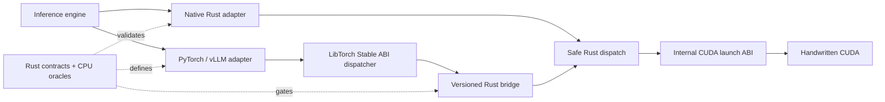

<div align="center">
  <h1>Loom Kernels</h1>
  <p><strong>Rust-first GPU operators for LLM inference.</strong></p>
  <p>Backend-independent contracts · handwritten CUDA · PyTorch and vLLM adapters · H20-qualified evidence</p>
  <p>
    <a href="docs/README.md">Documentation</a> ·
    <a href="docs/operator-catalog.md">Operator catalog</a> ·
    <a href="docs/compatibility.md">Compatibility</a> ·
    <a href="docs/guides/vllm-ir-provider.md">Integration guide</a> ·
    <a href="docs/results/README.md">H20 evidence</a> ·
    <a href="CONTRIBUTING.md">Contributing</a> ·
    <a href="CHANGELOG.md">Changelog</a> ·
    <a href="https://feichai0017.github.io/loom-kernels/">Website</a>
  </p>
  <p>
    <a href="https://github.com/feichai0017/loom-kernels/actions/workflows/ci.yml"></a>
    <a href="https://github.com/feichai0017/loom-kernels/actions/workflows/ci_typos.yml"></a>
  </p>
</div>

Loom Kernels owns the narrow operator boundaries where fusion, layout-aware
execution, quantization, or fewer launches can improve a real inference path.
It is not an inference engine, tensor framework, or replacement for vendor
GEMM libraries.

> [!IMPORTANT]
> Loom is an alpha project. Engine integrations are opt-in and shape-gated;
> unsupported contracts fall back to the engine's native implementation.

## What Loom owns

| Layer | Responsibility |
| --- | --- |
| Contract | Dtypes, shapes, layouts, aliasing rules, capability queries, and invalid-input behavior |
| Reference | Deterministic CPU oracles used before accelerator timing |
| Execution | Safe Rust dispatch over a small C ABI and handwritten CUDA kernels |
| Integration | Current-stream PyTorch operators and narrow vLLM 0.24/0.25 registration points |
| Evidence | Reproducible correctness, named-baseline, CUDA Graph, and engine gates |

Dense, quantized, sparse, and grouped GEMM always stay with cuBLASLt, CUTLASS,
FlashInfer, or the engine-selected backend. Loom targets the memory-bound work,
layout/scheduling metadata, and useful fusion boundaries around that matrix
core; it will not implement a competing GEMM.

## Supported operator paths

| Family | Operators | Qualified boundary |
| --- | --- | --- |
| Normalization | RMSNorm · Add+RMSNorm · optional residual Add+RMSNorm→dynamic FP8 | F32, FP16, BF16; exact PyTorch/vLLM mutation schema and opt-in compiler fusion |
| MLP | split-half SiLU-and-Mul · SiLU-and-Mul→block FP8 | F32, FP16, BF16; opt-in vLLM activation paths |
| Position and KV | NeoX/interleaved RoPE + native/static-FP8 paged-KV write | packed QKV, NHD/HND cache views, static per-tensor/per-head FP8 E4M3 scales, current-stream PyTorch |
| Decode tail | fused logits preprocessing · deterministic categorical sampling · greedy + sampled logprob · selected-token logprob + rank · exact in-place top-k filter · fused top-p + renormalization · sampled-token + top-k logprobs · sparse penalties · Min-P | mixed greedy/random preprocessing, explicit Philox state, exact-token/rank gates, and measured vLLM fallbacks |
| Speculative decode | greedy draft verify + accepted/bonus-token compaction | flattened ragged int32 metadata, exact vLLM 0.24/0.25 rejection semantics, real vLLM 0.24 draft/target invocation |
| Attention | paged MQA/GQA decode · local split-K/LSE merge | native paged KV, GQA reuse, short shape-gated vLLM route |

The [operator catalog](docs/operator-catalog.md) separates `supported`,
`in progress`, `next`, `planned`, `profile-gated`, and `vendor-backed` work.
Catalog membership alone is never a performance claim.

## Next value program

The bridge-ABI-9 native-wheel engineering gate is complete for one
Linux x86_64, CUDA 13.1, SM90, Python 3.11, PyTorch 2.10/2.11, and vLLM
0.24/0.25 cross-matrix artifact. The exact `7df4133` wheel contains all
seventeen checked operators, including optional-residual RMSNorm-to-FP8 and
persistent explicit-state categorical sampling, and passes 305 tests with
each vLLM minor plus 201 applicable tests on PyTorch 2.10. It is qualified but
not published to a package index. ABI8 and earlier artifacts remain immutable
historical evidence.

Fused logits preprocessing combines blocked-token masking, unique sparse
bias, sparse suppression, and mixed-row temperature in one in-place F32 CUDA
pass. The first post-K0.7 speculative slice is also complete: deterministic greedy
verification and token compaction now follow the same Rust-owned path, and a
process-isolated Qwen2.5-1.5B/0.5B vLLM 0.24 gate proves exact native/Loom
speculative output with complete measured path coverage. That gate also shows
that the verifier is only `0.048-0.200%` of batch latency and that speculative
decode is `3.18-4.97x` slower than target-only for this workload. Further
speculative expansion is therefore profile-gated. The ordered feature program
is now:

| Order | Direction | First proof |
| --- | --- | --- |
| 1 | Quantization plumbing | measured scale/pack/layout work around unchanged vendor GEMM |
| 2 | MoE routing and movement | routing, histogram/prefix sum, permutation, and combine around vendor grouped GEMM |
| 3 | Profile-gated KV movement | revisit only for a named offload, beam, or compaction path with real physical movement |
| 4 | Profile-gated speculative extensions | tree/stochastic/KV work only after a named workload exposes a material non-GEMM boundary |
| 5 | Minimal Rust decode proof | one zero-copy decode step over borrowed tensors and streams, without becoming an inference engine |

The first quantization-plumbing slice is implemented through bridge ABI9.
One exact operator now covers both vLLM RMSNorm-to-dynamic-FP8 fusion keys:
plain normalization and residual Add+RMSNorm. On H20 it is bitwise identical
to vLLM across F32/FP16/BF16, directly faster for the measured BF16
hidden-size-896 cases, and preserves all Cutlass scaled-mm call sites in a real
Qwen2.5-0.5B graph. Order-reversed, 15-sample prefill-only runs improve batch
latency by `1.0066-1.0506x`; decode-heavy runs cross parity, so no TPOT or
throughput win is claimed. The same exact ABI9 wheel passes the repository-free
PyTorch/vLLM matrix. See the
[K2.5 H20 evidence](docs/results/h20-rms-norm-dynamic-fp8-residual-20260727.json)
and [ABI9 clean-install evidence](docs/results/h20-native-wheel-clean-install-abi9-20260727.json).

The explicit-seed, non-speculative sampling subsystem is complete through
binary distribution.
ABI8 consumes normalized F32 probabilities plus caller-owned
`(seed, counter)` state, advances every counter once, launches one CUDA kernel,
and owns no probability-shaped temporary. Directly against vLLM 0.24's
all-seeded boundary on H20, Loom loses at 1–2 rows, then is
`1.15x/1.62x/1.80x/5.40x` faster at 4/7/8/32 rows. At 32 rows that is
`76.20 us`, one kernel, and `512 B` of measured output allocation versus
`411.13 us`, 34 kernels, and `19.45 MB`.

The opt-in adapter keeps state on `CachedRequestState`, moves it with
`InputBatch` slots, and preserves it across remove, condense, resume, and swap.
The lifecycle gate passes on vLLM 0.24 and 0.25. In an order-reversed
Qwen2.5-0.5B engine A/B, every provider exactly replays its declared stream,
Loom records one launch per decode step with no rejection, batch 1–4 pays a
measured `1.5–2.4%` cost, batch 8 is near crossover, and batch 32 improves
latency/throughput by `5.7–8.1%` in both provider orders. Loom intentionally
does not reproduce native vLLM seed-to-token identity. See the
[direct evidence](docs/results/h20-categorical-sample-20260727.json),
[baseline-first engine evidence](docs/results/h20-vllm-engine-categorical-sample-20260727.json),
[Loom-first engine evidence](docs/results/h20-vllm-engine-categorical-sample-loom-first-20260727.json),
[admission evidence](docs/results/h20-vllm-seeded-sampling-admission-20260727.json),
[ABI8 clean-install evidence](docs/results/h20-native-wheel-clean-install-abi8-20260727.json),
and [contract](docs/design/counter-based-sampling.md).

The former first item, default vLLM prefix/preemption KV movement, is now
explicitly rejected. A real Qwen2.5-0.5B vLLM V1 H20 run observed a
1,024-token prefix hit and three scheduler preemptions, but zero calls and zero
bytes through the instrumented swap/batch-copy paths. Prefix reuse is logical;
default preemption frees blocks and recomputes. Loom will not add an API or
kernel for a movement boundary that does not exist. See the
[admission result](docs/results/h20-vllm-kv-movement-admission-rejected-20260727.json).

FP8 KV-cache compression is now an evidence track rather than the next kernel
implementation: it resumes only with a distinct pinned model, backend, or
cache representation that can pass the same quality precondition.

The first K3 slice extends the same fused RoPE+paged-KV operator to write
vLLM-compatible FP8 E4M3 cache bytes with static per-tensor or per-head scales.
The exact bridge-ABI-7 wheel requalifies the H20 exact-byte, current-stream,
compile/graph, named-operator, clean-install, and real-engine invocation gates.
The physical cache allocation is `2x` smaller than BF16 at this operator
boundary, and the fused path is `1.317-1.378x` faster than vLLM's separate RoPE
and cache-write submissions across the measured sweep. The first pinned
system candidate is now explicitly rejected: on a held-out UltraChat early-stop
slice of 8 sequences and 1,016 scored tokens, native vLLM FP8 and Loom FP8
remain equivalent at a `1.00064` symmetric perplexity ratio, and FP8 capacity
is `1.99879x` BF16, but both FP8 paths regress Qwen2.5-7B BF16 perplexity by
about `3.07x`, far beyond the `1.02` limit.
The formal TTFT/TPOT matrix was therefore not run. K3 remains `in progress`
for a different pinned model, backend, or cache representation; this result
proves the operational boundary, not system value. It used the qualified ABI7
native libraries plus a SHA-pinned Python adapter overlay, so it is not a new
clean-install wheel gate. See the
[FP8 KV-cache design](docs/design/fp8-kv-cache.md).

The detailed contracts and exit criteria live in the
[roadmap](docs/roadmap.md).

## Architecture



Every framework operator follows this path. There is no Python/ctypes
implementation, unchecked dispatcher twin, direct C++-to-CUDA launch, or
layout-specific fallback inside Loom. PyTorch passes existing pointers,
physical storage spans, strides, and its current stream through the versioned
bridge through one LibTorch Stable ABI dispatcher targeting PyTorch 2.10;
Rust constructs checked borrowed views and selects the CUDA kernel. The backend
either accepts the exact contract or returns an error. Engine adapters decide
whether to call Loom before dispatch and retain the engine's native
implementation for unsupported semantics.

## Quick start

Use the backend-independent contracts from any Rust project:

```bash
cargo add loom-kernels@1.0.0-alpha.1
```

On a CUDA build host, add the safe GPU backend explicitly:

```bash
cargo add loom-cuda@1.0.0-alpha.1 --features cuda
```

The default workspace is dependency-light and does not require CUDA:

```bash
git clone https://github.com/feichai0017/loom-kernels.git
cd loom-kernels

cargo fmt --all -- --check
cargo clippy --workspace --all-targets -- -D warnings
cargo test --workspace --all-targets
cargo check --workspace --release
```

On an NVIDIA CUDA host, set the toolkit and target architecture explicitly:

```bash
CUDA_HOME=/usr/local/cuda-13.1 LOOM_CUDA_ARCHS=90 \
  cargo check -p loom-cuda --features cuda --release

CUDA_HOME=/usr/local/cuda-13.1 LOOM_CUDA_ARCHS=90 \
  cargo run -p loom-cuda --features cuda --release \
  --example rust_cuda_smoke

CUDA_HOME=/usr/local/cuda-13.1 LOOM_CUDA_ARCHS=90 \
  cargo bench -p loom-cuda --features cuda \
  --bench add_rms_norm -- \
  --dtype bf16 --rows 8 --hidden-size 4096
```

Build the native Python artifact from a clean Linux x86_64 checkout:

```bash
python3 -m venv .venv-wheel
.venv-wheel/bin/pip install \
  'setuptools>=80,<82' 'wheel>=0.45' build 'torch>=2.10,<2.12'

CUDA_HOME=/usr/local/cuda-13.1 LOOM_CUDA_ARCHS=90 \
  .venv-wheel/bin/python python/build_wheel.py \
  --cuda-home /usr/local/cuda-13.1 \
  --archs 90 \
  --wheel-dir dist

python3 -m venv .venv-loom
.venv-loom/bin/pip install \
  'dist/loom_kernels-1.0.0a1-9cu131torch210sm90-py3-none-linux_x86_64.whl[test]'
```

The wheel contains exactly `libloom_cuda_bridge.so` and the boxed
`libloom_kernels_torch.so` Stable ABI dispatcher, plus a manifest binding the
Git revision, CUDA toolkit, SM targets, runtime range, and library hashes. A
source-only wheel is rejected. The installed package validates that manifest
and loads only its packaged libraries; no repository checkout or library-path
override is used.

The exact ABI9 `7df4133` artifact passes repository-free PyTorch 2.10/2.11 and
vLLM 0.24/0.25 H20 clean-install gates. ABI8 and earlier wheels are retained
only as historical evidence. None is published.

See the [Python README](python/README.md) for binary and editable development
flows, direct calls, and the
[vLLM integration guide](docs/guides/vllm-ir-provider.md) for every opt-in and
fallback contract. The [compatibility matrix](docs/compatibility.md) separates
source development, qualified framework versions, and the native-wheel
boundary.

## Evidence, not blanket claims

The table below is a compact view of qualified NVIDIA H20 results. Each link
opens the raw JSON artifact used for the claim.

| Path | Qualified result | Claim boundary |
| --- | --- | --- |
| [Optional-residual RMSNorm→dynamic FP8](docs/results/h20-rms-norm-dynamic-fp8-residual-20260727.json) | Exact FP8/scale/residual bytes; `1.033–1.082×` direct CUDA Graph ratio; order-stable `1.0066–1.0506×` Qwen prefill batch-latency ratio | vLLM 0.24 `fp8_per_tensor`, BF16 Qwen2.5-0.5B, Cutlass GEMM, 128-token prefill. Decode-heavy latency crosses parity; the ABI9 wheel is qualified separately |
| [Greedy + sampled logprob](docs/results/h20-greedy-sample-logprobs-20260722.json) | `3.16–4.35×` operator ratio; `1.129–1.250×` real-engine batch-latency ratio | Pure greedy requests with raw `logprobs=0` |
| [Selected-token logprob + rank](docs/results/h20-selected-token-logprobs-20260722.json) | `2.77–3.78×` operator ratio; `1.044–1.125×` real-engine batch-latency ratio | vLLM still owns top-k/top-p, RNG, and selection |
| [Exact in-place top-k filter](docs/results/h20-top-k-filter-20260727.json) | `1.42–2.15×` over vLLM's full sort for all admitted 1–7-row cases; `0.62–4.36 MB` versus `4.90–47.01 MB` peak temporaries | F32, 151,936-token vocabulary, `top_k=50`; threshold ties preserved and larger batches remain on vLLM Qrita Triton |
| Fused top-p + renormalization: [151,936 vocabulary](docs/results/h20-top-p-renorm-20260727.json) · [32,768 boundary](docs/results/h20-top-p-renorm-vocab32768-20260727.json) | `1.72–1.77×` and `1.15–1.34×` over vLLM's full sort plus F32 softmax for all admitted 2/4/7-row cases | F32 top-p-only route; vLLM keeps RNG/selection; parallel F32 scans may differ by one cutoff token with probability L1 ≤ `1e-4` |
| Fused logits preprocessing: [operator](docs/results/h20-logits-preprocess-20260727.json) · [baseline first](docs/results/h20-vllm-logits-preprocess-baseline-first-20260727.json) · [Loom first](docs/results/h20-vllm-logits-preprocess-loom-first-20260727.json) | Exact outputs and `3.26–7.30×` operator ratio at 1–32 rows; exact Qwen tokens and `720/0` Loom submissions in each order | Mixed greedy/random F32 sampler logits with mask, bias, suppression, min-tokens, and temperature. TPOT is order-stable at `1.010–1.084×`; batch latency crosses parity at batch 32, so no stable model-level latency claim |
| Sampled-token + top-k logprobs: [operator](docs/results/h20-topk-sampled-logprobs-20260725.json) · [baseline first](docs/results/h20-vllm-qwen25-topk-logprobs-baseline-first-20260725.json) · [Loom first](docs/results/h20-vllm-qwen25-topk-logprobs-loom-first-20260725.json) | `3.25×`, `2.60×`, and `1.19×` operator ratios at 1/8/32 rows; exact engine tokens, returned IDs, and ranks | Direct Loom ties are deterministic; the exact vLLM adapter preserves `torch.topk` order. Engine latency crosses parity after provider-order reversal, so no model-level speedup is claimed |
| [Min-P filtering](docs/results/h20-min-p-filter-20260722.json) | `1.885×` at 128 rows and no tensor-sized probability/mask temporaries | Smaller batches fall back to vLLM |
| Sparse token penalties: [operator](docs/results/h20-token-penalties-20260725.json) · [baseline first](docs/results/h20-vllm-qwen25-token-penalties-baseline-first-20260725.json) · [Loom first](docs/results/h20-vllm-qwen25-token-penalties-loom-first-20260725.json) | Exact outputs; `5.82–34.30×` operator ratio; `1.056–1.123×` order-stable Qwen engine batch-latency ratio | F32 repetition/frequency/presence; `1440/0` Loom path hits per provider order; serving-scale goodput remains separate |
| Deterministic categorical sampling: [direct](docs/results/h20-categorical-sample-20260727.json) · [baseline first](docs/results/h20-vllm-engine-categorical-sample-20260727.json) · [Loom first](docs/results/h20-vllm-engine-categorical-sample-loom-first-20260727.json) · [ABI8 wheel](docs/results/h20-native-wheel-clean-install-abi8-20260727.json) · [prior admission](docs/results/h20-vllm-seeded-sampling-admission-20260727.json) | Direct ABI8 is `1.15–5.40×` faster at 4–32 rows with one kernel and no probability-shaped temporary; Qwen batch-32 engine ratio is an order-stable `1.057–1.081×` | Explicit Loom Philox semantics; persistent vLLM 0.24/0.25 request state; unseeded random and speculative engines are rejected. Batch 1–4 engine cost is `1.5–2.4%`; no native seed-to-token parity claim. The matrix wheel is qualified but unpublished |
| [Greedy speculative verify + compact](docs/results/h20-greedy-speculative-verify-20260723.json) | `1.101–1.128×` dispatcher ratio across 15 batch/draft shapes; bit-exact with vLLM | Deterministic all-greedy rejection only; the real-model gate is the next row |
| Real-model speculative decode: [native first](docs/results/h20-vllm-qwen25-speculative-native-first-20260723.json) · [Loom first](docs/results/h20-vllm-qwen25-speculative-loom-first-20260723.json) | Exact native/Loom tokens, `714/714` measured Loom calls per order; verifier share `0.048–0.200%` | Engine path proven; native/Loom latency crosses parity and speculative decode loses to target-only on this model pair |
| [RoPE + paged-KV write](docs/results/h20-rope-paged-kv-20260722.json) | `2.30–2.40×` dispatcher ratio for 1–512 tokens | Real-engine invocation is proven; end-to-end remains at parity |
| Static FP8 KV-cache: [operator](docs/results/h20-fp8-kv-cache-write-20260724.json) · [rejected Qwen2.5 system candidate](docs/results/h20-fp8-kv-system-rejected-20260727.json) | Exact vLLM E4M3 bytes; `1.317–1.378×` operator ratio; `1.99879×` system cache-token capacity; native-vLLM/Loom FP8 PPL ratio `1.00064` | Integration and provider equivalence proven; 8-sequence early-stop slice rejects Qwen2.5 because FP8/BF16 PPL is about `3.07×`; no TTFT/TPOT claim |
| [Short paged decode](docs/results/h20-vllm-paged-decode-backend-20260722.json) | `1.154–2.374×` across all 24 admitted backend cases | FP16/BF16, Hq/Hkv 32/8, D128, context ≤32; other shapes use FA3 |
| [Local split-K paged decode](docs/results/h20-paged-decode-split-k-20260722.json) | `1.14–6.22×` versus legacy Loom | Improves the Rust/CUDA backend; FA3 remains the long-context engine fallback |
| [LibTorch Stable ABI dispatcher](docs/results/h20-libtorch-stable-abi-20260723.json) | Same `.so`: 192 tests on PyTorch 2.11 with each vLLM minor; 123 applicable tests on PyTorch 2.10 | Historical source-built binary gate; the current packaged boundary is the next row |
| [Native ABI9 cross-matrix wheel](docs/results/h20-native-wheel-clean-install-abi9-20260727.json) | Same wheel: 305 tests with each vLLM minor; 201 applicable tests on PyTorch 2.10 | Current Linux x86_64, CUDA 13.1, SM90, Python 3.11 matrix artifact; qualified but not published |
| [Historical ABI8 cross-matrix wheel](docs/results/h20-native-wheel-clean-install-abi8-20260727.json) | Same wheel: 293 tests with each vLLM minor; 199 applicable tests on PyTorch 2.10 | Predecessor before optional-residual RMSNorm-to-FP8 entered ABI9 |
| [Historical refreshed ABI7 vLLM 0.24 wheel](docs/results/h20-native-wheel-clean-install-abi7-refresh-20260727.json) | 286/286 full GPU tests plus 22/22 focused FP8 KV/adapter tests from a fresh repository-free environment | Closed the FP8 KV adapter packaging gap before ABI8 superseded the matrix |
| [Native ABI7 cross-matrix wheel](docs/results/h20-native-wheel-clean-install-abi7-20260727.json) | Same wheel: 286 tests with each vLLM minor; 193 applicable tests on PyTorch 2.10 | First complete Linux x86_64, CUDA 13.1, SM90, Python 3.11 matrix artifact; qualified but not published |
| [Rejected default KV movement candidate](docs/results/h20-vllm-kv-movement-admission-rejected-20260727.json) | 1,024 cached prefix tokens and three real preemptions with zero physical movement calls/bytes | Default vLLM prefix caching is logical and preemption recomputes; optional offload/beam/compaction require separate profiling |
| [Historical ABI6 matrix wheel](docs/results/h20-native-wheel-clean-install-abi6-20260727.json) | Same wheel: 277 tests with each vLLM minor; 186 applicable tests on PyTorch 2.10 | Predecessor before fused logits preprocessing entered the packaged ABI |
| [Historical ABI5 matrix wheel](docs/results/h20-native-wheel-clean-install-abi5-20260727.json) | Same wheel: 268 tests with each vLLM minor; 178 applicable tests on PyTorch 2.10 | Predecessor before fused top-p filtering and renormalization entered the packaged ABI |
| [Historical ABI4 matrix wheel](docs/results/h20-native-wheel-clean-install-abi4-20260725.json) | Same wheel: 253 tests with each vLLM minor; 164 applicable tests on PyTorch 2.10 | Predecessor before exact top-k filtering entered the packaged ABI |
| [Historical ABI2 matrix wheel](docs/results/h20-native-wheel-clean-install-abi2-20260724.json) | Same wheel: 225 tests with each vLLM minor; 138 applicable tests on PyTorch 2.10 | Predecessor before sparse penalties and top-k logprobs entered the packaged ABI |

> [!NOTE]
> A fast kernel is not automatically a faster model. Loom records operator,
> dispatcher, CUDA Graph, engine, and serving evidence as separate gates.
> Only artifacts under [`docs/results`](docs/results/README.md) support measured
> performance statements.

## Repository map

| Path | Purpose |
| --- | --- |
| `crates/loom-kernels` | Public Rust contracts, capabilities, and CPU references |
| `crates/loom-cuda` | Safe CUDA backend and oracle-backed benchmarks |
| `crates/loom-cuda-bridge` | Checked C boundary from framework-owned tensors into borrowed Rust dispatch |
| `crates/loom-cuda-sys` | Internal CUDA launch ABI, build plumbing, and packaged handwritten kernels |
| `python/csrc` | Stable ABI schemas plus domain-specific PyTorch tensor/stream adapters |
| `python/src/loom_kernels/vllm` | Public vLLM facade plus domain-specific registration policy |
| `benchmarks` | Named framework and engine baselines |
| `docs/results` | Hardware-qualified machine-readable evidence |
| `website` | Astro documentation site |

## Documentation

| Read | When you need it |
| --- | --- |
| [Documentation index](docs/README.md) | Choose the shortest path through the project |
| [Operator catalog](docs/operator-catalog.md) | Inspect the complete supported and planned surface |
| [Operator-library design](docs/design/operator-library.md) | Understand architecture and admission gates |
| [Code layout](docs/design/code-layout.md) | Trace an operator across contracts, CUDA, bridge, PyTorch, and vLLM |
| [Greedy speculative-verify design](docs/design/greedy-speculative-verify.md) | Read the ragged contract, ownership boundary, and deliberate exclusions |
| [FP8 KV-cache design](docs/design/fp8-kv-cache.md) | Read the static-scale write contract, qualified implementation boundary, and remaining system-value gate |
| [Counter-based sampling design](docs/design/counter-based-sampling.md) | Read the completed explicit-state ABI8-A operator, request lifecycle, and engine gate |
| [Paged-decode design](docs/design/paged-decode-attention.md) | Read cache layouts, split-K semantics, and exclusions |
| [vLLM provider guide](docs/guides/vllm-ir-provider.md) | Build, configure, validate, and benchmark engine adapters |
| [Compatibility matrix](docs/compatibility.md) | Check Rust, CUDA, PyTorch, vLLM, and binary distribution boundaries |
| [Implementation status](docs/status.md) | See what is implemented, validated, and still open |
| [Evidence index](docs/results/README.md) | Browse accepted, parity, fallback, and rejected experiments |
| [Roadmap](docs/roadmap.md) | Follow the next operator boundaries and exit criteria |
| [Changelog](CHANGELOG.md) | Review released surfaces and alpha compatibility boundaries |
| [Contributing](CONTRIBUTING.md) | Propose and validate an operator or integration change |

## License

[MIT](LICENSE)
