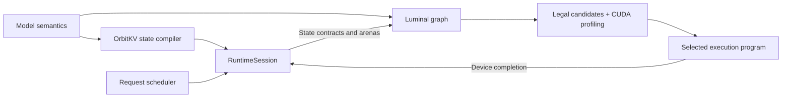

<p align="center">
  
</p>

<p align="center">
  <a href="https://feichai0017.github.io/orbitkv/">Website</a> ·
  <a href="docs/architecture.md">Architecture</a> ·
  <a href="docs/roadmap.md">Roadmap</a> ·
  <a href="results/README.md">Evidence</a>
</p>

# OrbitKV

**An attention-state compiler and native Rust inference stack.**

OrbitKV compiles attention visibility and retention into physical memory plans.
It owns KV pages and persistent model state, and reuses storage after semantic
lifetime, device completion, and acknowledgement permit it. The inference-only
[Luminal fork](third_party/luminal) compiles model graphs and measures legal CUDA
implementations to select an execution schedule.

Created by **[feichai](https://github.com/feichai0017)**. MIT licensed.

> **Status:** active development, with bounded correctness and serving
> qualification on NVIDIA H20. The primary 27B block-FP8 hybrid text decoder runs
> end to end. Competitive serving performance against vLLM and SGLang remains
> an open goal; see the [capability matrix](docs/capability-matrix.md).

## Why OrbitKV

- **Compile state lifetimes.** Full, Sliding, mixed, and exact Chunked attention
  produce different placement and retirement programs. Recurrent and convolution
  layers carry generation-checked fixed state.
- **Keep ownership explicit.** One manager handles page generations, prefix
  sharing, copy-on-write, cancellation, retirement, and safe reuse. Executors and
  external transports consume its plans.
- **Search implementations from contracts.** Model math, dtype, shape, state
  layout, and target capabilities admit kernel candidates. Luminal profiles
  alternatives on CUDA and persists selected programs for strict replay.

The direction is [joint state and execution compilation](docs/joint-compilation.md).
Current state facts enforce ownership and artifact compatibility. Competition
between multiple KV layouts, transport-aware scheduling, and general megakernel
generation are future work.

## Architecture



| Crate | Responsibility |
| --- | --- |
| [`orbitkv`](crates/orbitkv) | Backend-independent state compiler, KV manager, snapshots, prefix/COW, retirement, and `RuntimeSession` |
| [`orbitkv-executor`](crates/orbitkv-executor) | Checkpoint normalization, state bindings, Luminal graph execution, artifacts, and external byte transports |
| [`orbitkv-engine`](crates/orbitkv-engine) | Scheduling, batching, cancellation, protocol contracts, and the optional OpenAI-compatible HTTP frontend |

The core is usable independently of the inference engine. The complete stack
runs in one Rust process. The optional frontend reuses the pinned vLLM Rust
HTTP/tokenizer/chat/SSE components; OrbitKV retains scheduling and KV ownership.

## Model and kernel support

| Model / state family | Current qualification |
| --- | --- |
| Dense Full attention | Bounded released-checkpoint execution on H20 |
| Interleaved Full + Sliding attention | Released-model correctness, window crossing, page reuse, batching, and HTTP lifecycle on H20 |
| Qwen3.8-27B-FP8 hybrid text decoder | Block-FP8 linear, Full attention, Gated DeltaNet, convolution state, logit checks, and bounded HTTP serving on H20 |
| Exact Chunked attention | Core compilation and host lifecycle tests; released-model device qualification pending |
| MLA, MoE, multimodal, multi-device | End-to-end execution remains open |

The 27B checkpoint normalizes through its Qwen3.5 text architecture configuration.
Model names do not select kernels. See [checkpoint import](docs/checkpoint-import.md)
for the supported configuration contracts.

| CUDA provider | Role |
| --- | --- |
| cuBLASLt | Dense and batched matrix products, with supported epilogues |
| DeepGEMM | SM90 block-scaled FP8 linear and tile candidates |
| FlashInfer | CUDA-core decode and tensor-core decode / packed prefill |
| FlashAttention-3 | Optional SM90 F16/BF16 paged decode / prefill, head dimensions 64/128/256 |
| Generated CUDA | Primitive operations, state updates, and legal fused regions |

Attention candidates share logical semantics and an explicit paged KV view.
The current executed attention contract is causal/sliding with separate NHD
K/V pages. The handwritten native attention provider has been removed.
[Provider documentation](docs/attention-providers.md) specifies admission,
source setup, and device limits. CUDA Graph replay combines launches; it does
not turn the entire model into one kernel.

## Quickstart

From a checkout of this revision, initialize the pinned Luminal submodule.
Host tests need a Rust toolchain (workspace MSRV 1.88) and Python 3; no GPU is
required. Use current stable Rust for the complete dependency graph, as CI does.

```sh
git submodule update --init --recursive
cargo test --locked --all-targets
cargo clippy --locked --all-targets -- -D warnings
cargo fmt --all -- --check
python tools/verify_active_source.py
```

Compile an example runtime manifest:

```sh
cargo run --locked -p orbitkv --bin orbitkv -- \
  compile-runtime-manifest crates/orbitkv/examples/hybrid-attention-state-plan.json
```

CUDA execution additionally requires an NVIDIA GPU, a compatible driver/CUDA
toolkit, and the sources for the providers used by the workload. Prefetch them
explicitly; model compilation performs no network downloads:

```sh
cargo run --manifest-path third_party/luminal/Cargo.toml \
  -p luminal_cuda_lite --bin fetch-provider -- flashinfer

# For block-FP8 linear or the optional SM90 attention candidate:
cargo run --manifest-path third_party/luminal/Cargo.toml \
  -p luminal_cuda_lite --bin fetch-provider -- deepgemm
cargo run --manifest-path third_party/luminal/Cargo.toml \
  -p luminal_cuda_lite --bin fetch-provider -- flashattention

cargo run --release --locked -p orbitkv-engine \
  --features server --bin orbitkv-serve -- --help
```

Serving requires a supported checkpoint and an explicit page budget for each
compiled KV class. Start with the [engine setup](crates/orbitkv-engine/README.md)
and [qualification workloads](docs/benchmarking.md). Use `--decoder-artifact`
to save a fresh search or strictly load an existing schedule and CUDA module
images. Provider libraries are cached separately. Artifact compatibility and
startup behavior are documented in [module artifacts](docs/module-artifacts.md)
and [graph residency](docs/graph-residency.md).

## Measured progress

The [14 September H20 qualification](results/provider-kernels-20260914/README.md)
records:

- **Provider selection:** FlashInfer tensor-core attention for the recorded decode
  bucket and FlashAttention-3 for the packed-prefill bucket.
- **Correctness:** 96 full-vocabulary logit comparisons across fresh search and
  two strict replay configurations; maximum absolute error 0.71875 under the
  existing 1.0 gate.
- **Replay and lifecycle:** 423 generated module-image hits with zero NVRTC calls
  in the recorded HTTP replay run, plus cancellation and complete state drain.
  External provider libraries were already cached.

Warm full-logit diagnostic decode was about **24.1 ms**. This is a bounded
measurement, not an established whole-model speedup. Historical same-executor
experiments show memory savings and improvements from compiler selection;
recorded vLLM/SGLang serving comparisons still show a performance gap. The
[results index](results/README.md) retains the exact workloads and source limits.

## Repository and documentation

```text
crates/                 core, executor, and engine
  <crate>/src/          implementation
  <crate>/tests/        integration tests, private unit suites, and fixtures
third_party/luminal/    pinned inference-only compiler workspace
docs/                   architecture, contracts, and roadmap
benchmarks/             workload and tuning manifests
tools/                  qualification tools; tests in tools/tests/
results/                compact reviewed evidence
website/                static Astro website
```

| Understand the system | Work on the implementation |
| --- | --- |
| [Architecture](docs/architecture.md) | [Code and test layout](docs/code-layout.md) |
| [Joint compilation](docs/joint-compilation.md) | [Luminal design](docs/luminal-design.md) |
| [RuntimeSession](docs/runtime-session.md) | [Compiler boundaries](docs/compiler-boundaries.md) |
| [State lifetimes](docs/state-lifecycle.md) | [Kernel providers](docs/attention-providers.md) |
| [External KV tiers](docs/external-kv.md) | [Benchmarking](docs/benchmarking.md) |
| [Capability matrix](docs/capability-matrix.md) | [Website development](website/README.md) |

## Author and acknowledgements

OrbitKV is created and maintained by **[feichai](https://github.com/feichai0017)**.
The project is available under the [MIT license](LICENSE).

The Luminal fork builds on [Luminal](https://github.com/luminal-ai/luminal).
CUDA integrations use cuBLASLt, DeepGEMM, FlashInfer, and FlashAttention.
The optional HTTP frontend reuses vLLM's Rust components. Upstream projects
retain their own authorship and licenses; see [components](docs/components.md)
and the [fork policy](docs/executor-upstream.md).
