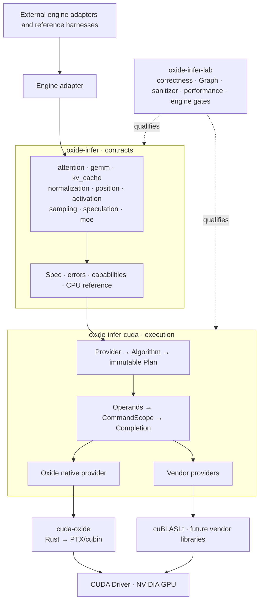

<div align="center">
  <p><code>OXIDE // INFER</code></p>
  <h1>Rust-native GPU operators for LLM inference</h1>
  <p>
    Checked asynchronous execution, native cuda-oxide kernels, and explicit vendor providers.
  </p>
  <p>
    <a href="https://github.com/feichai0017/oxide-infer/actions/workflows/ci.yml"></a>
    <a href="LICENSE"></a>
    
    
    
  </p>
  <p>
    <a href="docs/README.md">Docs</a> ·
    <a href="docs/design/oxide-infer-architecture.md">Architecture</a> ·
    <a href="docs/operator-catalog.md">Operators</a> ·
    <a href="docs/results/README.md">Evidence</a> ·
    <a href="docs/roadmap.md">Roadmap</a>
  </p>
</div>

Oxide Infer is a GPU operator runtime for Rust inference engines. It defines
operator contracts, chooses an explicit provider and algorithm, freezes an
immutable plan, checks runtime resources, and retains them until GPU work
settles.

The [accepted target architecture](docs/design/standalone-oxide-engine.md)
evolves this alpha into a standalone Rust inference engine: an Oxide-owned
server, scheduler, model and KV data plane, with offline TileLang artifacts as
the only product custom compute kernels. Mature non-compute capabilities start
from a pinned, attributed Rust engine source baseline and are transplanted into
Oxide modules; the source engine remains an independent behavioral and
performance baseline. That target is not yet the state of the current source;
migration gates and the
[engine benchmark plan](docs/development/engine-benchmark-plan.md) keep the
distinction explicit.

[cuda-oxide](https://github.com/NVlabs/cuda-oxide) compiles native Rust device
code. Vendor providers such as cuBLASLt enter through the same checked command
runtime without passing through the native-kernel toolchain.

Oxide Infer is an operator layer. Consumer engines retain model graphs,
continuous batching, request scheduling, KV-cache policy, distributed control,
tokenizers, and serving APIs.

## One execution model

Every operator follows one lifecycle:

```text
Spec
  → Provider
  → Algorithm
  → Plan
  → Operands
  → CommandScope
  → Completion
```

Planning fixes the provider, algorithm, workspace contract, launch
configuration, artifact, and CUDA Graph policy. Enqueue does not tune, switch
providers, or select a silent fallback.

## Architecture



The native provider owns architecture-specific Rust kernels. `sm90a`,
`sm100a`, and later modules combine the CUDA primitives that each algorithm
needs. TMA is a data-movement primitive. WGMMA and tcgen05 are compute
instruction families. They are not runtime providers by themselves.

The [architecture document](docs/design/oxide-infer-architecture.md) defines
ownership, planning, workspace, stream, Graph, artifact, and engine-adapter
boundaries.

## Operator surface

The table separates source presence from qualification. A source path does not
prove device correctness or performance.

| Family | Current source | State |
| --- | --- | --- |
| Attention | Single decode, paged decode, ragged prefill, paged prefill | Declared runner paths device-qualified in R1 |
| KV cache | Paged append and RoPE plus paged append | Exclusive-page runner path device-qualified in R1 |
| GEMM | Contiguous BF16 dense through cuBLASLt | R1 correctness, Graph, and sanitizer qualified |
| GEMV | Native BF16 M=1 SM90a algorithm | Experimental; performance stop recorded, cuBLASLt remains selected |
| Normalization | RMSNorm for F32, FP16, and BF16 | Declared runner paths device-qualified in R1 |
| Position | BF16 NeoX RoPE with explicit positions | Declared runner path device-qualified in R1 |
| Activation | SwiGLU and fused epilogues | Planned |
| Sampling | Logits transforms, RNG, and token selection | Planned |
| Advanced attention | MLA and expanded KV layouts | Planned |
| Matrix operations | FP8, grouped GEMM, and MoE shapes | Planned |

The [operator catalog](docs/operator-catalog.md) records the exact dtype,
shape, layout, provider, algorithm, and evidence state for every admitted path.

## Performance snapshot

Matched BF16 eager-provider timing against FlashInfer 0.6.17 produced stable
rankings for all 14 baseline attention shapes on the recorded H20. Oxide Infer
had lower combined median latency in 8 shapes; FlashInfer had lower latency in
6. The two long GQA4 rows below are refreshed from their optimized paths; the
other rows retain the full-matrix baseline. Every row uses its matched
provider-comparison cohort.

| Contract | Shape | Oxide | FlashInfer | Lower latency |
| --- | --- | ---: | ---: | --- |
| Paged decode MHA | B1, KV 1, NHD, D128 | 9.54 µs | 13.77 µs | Oxide 1.44× |
| Ragged prefill MHA | Q 16, KV 16, D128 | 8.25 µs | 13.99 µs | Oxide 1.69× |
| Ragged prefill GQA4 | Q 32+64, KV 256+1024, D128 | 36.94 µs | 21.93 µs | FlashInfer 1.68× |
| Paged prefill GQA4 | Q 32+64, KV 256+1024, D128 | 46.60 µs | 23.21 µs | FlashInfer 2.01× |

These are CUDA-event measurements of matched operator paths, not isolated
kernel, model, or serving results. See the [complete record and raw
samples](docs/results/h20-flashinfer-v0.6.17-attention-eager-performance-7f3d08e-20260812.json).
The [current paged-GQA4 record](docs/results/h20-flashinfer-v0.6.17-paged-prefill-current-gqa4-eager-performance-02faf27-20260812.json)
contains separate two-order provider and source-progression cohorts.
The [optimized ragged-GQA4 record](docs/results/h20-flashinfer-v0.6.17-ragged-prefill-dual-tile-gqa4-eager-performance-f9b95b0-20260812.json)
does the same for the dual-tile path.

The experimental native M=1 GEMV met its 10% margin against both Mistral.rs
custom GEMV and cuBLASLt on only one of five census shapes. Its
[stop record](docs/results/h20-sm90a-m1-gemv-stop-ac2bd5a-20260812.json) keeps
the per-order summaries and evidence limits; no engine rollout follows for
that frozen candidate.

## Providers

Oxide Infer exposes provider selection before execution.

```text
Oxide
  native Rust kernels
  → cuda-oxide
  → PTX or cubin
  → CUDA Driver

CublasLt
  checked vendor plan
  → cuBLASLt
  → CUDA Driver
```

The command runtime gives both paths the same resource and failure model:

- caller-selected CUDA context and stream
- typed read and write regions
- checked span, alignment, alias, and capacity rules
- explicit workspace requirements
- completion-owned resource leases
- typed device-status failures
- fixed-address CUDA Graph capture where admitted

## Workspace

| Crate | Responsibility |
| --- | --- |
| `oxide-infer` | Backend-independent contracts, errors, capabilities, and CPU references |
| `oxide-infer-cuda` | Planning, CUDA command runtime, native kernels, Graphs, and vendor providers |
| `oxide-infer-lab` | Non-published hardware gates, matched benchmarks, fixtures, and evidence generation |

The workspace does not split GEMM, kernels, or runtime into additional crates.
They remain modules until they need a separate dependency, release, ownership,
or safety boundary.

## Build and validate

Install `mise`, then review `mise.toml` before trusting it.

```bash
git clone https://github.com/feichai0017/oxide-infer.git
cd oxide-infer

mise trust
mise install
USE_MISE=1 make install-website
USE_MISE=1 make check
```

Run CUDA gates inside the pinned Linux environment:

```bash
USE_MISE=1 make cuda-doctor
USE_MISE=1 make cuda-check
USE_MISE=1 make cuda-test
USE_MISE=1 make h20
```

The [environment guide](docs/development/environment.md) lists the pinned Rust,
Node.js, CUDA, and cuda-oxide versions. The current [device qualification
guide](docs/development/h20-validation.md) defines the recorded H20 correctness,
sanitizer, Graph, and performance gates without making H20 the product boundary.

## Evidence before claims

Oxide Infer keeps these evidence levels separate:

```text
host reference
  → CUDA correctness
  → lifetime and negative gates
  → CUDA Graph
  → sanitizer
  → matched operator benchmark
  → engine integration
  → serving workload
```

A lower level does not imply a higher one. Correct output does not prove a
speedup. A Graph replay does not prove serving throughput. An adapter hit does
not prove end-to-end latency.

Historical Loom Infer records remain immutable. They retain their original
provider names, source hashes, and commands.

New Oxide Infer records qualify only the source revision named by each record. See the
[evidence index](docs/results/README.md).

## Roadmap

The roadmap now advances one complete engine profile at a time:

1. Freeze the TileLang artifact ABI and checked Rust loader.
2. Replace the current native and vendor paths for one BF16 model profile.
3. Build the complete Qwen2.5-1.5B prefill and decode plan with no Candle CUDA
   execution or silent provider fallback.
4. Build the Oxide API, tokenizer, streaming, and continuous-batch control
   plane around stable engine request and event types.
5. Qualify continuous batching, KV paging, cancellation, Graphs, and recovery.
6. Compare kernels with FlashInfer and the complete server with vLLM and
   SGLang under matched workloads.
7. Expand model, dtype, hardware, and distributed coverage only after the
   first profile passes its release gate.

Each milestone has admission, evidence, and stop conditions in the
[full roadmap](docs/roadmap.md).

## Contributing

Start with a real engine call site and one measurable contract. Keep one public
execution path per operator. Do not add compatibility facades, hidden fallback,
or a new crate without a concrete boundary.

Read [CONTRIBUTING.md](CONTRIBUTING.md) before adding a provider or changing
runtime ownership.

## License

[MIT](LICENSE)
