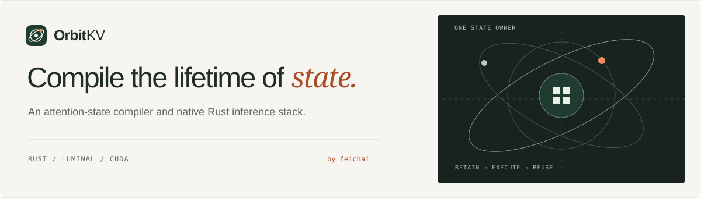

<p align="center">
  
</p>

<p align="center">
  <a href="https://feichai0017.github.io/orbitkv/">Website</a> ·
  <a href="docs/single-node.md">Single-node guide</a> ·
  <a href="docs/architecture.md">Architecture</a> ·
  <a href="docs/roadmap.md">Roadmap</a> ·
  <a href="TODO.md">TODO</a>
</p>

**A node-local KV cache for vLLM and SGLang, with an experimental multi-node path.**

OrbitKV runs one Cache Manager beside each inference node. vLLM uses a KV
connector and SGLang uses a direct GPU-page linker. Both register engine-owned
GPU KV buffers through CUDA IPC and use the same UDS + iceoryx2 cache API.
Single-node DRAM recovery has been validated against the pinned releases on a GPU.
The framework release targets as of 2026-09-20 are
[vLLM `0.29.0`](https://github.com/vllm-project/vllm/releases/tag/v0.29.0)
and [SGLang `0.5.20`](https://github.com/sgl-project/sglang/releases/tag/v0.5.20);
the SGLang source submodule is pinned to that release. See
[`python/README.md`](python/README.md) for separate GPU environments.

## What exists now

- content-addressed KV blocks in pinned host memory, with optional SSD backing;
- NUMA-aware allocation and batched GPU/host transfer;
- experimental cross-node discovery through an in-memory MetaServer and remote
  fetch through Mooncake Transfer Engine over RDMA or TCP;
- prefix lookup, leases, eviction, and metrics;
- a Rust Cache Manager, Python bindings, the vLLM connector, and an SGLang
  GPU-page linker that restores prompts after SGLang flushes its radix cache;
- an experimental **vLLM-only** Mooncake P/D connector, separate from the
  Cache Manager's remote-cache fetch path. vLLM also provides its own NIXL P/D
  connector; OrbitKV does not ship a NIXL connector.

Both engines now pass single-rank GPU recovery gates after DRAM eviction.
SGLang uses a plugin admission hook to wait for a leased result before
allocating restore destinations. The [SSD measurements](docs/ssd-performance.md)
retain the original failed-readiness baseline and the follow-up results.

The initial storage and control data plane was imported from PegaFlow `0.24.5`
and renamed throughout. The copied remote transfer stacks have since been
replaced by a pinned upstream Mooncake Transfer Engine. PegaFlow's published
measurements are not presented as OrbitKV results.

## Target architecture

The engine continues to own HBM allocation and execution. OrbitKV owns
external pinned DRAM/SSD replicas and their transfer leases. The intended
multi-node deployment retains one Cache Manager per node, embeds replicated
catalog shards and local candidate indexes in those managers, and makes remote
hits follow the same cache API as local hits. KV-aware routing comes **after**
local correctness and
distributed-cache recovery are established. The eventual planner will compile
a declarative state-liveness contract into physical plans:

- semantic death and execution completion are separate reclamation frontiers;
- HBM usage, DRAM, SSD, and remote replicas can be compared under one cost model,
  while engine-owned HBM remains under the engine's allocator;
- ring buffers, prefix pages, checkpoints, and eviction classes are derived
  physical plans rather than hard-coded product features;
- both frameworks retain their serving schedulers while OrbitKV develops a
  shared, validated state identity and safe-reuse contract.

The cache hot path now uses a versioned `StateKey` bound to model-artifact
content, engine configuration and registered storage geometry. Complete
recovery semantics remain open: Publish carries raw block IDs, absolute token
span evidence is not carried by both adapters, and bundle completeness is a
component-presence check. The MetaServer is a separate, non-HA, in-memory
directory with automatic resident-inventory replay after restart. Versioned
snapshots and bounded journals are implemented; embedded catalogs, etcd
membership and candidate caching are next in the
[distributed cache plan](docs/distributed-cache.md). See [architecture](docs/architecture.md)
and the [model-aware state plan](docs/state-identity.md) for the implementation
boundary. [State demand and transfer planning](docs/state-planning.md) describes
the implemented versioned query lifecycle and byte admission, plus the proposed
earlier warming and cost-based scheduling policies. Query budgets cover
preparation, ready leases, and GPU consumers; identical reads can be shared.
The [concurrent baseline](docs/concurrent-performance.md) records 1/4/8-request
bursts with a 2 GiB query budget, including output controls and an admission
regression found during measurement.
Single-node correctness is validated for the pinned adapter layouts;
the revised local path has not yet passed a full throughput and tail-latency
qualification against native-engine and no-cache baselines.

SGLang has a direct GPU-page linker for full-attention MHA and MLA models.
Hybrid models and auxiliary state require complete recovery contracts before
OrbitKV can claim a reusable prefix for them.

## Workspace

| Path | Responsibility |
| --- | --- |
| [`orbitkv-state`](crates/orbitkv-state) | Framework-neutral state identity, format, page and recovery contracts |
| [`orbitkv-channel`](crates/orbitkv-channel) | Versioned iceoryx2 and UDS process IPC implementation |
| [`orbitkv-core`](crates/orbitkv-core) | Content-addressed blocks, leases, eviction, SSD and remote tiers |
| [`orbitkv-transfer`](crates/orbitkv-transfer) | Pinned upstream Mooncake Transfer Engine wrapper |
| [`orbitkv-server`](crates/orbitkv-server) | Cache Manager crate: shared cache operations, process endpoint, peer control, health and metrics |
| [`orbitkv-metaserver`](crates/orbitkv-metaserver) | Cross-node replica discovery |
| [`python/orbitkv/vllm`](python/orbitkv/vllm) | vLLM cache connector, Mooncake P/D adapter, plugin entry point |
| [`python/orbitkv/sglang`](python/orbitkv/sglang) | SGLang GPU-page linker and plugin entry point |
| [`python/orbitkv/client`](python/orbitkv/client) | Framework-neutral cache API and Cache Manager connection |
| [`third-party/sglang`](third-party/sglang) | Pinned SGLang source used to develop and validate integration |
| [`third-party/vllm`](third-party/vllm) | Pinned vLLM release source used to develop and validate integration |
| [`website`](website) | OrbitKV project website and brand assets |

The process IPC, network control, Mooncake integration boundary, and measured
IPC baselines are documented in
[`docs/transport.md`](docs/transport.md).
For complete vLLM and SGLang installation, commands, capacity controls, and
verification, see the [single-node guide](docs/single-node.md). For deployment
modes and the distinction between cache sharing, P/D, and NIXL, see
[`docs/deployment.md`](docs/deployment.md).

## Build

The default build targets CUDA 12.8. Host-only inspection can disable default
features; GPU and RDMA qualification requires matching local hardware and drivers. The
workspace MSRV is Rust 1.89, required by iceoryx2 0.10.

```sh
cargo check --workspace

cd python
maturin develop --release
```

Initialize Mooncake before the first native build:

```sh
git submodule update --init --recursive third-party/mooncake
```

For a quick same-host vLLM run after installing the matching OrbitKV wheel and
vLLM `0.29.0` in the engine environment, start the Cache Manager in one
terminal and vLLM in another:

```sh
orbitkv-cache-manager
```

```sh
vllm serve /path/to/immutable-model \
  --enable-prefix-caching \
  --kv-transfer-config '{"kv_connector":"OrbitKVConnector","kv_role":"kv_both","kv_connector_module_path":"orbitkv.vllm"}'
```

Local model artifacts are fingerprinted at startup. Hub models require an
immutable `--revision` or a verified `ORBITKV_MODEL_FINGERPRINT`; see
[state identity](docs/state-identity.md).

For SGLang `0.5.20`, use the same manager and a SGLang environment containing
the OrbitKV wheel:

```sh
ORBITKV_SGLANG_ENDPOINT=unix:///tmp/orbitkv-50055.sock \
  sglang serve --model-path /path/to/model --page-size 64 \
  --enable-unified-cache-external-linker --radix-cache-backend orbitkv
```

For a same-host Cache Manager, the connector uses UDS bootstrap +
iceoryx2 for Query/Publish/Restore/Release. If the derived same-host socket is
missing, startup fails with a clear error instead of switching to gRPC.
Registration, health, sessions, and cleanup use the same authenticated
Unix socket. Standalone mode does not start a gRPC listener. Distributed mode
(`--metaserver-addr`) enables a peer-only gRPC control endpoint; remote KV
bytes still use Mooncake. Every inference process connects to a Cache Manager
on its own host.

The SGLang linker currently accepts full-attention MHA/MLA layouts with one KV
pool. For exact setup steps, supported layouts, and warm-hit verification for
both engines, use [the single-node guide](docs/single-node.md).

For Qwen3-8B latency measurements against native HBM caching, CPU offload,
SGLang HiCache, and LMCache, plus FlexKV compatibility results, see the
[single-node benchmark](docs/single-node-performance.md).

Benchmark workloads, harness tests, and recorded results: [`benches/`](benches/README.md).

OrbitKV's current workspace is Apache-2.0 licensed. Earlier experiments remain
available in repository history but are not part of the current build.
