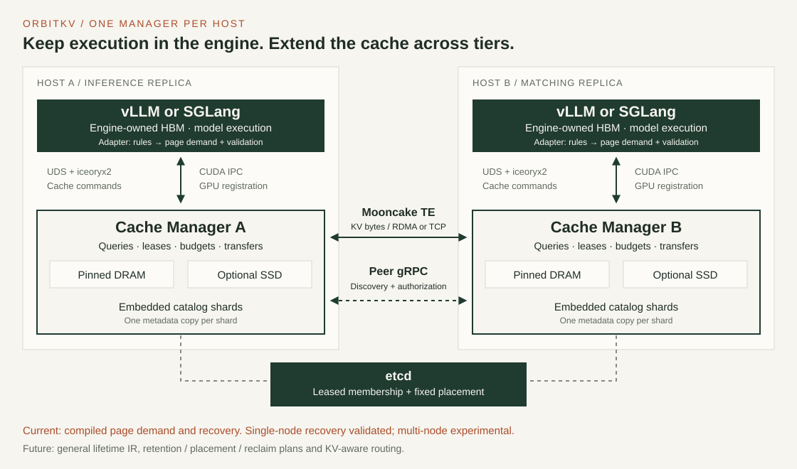

# OrbitKV architecture

## Mission

OrbitKV is a KV cache for vLLM and SGLang and a proposed framework-neutral
state planner. It does not schedule model execution. Each framework owns its
HBM allocation and active GPU page lifecycle. Its adapter exposes block
identity and registered GPU buffers; OrbitKV currently owns external pinned
DRAM/SSD replicas and transfer leases. SGLang and vLLM hybrid layouts share
compiled page demand and recovery validation; general lifetime analysis,
retention and joint placement/routing policy remain future work.

The data plane is derived from PegaFlow 0.24.5. The vLLM connector and SGLang
direct GPU linker have passed single-node GPU recovery tests.

## Process topology



Run one OrbitKV Cache Manager per inference host. Framework adapters run in the
inference processes and use the same cache API for local DRAM, SSD, and remote
fetches. The cache manager decides where to source a hit; the inference engine
still decides when to query and save. Remote fetch is experimental. There is no
OrbitKV KV-aware request router today.

```text
       current multi-node cache (experimental)
   host A                                      host B
   vLLM or SGLang                             vLLM or SGLang
   engine-owned HBM                           engine-owned HBM
        | CUDA IPC + UDS/iceoryx2                   | CUDA IPC + UDS/iceoryx2
   Cache Manager A ---- Mooncake RDMA/TCP ---- Cache Manager B
   pinned DRAM / SSD                         pinned DRAM / SSD
            \                                   /
             \---- etcd members/placement ----/
      catalog shards embedded in Managers; one copy per shard
```

Single-node deployment consists of one engine and one Cache Manager on the same
host and needs neither Catalog nor peer gRPC. Current SSD backing is a cache
file truncated on Cache Manager startup, not durable KV storage across manager
restarts. Distributed Managers advertise sealed replicas to assigned catalog
shards using cached membership, then query missing evidence in bounded batches.
They authorize/pin source data before Mooncake reads bytes. Catalog restart is
repaired from surviving owner inventories. Each shard has one metadata copy;
replication and online placement handoff remain future work.

Standalone deployment has no gRPC listener. Registration, health, sessions, and
cleanup use the authenticated bootstrap UDS. `--etcd-endpoints` with Node ID and catalog placement enables a
peer gRPC listener for catalog synchronization, discovery, source authorization
and lock release. Process
IPC supports query, publish, asynchronous restore completion, and lease
release:
iceoryx2 carries fixed descriptors while a Unix socket authenticates the peer,
passes a sealed memfd descriptor arena, and supplies an eventfd for wakeups.
The vLLM adapter requires this path and fails fast if the Cache Manager socket
is missing. Each inference process must reach a Cache Manager on its own host.
Pending queries return `Loading` and continue on Tokio. The endpoint owns one
session-scoped operation/revision registry bound to instance, request, and group;
the core query future owns its backing
reads and returns a terminal result. Cancelling or disconnecting drops reply
ownership while submitted reads drain, including cache admission and lease
release, without another poll. SGLang's plugin admission hook keeps pending
requests queued until a leased result or bounded fallback is available.
vLLM defers further lookup admission until an admitted restore reaches its first
compute step. This prevents a deferred lookup that cannot allocate GPU pages
from stranding a completed restore behind it in the waiting queue.
Query reservations use the registered group's padded bytes and remain charged
through preparation, result ownership, and GPU completion. Global and instance
limits bound retained payloads; identical backing reads can be shared while
each request keeps its own ticket and lease. See [query budgets](server.md#query-ownership-budgets).
Publish holds its
iceoryx2 reply until D2H finishes, so the caller does not release source HBM
pages early while the dispatcher remains free. The Rust cache client opens a
separate descriptor session for Publish on its first save, so an in-flight
save does not serialize the worker's Query/Restore calls behind that reply.
Instance cleanup serializes against registration, drains GPU load/save queues,
and only then releases imported CUDA mappings. Superseded
sessions cannot clean up a replacement session. Both vLLM and the SGLang
direct linker register CUDA IPC pages and use iceoryx2 descriptors on the hot
path. Remote transfers use the Mooncake-backed `TransferEngine`.
See [transport.md](transport.md) for the measured process-transport baseline.

## API and crate boundaries

| Layer | Code | Owns |
| --- | --- | --- |
| Framework adapters | `python/orbitkv/vllm`, `python/orbitkv/sglang` | Framework-specific hashes, layout, and page-lifetime events |
| Cache client | `orbitkv-channel/src/cache_client.rs`, `python/src/client.rs` | Rust query/warming ownership, independent publish session, client-bound restore handles and GIL-free waiting; PyO3 API |
| Connection setup | `python/orbitkv/client/connection.py` | Engine endpoint options and same-host socket selection |
| State contract | `orbitkv-state` | State identity, format compatibility, compiled page demand, recovery validation, page-reference types |
| Process IPC | `orbitkv-channel`, `orbitkv-server/src/endpoint/` | iceoryx2 requests/replies, UDS bootstrap and lifecycle, pending queries, descriptor generation |
| Process utilities | `orbitkv-common` | Shared logging setup and peer connection defaults |
| Hardware locality | `orbitkv-core/src/numa.rs` | NUMA topology and allocation/worker affinity |
| Cache statistics | `orbitkv-server/src/metric/hll.rs` | Namespaced miss cardinality and windowed reuse estimates |
| Cache service | `orbitkv-server/src/cache/` | Transport-neutral operations, registration, and session cleanup |
| Cache engine | `orbitkv-core` | Leases, HBM transfer scheduling, pinned DRAM, SSD, local and remote lookup |
| Peer control | `orbitkv-proto`, `orbitkv-core/src/internode/p2p_service.rs` | Network authorization and transfer locks |
| Replica catalog | `orbitkv-catalog`, `orbitkv-core/src/internode` | Candidate ownership and node liveness; embedded fixed shards with cached member admission |
| Byte movement | `orbitkv-transfer`, `orbitkv-mooncake-sys` | Mooncake Segment/BatchTransfer over RDMA or TCP |

Transport-specific names belong at physical boundaries. Cache operations and
framework adapters use placement-neutral names and results. Moving a cache hit
from DRAM to SSD or another node should not change `query_prefetch`, `save`,
`start_restore`, or `release` for the caller. The process channel implements
the current iceoryx2/UDS connection without defining a separate cache API.

## Layering

```text
vLLM adapter                SGLang adapter
block hashes / CUDA IPC     radix hashes / CUDA IPC
                             /
       PyO3 CacheManagerClient (cache API)
                    |
       Rust CacheClient (request ownership)
                    |
    orbitkv-channel / iceoryx2 + UDS
                    |
              orbitkv-server/cache/operations
                           |
                    orbitkv-core
                 cache · leases · tiers
                    /           \
                  SSD      Mooncake Transfer
                           |
                    peer DRAM / SSD

     peer control: tonic / gRPC, only with distributed etcd/placement configuration

    orbitkv-state: shared state identity and recovery semantics
```

### `orbitkv-state`

This crate contains no framework or CUDA dependencies. Its first public types
are:

- `StateKey`: the materialized model/storage namespace and versioned native prefix/group key;
- `StateDescriptor`: logical token span, component and format evidence for future recovery validation;
- `StateFormat`: model/implementation digest, dtype, layout, and parallel shape;
- `StateComponent`: attention KV, MLA, recurrent, convolution, SWA, draft, and
  indexer state;
- `LocalPageRef`: generation-qualified CUDA IPC or shared-host page reference;
- `StateBundle` and `RecoveryContract`: the components needed to claim that a
  logical boundary is restorable.

`RecoveryContract::compile` normalizes declared prefix/window/checkpoint rules
once at registration. `required_ranges(namespace, start, end)` exposes
absolute page-aligned intervals per group from the engine's valid HBM prefix
origin. Prefix demand covers the tail, window demand rounds up to pages and is
capped by that tail, and checkpoint demand selects its final page.
`restorable_boundaries` uses the same requirements to check namespace identity,
aligned spans and complete leased coverage. Both adapters intersect legal
boundary sets across ranks or shards; hybrid reconciliation is shared.

SGLang checks exact transferred-plus-retained keys against those ranges;
vLLM uses them for hybrid allocation. Hybrid discovery returns metadata-only
candidate positions; Rust computes legal boundaries and `read_recovery` uses
those same ranges to slice actual reads and revalidate leased coverage.
Discovery is not a hit promise. A stale selected range falls back to the valid
engine-owned origin. This compiles declared semantic
requirements into deterministic page demand. It does not analyze arbitrary model
graphs, prove the model's mathematics, predict future tokens, authorize reclaim
or enable automatic hybrid warming. General retention and physical planning
remain future work; this increment has no measured latency claim. See the
[known-range example and ownership lessons](hybrid-recovery.md).

Physical bytes may be shared across vLLM and SGLang only when their
`StateFormat` values are compatible. Sharing the core and policy never implies
blind cross-framework byte reuse.

### Framework adapters

The adapters resolve a shared versioned identity at startup and translate native
hashes and GPU layouts into the cache API. The manager binds registered storage
geometry and uses `StateKey` across tiers. Supported layouts use the common
recovery contract:

| Concern | vLLM | SGLang |
| --- | --- | --- |
| Prefix identity | `Request.block_hashes` | Radix page hashes |
| Local GPU pages | vLLM block IDs + CUDA IPC | Radix page indices + CUDA IPC on the direct path |
| Host pages | OrbitKV-owned pinned blocks | OrbitKV-owned pinned blocks |
| Hybrid state | Attention + aligned recurrent groups; shared demand and validation | Full + SWA or Full + recurrent/conv; shared demand and validation |
| Lifecycle | KVConnector callbacks | Radix-cache events |

Adapters do not decide which component set is a legal recovery point. That
logic belongs in the common recovery contract.

### `orbitkv-core`

The current core provides content-addressed sealed blocks, NUMA-aware pinned
memory, leases, LRU/TinyLFU admission, SSD, remote fetch, and session cleanup.
DRAM, SSD and the directory share `orbitkv-state::StateKey`; registration binds
model identity to stored layout before Query/Publish. Engine page IDs remain raw,
and generation-qualified page types and complete recovery proofs are not yet
enforced. See [state identity](state-identity.md) for fingerprint configuration.

### Transfer and backing domains

The native physical domains are:

- framework GPU pages;
- shared or OrbitKV-owned pinned DRAM;
- local SSD;
- remote OrbitKV replicas over Mooncake-selected RDMA or TCP.

Mooncake Transfer Engine is the sole remote-movement backend in this codebase. It
contributes Segment/BatchTransfer, multi-NIC topology selection, endpoint
pooling, and rail failover. Mooncake Store Master is not OrbitKV's
semantic authority: bundle completeness, leases, generations, and planning
remain in OrbitKV.

## SGLang integration

### Direct GPU linker and compiled recovery

`orbitkv.sglang.linker.OrbitKVLinker` is registered through SGLang's plugin
entry point and selected by `--radix-cache-backend orbitkv` together with
`--enable-unified-cache-external-linker`. The latter is required for SGLang's
scheduler to submit GPU restores and drain linker completions. It uses
`UnifiedCacheLinker` callbacks to look up radix page hashes, pin SGLang-owned
GPU slots during asynchronous saves and loads, and transfer bytes through the
same Cache Manager API as vLLM. Each scheduler rank registers its local GPU KV
buffers through CUDA IPC. A model-, rank-, and layout-scoped namespace prevents
incompatible byte reuse. Full attention, Full + SWA and Full + recurrent/conv
have explicit recovery rules. Convolution and recurrent tensors share one
sealed checkpoint group; SWA has independent page coverage. SGLang retains
authority over HBM allocation, request-state copy-on-write and prefix-tree nodes.
Hybrid lookup discovers group positions without reading payloads and preserves
all legal boundaries until rank intersection. Rust reads only the selected
compiled ranges; SGLang admits the hit after every rank holds complete leases.
The [hybrid recovery contract](hybrid-recovery.md) describes the pinned-release
component bridge and unsupported representations.

Both DRAM and SSD recovery are GPU-validated at TP=1. SGLang's general plugin
admission hook retains pending requests in the queue and consumes the ready
result on a subsequent match. vLLM reports unresolved lookups through its own
connector scheduler contract. The original SSD readiness failure and successful
follow-up remain in [SSD results](ssd-performance.md). The first
[bounded queued-warming path](queued-warming.md) is implemented; cost selection
remains in [state demand and transfer planning](state-planning.md).

### Future: Radix lifecycle bridge for routing

Publish prefix materialization, match, release, promotion, demotion, and removal
events from RadixAttention. OrbitKV uses the events to maintain a global replica
index and estimate next touch. It does not maintain a competing radix tree.

### Future: generation-safe page references

Adapters pass generation-qualified references for engine-owned HBM pages.
OrbitKV validates the registration session and page generation before copying,
while the engine still allocates and reuses its HBM slots. OrbitKV can assign
handles to its own external replicas without taking over the GPU allocator.

## Safety invariant

A physical generation may be reused only when both conditions hold:

```text
SemanticDead(page, semantic_frontier)
and
ExecutionComplete(page, execution_frontier)
```

Semantic death proves that no future legal execution can read the state.
Execution completion proves that no submitted CUDA, SSD, or network operation
still references the generation. A lease or refcount supplies execution
evidence; it does not by itself prove semantic death.

The descriptor arena validates its slot generation and Cache Manager session epoch,
and vLLM pins save-source blocks until Publish returns. These checks do not
yet validate a framework HBM page's reuse generation. `LocalPageRef` defines
the future contract, but current Publish still carries raw block IDs;
generation enforcement requires page-lifecycle information from the adapter
before a stale ID can be rejected at the Cache Manager boundary.

## Multi-node cache path and deployment

`orbitkv-catalog` is an embedded library served on each distributed Manager's
peer endpoint. All Managers agree on an immutable catalog host set in etcd.
Sixteen fixed logical shards are assigned by equal-weight rendezvous hashing;
member loss does not change placement. Cached member snapshots resolve each
assigned Node ID to a current endpoint and runtime UUID. Ordinary block operations
perform no etcd I/O.

Managers asynchronously synchronize independently ordered DRAM inventory streams
per shard. Bounded snapshots and deltas reconstruct lost evidence; incomplete
replacement views stay hidden until commit. After a local miss, the requester
checks its bounded positive candidate index and queries only missing shards.
It plans source spans and obtains exact runtime/residency authorization before
Mooncake reads bytes into pinned DRAM, then restores them through the same engine
API. The destination also advertises its newly resident replicas.

Catalog and source control use gRPC; Mooncake carries KV bytes. Mooncake's P2P
handshake provides transport metadata rather than KV ownership. Each catalog
shard currently has one metadata copy, so losing a host makes those cold lookups
unavailable until it returns and inventories replay. Other shards and valid
cached candidates remain usable. etcd membership gates new remote admission;
local DRAM/SSD operations continue through coordinator loss.

Source transfer timeout reclamation still lacks transport revocation qualification.
Caller cancellation retains buffers and source holds through blocking completion,
but this does not prove safe source failure or partitions. See the
[implemented protocol and limits](../crates/orbitkv-catalog/README.md).

The next stages add replicated placement generations, controlled handoff,
subscriptions and remote SSD. These are target features in the diagram below.
The [distributed cache design](distributed-cache.md) defines the acceptance gates.
A later KV-aware router can consume replica summaries and engine load events
without entering the transfer path. Metadata replicas do not imply KV payload
replicas or general object-store CAS semantics.

```text
host A                                           host B
engine HBM                                      engine HBM
    | UDS + iceoryx2 / CUDA IPC                      | UDS + iceoryx2 / CUDA IPC
Cache Manager A  <---- Mooncake KV bytes ---->  Cache Manager B
  DRAM / SSD · local candidate index              DRAM / SSD · local candidate index
  catalog shards  <---- replicated metadata ---> catalog shards
         \________ etcd membership/placement _________/

catalog summaries ----> future KV-aware router <---- engine load/events
```

## Planning direction

The proposed [state demand and transfer planner](state-planning.md) describes
engine readiness signals, recovery boundaries, prefetch timing, and the local
evaluation sequence. It is a design proposal; current cache hits do not imply
those planning capabilities are implemented.

After the cache and catalog are reliable, the target optimization problem is
Minimum Persistent State Realization: find
the smallest complete `StateBundle` that can resume legal execution, then choose
its physical realization. The planner compares:

```text
queue delay
+ missing-state recomputation
+ restore time by tier and topology
+ transfer queueing
+ destination eviction externality
+ replica failure risk
```

These terms require calibrated units and critical-path accounting; overlapping
operations cannot simply have their durations added together.

Reuse Dynamo's worker selector for request placement. Dynamo v1.4.2 provides
an independent Rust router crate and a selection service; its runtime is an
optional dependency of the crate. The selected Cache Manager then revalidates
replicas and constructs the leased physical plan: source, restore or recompute
proposal, staging budget, transfer deadline, and completion dependencies. The
engine owns execution admission and HBM allocation. A routing load reservation
does not replace a transfer lease.

The [Dynamo integration boundary](state-planning.md#reuse-dynamo-for-request-routing)
and [implementation stages](state-planning.md#implementation-sequence) specify
the reusable components, pending engine-interface dependency, and acceptance
gates. No router dependency is introduced into the current single-node core.

## Ownership boundary by milestone

| Milestone | Framework owns | OrbitKV owns |
| --- | --- | --- |
| M0 | local page identity and execution | external replicas and current data plane |
| M1 | GPU pages | Pinned DRAM/SSD replicas and direct GPU restore |
| M2 | GPU pages | Compiled page demand, common recovery validation and transfer operations |
| M2.5 | GPU pages and execution | recoverable replica catalog and remote cache fetch |
| M3 | execution and local page identity | KV-aware routing and restore plans |
| M4 | HBM allocation, physical GPU page IDs, and execution | external replica handles, validated GPU references, and transfer fences |
| M5+ | execution | semantic lifetime and compiled physical plans |
