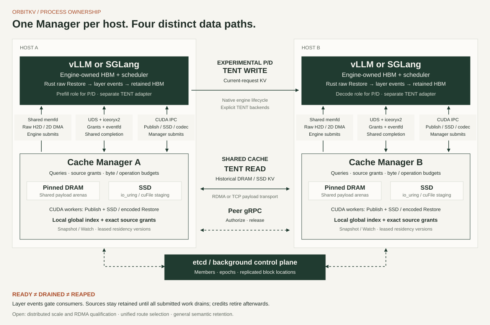
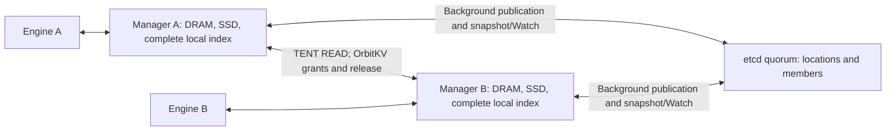

# OrbitKV architecture

## Mission

OrbitKV is a KV cache for vLLM and SGLang and a proposed framework-neutral
state planner. It does not schedule model execution. Each framework owns its
HBM allocation and active GPU page lifecycle. Its adapter exposes block
identity and registered GPU buffers; OrbitKV currently owns external pinned
DRAM/SSD replicas and transfer leases. SGLang and vLLM hybrid layouts share
compiled page demand and recovery validation; general lifetime analysis,
retention and joint placement/routing policy remain future work.

The vLLM connector and SGLang direct GPU linker share the same Rust cache client
and have passed single-node GPU recovery tests.

## Process topology



Run one independent OrbitKV Cache Manager per inference host, with one or more
engine instances connected to it. Framework adapters run in the inference
processes and use the same cache API for local DRAM, SSD, and remote
fetches. The cache manager decides where to source a hit; the inference engine
still decides when to query and save. Remote fetch is experimental. There is no
OrbitKV KV-aware request router today.

The diagram separates four payload routes:

| Route | Submission owner | Control and completion |
| --- | --- | --- |
| Raw local DRAM → HBM | Engine's Rust executor | Manager source grant; shared memfd arenas; per-layer CUDA events; final GPU drain and asynchronous source retirement |
| Publish, SSD or encoded Restore | Manager GPU/storage worker | CUDA IPC tensor registration; retained source/destination and staging owners through completion |
| Historical peer KV → local cache → HBM | Requester Manager, then its existing local Restore route | Local index candidates and source gRPC authorization; TENT READ; acknowledged source release |
| Current prefill KV → decode HBM | Engine P/D adapters | TENT WRITE; vLLM split-connector protocol or SGLang native bootstrap/rooms |

UDS transfers descriptors during session setup; iceoryx2 carries local cache
commands. Shared completion records and eventfd wakeups report local restore
progress. The native executor records a layer event only after that layer's final
required ranges; consumers can overlap later raw copies while source ownership
remains retained through final drain. vLLM admits the restore into the consuming
forward and requires piecewise graphs. SGLang installs persistent external event
waits before its first graph capture. Packed buffers, vLLM recurrent operators
and multi-part plans retain coarser dependencies; see the
[layer readiness contract](engine-local-restore.md#layer-readiness-and-framework-consumption).
etcd stores membership, epochs and block locations. Background publication and
snapshot/Watch maintain a complete local global index. Discovery stays local;
peer source authorization and release use gRPC.


Single-node deployment connects engines to their host's Cache Manager and needs
neither Catalog nor peer gRPC. The Manager shares external capacity across
instances; model/storage identities still determine whether bytes are reusable.
Container GPU/PID/IPC wiring and concurrent multi-engine serving require
[separate qualification](deployment.md#containers-and-kubernetes).
Current SSD backing is a cache
file truncated on Cache Manager startup, not durable KV storage across manager
restarts. Distributed Managers asynchronously publish DRAM and SSD residencies
to etcd. Their complete local global indexes supply candidates; exact source
authorization and pins still precede Mooncake READ. Metadata replication cannot
preserve a payload held only by a failed source.

Standalone deployment has no gRPC listener. Registration, health, sessions and
cleanup use the authenticated bootstrap UDS. `--etcd-endpoints` with a Node ID
enables source authorization and release on the peer gRPC listener. Process
IPC supports query, publish, asynchronous restore completion, and lease
release:
iceoryx2 carries fixed descriptors while a Unix socket authenticates the peer,
passes sealed descriptor and restore-result memfds, and supplies separate
eventfds for restore completion and Publish replies. A required companion
iceoryx2 event wakes request dispatch after
enqueue; the Manager sleeps until a request event or maintenance deadline
instead of polling every 50 us. Restore completion is read and acknowledged from its shared record;
the GPU outcome waiter publishes it directly without a dispatcher scan or terminal RPC.
The vLLM adapter requires this path and fails fast if the Cache Manager socket
is missing. Each inference process must reach a Cache Manager on its own host.
Pending queries return `Loading` and continue on Tokio. The endpoint owns one
session-scoped operation/revision registry bound to instance, request, and group;
the core query future owns its backing
reads and returns a terminal result. Cancelling or disconnecting drops reply
ownership while submitted reads drain, including cache admission and lease
release, without another poll. SGLang's plugin admission hook keeps pending
requests queued until a leased result or bounded fallback is available.
vLLM defers further lookup admission until an admitted restore reaches its first
compute step. This prevents a deferred lookup that cannot allocate GPU pages
from stranding a completed restore behind it in the waiting queue.
Query reservations use the registered group's padded bytes and remain charged
through preparation, result ownership, and GPU completion. Global and instance
limits bound retained payloads; identical backing reads can be shared while
each request keeps its own ticket and lease. See [query budgets](server.md#query-ownership-budgets).
Users configure SSD paths and capacity; engine adapters do not choose the
storage backend, and normal deployment leaves `--ssd-backend` at its default.
With [automatic SSD selection](gds.md), the Manager tries native cuFile on
ext4/XFS and falls back to io_uring when unavailable. On the cuFile path a demand
result can own a pinned file extent instead of host bytes. A dedicated GPU storage worker reads through
bounded registered staging and scatters only the selected state. DRAM restores,
and speculative preparation retain their existing paths. Complete groups can
be written from GPU staging; fragmented groups seal in DRAM before writeback.
GPU-storage files reserve physical capacity before admission. Reads coalesce
across source leases within each file, while the restore task retains all leases
and excludes unrequested aligned gaps. Two registered 4 MiB slots issue
asynchronous cuFile I/O with event/byte-count completion checks. The storage
queue limits GPU writes to eight jobs and one in-flight write, rotates jobs by
batch and bounds read bursts; saturation uses host publication/io_uring.
Native GDS
qualification is separate from compatibility-mode correctness.
Publish holds its
iceoryx2 reply until D2H and any GPU-backed SSD writes finish, so the caller does not release source HBM
pages early while the dispatcher remains free. The Rust cache client opens a
separate descriptor session for Publish on its first save, so an in-flight
save does not serialize the worker's Query/Restore calls behind that reply.
Instance cleanup serializes against registration, drains GPU load/save/storage queues,
and only then releases imported CUDA mappings. Superseded
sessions cannot clean up a replacement session. Both vLLM and the SGLang
direct linker register CUDA IPC pages and use iceoryx2 descriptors on the hot
path. Remote transfers use the Mooncake-backed `TransferEngine`.
See [transport.md](transport.md) for the measured process-transport baseline.

## API and crate boundaries

| Layer | Code | Owns |
| --- | --- | --- |
| Framework adapters | `python/orbitkv/vllm`, `python/orbitkv/sglang` | Framework-specific hashes, layout, and page-lifetime events |
| Cache client | `orbitkv-channel/src/cache_client.rs`, `python/src/client.rs` | Rust query/warming ownership, independent publish session, client-bound restore handles and GIL-free waiting; PyO3 API |
| Connection setup | `python/orbitkv/client/connection.py` | Engine endpoint options and same-host socket selection |
| State contract | `orbitkv-state` | State identity, format compatibility, compiled page demand, recovery validation, page-reference types |
| Process IPC | `orbitkv-channel`, `orbitkv-server/src/endpoint/` | iceoryx2 requests/replies, UDS bootstrap and lifecycle, pending queries, descriptor generation and authenticated completion observations |
| Process utilities | `orbitkv-common` | Shared logging setup and peer connection defaults |
| Hardware locality | `orbitkv-core/src/memory/numa.rs` | NUMA topology and allocation/worker affinity |
| Cache statistics | `orbitkv-server/src/metric/hll.rs` | Namespaced miss cardinality and windowed reuse estimates |
| Cache service | `orbitkv-server/src/cache/` | Transport-neutral operations, registration, and session cleanup |
| Cache engine | `orbitkv-core` | Leases, HBM transfer scheduling, pinned DRAM, SSD, local and remote lookup |
| Peer control | `orbitkv-server/src/peer.rs`, `orbitkv-core/src/peer/export.rs` | Server translates RPCs; Core validates and owns source grants |
| Global index | `orbitkv-catalog`, `orbitkv-server/src/cluster` | Complete local candidate index; fenced etcd publication, snapshot/Watch and member admission |
| Byte movement | `orbitkv-transfer`, `orbitkv-mooncake-sys` | Mooncake Segment/BatchTransfer over RDMA or TCP |

Transport-specific names belong at physical boundaries. Cache operations and
framework adapters use placement-neutral names and results. Moving a cache hit
from DRAM to SSD or another node should not change `query_prefetch`, `save`,
`start_restore`, or `release` for the caller. The process channel implements
the current iceoryx2/UDS connection without defining a separate cache API.

## Definitions and naming

These terms describe responsibilities in the existing owners. A term does not
require a new public type, wrapper or planner layer.

| Term | Meaning and boundary |
| --- | --- |
| Demand | State groups and ranges needed for a legal recovery boundary. It does not allocate pages or authorize reads. |
| Replica / candidate | A stored copy / evidence that a compatible copy may exist. A candidate does not hold the bytes. Medium, owner/locality and representation are separate dimensions. |
| Route | Supported transfer, staging and decode steps from a source to a declared completion target. TENT is a transfer backend; remote is locality, not a medium. |
| Plan | Bounded work description whose type declares its stage. `ReadPlan` holds unresolved candidates; `RestorePlan` binds selected sources and target geometry without owning payload or capacity; `RawRestorePlan` is the bounded copy description. |
| Lease | A retained source lifetime tied to a specific version or allocation. Expiry cannot release submitted DMA resources. |
| Grant | Authority to access retained resources under a fenced protocol. `RawRestoreGrant` retains sources, query reservations and the device permit. Registration alone grants no logical page lifetime. |
| Permit / admission | A real capacity reservation / the decision to acquire one. `DecodeRestorePermit` reserves an operation slot; it does not own GPU pages. |
| Shape | Descriptive bytes, fragments and geometry. `RestoreTargetShape` records the validated destination device and aggregate shape, with no resource ownership. |
| Resource evidence | A bounded, expiring snapshot of usage or queue pressure. `cost/resource_evidence` records it; execution owners perform admission. |
| Observation / estimate | A measured interval and outcome / a prediction derived from compatible observations. Neither authorizes execution. |
| Ready | The requested state is successfully usable at the declared target. Current `CompletionIntent::EngineRestore` names the engine-target goal; `HostReady` ends at host materialization. |
| Drained | Submitted accesses are terminal, including failure or cancellation. Drain permits safe release but does not imply successful recovery. |
| Reaped | The Manager released the operation's retained source owners and credits. It is distinct from engine readiness and record acknowledgement. |

`CostObservationKind` names a measurement boundary, `ExecutionResource` names
the measured resource, and the completion target says where the result must
be usable. They are independent. `CacheRestore` measures cache-to-engine
restoration, including Manager SSD/codec routes, and is distinct from
`PrefillToDecodeHandoff`. It begins after engine page allocation, not at
request arrival. First engine use and TTFT remain separate measurements.

Current cost estimates predict elapsed seconds with empirical error. Byte
counts describe route shape and resource demand; capacity is enforced by
execution owners. There is no combined score adding latency, bytes and
retention cost without a defined objective.

Keep protocol states tied to their authority transition. Rename misleading
internal types and their consumers together; do not retain aliases or forwarding
APIs. Wire/metric names need their own coordinated cutover when their actual
measurement boundary changes. Unsupported paths do not get speculative types.

## Core module ownership

| Module | Responsibility |
| --- | --- |
| `engine/` | Instance registration, `EngineConfig`, Publish orchestration, demand validation, restore handoff and registered-target completion evidence |
| `memory/` | NUMA placement, pinned allocations and pools |
| `storage/` | Residency assembly, shared replica inventory and allocator-driven reclamation; `publish.rs` owns queued sealing and publication |
| `storage/dram/` | Resident images, eviction/admission policy and exact insertion versions |
| `storage/ssd/` | Files, index, immutable extent leases, io_uring/cuFile I/O and registered staging |
| `planning/` | Metadata-only discovery, batch replica evidence, bounded host routes and device-bound consumed restore plans |
| `query/` | Admission budgets, shared reads, host materialization, query phases and leases |
| `peer/` | Local candidate discovery, authoritative exports, requester READs and completion recovery |
| `transfer/` | Registered engine layouts, GPU copies/codecs and completion-drained workers |
| `codec/` | Representation validation and encoding/decoding |
| `cost/` | Explicit operation/route sample boundaries, bounded resource-scoped estimates and guarded same-target shadow comparisons |

`lib.rs` defines the public API. Tests mirror these modules under
`crates/orbitkv-core/tests/unit/`; GPU integration gates stay in `tests/`.
`backing/` and `internode/` have been removed. There is one SSD store with
independent access routes; peer transport is not a storage medium. `PeerExports`
checks live owner/version evidence and holds source memory until completion.
Every pinned-pool shard has a size-sealed memfd backing mapped with `MAP_SHARED`;
regular and huge pages share the same NUMA first-touch and CUDA registration
path. GPU registration exports payload FDs to inference processes, which map
and CUDA-register them independently. Unencoded DRAM restores execute in the
inference process under a Manager-owned source grant; SSD, encoded and mixed
restores retain Manager workers. See [engine-local restore](engine-local-restore.md).
The Mooncake registration owner retains its pinned pool through unregister.
Each registered region is represented by an RAII token that also retains the
TransferEngine; Core clears these tokens before releasing the pinned-pool
backing. A future GPU-region token does not by itself own engine HBM: it must be
bundled with the engine's generation-fenced page grant through completion.
Cost observations and shadow comparisons remain opt-in; shadow results never
select execution. A second opt-in may choose among equal-coverage owners of one
peer medium using complete HostReady evidence, while broader cross-route choice
remains open. Local SSD and single-owner peer routes share stored-byte/block
HostReady keys; a third experimental opt-in may execute the cross-medium result,
while the ordinary default stays fixed until H20 qualification. Peer SSD uses
source io_uring staging plus Mooncake TE; remote HBM and GPU-direct cache
endpoints remain future work.
Instance-owned GPU workers share the bounded GPU SSD-write admission for their
physical CUDA device; the permit remains with the submitted save until its
completion owner releases it.
One instance worker pool at a time owns that device's persistent cuFile and
codec staging. Automatic SSD demand may switch to io_uring before submission
when another pool owns staging; an explicit cuFile route never switches. The
owner covers read and GPU-write workers and is released only after all lanes of
that pool drain.

`RestoreExecution` returns either a local raw source grant or a Manager-worker
completion receiver. The process channel exposes one restore handle API with
generation-fenced shared records. Engine-local results become consumable
after drain, while Manager source retirement completes separately. The old
terminal-poll RPC has been removed.

## Upstream designs and OrbitKV owners

LMCache, FlexKV and Mooncake provide implementation references for concrete
cache mechanisms. OrbitKV applies them through its existing state contract and
Rust resource owners. vLLM and SGLang adapters continue to supply engine layouts,
scheduler signals and page ownership; they do not gain separate cache schedulers.
The [integration reference](adapters.md#lmcache-and-flexkv-reference)
maps released LMCache callback and P/D contracts to OrbitKV ownership;
remaining execution work is tracked only in the completion plan.

| Reference | Mechanism to use | OrbitKV owner and status |
| --- | --- | --- |
| [LMCache v0.5.5 GDS context](https://github.com/LMCache/LMCache/blob/05a013b29da78cf2321b9b46ec5039dde2fb0bb0/lmcache/v1/gpu_connector/gds_context.py) | Preallocated storage, reusable registered staging, stream-ordered I/O with retained submission state | `storage/ssd` reserves capacity; `cufile/slot` owns registered streams/staging and stable asynchronous arguments/results through event completion. |
| [LMCache MP serialization](https://docs.lmcache.ai/mp/serde.html) and [FlexKV compression](https://github.com/taco-project/FlexKV/tree/738ddc141a198b4e20de6c5d1f0128e387f7fdb2/flexkv/transfer/compression) | Separate engine precision from cache encoding; bound codec workspace and qualify formats | `codec/` owns batched GPU ANS/FP8/TurboQuant, reusable arenas, CPU SIMD and CRC validation; `transfer/worker/codec` owns engine-page and writeback lifetimes. Encoded DRAM, SSD and Mooncake payloads share versioned metadata. cuFile can write encoded GPU groups and restore through GPU validation/decode. Native GDS and broader model-quality qualification remain open. |
| [FlexKV file-range coalescing](https://github.com/taco-project/FlexKV/blob/738ddc141a198b4e20de6c5d1f0128e387f7fdb2/csrc/transfer_ssd.cpp) and [GDS](https://github.com/taco-project/FlexKV/blob/738ddc141a198b4e20de6c5d1f0128e387f7fdb2/csrc/gds/gds_manager.cpp) | Merge physically compatible same-file ranges; keep storage geometry separate from engine tensor layouts | `transfer/worker/ssd` validates demand and coalesces leased ranges per file; its queue owns task/extent lifetime, bounded GPU write admission and batch-level read/write scheduling. |
| [Mooncake TE v0.3.13.post1](https://github.com/kvcache-ai/Mooncake/blob/719735896c86b56fabec6cf3e825fb2ea640597a/mooncake-transfer-engine/include/transfer_engine.h) | Registered memory and batched remote transfers | Reused directly through `orbitkv-transfer` and `orbitkv-mooncake-sys`. Catalog/source authorization and state compatibility remain OrbitKV responsibilities. Scoped two-host TCP serving passes; RDMA remains unqualified. |
| [Mooncake RFC #3504](https://github.com/kvcache-ai/Mooncake/issues/3504) — draft proposal | Cached membership and embedded authority; keep coordination off per-key data paths | `orbitkv-catalog` owns complete local global indexes; `server/cluster` owns etcd metadata, leases and snapshot/Watch. The RFC is a reference, not a claim of implementation equivalence. |

Compiled `required_ranges`, complete-state recovery and generation/lease checks
remain the common acceptance boundary for every tier. A useful transfer policy
must reduce request latency or resource cost under matched workloads without
weakening those checks. Reuse, prefetch and retention policies keep their
[existing evidence gates](queued-warming.md#reference-implementations-and-policy-order);
an upstream default alone does not justify enabling an OrbitKV policy.
The [completion plan](completion-plan.md) keeps single-node correctness,
DP sharing, P/D reuse and catalog availability separately qualified.

## Layering

```text
vLLM adapter                SGLang adapter
block hashes / CUDA IPC     radix hashes / CUDA IPC
                             /
       PyO3 CacheManagerClient (cache API)
                    |
       Rust CacheClient (request ownership)
                    |
    orbitkv-channel / iceoryx2 + UDS
                    |
              orbitkv-server/cache/operations
                           |
                    orbitkv-core
                 cache · leases · tiers
                    /           \
                  SSD      Mooncake Transfer
                           |
                    peer DRAM / SSD

     peer control: tonic / gRPC, only with distributed etcd membership configuration

    orbitkv-state: shared state identity and recovery semantics
```

### `orbitkv-state`

This crate contains no framework or CUDA dependencies. Its first public types
are:

- `StateKey`: the materialized model/storage namespace and versioned native prefix/group key;
- `StateDescriptor`: logical token span, component and format evidence for future recovery validation;
- `StateFormat`: model/implementation digest, dtype, layout, and parallel shape;
- `StateComponent`: attention KV, MLA, recurrent, convolution, SWA, draft, and
  indexer state;
- `StateBundle`, `RecoveryContract` and `RecoveryDemand`: recovery evidence,
  compiled rules and the complete selected boundary's required group ranges.

`RecoveryContract::compile` normalizes declared prefix/window/checkpoint rules
once at registration. `required_ranges(namespace, start, end)` exposes
absolute page-aligned intervals per group from the engine's valid HBM prefix
origin. Prefix demand covers the tail, window demand rounds up to pages and is
capped by that tail, and checkpoint demand selects its final page.
`restorable_boundaries` uses the same requirements to check namespace identity,
aligned spans and complete leased coverage. Both adapters intersect legal
boundary sets across ranks or shards; hybrid reconciliation is shared.

SGLang checks exact transferred-plus-retained keys against those ranges;
vLLM uses them for hybrid allocation. Hybrid discovery returns metadata-only
candidate positions; Rust computes legal boundaries and `read_recovery` uses
those same ranges to slice actual reads and revalidate leased coverage.
Discovery is not a hit promise. A stale selected range falls back to the valid
engine-owned origin. This compiles declared semantic
requirements into deterministic page demand. It does not analyze arbitrary model
graphs, prove the model's mathematics, predict future tokens, authorize reclaim
or enable automatic hybrid warming. General retention and physical planning
remain future work; this increment has no measured latency claim. See the
[known-range example and ownership lessons](hybrid-recovery.md).

Physical bytes may be shared across vLLM and SGLang only when their
`StateFormat` values are compatible. Sharing the core and policy never implies
blind cross-framework byte reuse.

### Framework adapters

The adapters resolve a shared versioned identity at startup and translate native
hashes and GPU layouts into the cache API. The manager binds registered storage
geometry and uses `StateKey` across tiers. Supported layouts use the common
recovery contract:

| Concern | vLLM | SGLang |
| --- | --- | --- |
| Prefix identity | `Request.block_hashes` | Radix page hashes |
| Local GPU pages | vLLM block IDs + CUDA IPC | Radix page indices + CUDA IPC on the direct path |
| Host pages | OrbitKV-owned pinned blocks | OrbitKV-owned pinned blocks |
| Hybrid state | Full + SWA + aligned recurrent groups; shared demand and validation | Full + SWA + recurrent/conv; shared demand and validation |
| Lifecycle | KVConnector callbacks | Radix-cache events |

Adapters do not decide which component set is a legal recovery point. That
logic belongs in the common recovery contract.

The vLLM P/D adapter exposes separate prefill and decode connector classes;
there is no role-selecting compatibility facade. Its framework callbacks and
KV tensor layout inspection remain in Python. Registered-memory ownership,
TENT batch completion and the notification wait mailbox live in Rust. Native
waits release the GIL, preserve notifications consumed by competing waiter
threads, and fence close/reopen with a monotonically increasing scope
generation.

### `orbitkv-core`

The current core provides content-addressed sealed blocks, NUMA-aware pinned
memory, leases, LRU/TinyLFU admission, SSD, remote fetch, and session cleanup.
DRAM, SSD and the directory share `orbitkv-state::StateKey`; registration binds
model identity to stored layout before Query/Publish. Engine page IDs remain raw,
and generation-qualified page types and complete recovery proofs are not yet
enforced. See [state identity](state-identity.md) for fingerprint configuration.

### Transfer and backing domains

The native physical domains are:

- framework GPU pages;
- shared or OrbitKV-owned pinned DRAM;
- local SSD;
- remote OrbitKV replicas over Mooncake-selected RDMA or TCP.

Mooncake TENT is the sole remote-movement backend in this codebase. The legacy
Transfer Engine ABI is neither built nor loaded. TENT contributes
Segment/BatchTransfer, multi-NIC topology selection, endpoint
pooling, and rail failover. Mooncake Store Master is not OrbitKV's
semantic authority: bundle completeness, leases, generations, and planning
remain in OrbitKV.

## SGLang integration

### Direct GPU linker and compiled recovery

`orbitkv.sglang.linker.OrbitKVLinker` is registered through SGLang's plugin
entry point and selected by `--radix-cache-backend orbitkv` together with
`--enable-unified-cache-external-linker`. The latter is required for SGLang's
scheduler to submit GPU restores and drain linker completions. It uses
`UnifiedCacheLinker` callbacks to look up radix page hashes, pin SGLang-owned
GPU slots during asynchronous saves and loads, and transfer bytes through the
same Cache Manager API as vLLM. Each scheduler rank registers its local GPU KV
buffers through CUDA IPC. A model-, rank-, and layout-scoped namespace prevents
incompatible byte reuse. Full attention, Full + SWA, Full + recurrent/conv and
their combined layout have explicit recovery rules. Convolution and recurrent tensors share one
sealed checkpoint group; SWA has independent page coverage. SGLang retains
authority over HBM allocation, request-state copy-on-write and prefix-tree nodes.
Hybrid lookup discovers group positions without reading payloads and preserves
all legal boundaries until rank intersection. Rust reads only the selected
compiled ranges; SGLang admits the hit after every rank holds complete leases.
The [hybrid recovery contract](hybrid-recovery.md) describes the pinned-release
component bridge and unsupported representations.

Both DRAM and SSD recovery are GPU-validated at TP=1. SGLang's general plugin
admission hook retains pending requests in the queue and consumes the ready
result on a subsequent match. vLLM reports unresolved lookups through its own
connector scheduler contract. The original SSD readiness failure and successful
follow-up remain in [SSD results](ssd-performance.md). The first
[bounded queued-warming path](queued-warming.md) is implemented; cost selection
remains in [state demand and transfer planning](state-planning.md).

### P/D handoff

The SGLang P/D path is deliberately separate from the external-cache linker.
Pinned SGLang `0.5.20` owns bootstrap rooms, destination page allocation,
parallel-rank mapping, chunk scheduling and request completion. With
`SGLANG_MOONCAKE_TRANSFER_ENGINE=orbitkv`, the OrbitKV plugin registers an explicit
payload factory in the experimental engine build; SGLang constructs it lazily.
Official 0.5.20 does not ship this factory. The resulting adapter lowers
SGLang's registered pointer ranges and WRITE batches into the same PyO3-backed
Rust TENT owner as the vLLM P/D connector. It does not introduce another Python
request state machine or send payload through the Cache Manager/control plane.

Rust registration tokens retain HBM/host registrations, and Rust batch
completion retains all submitted addresses until each TENT task is terminal.
On a transfer error the adapter invalidates the cached segment and returns
failure to SGLang's room owner. The SGLang CLI still spells the backend
`mooncake` because that is its fixed dispatch key; OrbitKV packages and loads
only `libtent_shared.so`. The experimental vLLM profile likewise uses native
MooncakeConnector and vllm-router with an explicit TENT factory. Existing custom
vLLM owners remain until S3 destination-generation and remote-drain gates pass.
SGLang's deferred-release timeout also needs a safe reclamation contract.
See [P/D transfer](pd.md) for operation and current
qualification limits.

The first P/D-plus-cache composition uses the existing owners rather than a
new coordinator. Both workers may attach the OrbitKV external linker to the
same Cache Manager namespace; decode additionally enables SGLang's radix cache.
After exact identity/layout validation, prefill restores a reusable prefix,
SGLang sends the live request state to decode through TENT, and decode can
publish its longer completed prefix for a later prefill request. OrbitKV rejects
this composition if the live P/D backend is not its TENT adapter. Direct-to-D
restore versus P-restore-plus-handoff is not yet one comparable cost-model
choice and remains a later planning step.

### Future: Radix lifecycle bridge for routing

Publish prefix materialization, match, release, promotion, demotion, and removal
events from RadixAttention. OrbitKV uses the events to maintain a global replica
index and estimate next touch. It does not maintain a competing radix tree.

### Future: generation-safe page references

Adapters pass generation-qualified references for engine-owned HBM pages.
OrbitKV validates the registration session and page generation before copying,
while the engine still allocates and reuses its HBM slots. OrbitKV can assign
handles to its own external replicas without taking over the GPU allocator.

## Safety invariant

A physical generation may be reused only when both conditions hold:

```text
SemanticDead(page, semantic_frontier)
and
ExecutionComplete(page, execution_frontier)
```

Semantic death proves that no future legal execution can read the state.
Execution completion proves that no submitted CUDA, SSD, or network operation
still references the generation. A lease or refcount supplies execution
evidence; it does not by itself prove semantic death.

The descriptor arena validates its slot generation and Cache Manager session epoch,
and vLLM pins save-source blocks until Publish returns. These checks do not
yet validate a framework HBM page's reuse generation. Publish and Restore still
carry block IDs; unused page-reference types are not exposed as guarantees.
Generation enforcement requires page-lifecycle information from the adapter
and destination ownership through terminal DMA completion.

## Multi-node cache path and deployment

Each Manager has a complete local global index. Owner inventories record real
DRAM and SSD residencies independently; server cluster tasks publish their bounded
change journal to etcd using member/lease and publisher-cursor comparisons.
Fixed-revision snapshots plus Watch synchronize indexes without request-time
directory RPCs. A restarted Manager reconstructs locations from etcd; a failed
Manager does not take another Manager's index with it.

The requester reads local index evidence, plans source spans and obtains exact
runtime/residency authorization. TENT READ moves bytes into owned pinned DRAM;
the existing local path restores them to HBM. Newly resident requester copies
are published asynchronously. Source SSD uses bounded exact-generation staging.
Source grants and release use gRPC; native TENT remains the payload transport.

There are no catalog shards, fixed placement, TTL hints, directory lookup RPCs
or compatibility runtime. Incomplete snapshots or capacity failures withdraw
index availability. Etcd quorum loss stops new remote admission after conservative
lease expiry while local caches remain usable. See [protocol and limits](distributed-cache.md).

Source timeout does not prove transport revocation: overdue pins remain charged
until completion. Permanently lost requesters, physical partitions, RDMA and
large-cluster update capacity retain separate qualification gates. Metadata
redundancy does not imply payload replicas, durable SSD restart, or a unified
route optimizer.


```mermaid
flowchart LR
    EA[Engine A] <--> MA[Manager A: DRAM, SSD, complete local index]
    EB[Engine B] <--> MB[Manager B: DRAM, SSD, complete local index]
    MA <-->|TENT READ; OrbitKV grants and release| MB
    MA <-->|Background publication and snapshot/Watch| E[etcd quorum: locations and members]
    MB <-->|Background publication and snapshot/Watch| E
```

## Planning direction

The proposed [state demand and transfer planner](state-planning.md) describes
engine readiness signals, recovery boundaries, measured local/peer paths and
prefetch timing. Shared Rust cost observations and resource accounting support
different [deployment contracts](state-planning.md#policies-by-deployment-mode).

The first [structural refactor](state-planning.md#unified-replicas-routes-and-execution-ownership)
adds Core `planning/`: bounded replica records separate medium from acquisition
evidence, SSD planning revalidates exact versions before pinning, and peer plans
own source segmentation and rejected-evidence updates. Default execution remains
unchanged. The fuller owner/resource endpoint, route and resource-reservation
contract remains planned; current discovery still returns positions to the
engine. A common endpoint does not give the Manager allocation or eviction
authority over engine HBM. GPUDirect RDMA remains a TE capability requiring valid
GPU endpoints, not a new cache tier. See the
[target Core layout](state-planning.md#code-ownership-and-migration) and
[route cost contract](state-planning.md#cost-model-for-complete-routes).
Local path selection comes first; distributed qualification proceeds alongside
it. These are design proposals, not capabilities implied by current cache hits.

The planner compares legal recovery boundaries and the exact `required_ranges`
for each, then chooses available sources and executable paths. The longest
prefix or smallest stored representation need not minimize request latency.
For whole-restore admission, estimate from one decision point:

```text
state_ready = resource wait + restore critical path + completion visibility
first_token = max(engine_admission, state_ready) + remaining_prefill
```

Observe queue/service time, encoded and physical bytes, fragmentation, device
contention and prediction error. Enforce capacity, quality and latency limits;
overlapping durations cannot simply be added. Retention/write admission and
transfer scheduling share observations but remain separate decisions.

Mooncake TE remains the remote byte engine. Candidate discovery, source
authorization and both peers' budgets stay with OrbitKV. DP can propose bounded
fallback to recomputation; current-request P/D handoff needs explicit recovery
on failure. TP/PP add rank/stage completion dependencies. These dimensions can
compose within a deployment; roles belong to engine instances and operations,
not a single global Manager mode. HBM allocation stays with each engine.

Reuse Dynamo's worker selector for request placement. Dynamo v1.5.0 provides
an independent Rust router crate and a selection service; its runtime is an
optional dependency of the crate. The selected Cache Manager then revalidates
replicas and constructs the leased physical plan: source, restore or recompute
proposal, staging budget, transfer deadline, and completion dependencies. The
engine owns execution admission and HBM allocation. A routing load reservation
does not replace a transfer lease.

The [Dynamo integration boundary](state-planning.md#reuse-dynamo-for-request-routing)
and [implementation stages](completion-plan.md) specify
the reusable components, pending engine-interface dependency, and acceptance
gates. No router dependency is introduced into the current single-node core.

## Ownership boundary by milestone

| Milestone | Framework owns | OrbitKV owns |
| --- | --- | --- |
| M0 | local page identity and execution | external replicas and current data plane |
| M1 | GPU pages | Pinned DRAM/SSD replicas and direct GPU restore |
| M2 | GPU pages | Compiled page demand, common recovery validation and transfer operations |
| M2.5 | GPU pages and execution | recoverable replica catalog and remote cache fetch |
| M3 | execution and local page identity | KV-aware routing and restore plans |
| M4 | HBM allocation, physical GPU page IDs, and execution | external replica handles, validated GPU references, and transfer fences |
| M5+ | execution | semantic lifetime and compiled physical plans |
