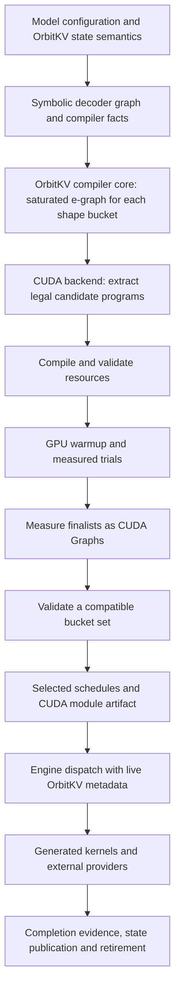

# OrbitKV compiler and CUDA execution

The model compiler and CUDA backend are owned members of the root workspace.
`orbitkv-compiler` supplies graph and search infrastructure; `orbitkv-cuda`
owns target implementations, measured program selection, and device execution.
Their [Luminal origin and maintenance policy](compiler-maintenance.md) remain
recorded independently of the current package names.

## Responsibilities

| Layer | Current responsibility | Main source |
| --- | --- | --- |
| OrbitKV core | Attention/state semantics, KV page and checkpoint lifetimes, placement facts and completion evidence | `crates/orbitkv/src/` |
| OrbitKV executor | Build the model graph, bind state arenas, submit compiler facts/alias constraints, dispatch steps | `crates/orbitkv-executor/src/model/` |
| OrbitKV compiler core | Tensor graph, symbolic shapes/strides, HLIR, e-graph construction and saturation, reusable search/extraction utilities | `crates/orbitkv-compiler/src/{graph,shape,hlir,search}` |
| CUDA backend | Legal CUDA implementations, code generation, candidate compilation/device measurement, resource planning, artifacts and execution | `crates/orbitkv-cuda/src/` |
| OrbitKV engine | Admission, continuous batching, cancellation, HTTP/frontend composition, request release and shutdown | `crates/orbitkv-engine/src/` |

The compiler subsystem comprises `orbitkv-compiler`, `orbitkv-ops`,
`orbitkv-cuda`, and `orbitkv-tracing`. Operation contracts and graph helpers
have no CUDA dependency. Training, Metal and Python bridges are outside this
product. The [checkpoint import boundary](checkpoint-import.md)
normalizes architecture conventions before graph construction.

Core ends at construction of the search space. CUDA backend's `search.rs` drives
the search state machine and owns candidate installation/profiling. `runtime.rs`
executes the result; `runtime/residency.rs` owns bounded graph preparation and
residency policy, and `artifact.rs` saves generated modules. The dynamic backend
reuses this foundation with runtime operation registration.

## Two implemented execution levels

`host::HostOp` describes an operation launched by host code. The computation
normally runs on the GPU: examples include cuBLASLt, FlashInfer, FlashAttention and DeepGEMM.
The contract exposes compilation preparation, output layout, captured pointer
and shape inputs, shared-state effects, allocation owners and resource costs.
An opaque provider's internal tile algorithm is not visible merely because it
has been added to the e-graph.

`kernel::KernelOp` exposes a CUDA function/module, generated source, launch
expressions, dynamic shared memory and constants. This supports generated
primitive kernels, dedicated kernels and selected fused regions.
`kernel/fusion/markers.rs` expresses legal region formation in egglog;
`region_codegen.rs` emits the already selected region as one kernel. Lowering
does not invent a different fusion or provider choice after extraction.

`kernel/to_host.rs` constructs executable CUDA Graphs from those operations. A
captured provider may contain several kernel launches, and the outer graph may
contain many provider and generated-kernel nodes. Capturing them reduces CPU
submission work; it does not concatenate their machine code into one kernel.

## What search actually chooses

The backend offers a finite set of alternatives through equivalence rules:

- Supported matrix products can have generic CUDA, GEMV or cuBLASLt candidates.
- Logical attention with an explicit paged KV view exposes admitted FlashInfer
  CUDA-core/tensor-core implementations and compatible FlashAttention-3 kernels.
- Block-scaled linear exposes DeepGEMM tile variants; optional shared activation
  quantization offers another graph-level representation.
- Supported operations can use specialized RMSNorm/RoPE/SwiGLU kernels, legal
  elementwise regions, output aliases or fused RoPE/scatter representations.

The [attention capability boundary](attention-providers.md) admits dtype,
head-dimension, layout and phase combinations before provider preparation.
The FlashAttention adapter currently covers SM90 F16/BF16 with equal head
dimensions 64/128/256 and separate NHD paged K/V. Each provider retains explicit
target/ABI constraints. Shared FP8 preparation remains opt-in and needs its own
numerical gate.
A new Triton/TileLang/CUTLASS implementation would need a semantic contract,
applicability guard, code/launch interface, resource ownership and equivalence
rule to participate. Such integration is possible at the provider boundary but
is not automatic in this checkout.

CUDA search extracts a candidate, rejects invalid layouts, aliases, cycles or
resource requirements, compiles/installs it, warms it up and measures real CUDA
execution. Timed trials use device events; setup/JIT and one-time warmup are
outside the ordinary timed score. Leading candidates are measured again through
the CUDA Graph deployment path. A bucket lattice selects a compatible set,
currently scored by the sum of bucket device durations and subject to aggregate
resource constraints.

This searches among implemented equivalents within the exploration budget. It
does not synthesize arbitrary attention algorithms, search all tilings, verify
every candidate against a numerical oracle online, or prove a global optimum.
Rules must already preserve semantics; independent operator/model regressions
check that promise. Resource rejection is a correctness/applicability decision,
not a replacement for measuring legal but potentially slow candidates.

The current score also excludes much of the real request cost: CPU preparation,
provider replanning, graph reconstruction, queueing, transport and workload
frequency. The recent bucket-residency result is a concrete example: keeping
identical kernels while changing graph ownership and retention reduces phase
switching work. Device kernel ranking alone cannot discover that deployment
policy.

## Why the design is useful for OrbitKV

The useful common boundary is the execution contract. A model can describe
attention with a KV view, block-scaled linear or recurrent state updates once, while
backend rules contribute implementations. OrbitKV supplies actual visibility,
page geometry, state ownership and required aliases; the compiler can reject
plans that violate those constraints. Generated regions can optimize around
mature providers while those providers retain their internal optimizations.

Several parts are already concrete: selected persistent K/V updates must alias
the registered arenas; saved artifacts bind model/state/bucket identity; CUDA
module images eliminate repeated NVRTC work on strict replay; and captured
provider plans retain their allocation owners. [Graph residency](graph-residency.md)
describes the FlashInfer metadata ownership and memory accounting needed for
retained buckets.

Full joint optimization remains partial. The system does not yet automatically
choose KV layout, external-tier transfers, graph residency and fused-region
boundaries under an end-to-end serving objective. The current foundation makes
those choices expressible; each new choice still needs a legal representation,
cost measurements and lifecycle validation.

## Megakernels and engineering limits

Block-, warp- and thread-level composition is planned. There is no implemented
`BlockOp` pipeline that lowers an arbitrary selected model to a persistent
megakernel. `kernel/cuda_graph.rs` contains a `MegakernelParams` parameter holder,
but that type has no active construction call sites in this checkout. It is
not evidence of an executing megakernel compiler.

A future implementation must represent tiling, shared-memory/register use,
barriers, cross-block dependencies, persistent scheduling and state effects.
It should enter search alongside existing multi-kernel plans and win on measured
whole-request cost. Large fusion alone is not a performance criterion.

The backend also still has large `runtime.rs` and `kernel/to_host.rs` modules.
Weight loading, search tracing, artifacts and provider workspace ownership have
separate owners already; execution-program installation, arena planning, capture
lifecycle and profiling are further useful extraction boundaries. Refactoring
should retain those contracts and fault-boundary tests before widening search.
See [roadmap](roadmap.md) for the measured implementation sequence.
