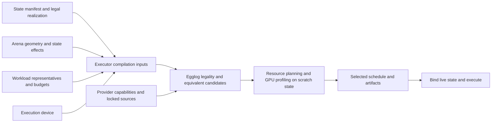

# CUDA backend

`orbitkv-cuda` owns CUDA code generation, provider integration, measured selection
and execution. The compiler core owns graph semantics and egglog saturation;
`orbitkv` owns persistent-state semantics and lifecycle. None of these crates
selects an implementation by checkpoint name.

## Source layout

| Location in `crates/orbitkv-cuda/` | Responsibility |
| --- | --- |
| `providers.lock.json` | Integrated native providers, exact Git commits and their own dependency commits |
| `src/target.rs`, `src/target.egg` | Execution-device facts supplied to compilation |
| `src/providers/registry.rs` | Typed provider inventory and lock validation |
| `src/providers/provider_source.rs` | Explicit source discovery, prefetch and actual-content identity |
| `src/providers/cache.rs`, `build.rs` | Shared cache paths, native compilation, deadline and atomic publication |
| `src/providers/operation.rs` | Device buffers, host-launched operation, workspace and capture contracts |
| `src/providers/<provider>.rs`, `<provider>/` | Provider admission, C ABI, preparation and launches |
| `src/kernel/` | Generated kernel contracts, lowering and fusion regions |
| `src/compilation.rs`, `src/artifact.rs` | NVRTC, compilation limits and checksummed CUDA module images |
| `src/environment.rs`, `src/environment/` | Selected-provider provenance and replay/retuning compatibility |
| `src/runtime/`, `src/search/` | Memory budgets, profiling, selected schedules, capture and execution |
| `tests/` | Unit, contract, numerical and device qualification tests |

Complete egglog rules and CUDA kernels live beside their owning module as
`.egg`, `.cu` or `.cuh` assets. A `.egg.in` or `.cu.in` asset uses Rust format
interpolation, including doubled C++ braces. Rust supplies explicit parameters;
`format!(include_str!(...), ...)` checks the interpolation at Rust compilation.
Small typed rule-builder expressions and dynamic code generation remain Rust.
This is one backend, with no full/Lite compatibility layer.

Matching, fusion and provider alternatives belong in egglog. Lowering emits the
selected program; it does not inspect extracted graphs to choose another
algorithm. `HostOp` can describe several GPU launches and their preparation.
`KernelOp` describes one generated kernel. A CUDA Graph captures launches and
dependencies; it does not merge external libraries into one kernel.

## Provider lock and build policy

| Provider | Source of version | Current adapter |
| --- | --- | --- |
| cuBLASLt | Installed CUDA library; inspection reports `cublasLtGetVersion()` | Dense and scaled matrix multiplication |
| DeepGEMM | Exact commit and its CUTLASS commit in the lock | Hopper block-FP8 linear candidates |
| FlashInfer | Exact commit and its CUTLASS commit in the lock | CUDA-core decode and tensor-core paged attention |
| FlashAttention | Exact commit and its CUTLASS commit in the lock | Hopper FlashAttention-3 paged attention |

CUTLASS is pinned per provider. Sharing a dependency name does not establish ABI
or source compatibility. Compiler flags also remain adapter-owned: DeepGEMM
requires both the `compute_90a` virtual ISA and `sm_90a` binary target for WGMMA;
NVCC architecture shorthand is not an equivalent build contract. This reorganization preserves the existing commits and
all crate versions remain `0.1.0`. FlashMLA is not in the integrated inventory;
adding it requires an MLA semantic operation, latent-state contract, native
adapter and independent numerical/capture qualification.

```sh
cargo run -p orbitkv-cuda --bin providers -- list
cargo run -p orbitkv-cuda --bin providers -- fetch all
cargo run -p orbitkv-cuda --bin providers -- inspect flashattention
cargo run -p orbitkv-cuda --bin providers -- inspect cublaslt
```

`list` reads the embedded lock without loading CUDA libraries. `fetch` accepts
`all` or one Git provider; cuBLASLt is installed with CUDA. `inspect` reports
resolved source content or the loaded toolkit-library version.

| Setting | Meaning |
| --- | --- |
| `ORBITKV_CACHE_DIR` | Common source/library cache root |
| `ORBITKV_DEEPGEMM_DIR` | Explicit DeepGEMM checkout |
| `ORBITKV_FLASHINFER_DIR` | Explicit FlashInfer checkout |
| `ORBITKV_FLASHATTENTION_DIR` | Explicit FlashAttention checkout |
| `CUDA_HOME`, `CUDA_PATH` | Toolkit containing `bin/nvcc`; otherwise use `nvcc` on `PATH` |
| `ORBITKV_NVCC_TIMEOUT_SECONDS` | Positive native-build deadline; defaults to 600 seconds |

The default cache root is `$XDG_CACHE_HOME/orbitkv`, then
`$HOME/.cache/orbitkv`, then the system temporary directory's `orbitkv` folder.
Sources use `providers/<name>/<full-commit>/<source-contract-digest>/`, so a
dependency-only pin change also selects a new checkout. Compiled libraries use
`libraries/<name>/<build-digest>/`. Old per-provider library-cache overrides and
implicit home/installation-directory searches are removed. An invalid explicit
checkout produces an error even if another checkout is cached. Compilation
never downloads sources; prepare them before model compilation.

Native build keys bind actual provider/dependency headers, generated wrapper,
NVCC executable/version, target, flags and recorded compiler environment.
Builds use private staging directories and atomic publication. Diagnostics have
a bounded tail; the deadline includes compiler subprocesses holding diagnostic
pipes. Sources and toolchains remain fixed after first resolution in a process;
restart after editing them. This is not a hermetic toolchain fingerprint: host
compiler binaries, auxiliary tools and all system headers are not hashed.

Selected provider nodes bind source/wrapper identity. The decoder's execution
environment records the provider inventory, selected library/source identities,
device, CUDA driver API, NVRTC and native compiler facts. Providers declare their
dependencies through `HostOp`, including calls nested inside CUDA Graphs. Replay
reports whether a changed component requires recompilation or retuning and rejects
both; it never silently keeps an old timing result. CUDA module images separately
validate architecture, NVRTC version/options and image checksums. Native libraries
remain separate artifacts. See [artifact validation](module-artifacts.md#execution-environment)
for the exact coverage and limits. An older artifact requires fresh search;
serialization version numbers have not been incremented for this unreleased
refactor.

## State and kernel compilation



`Graph::compile` obtains `Runtime::compilation_facts()` before saturation and
joins it with caller-supplied state/workload facts. CUDA queries the context that
owns its execution stream; it does not probe GPU 0 or assume `sm_80`. The native
JIT uses that same context's architecture. When using the separate
`Graph::build_search_space` API, supply target facts explicitly in
`CompileOptions::compiler_facts`; absent facts cannot admit a target-dependent
provider. This also permits offline legality tests for different devices.

Today the executor supplies one selected state realization, exact arena geometry,
workload buckets and resource limits. The backend searches compatible compute
candidates and profiles them with scratch state. It does **not** yet enumerate
KV page sizes, layouts or external-pool placements and globally minimize their
combined cost. That outer search belongs in the executor:

1. Obtain legal state realizations and capacity/transfer costs from state and
   storage contracts.
2. Build one compatible compute search space per realization, preserving the
   shared state ABI across prefill and decode.
3. Profile complete representatives, including metadata preparation, transfers,
   synchronization and memory pressure; account for compilation amortization.
4. Select a deployment under workload latency/throughput and memory constraints.
   Bind live pages only after selection and validation.

The objective and stopping budget must be explicit. A fast isolated kernel does
not establish a fast serving plan. Region fusion and future persistent kernels
remain competing implementations under the same contracts. See
[joint compilation](joint-compilation.md) for the complete target design.
