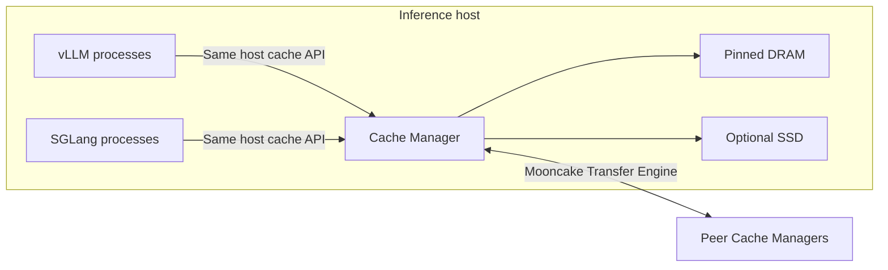

# Deployment

Run an independent Cache Manager on each inference host. One or more vLLM or
SGLang processes connect to that host's Manager; it owns the shared DRAM budget,
optional SSD cache and peer transfers. Restarting an engine does not require
restarting the Manager.

This follows the service topology of
[LMCache multiprocess deployment](https://github.com/LMCache/LMCache/blob/05a013b29da78cf2321b9b46ec5039dde2fb0bb0/docs/source/mp/deployment.rst)
(v0.5.5): an independent cache service shared by engines on the same node.
OrbitKV's adapters use UDS/iceoryx2 and CUDA IPC; adding SSD or remote caching
does not change their connection or expose storage backend selection to them.

## Choose a topology

| Mode | Processes | Status |
| --- | --- | --- |
| Single-node vLLM or SGLang cache | Engine + independent Cache Manager | TP=1 DRAM/SSD recovery and concurrent faults validated on both; multi-rank and long-running fault soak remain open |
| Multiple engines on one node | Engines share one Manager and its cache budget | Shared endpoint and independent instance registrations are implemented; concurrent multi-engine serving and container isolation need separate qualification |
| Independent matching replicas, TP=1 | Two engines, two Managers and etcd | Qwen3-8B sharing and restart gates pass on both engines over same-host TCP; [recorded scope](shared-cache-qualification.md#recorded-result) |
| Shared cache across nodes | One Cache Manager per host with embedded catalog + etcd | Experimental; [shared-cache gates](shared-cache-qualification.md) distinguish same-host TCP from real two-host/RDMA qualification; catalogs have one metadata copy |
| vLLM P/D through OrbitKV `PdConnector` | Prefill, decode, P/D proxy; Mooncake transfers KV | Experimental; does not need Cache Manager or Catalog for the handoff |
| vLLM P/D through upstream NIXL | Prefill, decode, NIXL-aware router | Upstream vLLM connector; separate from OrbitKV cache |



The peer connection is optional and experimental. Sharing a service does not
make vLLM and SGLang cache bytes interchangeable: model, computation and storage
identities must match, and cross-engine layout conversion is not implemented.
For integration boundaries and execution priorities, see
[distributed deployment comparison](distributed-comparison.md).

## Configure capacity, then connect engines

Install the same OrbitKV build in the Manager and engine environments using the
[single-node guide](single-node.md). The Manager needs compatible PyTorch/CUDA
for GPU registration, but does not load model weights or run inference. It can
run from a separate environment with those dependencies.

Start a DRAM cache:

```bash
orbitkv-cache-manager \
  --addr 127.0.0.1:50055 \
  --http-addr 127.0.0.1:9091 \
  --pool-size 8gb
```

To also use SSD, start it with a writable cache file and a capacity that fits
that filesystem:

```bash
orbitkv-cache-manager \
  --addr 127.0.0.1:50055 \
  --http-addr 127.0.0.1:9091 \
  --pool-size 8gb \
  --ssd-cache-path /data/orbitkv/cache.bin \
  --ssd-cache-capacity 100gb
```

There is no need to specify `--ssd-backend` or start a cuFile service. The
default `auto` tries native cuFile and uses io_uring when the library, driver
or filesystem capability is unavailable. cuFile is a library loaded inside the
Manager. A working SSD cache does not require installing it; using native GDS
does require a compatible NVIDIA GDS installation and storage stack.

`--ssd-backend uring` and `--ssd-backend cufile` are overrides for controlled
comparisons, diagnosis and qualification. Explicit `cufile` requires cuFile
initialization and follows NVIDIA compatibility settings; it does not prove
native GDS. Automatic selection currently adapts to capability and failures,
not measured per-request latency. See [GPU storage](gds.md) for the exact rules.

| Resource | Configured by | Responsibility |
| --- | --- | --- |
| Engine HBM | Each engine's memory and scheduler options | Engine allocates and recycles active GPU pages |
| Shared pinned DRAM | Manager `--pool-size` | One pool budget across attached instances |
| SSD | Manager `--ssd-cache-path` and `--ssd-cache-capacity` | Optional external cache; backend selection stays inside the Manager |
| Pending and leased query bytes | Manager `--query-budget` and `--query-instance-budget` | Bound total and per-instance ownership through transfer completion |

Only a configured path enables SSD caching. Capacity defaults to `512gb` if
omitted; set it explicitly to match the intended storage budget. cuFile reserves
physical space before serving, and capacity/quota failures fail startup rather
than silently falling back. Cache files are truncated on Manager startup and
are not durable across its restart. See [SSD measurements](ssd-performance.md)
for measured behavior.

## Share one Manager

Start engines with the commands in the [single-node guide](single-node.md),
using the same host socket:

| Engine | Connection to the Manager |
| --- | --- |
| vLLM | Default `/tmp/orbitkv-50055.sock`; set `orbitkv.bootstrap_socket` in `kv_connector_extra_config` for another path |
| SGLang | `ORBITKV_SGLANG_ENDPOINT=unix:///tmp/orbitkv-50055.sock` |

Each engine instance registers separately. Give serving instances different
HTTP ports, preserve immutable model identities and let each engine manage its
own HBM allocation. They share external capacity, not a combined HBM allocator.
Per-instance query limits bound retained reads and leases; these are not
resident-cache quotas or a guarantee of fair scheduling. Incompatible storage
identities stay separate.

The process channel admits 64 client ports. A cache client uses a control port
and a second port after its first Publish. Count scheduler and worker clients
when sizing a deployment; this is not a limit of 64 engine replicas.

For separate cache budgets or incompatible runtime environments, multiple
Managers can run on one host. Assign distinct bootstrap sockets, HTTP endpoints,
peer endpoints when enabled, and SSD files. Never point two Managers at the same
cache file. Start with one engine and one Manager until the intended shared
serving workload passes its concurrency gate.

## Containers and Kubernetes

The intended Kubernetes topology is a Manager DaemonSet on inference nodes and
separate vLLM/SGLang Deployments. Each engine connects to its own node's Manager.
A cluster-wide Service that load-balances engines across Managers cannot replace
that connection: CUDA registrations and process-channel resources are host-scoped.
Remote cache discovery and transfer occur between Managers.

The current runtime requires:

- The same UID and compatible OrbitKV/PyTorch/CUDA environments.
- A shared bootstrap socket directory, iceoryx2 discovery files and shared-memory
  resources. Sharing only the socket file is insufficient.
- Shared IPC resources for PyTorch CUDA registration and access to the same
  physical GPUs. Keep Manager device ordinals consistent with the IDs sent by
  engines; arbitrary container GPU remapping is not qualified.
- Peer-process visibility and permission to open the Manager's pidfd. Publish
  uses this to distinguish process exit from a stalled transfer. Separate PID
  namespaces are not qualified; shared PID visibility is required in addition
  to shared IPC.
- A host SSD mount for storage qualification, compatible device/library access
  for native GDS, and sufficient host memory for the pinned pool.

GPU access for a node-wide Manager needs explicit cluster runtime/device-plugin
configuration: it must access engine GPUs without taking an additional exclusive
GPU allocation away from the engines. A DaemonSet alone does not arrange this.
Use `/health` and `/metrics` on the Manager's HTTP endpoint for probes and
monitoring; HTTP does not carry the engine's cache data.

Container images, shared GPU/PID/IPC wiring, rolling restarts and concurrent
multi-engine serving remain deployment acceptance work. OrbitKV does not yet
ship a qualified DaemonSet/Helm installation or an isolated-IPC mode. The current
serving gates run separate processes inside one environment; they do not
establish parity with LMCache's container deployment support.

## Add peer caching

Keep engine connections unchanged and configure each Manager with the
[embedded catalog and etcd membership](p2p.md). Mooncake Transfer Engine moves
remote bytes; etcd stores member/placement information, not per-block KV data.
There is no standalone metadata server to deploy. Catalogs currently have one
metadata copy per shard, and real two-host/RDMA serving remains a separate gate.
Multi-host TP query fan-out is not supported yet.

## P/D: Mooncake or NIXL

P/D moves KV for the same request from prefill to decode. Remote caching finds
reusable KV from an earlier request. These are independent paths; see
[P/D and NIXL](pd.md) for the ownership and control-flow distinction.

OrbitKV's vLLM `PdConnector` pushes KV through Mooncake directly between GPU
workers. Try the [local P/D example](../scripts/run_pd_local.sh) for that path.
vLLM `0.29.0` also includes its own NIXL connector; the
[NIXL comparison example](../scripts/run_nixl_local.sh) uses vLLM's code.
OrbitKV does not ship a NIXL connector, and its SGLang adapter currently
implements external caching only.

### Experimental vLLM P/D with NIXL plus OrbitKV cache

This configuration is illustrative and has not passed the multi-host
qualification gate. It uses dense Qwen3-8B and `MultiConnector` on both sides;
DSA and draft/MTP recovery need separate state contracts. vLLM's
NIXL connector handles the P-to-D handoff; OrbitKV uses `read_write` on P and
`save_only` on D to retain KV for later requests without competing with NIXL
loads. `MultiConnector` chooses the first connector advertising a load and
saves to all configured connectors in order.

Run one Cache Manager beside each vLLM instance, with the same etcd cluster and catalog host set,
and use a P/D-aware request router. Configure each manager's routable `--addr`,
`--nics`, `--etcd-endpoints`, `--node-id`, and `--catalog-nodes` as described in the [P2P guide](./p2p.md).
P and D must use compatible model, tokenizer, block size, KV dtype, KV layout,
and `PYTHONHASHSEED`.

Replace `<p_node_ip>` and `<d_node_ip>` with the addresses assigned to the P
and D nodes. The example assumes P and D run on separate nodes; to colocate
them on one host, keep the distinct NIXL side-channel ports and point both
connectors at one local Cache Manager — each vLLM instance registers with its
own instance ID.

### Prefill

```bash
PYTHONHASHSEED=42 \
VLLM_NIXL_SIDE_CHANNEL_HOST=<p_node_ip> \
VLLM_NIXL_SIDE_CHANNEL_PORT=5600 \
vllm serve /path/to/qwen3-8b \
  --served-model-name qwen3-8b \
  --host 0.0.0.0 \
  --port 8000 \
  --tensor-parallel-size 1 \
  --enable-prefix-caching \
  --trust-remote-code \
  --kv-transfer-config '{
    "kv_connector": "MultiConnector",
    "kv_role": "kv_both",
    "kv_connector_extra_config": {
      "connectors": [
        {
          "kv_connector": "NixlConnector",
          "kv_role": "kv_producer"
        },
        {
          "kv_connector": "OrbitKVConnector",
          "kv_role": "kv_both",
          "kv_connector_module_path": "orbitkv.vllm",
          "kv_connector_extra_config": {
            "orbitkv.port": 50055,
            "orbitkv.mode": "read_write"
          }
        }
      ]
    }
  }'
```

### Decode

```bash
PYTHONHASHSEED=42 \
VLLM_NIXL_SIDE_CHANNEL_HOST=<d_node_ip> \
VLLM_NIXL_SIDE_CHANNEL_PORT=5601 \
vllm serve /path/to/qwen3-8b \
  --served-model-name qwen3-8b \
  --host 0.0.0.0 \
  --port 8001 \
  --tensor-parallel-size 1 \
  --enable-prefix-caching \
  --trust-remote-code \
  --kv-transfer-config '{
    "kv_connector": "MultiConnector",
    "kv_role": "kv_both",
    "kv_connector_extra_config": {
      "connectors": [
        {
          "kv_connector": "NixlConnector",
          "kv_role": "kv_consumer",
          "kv_connector_extra_config": {
            "kv_recompute_threshold": 0
          }
        },
        {
          "kv_connector": "OrbitKVConnector",
          "kv_role": "kv_both",
          "kv_connector_module_path": "orbitkv.vllm",
          "kv_connector_extra_config": {
            "orbitkv.port": 50055,
            "orbitkv.mode": "save_only"
          }
        }
      ]
    }
  }'
```

### Validate D-to-P reuse

Generate a multi-block response, then send the full history in turn two. A hit
for the first response exercises D-to-P reuse. Verify:

- `orbitkv_remote_fetch_bytes` increases on the prefill-side Cache Manager if
  a remote cache hit occurs, and peer-transfer authorization is visible in the
  decode-side Cache Manager logs.
- Every requested block is transferred with no block-count mismatch.
- `vllm:orbitkv_load_failure_total`, `vllm:orbitkv_save_failure_total`, and
  peer-transfer failures stay at zero.
