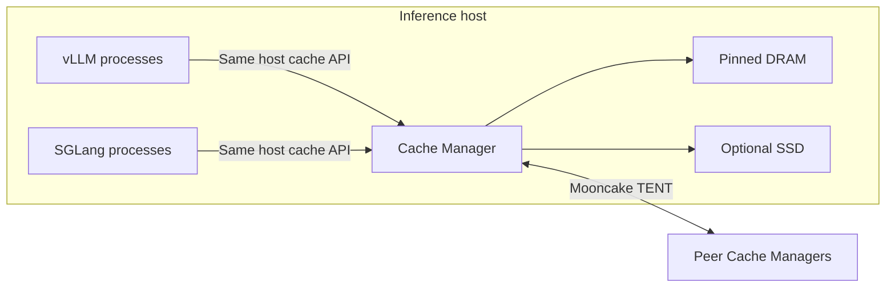

# Deployment

Run an independent Cache Manager on each inference host. One or more vLLM or
SGLang processes connect to that host's Manager; it owns the shared DRAM budget,
optional SSD cache and peer transfers. Restarting an engine does not require
restarting the Manager.

This follows the service topology of
[LMCache multiprocess deployment](https://github.com/LMCache/LMCache/blob/05a013b29da78cf2321b9b46ec5039dde2fb0bb0/docs/source/mp/deployment.rst)
(v0.5.5): an independent cache service shared by engines on the same node.
OrbitKV's adapters use UDS/iceoryx2 and CUDA IPC; adding SSD or remote caching
does not change their connection or expose storage backend selection to them.
The topology table below defines service profiles; the
[completion plan](completion-plan.md) defines qualification order; an upstream deployment example
does not establish OrbitKV compatibility.

## Choose a topology

| Mode | Processes | Status |
| --- | --- | --- |
| Single-node vLLM or SGLang cache | Engine + independent Cache Manager | The installed dense eager TP=1 DRAM/io_uring profile is independently accepted on H20; multi-rank and transfer-fault qualification remain open |
| Multiple engines on one node | Engines share one Manager and its cache budget | The H20 dense eager direct/kernel 900-second io_uring pressure profile is independently accepted; individual engine recovery passes, while Manager restart and separate-container qualification remain open |
| Independent matching replicas, TP=1 | Two engines, two Managers and etcd | Historical Qwen3-8B sharing/restart and H20/A100 TCP evidence is retained at its recorded engine/wheel revisions; current-release reruns remain open; [recorded scope](shared-cache-qualification.md#recorded-result) |
| Shared cache across nodes | One Cache Manager per host with local global index + etcd metadata | Experimental; [two-host TCP correctness](shared-cache-qualification.md#two-host-tcp-2026-09-28) is recorded with numerical limits; RDMA and metadata scale/failure qualification remain open |
| vLLM native P/D plus cache | Official NIXL, MultiConnector, upstream router and independent Managers | Candidate: P read/write cache, D save-only; [gates and limits](pd.md) |
| SGLang native P/D plus cache | Official disaggregation backend/router and independent Managers | Candidate: P restore, D save; [gates and limits](pd.md) |


```mermaid
flowchart LR
  subgraph host[Inference host]
    V[vLLM processes] -->|Same host cache API| M[Cache Manager]
    S[SGLang processes] -->|Same host cache API| M
    M --> D[Pinned DRAM]
    M --> F[Optional SSD]
  end
  M <-->|Mooncake TENT| P[Peer Cache Managers]
```

The peer connection is optional and experimental. Sharing a service does not
make vLLM and SGLang cache bytes interchangeable: model, computation and storage
identities must match, and cross-engine layout conversion is not implemented.
For integration boundaries and execution priorities, see
[distributed deployment comparison](distributed-comparison.md).

The planned [transfer policies](state-planning.md#policies-by-deployment-mode)
share Rust cost observations and budgets across local and Mooncake TENT paths.
`ORBITKV_COST_SELECTION=1` has an effect only together with
`ORBITKV_COST_OBSERVATIONS=1`; today it can select among equal-coverage owners
of the same peer medium and does not enable general cross-tier policy.
Experimental local-SSD/peer switching additionally requires
`ORBITKV_CROSS_MEDIUM_SELECTION=1`. Leave it unset outside the dedicated H20
qualification matrix; missing or incomparable evidence preserves fixed priority.
They distinguish ordinary cache recovery, current-request P/D handoff and
TP/PP completion dependencies. These deployment dimensions can compose; one
Manager may serve instances with different roles. Dynamic cost selection and
the additional topology gates remain future work, not extra supported modes
in the table above.

## Configure capacity, then connect engines

Install the same OrbitKV build in the Manager and engine environments using the
[single-node guide](single-node.md). The Manager needs compatible PyTorch/CUDA
for GPU registration, but does not load model weights or run inference. It can
run from a separate environment with those dependencies.

Upgrade the native client extension and Manager together; mismatched bootstrap,
channel and cache-body versions are rejected. The current versions and boundary
contracts are listed in [the adapter guide](adapters.md#process-channel).
The engine still owns HBM allocation and page lifetimes.

Start a DRAM cache:

```bash
orbitkv-cache-manager \
  --addr 127.0.0.1:50055 \
  --http-addr 127.0.0.1:9091 \
  --pool-size 8gb
```

To also use SSD, start it with a writable cache file and a capacity that fits
that filesystem:

```bash
orbitkv-cache-manager \
  --addr 127.0.0.1:50055 \
  --http-addr 127.0.0.1:9091 \
  --pool-size 8gb \
  --ssd-cache-path /data/orbitkv/cache.bin \
  --ssd-cache-capacity 100gb
```

There is no need to specify `--ssd-backend` or start a cuFile service. The
default `auto` tries native cuFile and uses io_uring when the library, driver
or filesystem capability is unavailable. cuFile is a library loaded inside the
Manager. A working SSD cache does not require installing it; using native GDS
does require a compatible NVIDIA GDS installation and storage stack.

`--ssd-backend uring` and `--ssd-backend cufile` are overrides for controlled
comparisons, diagnosis and qualification. Explicit `cufile` requires cuFile
initialization and follows NVIDIA compatibility settings; it does not prove
native GDS. Automatic selection currently adapts to capability and failures,
not measured per-request latency. See [GPU storage](gds.md) for the exact rules.

| Resource | Configured by | Responsibility |
| --- | --- | --- |
| Engine HBM | Each engine's memory and scheduler options | Engine allocates and recycles active GPU pages |
| Shared pinned DRAM | Manager `--pool-size` | One pool budget across attached instances |
| SSD | Manager `--ssd-cache-path` and `--ssd-cache-capacity` | Optional external cache; backend selection stays inside the Manager |
| Pending and leased query bytes | Manager `--query-budget` and `--query-instance-budget` | Bound total and per-instance ownership through transfer completion |

Pinned-pool shards use size-sealed Linux memfds with shared mappings and CUDA
host registration. Huge-page mode requires reserved huge pages and permission
to create hugetlb memfds; it does not silently switch to regular pages.
NUMA placement is established by Manager first-touch. GPU registration exports
the payload arena FDs to the engine's native executor, which maps and registers
them independently for raw DRAM restores. The Manager retains source leases
and admission permits through the authoritative engine drain.

Only a configured path enables SSD caching. Capacity defaults to `512gb` if
omitted; set it explicitly to match the intended storage budget. cuFile reserves
physical space before serving, and capacity/quota failures fail startup rather
than silently falling back. Cache files are truncated on Manager startup and
are not durable across its restart. See [SSD measurements](ssd-performance.md)
for measured behavior.

## Share one Manager

Start engines with the commands in the [single-node guide](single-node.md),
using the same host socket:

| Engine | Connection to the Manager |
| --- | --- |
| vLLM | Default `/tmp/orbitkv-50055.sock`; set `orbitkv.bootstrap_socket` in `kv_connector_extra_config` for another path |
| SGLang | `ORBITKV_SGLANG_ENDPOINT=unix:///tmp/orbitkv-50055.sock` |

Each engine instance registers separately. Give serving instances different
HTTP ports, preserve immutable model identities and let each engine manage its
own HBM allocation. They share external capacity, not a combined HBM allocator.
The [installed shared-Manager gate](../python/tests/README.md#two-engines-sharing-one-manager)
uses separate official engine environments, native output controls and actual
DRAM/io_uring recovery after each engine restarts while the other stays available.
See [S5.5](completion-plan.md#s55--deployment-matrix-and-upstream-maintenance)
for the frozen wheel, evidence and independent-review status.

Per-instance query limits bound retained reads and leases; these are not
resident-cache quotas or a guarantee of fair scheduling. Incompatible storage
identities stay separate.

The process channel admits 64 client ports. A cache client uses a control port
and a second port after its first Publish. Count scheduler and worker clients
when sizing a deployment; this is not a limit of 64 engine replicas.

A successful UDS bootstrap does not prove iceoryx2 service discovery. On an
iceoryx2 open failure, the native client reports the exact service name, messaging
pattern, effective static-config path, file metadata observation and mount
namespace. `RequestResponseOpenError::DoesNotExist` identifies the request service;
`EventOpenError::DoesNotExist` identifies its `/requests` doorbell. Compare the
reported name with the live Manager incarnation and verify both processes see the
same discovery directory. The metadata snapshot is taken after the failed open,
so a present file does not prove it existed during lookup. Do not recreate a
service from a client or remove discovery files belonging to a live Manager.

For separate cache budgets or incompatible runtime environments, multiple
Managers can run on one host. Assign distinct bootstrap sockets, HTTP endpoints,
peer endpoints when enabled, and SSD files. Never point two Managers at the same
cache file. Start with one engine and one Manager until the intended shared
serving workload passes its concurrency gate.

## H20 direct CUDA runtime

CUDA initialization in the current H20 container fails or stalls under the
shared default MPS directory. A process-local private pipe directory and the existing
`/usr/local/cuda/compat` driver closure pass arithmetic and spawned CUDA IPC in
both fresh official release environments. All test processes inherit these
settings; the shared MPS service and host driver keep their configuration.
The [NVIDIA MPS directory contract](https://docs.nvidia.com/deploy/topics/topic_5_2_2.html)
defines `CUDA_MPS_PIPE_DIRECTORY`. This recipe selects direct CUDA access for
the assigned GPU; deployments using MPS select their functioning assigned
server's directory instead.

```bash
export CUDA_MPS_PIPE_DIRECTORY="$(mktemp -d /tmp/orbitkv-mps.XXXXXX)"
export LD_LIBRARY_PATH="/usr/local/cuda/compat:${LD_LIBRARY_PATH:-}"
python -c 'import torch; x = torch.arange(4096, device="cuda", dtype=torch.int64); y = (x * 3 + 7).sum().item(); torch.cuda.synchronize(); assert y == 25188352; print(torch.cuda.get_device_name(), y)'
```

Seeing a device in `nvidia-smi` alone does not establish CUDA or IPC readiness.
The independently accepted scope is one assigned H20 and processes in this
container. Separate container namespaces, multi-GPU/rank layouts, native P/D faults
and peer data-plane qualification remain tracked in the
[completion plan](completion-plan.md#s5--released-engine-integration-and-upstream-contributions).
The failed default/535/580 probes and successful private-directory controls are
preserved at `/root/orbitkv-artifacts/s5-h20-container-runtime-20261008/` and
`/root/orbitkv-artifacts/s5-h20-readiness-20261008/`.

## Containers and Kubernetes

The intended Kubernetes topology is a Manager DaemonSet on inference nodes and
separate vLLM/SGLang Deployments. Each engine connects to its own node's Manager.
A cluster-wide Service that load-balances engines across Managers cannot replace
that connection: CUDA registrations and process-channel resources are host-scoped.
Remote cache discovery and transfer occur between Managers.

The current runtime requires:

- The same UID and compatible OrbitKV/PyTorch/CUDA environments.
- A shared bootstrap socket directory, iceoryx2 discovery files and shared-memory
  resources. Sharing only the socket file is insufficient.
- Shared IPC resources for PyTorch CUDA registration and access to the same
  physical GPUs. Keep Manager device ordinals consistent with the IDs sent by
  engines; arbitrary container GPU remapping is not qualified.
- Peer-process visibility and permission to open the Manager's pidfd. Publish
  uses this to distinguish process exit from a stalled transfer. Separate PID
  namespaces are not qualified; shared PID visibility is required in addition
  to shared IPC.
- A host SSD mount for storage qualification, compatible device/library access
  for native GDS, and sufficient host memory for the pinned pool.

GPU access for a node-wide Manager needs explicit cluster runtime/device-plugin
configuration: it must access engine GPUs without taking an additional exclusive
GPU allocation away from the engines. A DaemonSet alone does not arrange this.
Use `/health` and `/metrics` on the Manager's HTTP endpoint for probes and
monitoring; HTTP does not carry the engine's cache data.

Container images, shared GPU/PID/IPC wiring, Manager rolling restarts and
concurrent restore pressure remain deployment acceptance work. OrbitKV does not yet
ship a qualified DaemonSet/Helm installation or an isolated-IPC mode. The current
shared-Manager gates use separate venvs with the same UID/PID/IPC namespaces on
one host; they do not establish parity with LMCache's container deployment support.

The next deployment work packages the current explicit shared-resource profile,
then qualifies isolated allocation registration and completion in Rust. Following
LMCache's raw CUDA allocation/timeline-event design also requires handling
OrbitKV's UDS/iceoryx2 resources, stable GPU identity and process-death evidence.
It is not enough to remove the Torch wrapper or copy `hostIPC: false` into a
manifest. See the [completion plan](completion-plan.md) for registration, shared-service
and final image acceptance gates.

## Add peer caching

Keep engine connections unchanged and configure each Manager with the
[local global index and inventory protocol](p2p.md). Mooncake TENT moves
remote bytes; etcd stores protocol identity, epochs and leased members.
There is no standalone metadata server to deploy. Every Manager maintains a
local index through bounded peer snapshot/delta sessions. RDMA, sustained distributed faults and broader model
serving remain separate gates after the recorded two-host TCP checks.
Multi-host TP query fan-out is not supported yet.

## P/D: Mooncake or NIXL

Deployment profiles follow LMCache's independent service, P2P sharing and
[P/D handoff](https://docs.lmcache.ai/mp/disaggregated_prefill.html) organization.
The engine, cache tier and request-handoff role are separate choices. An upstream
mode is a reference topology, not proof that OrbitKV supports its engines,
parallelism, isolation or failure recovery. Keep those claims tied to the
qualification table above and the pinned vLLM 0.31.0 / SGLang 0.5.21 contracts.
Historical 0.29.0 topology evidence requires requalification after the upgrade.


P/D moves KV for the same request from prefill to decode. Remote caching finds
reusable KV from an earlier request. These are independent paths; see
[P/D and NIXL](pd.md) for the ownership and control-flow distinction.

The [native P/D candidate](pd.md) uses official vLLM 0.31.0 NIXL/MultiConnector
and official SGLang 0.5.21 disaggregation, with independent OrbitKV caches and
upstream routers. The [local vLLM launcher](../scripts/run_pd_local.sh) uses
read/write cache on P and save-only cache on D. Ordinary cache serving does not
require a P/D transport or router. Lifecycle fault qualification remains separate.

### Experimental vLLM P/D with NIXL plus OrbitKV cache

This configuration is illustrative and has not passed the multi-host
qualification gate. It uses dense Qwen3-8B and `MultiConnector` on both sides;
DSA and draft/MTP recovery need separate state contracts. vLLM's
NIXL connector handles the P-to-D handoff; OrbitKV uses `read_write` on P and
`save_only` on D to retain KV for later requests without competing with NIXL
loads. `MultiConnector` chooses the first connector advertising a load and
saves to all configured connectors in order.

Run one Cache Manager beside each vLLM instance, with the same etcd cluster and namespace,
and use a P/D-aware request router. Configure each manager's routable `--addr`,
`--nics`, `--etcd-endpoints`, `--node-id`, and `--index-budget` as described in the [P2P guide](./p2p.md).
P and D must use compatible model, tokenizer, block size, KV dtype, KV layout,
and `PYTHONHASHSEED`.

Replace `<p_node_ip>` and `<d_node_ip>` with the addresses assigned to the P
and D nodes. The example assumes P and D run on separate nodes; to colocate
them on one host, keep the distinct NIXL side-channel ports and point both
connectors at one local Cache Manager — each vLLM instance registers with its
own instance ID.

### Prefill

```bash
VLLM_USE_V2_MODEL_RUNNER=0 \
PYTHONHASHSEED=42 \
VLLM_NIXL_SIDE_CHANNEL_HOST=<p_node_ip> \
VLLM_NIXL_SIDE_CHANNEL_PORT=5600 \
vllm serve /path/to/qwen3-8b \
  --served-model-name qwen3-8b \
  --host 0.0.0.0 \
  --port 8000 \
  --tensor-parallel-size 1 \
  --enable-prefix-caching \
  --trust-remote-code \
  --kv-transfer-config '{
    "kv_connector": "MultiConnector",
    "kv_role": "kv_both",
    "kv_load_failure_policy": "fail",
    "kv_connector_extra_config": {
      "connectors": [
        {
          "kv_connector": "NixlConnector",
          "kv_role": "kv_producer"
        },
        {
          "kv_connector": "OrbitKVConnector",
          "kv_role": "kv_both",
          "kv_connector_module_path": "orbitkv.vllm",
          "kv_connector_extra_config": {
            "orbitkv.port": 50055,
            "orbitkv.mode": "read_write"
          }
        }
      ]
    }
  }'
```

### Decode

```bash
VLLM_USE_V2_MODEL_RUNNER=0 \
PYTHONHASHSEED=42 \
VLLM_NIXL_SIDE_CHANNEL_HOST=<d_node_ip> \
VLLM_NIXL_SIDE_CHANNEL_PORT=5601 \
vllm serve /path/to/qwen3-8b \
  --served-model-name qwen3-8b \
  --host 0.0.0.0 \
  --port 8001 \
  --tensor-parallel-size 1 \
  --enable-prefix-caching \
  --trust-remote-code \
  --kv-transfer-config '{
    "kv_connector": "MultiConnector",
    "kv_role": "kv_both",
    "kv_load_failure_policy": "fail",
    "kv_connector_extra_config": {
      "connectors": [
        {
          "kv_connector": "NixlConnector",
          "kv_role": "kv_consumer",
          "kv_connector_extra_config": {
            "kv_recompute_threshold": 0
          }
        },
        {
          "kv_connector": "OrbitKVConnector",
          "kv_role": "kv_both",
          "kv_connector_module_path": "orbitkv.vllm",
          "kv_connector_extra_config": {
            "orbitkv.port": 50055,
            "orbitkv.mode": "save_only"
          }
        }
      ]
    }
  }'
```

### Validate D-to-P reuse

Generate a multi-block response, then send the full history in turn two. A hit
for the first response exercises D-to-P reuse. Verify:

- `orbitkv_remote_fetch_bytes` increases on the prefill-side Cache Manager if
  a remote cache hit occurs, and peer-transfer authorization is visible in the
  decode-side Cache Manager logs.
- Every requested block is transferred with no block-count mismatch.
- `vllm:orbitkv_load_failure_total`, `vllm:orbitkv_save_failure_total`, and
  peer-transfer failures stay at zero.
