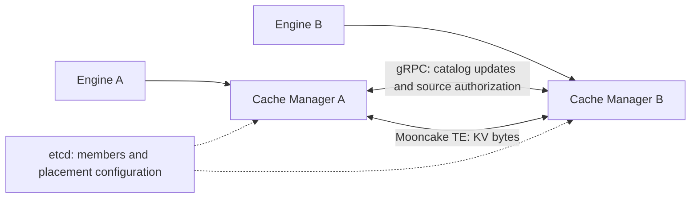

# Distributed cache design

Status: D0 inventory recovery and the D1 candidate index, source validation,
leased membership and embedded catalog are implemented. Managers host 16 fixed
logical shards, each with one directory copy, and route through cached member
information. The standalone MetaServer has been removed. Replication, online
placement changes, remote SSD and cross-host serving qualification remain open.
Mooncake TE carries KV bytes.

Owners retain bounded journals and recover each shard independently using
paginated snapshots and a complete delta interval. Catalog epochs and member
incarnations trigger repair even for idle caches. See the
[implemented protocol and limits](../crates/orbitkv-catalog/README.md).
Upgrade all Managers together; there is no old-protocol fallback.

Implemented discovery behavior:

- Each row carries the exact StateKey and up to four candidates, qualified by
  owner endpoint, runtime UUID and insertion sequence. Rows remain aligned with
  the request across gaps; empty rows do not prove global absence.
- Managers retain positive hints in an LRU index with a 16 MiB logical byte
  budget and a five-second TTL. Reads do not extend the TTL. Misses are not
  cached. A failed directory lookup preserves any already-known prefix.
  Concurrent misses recheck after an in-flight lookup; warm hits do not
  wait for the directory. Empty results cause waiting callers to look up again;
  this does not provide negative-result coalescing or a subscription stream.
- Cold lookups use batches of at most 128 keys and 64 KiB of namespace/hash
  bytes. Each cold query has a three-second total RPC budget after coalescing. The source-channel LRU retains
  at most 64 clients. These are initial fixed limits, not calibrated SLOs.
- The requester selects the longest contiguous span, using endpoint/incarnation
  ordering to break ties. Source authorization checks the runtime UUID and all
  insertion sequences before pinning under the cache lock. Rejection grants no
  addresses and creates no transfer session.
- A source rejection removes only the attempted candidate versions from the
  index. Planning can try existing alternatives at most twice per fetch; it
  issues no new directory RPC during these retries. Another query can refresh
  missing evidence. Payload-transfer failures stop the prefix without retries.
- A blocking READ owns its destination buffers and source-release guard until
  it returns, even if the asynchronous caller is cancelled. Source expiry now
  retains its pins and charges whole allocations against `--transfer-budget`
  (default: half the pool), with at most 1024 sessions. Completion release uses
  bounded idempotent retries. Reclaiming a permanently orphaned source hold
  still requires transport revocation; partition handling remains unqualified.

Implemented membership behavior (required on every distributed Manager):

- `--etcd-endpoints`, `--cluster-name`, `--node-id` and `--membership-ttl-secs`
  configure registration. A transaction requires an absent live Node ID,
  increments its persistent epoch and writes a leased record containing the
  peer endpoint and runtime UUID. The directory inventory uses that same UUID.
- Member snapshots use pages of 128 records at one revision, followed by Watch
  from the next revision. Reconnect, compaction, malformed records or overflow
  invalidate the view and trigger a fresh snapshot. The limit is 4,096 members,
  with at most 1 KiB of JSON per member. etcd stores no block hashes or payloads.
- Keepalives run separately from snapshot/Watch repair. Local registration is
  valid until half the acknowledged TTL, measured from sending the request.
  Delayed responses cannot revive an expired or explicitly fenced runtime.
  Restart the Manager to obtain a new incarnation after registration expires.
- Source admission and requester candidate selection consult only this local
  view. An incomplete view or expired registration disables new remote work;
  local DRAM/SSD operations continue. Existing transfer holds can still be
  released. Membership expiry does not forcibly free transfer buffers.
- Graceful shutdown revokes the lease. Abrupt shutdown stops renewal and lets
  etcd expire it. An observed own-record removal, changed epoch/lease binding,
  or coordinator cluster change
  fences the runtime. Watch evidence is a hint, not an authorization or transport
  revocation guarantee; bounded-clock assumptions and multi-host failure behavior
  still need qualification.

Implemented placement behavior:

- `--catalog-nodes` declares 1–16 stable Node IDs. etcd atomically installs the
  canonical host set at `/orbitkv/v1/<cluster>/placement`; mismatched joins fail.
- Domain-separated SHA-256 maps StateKeys to 16 shards; equal-weight rendezvous
  hashing chooses one configured host per shard. Temporary liveness changes do
  not alter assignments. Catalog endpoints and UUIDs come from cached membership.
- RPCs carry the shard, placement fingerprint and destination incarnation.
  Receivers reject wrong destinations, unregistered publishers and cross-shard keys.
- Every owner has independently ordered shard streams. Journals total 16 MiB;
  each catalog host defaults to 256 MiB of accounted index and retry storage
  across its assigned shards. Missing catalogs do not block local Publish.
- Configuration is immutable for this stage. Observed changes fence members;
  online transitions and metadata replicas belong to D2. Missing hosts leave
  their shards unavailable until they return and owners rebuild the index.

The directory is distributed across Managers but each shard still has one copy;
this is not HA. The initial etcd connector exposes HTTP endpoints, without
credential/TLS options. See [deployment](p2p.md#leased-manager-membership).

The remaining sections describe the target architecture.

The first serving gate covers immutable, sealed dense-attention KV in matching
model/format namespaces, with TP=1. Run vLLM-to-vLLM and SGLang-to-SGLang gates
separately. Cross-engine byte compatibility, hybrid-state completeness,
cross-host TP, P/D disaggregation, and request routing need separate gates.

## Design goals

- No etcd lookup for an ordinary cache query, publish, or transfer.
- A usable candidate in the Manager's index needs no catalog lookup RPC.
- Missing candidates use bounded, batched shard queries; no cluster broadcast.
- Inventory, synchronization, subscriptions, staging, and transfers have explicit
  byte and operation limits.
- Lost metadata changes can reduce reuse temporarily, but cannot authorize a
  stale memory read. Surviving owners can reconstruct the directory.
- Engine adapters keep the same cache API across DRAM, SSD, and peer replicas.

These are acceptance targets, not measured performance claims. Background
traffic, source authorization, and actual data transfer remain necessary.

## Borrowed ideas and OrbitKV's consistency boundary

[Mooncake RFC #3504](https://github.com/kvcache-ai/Mooncake/issues/3504) is a
discussion draft. It proposes cached membership, weighted rendezvous route
placement, peer route operations, and a separate coordination backend. Its
object-store protocol includes fenced route mutation and stronger lifecycle
semantics than a cache candidate directory.

[FlexKV](https://github.com/taco-project/FlexKV#distributed-kvcache-reuse)
maintains a local global-index snapshot and refreshes metadata through Redis.
OrbitKV borrows local prefix discovery, while targeting bounded subscriptions
and incremental repair instead of requiring every host to rebuild all metadata.

OrbitKV v1 records candidate evidence for immutable cache replicas. Each storage
owner alone publishes changes to its own replicas. Different owners' entries
are independent, even for the same StateKey. A directory replica cannot grant
access to source memory or promise that a copy still exists.

This permits asynchronous directory replication without per-block consensus.
It does not implement global overwrite/delete ordering, a guaranteed minimum
number of data copies, or hard cluster-wide quota admission. Those would require
additional protocols. A completed local Publish guarantees local visibility;
remote discovery becomes available after asynchronous advertisement.

## Responsibilities and deployment

| Component | Responsibility |
| --- | --- |
| Engine | HBM allocation, valid recovery boundaries, execution admission |
| Manager inventory | Current local replicas and their residency generations |
| Manager candidate index | Bounded cached evidence for useful model/format domains and prefixes |
| Manager catalog shards | Replicated owner evidence, snapshots, delta delivery and reconciliation |
| Manager transfer planner | Source selection, deadlines, staging and transfer budgets |
| etcd | Member identities, leases, configuration and placement generations |
| Mooncake TE | Registered-memory data transfer and completion evidence |

Standalone deployment needs one Manager and no etcd. Distributed deployment
adds etcd and peer connectivity to the same Manager binary. Use a three-member
etcd cluster for the HA qualification; the two-host data-path gate alone does
not prove coordinator HA. Do not run one etcd process per GPU or KV shard.

Network gRPC carries peer control, snapshots and deltas. UDS/iceoryx2 remain the
engine-to-Manager channel. TE endpoint discovery and KV ownership discovery are
separate concerns; using TE does not supply the replica catalog.

## Identity and evidence

Use the existing StateKey, whose namespace binds model, computation and stored
representation. A matching key is not by itself proof of a complete hybrid
StateBundle. Do not weaken identity to a token hash or model name.

The protocol needs distinct identifiers with distinct lifetimes:

| Identifier | Meaning |
| --- | --- |
| Cluster incarnation | Rejects evidence from another cluster or a restored control-plane generation |
| Node ID and runtime epoch | Identifies one registered Manager incarnation, independently of its IP |
| Placement generation | Identifies one committed logical-shard assignment |
| Owner stream sequence | Orders residency changes from one incarnation for one logical shard |
| Replica generation | Distinguishes successive residency episodes for a key and residence |
| Transfer operation/token | Identifies pinned source data and one transfer lifetime |

A candidate records StateKey, owner incarnation, tier, replica generation,
owner sequence and byte size. Endpoints and topology labels come from the member
view. Publish DRAM evidence only after the block is sealed and resident; publish
SSD evidence only after the write has completed successfully. Preparing data is
not ready data. Candidates contain no reusable raw memory address.

The owner stream is ordered per `(runtime incarnation, logical shard)`.
Within it, the latest sequence wins for `(StateKey, residence)`; generations change
on removal and recreation. Equal-version conflicting records are errors, not
ties resolved by arrival order. Retired runtime evidence cannot supersede a new
incarnation merely because it arrived late.

### Residency, proximity and access paths

The target model uses three independent dimensions: physical medium
(`HBM`, `DRAM`, `SSD`), owner/resource location, and an executable access path.
Local or peer proximity is derived relative to the consumer and its device.
Remote is not a fourth medium with a fixed priority after local SSD. GDS,
io_uring and Mooncake TE describe movement; GPU/host staging is temporary
workspace unless explicitly admitted as a retained cache replica.

| Residence | Owner and discovery contract | Access to a local consumer |
| --- | --- | --- |
| Engine HBM | Engine owns pages and export lifetimes; advertise only committed, exportable state with bounded metadata traffic | Existing local state or, later, authorized peer GPU transfer |
| Manager DRAM | Manager owns sealed retained objects and registered export memory | Local CUDA copy or peer TE transfer, followed by any decode/restore |
| Manager SSD | Manager publishes only complete writes and keeps extent generations independent of DRAM residency | Local io_uring/cuFile; peer owner prepares its own bytes before TE export |
| Shared/mounted storage, later | Storage authority and durability need a separate deployment contract | Qualified filesystem/NVMe-oF path; not automatically a peer Manager replica |

Each discoverable replica needs a residence identity within its owner, identifying
the medium and storage/engine resource where needed. Carry compatible state and
representation evidence, byte size and a residency generation. HBM evidence
also needs the exporting engine instance/rank and lifetime checks. Keep raw
addresses and transfer grants out of long-lived directory records. Current
`ReplicaLocation` contains only owner and insertion sequence; the residence
fields and corresponding inventory/wire changes are planned, not implemented.
Keep the existing representation-bound StateKey until a separately qualified
logical-to-physical format mapping exists.

A key may reside in B's DRAM and SSD at the same time. Evicting its DRAM copy
must remove only that residence, leaving the SSD candidate discoverable. Source
SSD residency does not imply an immediately readable TE memory range: authorize
and lease the extent, acquire bounded staging credit, prepare locally, then
export the prepared memory. Return pending, backpressure or missing explicitly.
Use existing transfer lifetime owners; do not add a recursively fetching
remote cache or a second copy of the SSD storage index.

Restoring a peer replica creates destination state; retaining it in destination
DRAM or SSD is a separate admission decision. Copies may coexist and expire
independently, with no mandatory demotion chain or implied minimum replica count.
Prepared query buffers and P/D destinations do not become shared cache entries
merely because a transfer finished. HBM remains engine-managed; a future
dedicated GPU cache pool would require its own explicit capacity reservation.

Discover bounded candidates, then compare local DRAM, local SSD and available
peer residences by the cost of reaching the same required state. Use cached
evidence first, so considering peers does not require a full-cluster lookup or
payload read. Follow the [route eligibility contract](state-planning.md#candidate-routes-and-eligibility);
each additional residence/path needs its own capability and qualification gate.

## Membership and shard placement

etcd stores leased member records, persistent epoch allocation state, and
versioned placement configuration. Registering a Node ID uses a transaction;
an existing live incarnation must be fenced or expire before replacement. A
Manager caches membership through a snapshot followed by a revisioned Watch.
After history compaction, obtain a fresh snapshot and resume from its revision.

etcd Watch is not a linearizable read; a cached view alone does not prove lease
validity. Use explicit incarnation checks and conservative local validity
deadlines. See the [etcd API guarantees](https://etcd.io/docs/v3.6/learning/api_guarantees/).

Map StateKeys to a fixed configured number of logical shards. Weighted
rendezvous hashing assigns each shard to a small set of catalog hosts, using
stable configured capacity weights and an agreed hash seed. The HA target is
three metadata copies on distinct hosts; failure-domain labels can refine this.
Two-host tests use two copies and must report that reduced failure coverage.
Metadata copy count does not set the number of KV payload copies.

Separate liveness from placement. A transient heartbeat failure removes an
unusable transfer candidate without immediately remapping the entire directory.
An elected background reconciler inside a Manager commits placement changes
through etcd transactions; it performs no block lookup or allocation.

During a placement transition, prepare the new shard set, copy evidence and
catch up owner streams while owners publish to both generations. Record the
handoff watermarks before retiring the old placement. If evidence cannot be
recovered, mark the shard incomplete and rebuild from surviving owners. During
the bounded transition window, queries may consult both generations within the
same discovery budget. Misses from incomplete shards are not authoritative
absence. Limit concurrent shard moves and retain explicit transition state.

## Inventory, replication and recovery

Inventory mutation and event sequencing must describe the same residency
transition. Instrument all admission, replacement, eviction, restore and cleanup
paths; a best-effort notification queue is insufficient as the source of truth.
Maintain bounded per-shard journals and an enumerable inventory of current
replicas. Metadata records do not retain payload Arcs or prevent eviction.

Owners send ordered batches to their assigned catalog replicas independently.
Receivers deduplicate by incarnation and sequence, acknowledge contiguous
progress, and request repair on a gap. Queue overflow sets an explicit resync
condition; it must not silently turn into permanent missing registrations.
Slow subscribers cannot hold unlimited history or stall a local Publish.

Snapshot recovery has a defined cut:

1. Establish a starting watermark and retain the subsequent delta interval.
2. Enumerate inventory in bounded pages, with record versions and stable key
   cursors. Concurrent modifications remain represented in the delta interval.
3. Send an end watermark and the complete ordered changes through that cut.
4. Build the receiver's replacement owner/shard view privately, applying record
   versions, including removals. Install it only after the snapshot and interval
   are complete, then consume later deltas.

If the retained interval overflows, abort that snapshot and restart within a
bounded retry budget. Rate-limit repair and expose lack of convergence; never
declare a partial scan complete. Whole-inventory scans must not hold the payload
cache lock or allocate unbounded buffers on the request path.

Account for old and replacement index views, journal retention and queued pages
before admitting a snapshot. If that budget cannot hold both views, the receiver
can discard derived hints for the affected shard and expose incomplete coverage
while rebuilding, or apply backpressure. It cannot discard the owner's actual
inventory or exceed the budget to make a snapshot appear successful.

Keep deletion evidence until a complete snapshot baseline and stream watermark
make older events rejectable. Delayed additions must not resurrect an evicted
residency episode. After receiver restart or state loss, require a new baseline.

Catalog-to-candidate subscriptions have their own delivery cursor, qualified by
the serving catalog incarnation. It is not interchangeable with owner sequence
or another replica's cursor. Filters must advance progress explicitly even when
no matching record is emitted. Switching replicas or losing retained history
requires resnapshotting the subscribed range.

Directory loss is repaired from surviving inventories. Manager restart starts
a new runtime epoch. Today's SSD files are truncated at startup, so the first
milestone does not promise preservation of SSD contents across Manager restart.
Persistent SSD manifests and recovery need a separate storage milestone.

## Query path and bounded subscriptions

The requesting Manager constructs the fetch plan; the directory returns
candidates and coverage evidence. The implemented prefix planner belongs to
that requesting Manager so it can see memory, I/O and deadline pressure.

1. Inspect local residency and the candidate index for the ordered StateKeys.
2. Merge simultaneous discovery of the same missing prefix with independent
   request ownership and cancellation.
3. Batch unresolved keys by directory host. Bound request bytes, concurrent
   hosts, retries and total discovery time. Never issue one RPC per KV block.
4. Select candidate spans and acquire source data in batches. Remove rejected
   candidates locally and try another source within the same budget.
5. Transfer into budgeted destination staging, validate completion and expected
   layout, then restore to engine-owned destinations through the existing API.

A local index miss may mean insufficient coverage or lag, rather than absence
of a replica. A short negative cache must carry scope and freshness information
and be invalidated by relevant additions. For incomplete coverage, choose a
bounded repair lookup or recomputation according to the request deadline.

Start with byte-limited model/format-domain subscriptions and a bounded demand
cache, using existing ordered block hashes. Full-domain views are useful when
small; they are not mandatory on every node. Later, repeated discovery can
promote hot ranges to subscriptions, and high churn or low reuse can demote
them. Measure lookup savings against update bytes and index CPU/memory before
introducing compressed prefix trees or probabilistic summaries.

Hash partitioning can scatter a long prefix across many hosts. Batch by physical
host, cap fan-out, and measure that cost explicitly. Prefix-oriented grouping
is a later optimization only if it preserves exact discovery for branches and
does not create a single hot metadata shard.

## Transfer lifetime and resource control

Source preparation validates the requested incarnation, StateKeys, replica
generations, coverage and representation, then pins the exact source objects.
Only the resulting transfer capability exposes TE segments and ranges. Bind it
to the source incarnation, requesting session, operation and byte limits;
duplicate requests, completion and release must be idempotent.

Directory freshness and source pin lifetime are independent. Rejecting an
expired RPC token does not cancel an already submitted RDMA operation. Reuse
requires transport completion or a proven revocation/quiescence mechanism.
If requester loss prevents that proof, quarantine the referenced memory and
keep charging it until the transport is safely drained or revoked. Do not
implement timeout-only reclamation. Validating the pinned TE version's actual
failure/completion semantics is a blocking gate for distributed reliability.

Reuse existing destination query byte ownership through GPU completion. Add
source export limits per peer and globally, with separate staging credits for
SSD reads. Charge and bound both sides; pinning existing DRAM can still prevent
eviction. Cancellation stops unsubmitted work and drains submitted work before
credits or memory are released.

Remote SSD preparation reads only the owner's local storage into registered,
budgeted DRAM. It must not recursively fetch from another peer on a miss. Give
the destination explicit pending/backpressure/missing outcomes; no unbounded
retry while holding destination HBM. Start with remote DRAM before this path.

## Planning and useful replication

The [decision owner is the Cache Manager below the engine](state-planning.md#cache-manager-decisions-below-the-engine).
Catalog evidence and bounded peer resource summaries give it a cluster view
without a required request router or a full inventory copy on every node.
The destination Manager chooses the plan; each source admits its own resources.
Optional Dynamo integration consumes summaries later and does not own cache
discovery or grant transfer authority.

Use the same [cost observations and deployment contracts](state-planning.md#policies-by-deployment-mode)
as local storage planning. Shared-cache DP, P/D handoff and TP/PP consumption
have different completion targets; do not assign one policy to every operation
on a physical node. This is a target design: today's source planner uses
coverage and ownership checks, not calibrated latency selection.

Represent a request as demand for a legal recovery boundary, with known bytes,
query ownership and later engine-supplied priority/first-use hints. Estimate
finish time from observed discovery, authorization, source preparation,
transfer queueing, Mooncake TE service and destination decode/H2D
cost. Compare legal restore/recompute options using critical-path accounting;
local SSD is not always cheaper than peer DRAM. The engine retains execution
admission and HBM allocation decisions.

Source-release acknowledgement and retained source byte-seconds affect resource
availability without necessarily delaying engine readiness. Bound sender and
receiver reservations together; never turn a wait timeout or a stale cost hint
into permission to reuse an in-flight buffer. Measurements carry peer
incarnation and transport context. Cached discovery does not replace source
authorization, and etcd is not on the per-read decision path.

Demand-driven remote reads may create local replicas. Admission uses reuse,
saved recomputation/transfer work and memory pressure; one remote hit need not
remain cached indefinitely. Hot-prefix replication and early DRAM warming follow
measured demand and explicit byte budgets. Directory redundancy is only a hint
for eviction unless a separate data-replication protocol guarantees coverage.

A later KV-aware router consumes summarized cache and engine events. It selects
a worker; the selected Manager still validates the recovery and transfer plan.
No router service is required for this distributed cache milestone.

## Failure contract

| Failure | Required behavior |
| --- | --- |
| Stale candidate or source eviction | Source rejects it; bounded alternate-source discovery or recomputation |
| Source restart at the same address | Old incarnation and capabilities are rejected; new inventory is advertised |
| Dropped or reordered update | Detect gaps, reject stale versions, replay or resnapshot |
| Catalog replica loss | Use another copy, or rebuild from owners without restarting engines |
| All copies of directory evidence lost | Report incomplete coverage while owners replay; no durability promise for lost payloads |
| etcd unavailable | Freeze membership/placement changes; existing remote grants drain; new remote grants require unexpired local registration validity; local cache continues |
| Requester loss during transfer | Fence new use, establish terminal transport state before buffer reuse |
| Subscriber or replay overload | Bound queues/history, expose resync/backpressure; no unbounded hot-path work |

## Code ownership and implementation order

`orbitkv-catalog` owns placement, cached membership, indexed evidence and the
receiving peer catalog service. `orbitkv-server/cluster` owns etcd registration,
renewal and Watch, while Manager orchestration serves catalog and source RPCs
on one endpoint. Core owns residency transitions, per-shard inventory replay,
candidate lookup, source holds, staging and query budgets. Outbound catalog RPCs
still live alongside core's inventory synchronization; moving this boundary is
separate from adding a forwarding client. The transfer crate owns TE integration.
The standalone directory crate/executables and compatibility flags are removed.

| Step | Deliverable | Gate |
| --- | --- | --- |
| D0: recoverable evidence (implemented) | Inventory transitions, identities, sequences, bounded journal and snapshot protocol | Concurrent insert/evict during replay, lost deltas, duplicates and overflow cannot produce a false complete view; test using the current directory deployment |
| D1: embedded catalog (implementation landed; cross-host qualification pending) | Candidate index, source checks, etcd membership, fixed placement and per-shard embedded catalogs | Two real hosts, each engine separately: positive remote TE/GPU bytes, identity rejection, cancellation, source restart and directory replay |
| D2: replicated placement | Replicated weighted placement generations, repair, handoff and bounded subscriptions | Three catalog failure domains; partitions, etcd outage, lease expiry and placement changes preserve the failure contract |
| D3: tier and cost planning | Remote SSD staging, measured source selection and demand warming | Forced source DRAM eviction proves remote SSD reads; bounded sender/receiver memory and latency under mixed load |

D0/D1 can proceed while single-node duplicate H2D and warming optimizations
continue. D1 must pass the source-lifetime gate before remote operation is called
reliable. D2 production HA needs real multi-host evidence, not multiple processes
on the same host. Retire obsolete standalone deployment code at D1 cutover;
retain its pre-change measurements as the comparison baseline.

## Measurements and acceptance

Store workloads and results under `benches/`. Compare the current centralized
path, bounded local candidate caching, and replicated embedded catalogs on the
same workload. Use full-domain subscription as a measured operating point when
it fits the memory budget, rather than a separate protocol implementation.

Report request discovery RPCs separately from etcd keepalives, background catalog
RPCs, source authorization and payload transfer. Include:

- P50/P95/P99 TTFT, restore latency, remote hit rate and recomputation fallback;
- metadata bytes/second, update lag, lookup fan-out, stale candidate rate and
  index bytes per host;
- inventory replay/handoff time, resync count and incomplete-coverage duration;
- sender pinned bytes, receiver staging bytes, active operations and budget waits;
- recovery after directory/source/coordinator failure and terminal transfer loss.

Steady-state requests should issue zero etcd calls. A usable cached candidate
should issue zero catalog discovery RPCs. Cold discovery may require several
batched shard RPCs. Set numerical latency and recovery SLOs from measured target
hardware; no universal speedup or cluster-size claim is made by this proposal.
