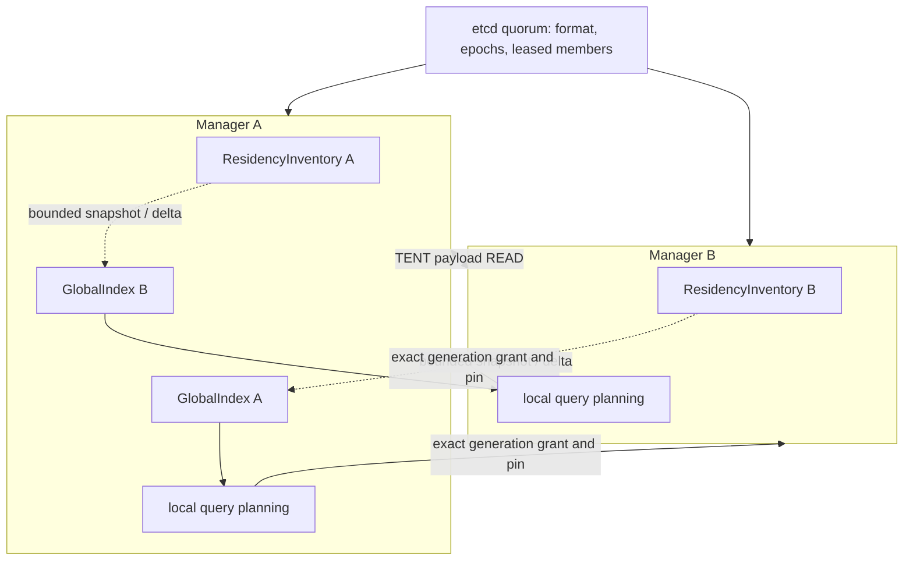
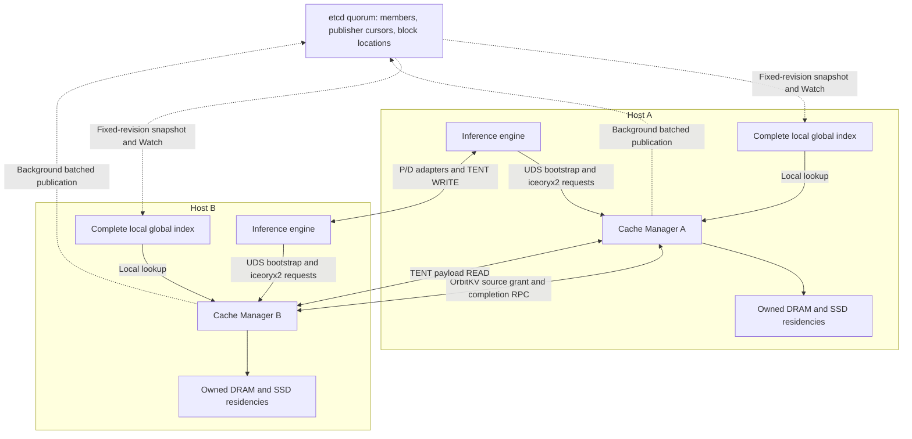

# Distributed cache design

The current S2.8 candidate keeps only protocol identity, persistent node epochs
and leased membership in etcd. Managers exchange bounded owner inventory
snapshots and deltas on the existing peer listener, then query the same local
`GlobalIndex` as before. `ResidencyInventory` remains the only source-side
residency truth; the stream has bounded frame credit and hidden snapshot staging,
not another Catalog. Source grants and completion remain OrbitKV gRPC, and
Mooncake TENT carries payload bytes.

This is a coordinated pre-1.0 protocol cutover. New Managers require
`orbitkv/inventory-stream/v3` and reject the frozen etcd-block format. Stop every
Manager and use `scripts/migrate-metadata-format.py` to dry-run, archive and CAS
the namespace before switching or rolling back. Mixed-version operation and a
second production metadata path are not supported.

The implementation is pending independent S2.8 acceptance. Its current evidence
is same-host TCP and synthetic all-to-all stream capacity; physical cross-host,
independent failure domains, native engine serving, RDMA, native GDS and S2.10
long live-store/soak cells remain open.

## Current owner inventory-stream protocol


```mermaid
flowchart TB
    E[etcd quorum: format, epochs, leased members]
    subgraph A[Manager A]
        SA[ResidencyInventory A] -.->|bounded snapshot / delta| IB[GlobalIndex B]
        IA[GlobalIndex A] --> QA[local query planning]
    end
    subgraph B[Manager B]
        SB[ResidencyInventory B] -.->|bounded snapshot / delta| IA
        IB --> QB[local query planning]
    end
    E --> A
    E --> B
    QA -->|exact generation grant and pin| B
    QB -->|exact generation grant and pin| A
    A <-->|TENT payload READ| B
```

Each directed all-namespace session binds the cluster UUID, source node epoch and
incarnation, requester incarnation, scope digest and random session ID. Frames
are ordered and bounded. A receiver stages every snapshot page and contiguous
journal replay out of view, validates its transcript and page count, then swaps
the complete owner view into `GlobalIndex` atomically. Frame-consumption ACKs
return bounded byte credit; they never advance the installed watermark.

Normal deltas cover a contiguous source interval, coalesce exact `(StateKey,
medium)` identities and update one owner view atomically. Duplicates are
idempotent. Overlap, gaps, conflicting generations, invalid identity or size and
missing snapshot pages fail without partial installation. Stream interruption
keeps valid positive hints while coverage becomes `partial_hints`; membership
removal excludes that incarnation immediately and cleans its reverse-index rows
in bounded batches.

The current limits are 1,024 records and 512 KiB encoded/decoded content per
frame, 1 MiB gRPC messages and per-stream outstanding credit, 32 MiB aggregate
outbound credit, 128 sessions in each direction, two served and received
snapshots, 64 concurrent fence awaiters, 16 MiB/s aggregate source pacing with a
1 MiB burst, and 100 ms to 3 s reconnect backoff. `--index-budget` charges active
and hidden staging views together.

`POST /cache/sync` waits for submitted saves and returns an `inventory_fence`
containing protocol, cluster UUID, source epoch/incarnation and source sequence.
It does not wait for any requester. A controlled requester calls
`POST /cache/metadata/await` with that fence, its exact scope digest and a timeout
of at most 30 seconds. Success requires a committed matching owner view at the
target sequence and still-valid membership. Ordinary queries remain local and
never issue this HTTP barrier or an on-demand directory RPC.

`GET /cache/metadata` reports membership revision/validity, explicit coverage,
active/staging/accounted index bytes, expected and installed owner-view counts,
local journal state, stream bytes/frames, session counts, queue high-water marks,
cluster identity and the all-namespace scope digest. Etcd traffic no longer grows
with block churn; inspect stream diagnostics separately from membership traffic.

The frozen same-host A100 candidate uses native commit `f9383365` and benchmark
harness `53314d52`. A 16-owner, 60-second all-to-all run applies 245,760 changes
at 4,083.76 changes/s, with 29.64 ms installed-visibility p99, a 7,929,600-byte
index, 719,456-byte aggregate queue peak and zero etcd database growth during
churn. Five independent full-Manager runs each at 0 and 2 ms show median stream
bytes of 500,172 and 78,732 (84.3% lower) and visibility p95 of 1.56 and 5.14 ms.
Both profiles have zero etcd revision change during block churn and 100% exact
post-visibility GPU restores; model inference latency is not measured.

The same package passes stream partition/journal-overflow snapshot recovery,
membership restart/leader/quorum gates, full-Manager DRAM/io_uring fault recovery,
live DRAM metadata-loss recovery and a 260-block TCP P2P restore. The migration
tool's dry-run/apply/rollback retains epoch keys and removes retired block/cursor
keys. Evidence and failed development controls are under
`/root/orbitkv-artifacts/s2-s51-20260930/s2-8-inventory-streams/` and the matching
A100 path `/workspace/orbitkv-three-host-20260930/s2-8-inventory-streams/`.
Independent review is pending; no cross-host or serving result is inferred.

## Historical S2.1–S2.7 etcd-block path

The remainder of this page through the S2.7 acceptance record describes the
frozen pre-cutover implementation and remains only as evidence/reproduction
context. Its `published_revision`, block-key Watch and old coalescing flag are not
callable interfaces in the S2.8 candidate.

## Local global index and etcd metadata


```mermaid
flowchart TB
    E[etcd quorum: members, publisher cursors, block locations]
    subgraph A[Host A]
        EA[Inference engine] -->|UDS bootstrap and iceoryx2 requests| MA[Cache Manager A]
        IA[Complete local global index] -->|Local lookup| MA
        MA --> SA[Owned DRAM and SSD residencies]
    end
    subgraph B[Host B]
        EB[Inference engine] -->|UDS bootstrap and iceoryx2 requests| MB[Cache Manager B]
        IB[Complete local global index] -->|Local lookup| MB
        MB --> SB[Owned DRAM and SSD residencies]
    end
    MA -.->|Background batched publication| E
    MB -.->|Background batched publication| E
    E -.->|Fixed-revision snapshot and Watch| IA
    E -.->|Fixed-revision snapshot and Watch| IB
    MA <-->|OrbitKV source grant and completion RPC| MB
    MA <-->|TENT payload READ| MB
    EA <-->|P/D adapters and TENT WRITE| EB
```

The [inspected FlexKV design](https://github.com/taco-project/FlexKV/blob/738ddc141a198b4e20de6c5d1f0128e387f7fdb2/docs/dist_reuse/README_en.md)
uses local global discovery with Redis metadata and Mooncake transfers.
OrbitKV uses etcd revisions and Watch. Every Manager has an index of the same
advertised namespace, with asynchronous visibility; independent local snapshots
are not themselves a consensus system. The etcd deployment supplies metadata
replication. Deploy its members across failure domains to protect against host
loss; three processes on one host only test process/leader failures.

### Ownership and consistency

| Owner | Responsibility |
| --- | --- |
| Engine | HBM, scheduling, page lifetime and legal recovery boundaries |
| Core inventory | Actual sealed DRAM and committed SSD residencies; generation and bounded journal |
| `orbitkv-catalog` | Local global index, applied revision, capacity and cached membership |
| `orbitkv-server/cluster` | etcd leases, fenced publication, snapshot/Watch and shutdown |
| Core planner and peer owners | Route selection, exact source grants, staging, READ and release |
| etcd | Replicated locations and membership; transaction ordering and Watch history |
| Mooncake TENT | Registered-memory transfer and native completion |

Index rows are hints. Only the source can pin actual residency and authorize
addresses. Publish completes locally without waiting for etcd. There is no
transaction across GPU memory, storage and metadata. A stale row can cause a
miss, but cannot authorize a reused address. A missing row is not proof that
no remote copy exists. Loss of a sole payload owner still needs recomputation.

### Identity and publication

All distributed Managers use `/orbitkv/v2/<cluster>/`:

| Key suffix | Value and lifetime |
| --- | --- |
| `format` | Persistent `orbitkv/global-index/v2` schema identifier |
| `epochs/<node>` | Persistent monotonically increasing registration epoch |
| `members/<node>` | Leased endpoint, runtime UUID and epoch |
| `publishers/<uuid>` | Leased operation cursor, inventory sequence and readiness |
| `blocks/<uuid>/<state-digest>/<dram-or-ssd>` | Leased protobuf StateKey, generation, representation and byte estimate |

The digest is domain-separated SHA-256 over the namespace length, namespace
and state hash. It organizes keys, not query placement. StateKeys retain their
existing model/layout/representation compatibility contract. DRAM and SSD are
independent entries; a DRAM eviction preserves committed SSD evidence. Metadata
contains no raw addresses, rkeys, transfer tickets or pins.

Each owner has one monotonic residency sequence. Every publication transaction
compares the exact member record, member lease and previous publisher cursor.
The cursor changes atomically with its puts/deletes. Lost replies reconcile
against that committed cursor before advancing; a delayed old Put cannot pass
the comparison after a newer Delete. Deletes retain the old medium in the
in-memory journal. Batches coalesce repeated changes to the same etcd key.

When the journal no longer covers publication progress, reconciliation:

1. Atomically withdraws publisher readiness and deletes that owner's advertised blocks.
2. Captures sequence S and publishes bounded pages of current residencies.
3. Replays every change from S through a captured end sequence.
4. Commits the final sequence and readiness. Readers hide the owner until then.

Another history gap restarts reconciliation. Local storage and lease renewal
remain independent; no partial publication is declared complete. Uncertain
transactions retry the same fenced operation with bounded exponential delay
while local registration remains valid. Startup lease acquisition tolerates a
balanced connection initially choosing an unavailable etcd endpoint.

### Snapshot and Watch

A Manager reads all metadata pages at one revision R while its index is hidden,
then Watches from R + 1. Normal reconnect resumes the last applied revision;
compaction, invalid metadata or decoder failure resets the index and rebuilds.
The client requests whole transaction Watch responses, not fragmented responses.
Oversized responses are recovered through paginated snapshots. A budget overflow
withdraws the entire view instead of silently dropping entries from a supposedly
complete index. Increase capacity or reduce advertised state before it can recover.

Membership renewal runs separately from publication and Watch. Admission uses
half the acknowledged lease TTL, measured from request send time. Expired or
fenced runtimes cannot revive; restart for a new UUID. Own-record replacement,
removal or coordinator identity change fences remote work. Local DRAM/SSD remains
usable. Metadata expiry never proves that a native payload transfer has drained.

### Request path and bounded work

1. Read local DRAM/SSD evidence and the local global index.
2. Retain up to four remote candidates **per medium**, preserving SSD alternatives.
3. Select a compatible route and ask its source to validate UUID and exact residency sequences.
4. Pin the source, execute TENT READ into requester-owned staging, and acknowledge release after drain.
5. Restore through the existing GPU path; newly resident requester copies publish in the background.

Batch rejection excludes the route from the current request. It does not erase
shared index rows: the response may identify neither the stale key nor a permanent
residency failure. Watch remains the sole owner of shared directory changes.

| Bound | Value |
| --- | --- |
| Owner replay journal | `--inventory-journal-bytes`, 16 MiB by default |
| Complete local index | `--index-budget`, 256 MiB of logical accounting by default |
| Inventory page | At most 1,024 records / 512 KiB |
| Publication transaction | At most 48 block operations plus its cursor; bounded bytes |
| Encoded block record | At most 128 KiB |
| Fixed-revision etcd page | 128 records |
| Membership | At most 4,096 members; 1 KiB per member record |
| Source authorization | Existing 128-key / 64 KiB demand segments and bounded sessions |

Index accounting includes conservative entry overhead, not a process RSS cap.
Every Manager pays memory and update CPU for the whole advertised namespace.
No cluster-size or sustainable-churn SLO is established yet.

### Synchronization and observability

`POST /cache/sync` waits for submitted saves and returns `published_revision`:
the etcd revision committing the captured local inventory. It does **not** wait
for other Managers. `GET /cache/metadata` reports index revision, accounted bytes,
registration validity, index availability, local inventory sequence and publisher
sequence/revision/readiness. Standalone Managers return JSON `null`.

For a controlled cross-Manager barrier, capture the source's published revision
and wait until the requester has an available index at or above it. The shared
cache qualification driver performs this barrier; ordinary requests remain
asynchronous and issue no directory query. A barrier does not retain payloads
against subsequent source eviction. See [metrics](metrics.md).

### Residency, proximity and access paths

The target model uses three independent dimensions: physical medium
(`HBM`, `DRAM`, `SSD`), owner/resource location, and an executable access path.
Local or peer proximity is derived relative to the consumer and its device.
Remote is not a fourth medium with a fixed priority after local SSD. GDS,
io_uring and Mooncake TE describe movement; GPU/host staging is temporary
workspace unless explicitly admitted as a retained cache replica.

| Residence | Owner and discovery contract | Access to a local consumer |
| --- | --- | --- |
| Engine HBM | Engine owns pages and export lifetimes; advertise only committed, exportable state with bounded metadata traffic | Existing local state or, later, authorized peer GPU transfer |
| Manager DRAM | Manager owns sealed retained objects and registered export memory | Local CUDA copy or peer TE transfer, followed by any decode/restore |
| Manager SSD | Manager publishes only complete writes and keeps extent generations independent of DRAM residency | Local io_uring/cuFile; peer owner prepares its own bytes before TE export |
| Shared/mounted storage, later | Storage authority and durability need a separate deployment contract | Qualified filesystem/NVMe-oF path; not automatically a peer Manager replica |

Each discoverable replica needs a residence identity within its owner, identifying
the medium and storage/engine resource where needed. Carry compatible state and
representation evidence, byte size and a residency generation. HBM evidence
also needs the exporting engine instance/rank and lifetime checks. Keep raw
addresses and transfer grants out of long-lived directory records. Current
`ReplicaLocation` carries owner, insertion sequence, medium, representation
family and optional stored bytes.
Keep the existing representation-bound StateKey until a separately qualified
logical-to-physical format mapping exists.

A key may reside in B's DRAM and SSD at the same time. Evicting its DRAM copy
must remove only that residence, leaving the SSD candidate discoverable. Source
SSD residency does not imply an immediately readable TE memory range: authorize
and lease the extent, acquire bounded staging credit, prepare locally, then
export the prepared memory. Return pending, backpressure or missing explicitly.
Use existing transfer lifetime owners; do not add a recursively fetching
remote cache or a second copy of the SSD storage index.

The source-side executor now implements this sequence for io_uring host staging.
It reserves a ticket session and the allocator-rounded staging footprint before
allocation. The detached SSD batch owns both exact extent leases and a two-phase
reservation until every read drains. Successful materialization replaces the
estimate with deduplicated actual allocation bytes and publishes the existing
transfer grant only after handing the result to the authorization owner.
Release-before-completion fences publication without freeing in-flight memory;
allocation, partial-read, queue and cancelled-receiver paths roll back. Requester
plans bind every segment to either peer DRAM or peer SSD and never mix media;
ordinary two-host TCP recovery is qualified; mixed-load performance,
source-staging cancellation and RDMA remain separate gates.

Restoring a peer replica creates destination state; retaining it in destination
DRAM or SSD is a separate admission decision. Copies may coexist and expire
independently, with no mandatory demotion chain or implied minimum replica count.
Prepared query buffers and P/D destinations do not become shared cache entries
merely because a transfer finished. HBM remains engine-managed; a future
dedicated GPU cache pool would require its own explicit capacity reservation.

Discover bounded candidates, then compare local DRAM, local SSD and available
peer residences by the cost of reaching the same required state. Use cached
evidence first, so considering peers does not require a full-cluster lookup or
payload read. Follow the [route eligibility contract](state-planning.md#candidate-routes-and-eligibility);
each additional residence/path needs its own capability and qualification gate.

## Transfer lifetime and resource control

Source preparation validates the requested incarnation, StateKeys, replica
generations, coverage and representation, then pins the exact source objects.
Only the resulting transfer capability exposes TE segments and ranges. Bind it
to the source incarnation, requesting session, operation and byte limits;
duplicate requests, completion and release must be idempotent.

Directory freshness and source pin lifetime are independent. Rejecting an
expired RPC token does not cancel an already submitted RDMA operation. Reuse
requires transport completion or a proven revocation/quiescence mechanism.
If requester loss prevents that proof, quarantine the referenced memory and
keep charging it until the transport is safely drained or revoked. Do not
implement timeout-only reclamation. Validating the pinned TE version's actual
failure/completion semantics is a blocking gate for distributed reliability.

Reuse existing destination query byte ownership through GPU completion. Add
source export limits per peer and globally, with separate staging credits for
SSD reads. Charge and bound both sides; pinning existing DRAM can still prevent
eviction. Cancellation stops unsubmitted work and drains submitted work before
credits or memory are released.

Remote SSD preparation reads only the owner's local storage into registered,
budgeted DRAM. It must not recursively fetch from another peer on a miss. Give
the destination explicit pending/backpressure/missing outcomes; no unbounded
retry while holding destination HBM. Keep its admission separate from retained DRAM exports.

## Planning and useful replication

The [decision owner is the Cache Manager below the engine](state-planning.md#cache-manager-decisions-below-the-engine).
The local global index and bounded peer resource summaries give it a cluster
view without a required request router.
The destination Manager chooses the plan; each source admits its own resources.
Optional Dynamo integration consumes summaries later and does not own cache
discovery or grant transfer authority.

Use the same [cost observations and deployment contracts](state-planning.md#policies-by-deployment-mode)
as local storage planning. Shared-cache DP, P/D handoff and TP/PP consumption
have different completion targets; do not assign one policy to every operation
on a physical node. The current narrow selector first requires equal coverage
and the same peer medium, then may choose an owner using fresh, incarnation-
scoped complete HostReady estimates. Cross-medium and local/peer selection remain
target design rather than inferred from these samples.

Represent a request as demand for a legal recovery boundary, with known bytes,
query ownership and later engine-supplied priority/first-use hints. Estimate
finish time from observed discovery, authorization, source preparation,
transfer queueing, Mooncake TE service and destination decode/H2D
cost. Compare legal restore/recompute options using critical-path accounting;
local SSD is not always cheaper than peer DRAM. The engine retains execution
admission and HBM allocation decisions.

Source-release acknowledgement and retained source byte-seconds affect resource
availability without necessarily delaying engine readiness. Bound sender and
receiver reservations together; never turn a wait timeout or a stale cost hint
into permission to reuse an in-flight buffer. Measurements carry peer
incarnation and transport context. Cached discovery does not replace source
authorization, and etcd is not on the per-read decision path.

Demand-driven remote reads may create local replicas. Admission uses reuse,
saved recomputation/transfer work and memory pressure; one remote hit need not
remain cached indefinitely. Hot-prefix replication and early DRAM warming follow
measured demand and explicit byte budgets. Directory redundancy is only a hint
for eviction unless a separate data-replication protocol guarantees coverage.

A later KV-aware router consumes summarized cache and engine events. It selects
a worker; the selected Manager still validates the recovery and transfer plan.
No router service is required for this distributed cache milestone.

## Availability and capacity contract

| Failure | Required behavior |
| --- | --- |
| One Manager/index fails | Other Managers retain their indexes; failed-owner payloads require another copy or recomputation |
| Source eviction/restart | Reject stale generations/incarnations; use another indexed owner or recompute |
| Watch disconnect/compaction | Resume retained history or rebuild; expose coverage and lag |
| One etcd member fails, quorum survives | Recover publication and Watches through the surviving service; qualify leader change |
| etcd quorum lost | Metadata stops; existing transfers drain; new remote admission stops when registration validity expires; local cache continues |
| etcd restored/new cluster | Fence the old coordination generation; reconcile live inventories before claiming complete coverage |
| Index/publisher budget exhausted | Bounded backpressure/resynchronization; no silent truncation of a complete view |
| Requester dies during transfer | Retain source memory until native drain or proven revocation, independently of metadata expiry |

Every Manager pays memory and update CPU proportional to global advertised
metadata and receives the update stream. etcd pays storage and replication costs
for block updates. Batching reduces RPC overhead, not those underlying writes.
This simplicity/lookup-latency tradeoff needs a measured scale limit.

[etcd limits](https://etcd.io/docs/v3.6/dev-guide/limit/) include a default 1.5 MiB
request limit and 2 GiB backend quota, with 8 GiB suggested for ordinary maximum
deployments. Measure actual encoded metadata, churn, lease deletion bursts,
compaction, defragmentation and quota exhaustion. A higher quota does not prove
sustainable throughput, and the quota is not KV-payload capacity.

## Qualification and remaining work

Run the [native and process gates](p2p.md#validation) sequentially with builds.
The new native gates use real etcd for fixed-revision bootstrap, compaction,
restart, duplicate identity, lost publication replies, delayed retry fencing,
leader loss and quorum loss. GPU gates use the same publisher/Watch path before
TENT READ and raw/encoded restoration; they do not emulate a directory.

Before production-scale claims, measure cold/warm TTFT, restore tail latency,
throughput, remote hit rate, index memory/update CPU, publication latency,
etcd database growth, Watch lag, compaction and quota exhaustion. Requalify
physical two-host serving on the new revision. RDMA, multi-rank deployment,
long-running churn and partition/rejoin remain separate gates. Permanently lost
requester reclamation still needs transport revocation proof. Current SSD files
are truncated on Manager restart; metadata redundancy does not change that.

## Quota and index-budget recovery

The S2.1 metadata gate uses real etcd and the production publisher, Watch,
membership and complete-index owners. It requires no GPU payload allocation.
After leader loss, an existing balanced channel can still route bootstrap
requests to the stopped endpoint. Startup now retries transient format/registration
requests under a finite budget while preserving the lease and runtime incarnation.
Permanent metadata/identity conflicts fail immediately. Retrying a committed
registration returns the same epoch only for the exact owner and lease; a new
incarnation or lease cannot take over a live node. A runtime whose conservative
registration deadline expires still has to restart with a new incarnation.

A 2 MiB etcd backend quota is exhausted with actual writes. The publication cursor
must remain unchanged while NOSPACE is active; after deleting the filler,
compacting, defragmenting and disarming each affected member's alarm, the pending
transaction must converge without restoring a retired replica. Quota checks use
committed backend size, so a rapid burst alone is not evidence that quota was hit.

The 2 KiB index case deliberately overflows with 24 residency records. Every
lookup stays empty while coverage is incomplete; lease renewal continues for
longer than the initial conservative registration window. Evicting 23 records
allows a fresh complete snapshot and restores the single surviving candidate.
These bounds are fault triggers, not production sizing recommendations.

Build Manager, extension, TENT and tests before starting services. Freeze the
printed test executable and native artifacts outside the checkout, then run:

```bash
ETCD_BIN=/path/to/frozen/etcd \
ORBITKV_METADATA_ARTIFACT_DIR=/var/tmp/orbitkv-evidence/metadata-publish \
  /path/to/frozen/server-tests cluster::publish::tests \
  --ignored --nocapture --test-threads=1

ETCD_BIN=/path/to/frozen/etcd \
ORBITKV_METADATA_ARTIFACT_DIR=/var/tmp/orbitkv-evidence/metadata-membership \
  /path/to/frozen/server-tests cluster::tests::etcd \
  --ignored --nocapture --test-threads=1
```

Use `cargo test --release -p orbitkv-server --no-default-features --features
cuda-13,mooncake --lib --no-run` during the build phase to obtain the executable.
`ORBITKV_METADATA_ARTIFACT_DIR` preserves each owned etcd data directory, logs and
fault summaries on success or failure and rejects a checkout-local destination.
Without it, the test helper uses ordinary temporary directories. A frozen test
binary may run without its compile-time source tree: the helper checks that tree
when present, otherwise it checks the runtime Git root when invoked from a
checkout. This preserves the external-output guard without creating a hidden
source-tree dependency for remote qualification.

The current run evidence is under
`/root/orbitkv-artifacts/s2-s51-20260929/s2-1/`: `frozen-v5-manifest.json` identifies
the exact binaries, `publish-after-bootstrap-fix.log` and `membership-final.log` retain complete
gate output, and the `publish-after-bootstrap-fix/` / `membership-after-fix/` trees retain etcd data
and fault summaries. Failed quota setup attempts and their frozen binaries are
retained alongside the final run. No performance advantage is claimed.

This is metadata-owner qualification with synthetic records and same-host etcd
process faults. GPU compute has not passed in this container; storage-originated
journal churn and local-cache availability during metadata loss remain separate
gates. A three-process quorum is not three independent host failure domains.
Quota recovery must preserve registration/incarnation and cursor fencing; never
remove those checks to make a recovered publisher appear healthy.

## Watch delay, partition and compaction

The S2.2 gate inserts a test-only loopback TCP proxy between one Cluster and a
real etcd 3.5.21 process. Source registration/publication uses an independent
direct connection, so the test can keep committing while only the reader's
Watch, bootstrap and keepalive streams are delayed or disconnected. This is a
controlled same-host network fault, not a physical cross-host partition.

The gate establishes an initial DRAM candidate, delays the Watch downstream by
400 ms and requires the measured application lag to reflect that delay. It then
disconnects the reader, commits a DRAM delete plus a different final key, compacts
through the committed revision and holds the partition long enough for Watch
resume attempts. While isolated, the reader retains the old complete revision;
after healing it must become unavailable during rebuild and expose only the final
SSD/source state when the complete snapshot reaches the committed revision.

The final implementation run observed 422.29 ms delayed-Watch application, a
1.50 s partition, 2.31 s from heal to complete coverage and 1.41 s with incomplete
coverage hidden. Final revision was 9, logical index accounting was 863 bytes and
etcd reported 36,864 backend bytes. These are one deterministic fault run and
diagnostic timings, not a capacity or latency envelope.

Build and freeze native artifacts first, then run the test executable without a
concurrent build:

```bash
ETCD_BIN=/path/to/frozen/etcd \
ORBITKV_METADATA_ARTIFACT_DIR=/var/tmp/orbitkv-evidence/watch-fault \
  /path/to/frozen/server-tests \
  cluster::publish::tests::delayed_and_compacted_watch \
  --ignored --nocapture --test-threads=1
```

The current external evidence is under
`/root/orbitkv-artifacts/s2-s51-20260929/s2-2/`. `run-1.log` preserves the
failure that revealed premature index reset. `run-2` preserves an intermediate
passing attempt whose partition-duration label included recovery time.
`publish-v3.log` and `publish-v3/*/watch-partition-recovery.json` contain the
pre-review gate. The review correction and final frozen run are under
`/root/orbitkv-artifacts/s2-s51-20260929/s2-2-correction/`; `publish.log`,
`publish/*/watch-partition-recovery.json` and `frozen-sha256.txt` identify the
typed-error and measurement correction. The gate-drain correction and final
candidate are under `s2-2-gate-correction/` with the same filenames. Earlier
failures and intermediate runs remain intact.

Only explicitly recognized transport failures retain the old complete snapshot.
An arbitrary gRPC `Unknown`, invalid metadata, a changed format, compaction or a
delete without required previous metadata still resets coverage and rebuilds.
Registration expiry fences discovery even if the last index snapshot was
complete. Production Watch/RPC metrics, sustained store-originated journal
overflow, CPU/RSS and increasing-key capacity measurements remain open.

## Measured metadata scaling smoke

The S2.3 ignored test drives the production registration, Publisher, Watch and
GlobalIndex owners against one real etcd 3.5.21 process. It repeats three fixed
profiles: 1, 4 and 16 source registrations, each with 512 unique 4 KiB logical
residencies. Initial publication stays hidden until each publisher's ready marker;
a fresh reader then rebuilds the complete snapshot. Finally every publisher
deletes half its keys and both readers converge to the exact remaining count.

Publication latency is the Publisher transaction call. Watch lag starts after
that transaction returns and is observed with a 1 ms polling interval. Snapshot
rebuild includes Cluster join through complete candidate visibility. Process CPU
is Linux user+system ticks at 100 ticks/second; RSS is `/proc` VmRSS. Etcd backend
size is sampled after a fixed 500 ms stabilization outside timed operations.
These definitions make repeated runs comparable, but the Watch observer and
process-wide counters are not instrumentation of pure service time.

Median of three runs on each checked host:

| Host | Sources / records | Publish p50 / p95, ms | Watch p50 / p95, ms | Rebuild, ms | Index before rebuild | Etcd growth | Test / etcd CPU ticks | Test / etcd RSS delta |
| --- | ---: | ---: | ---: | ---: | ---: | ---: | ---: | ---: |
| H20 container | 1 / 512 | 0.61 / 0.83 | 2.16 / 2.26 | 5.74 | 144,640 B | 196,608 B | 1 / 5 | 5,776 / 7,000 KiB |
| H20 container | 4 / 2,048 | 0.60 / 0.90 | 2.13 / 2.31 | 14.07 | 578,176 B | 790,528 B | 4 / 27 | 4,560 / 12,540 KiB |
| H20 container | 16 / 8,192 | 0.63 / 1.16 | 2.12 / 2.41 | 56.33 | 2,315,392 B | 3,137,536 B | 15 / 176 | 11,636 / 23,088 KiB |
| A100 host | 1 / 512 | 0.66 / 0.82 | 2.07 / 2.28 | 7.11 | 144,640 B | 196,608 B | 1 / 6 | 5,332 / 6,572 KiB |
| A100 host | 4 / 2,048 | 0.66 / 1.19 | 2.07 / 2.34 | 14.34 | 578,176 B | 790,528 B | 4 / 23 | 4,360 / 11,436 KiB |
| A100 host | 16 / 8,192 | 0.68 / 0.95 | 2.07 / 2.45 | 59.78 | 2,315,392 B | 3,141,632 B | 17 / 116 | 10,420 / 22,604 KiB |

Build and freeze first, then run with a new external evidence directory:

```bash
ETCD_BIN=/path/to/frozen/etcd \
ORBITKV_METADATA_ARTIFACT_DIR=/var/tmp/orbitkv-evidence/capacity-repeat-1 \
  /path/to/frozen/server-tests \
  cluster::publish::tests::increasing_metadata_load \
  --ignored --nocapture --test-threads=1
```

The final exact-row assertion, frozen H20 runs and independent acceptance are under
`/root/orbitkv-artifacts/s2-s51-20260929/s2-3-exact/`. The final A100 frozen rerun
is under `/root/orbitkv-artifacts/three-host-20260929/node-b-s2-3-exact-680eaa1a/`
and the test-owned remote directory
`/workspace/orbitkv-three-host-20260929/s2-3-exact-680eaa1a/`. The preceding
correction runs used for the table remain under `s2-3-correction/` on each host.
The initial stale-`db_size` run and the first evidence version that did not
verify the exact deleted key set remain under `s2-3-final/` and
`s2-3-qualified/`; both are excluded from this table.

The original JSON called this pre-rebuild sample `index_bytes_peak`; it was not a
sampled high-water mark. New runs emit `index_bytes_before_rebuild`. Historical
artifacts retain their original field name.

This does not qualify 16 nodes as a production maximum or model CPU/RSS under
contention. Sources are real registered metadata publishers with synthetic
records, not Managers receiving DRAM/SSD events from live GPU storage. One etcd
process avoids quorum replication cost. Continue with larger loads, update churn,
three independent etcd hosts and live-store journal overflow before defining an
operating envelope.

## Live DRAM journal overflow and metadata loss

The ignored A100 gate uses the production GPU save path, DRAM store,
`ResidencyInventory`, Cluster publisher, Watch and `GlobalIndex`. It publishes 64
blocks, isolates only the source's etcd connection, evicts those live blocks and
saves 64 replacements. The 1 KiB journal advances from sequence 64 to 192 and
must return `HistoryGap` from the last published cursor. Before healing, an
available observer must still expose the exact old owner and no replacement.
After healing, a publisher snapshot must expose only the replacements.

The gate zeroes the registered GPU allocation and verifies all 65,536 restored
bytes during the transient partition. It then partitions the source through its
12-second lease deadline and waits until an independently connected, available
observer no longer permits that exact incarnation and exposes no source rows.
The same local bytes must still restore exactly, while healing must not revive
the expired runtime.

Build and freeze the test and native libraries before running:

```bash
CUDA_VISIBLE_DEVICES=0 MC_FORCE_TCP=1 \
ORBITKV_MOONCAKE_LIB_DIR=/path/to/frozen \
LD_LIBRARY_PATH=/path/to/frozen \
ETCD_BIN=/path/to/frozen/etcd \
ORBITKV_METADATA_ARTIFACT_DIR=/var/tmp/orbitkv-evidence/live-journal \
  /path/to/frozen/server-tests \
  cluster::tests::p2p_mooncake::live_dram_journal_overflow_rebuilds_and_local_payload_survives_metadata_loss \
  --ignored --nocapture --test-threads=1
```

The final frozen artifact and accepted review are under
`/root/orbitkv-artifacts/s2-s51-20260929/s2-4-live-journal-correction/`.
The implementation and reviewer runs remain on the test-owned A100 path
`/workspace/orbitkv-three-host-20260929/s2-4-live-journal-correction-f7d953a8/`;
the copied implementation evidence is under
`/root/orbitkv-artifacts/three-host-20260929/node-b-s2-4-live-journal-correction-f7d953a8/`.
The corrected `server-tests` SHA-256 is
`3efb6137b795560a8e3f8bb6f9cf228ecd77d2dec3c765cfcc2b81272d9a6176`.

This is a bounded one-host A100 correctness gate, not sustained journal capacity.
The source is a real `OrbitKVEngine` but not a complete Manager process. SSD,
cross-host/two-GPU recovery, P/D, RDMA, native GDS and three-host etcd remain
independent qualification cells.

## Manager process DRAM and io_uring metadata faults

S2.5 extends the distributed Python integration gate to two independent Manager
processes plus a separate client process and real etcd. The source Manager alone
connects through a test-owned TCP gate; the consumer stays connected as the
authoritative observer. Both DRAM and explicit io_uring SSD cases perform five
eight-block rounds with unique hashes and deterministic per-block payloads.

Each case covers a no-fault remote restore, three publication/eviction/re-save
rounds during a transient source metadata partition, snapshot convergence after
healing and a second partition through the source's actual lease expiry. The
test decodes records from its isolated etcd namespace to compare the exact
source incarnation, grouped hash, location-key digest, stored byte count and
DRAM/SSD medium. Deleted rounds must be absent rather than merely balanced by the
same number of unexpected records.

The SSD case pins `--ssd-backend uring --ssd-read-path uring`. It waits until
writes are complete, removes the DRAM copy, requires
`orbitkv_ssd_prefetch_bytes_total` to advance and only then accepts a byte-exact
GPU restore. The second Manager's DRAM is cleared before the expired-source
query; its remote-fetch counter must remain unchanged before and after the
source network heals.

Run only after freezing the Manager, wheel/extension, TENT and etcd:

```bash
cd /path/to/frozen-test-bundle
PYTHONPATH=/path/to/frozen-python:/path/to/frozen-test-bundle \
LD_LIBRARY_PATH=/path/to/frozen \
ORBITKV_MOONCAKE_LIB_DIR=/path/to/frozen \
ORBITKV_CACHE_MANAGER_BINARY=/path/to/frozen/orbitkv-cache-manager \
ETCD_BIN=/path/to/frozen/etcd MC_FORCE_TCP=1 \
python3 -m pytest -m integration -vv -s \
  --basetemp=/var/tmp/orbitkv-evidence/s2-5 \
  tests/integration/test_distributed_cache.py
```

The final A100 implementation run passes both parameters in 38.71 seconds. The
whole DRAM and SSD transient scenarios measured 258.5 and 252.3 ms, including
healing, convergence and final restore; expiry checks measured
11.29 and 11.43 seconds. The SSD Manager recorded 163,840 written bytes and
262,144 io_uring-prefetched bytes, with zero final write/read ownership gauges.
These values are correctness diagnostics, not latency or capacity claims.

Frozen artifacts and copied raw evidence are under
`/root/orbitkv-artifacts/s2-s51-20260930/s2-5-manager-process-exact/`.
The original failed runs remain under the preceding `s2-5-manager-process*`
directories. Remote raw evidence, including etcd DB/WAL files, remains under
`/workspace/orbitkv-three-host-20260930/s2-5-manager-process-e4cfc810/`.
The independent accepted review and its separate A100 run are under
`/root/orbitkv-artifacts/s2-s51-20260930/s2-5-manager-process-exact/reviewer/`.

This is one A100 host with multiple processes and loopback TCP. It does not
qualify a cross-host cache, etcd HA/failure domains, native GDS, P/D, RDMA,
engine model output or a sustained maximum operating envelope.

## Sustained metadata churn and capacity

S2.6 has a separate ignored release gate for a declared 60-second load. It uses
one real etcd 3.5.21 process, 16 registered production Publishers, one stable
Watch/GlobalIndex observer and fresh observers started during rounds 15, 30, 45
and 60. Each source rotates a 1,536-key active window through 2,048 deterministic
keys. Every one-second round publishes 128 deletes and 128 inserts per source,
for 4,096 changes per round, 245,760 changes total and 24,576 final records.
Even keys advertise DRAM and odd keys advertise SSD, so the exact oracle checks
key, source incarnation, sequence, medium, representation and stored bytes.

The fixed pre-run budgets are a 16 MiB complete index per observer, production's
48-record and 512 KiB plus key-overhead publication transaction bounds, and a
1 GiB etcd backend quota. The gate records transaction publication time, stable
observer Watch application lag, fresh-reader first-snapshot and target-revision
convergence, logical index bytes, maximum transaction records/bytes, process CPU
ticks and average cores, RSS/high-water RSS, and etcd backend/in-use growth. It
writes its workload contract before starting etcd and writes the final JSON before
applying threshold assertions, so failed runs remain diagnosable.

Each fresh reader joins immediately before its scheduled eviction batch. The gate
requires its complete index to still be unavailable when mutations begin, then
measures the unmodified direct-etcd snapshot and Watch catch-up path. Network delay
and partition behavior stay in S2.2; inserting a byte-stream proxy here would
measure the proxy's frame scheduling rather than metadata rebuild capacity.

The predeclared acceptance thresholds are at least 1,500 changes/second;
publication p95 at most 100 ms and max at most 1 second; Watch p95 at most 100 ms
and max at most 1 second; rebuild and convergence max at most 10 seconds; no
publication batch over its production bounds; no index over 16 MiB; test/etcd
average CPU at most 8/4 cores; test/etcd high-water growth at most 512 MiB each;
and etcd backend growth at most 768 MiB. The 60-second work has a 180-second hard
limit. All exact-set assertions and the raw etcd block count must pass.

Build and freeze the release test executable and etcd before running:

```bash
ETCD_BIN=/path/to/frozen/etcd \
ORBITKV_METADATA_ARTIFACT_DIR=/var/tmp/orbitkv-evidence/s2-6-run-1 \
  /path/to/frozen/server-tests \
  cluster::publish::tests::capacity::sustained_churn_bounds_batches_and_rebuilds_exactly \
  --ignored --nocapture --exact --test-threads=1
```

This gate uses synthetic residency records at the production Publisher boundary.
S2.4 and S2.5 separately qualify storage-originated journal overflow and complete
Manager DRAM/io_uring behavior. `GET /cache/metadata` now exposes journal records,
current/peak retained bytes, configured capacity and production-observed history
gaps, without adding a metadata owner or widening the storage mutation API.
The release candidate at `85f0f656` passes once locally and three times on the
A100 host. Across the three A100 runs, throughput is 4,032 changes/second,
publication p95 is 1.02–1.04 ms, Watch p95 is 3.46–3.47 ms, fresh-reader snapshot
max is 350–374 ms and convergence max is 443–454 ms. Every run finishes with
24,576 exact raw etcd block records and a 7,015,680-byte index peak. Etcd grows
69.53–69.55 MB; test-process average CPU is 0.056 cores with 16.2–19.6 MiB
high-water growth, while etcd averages 0.38–0.53 cores with 184.1–186.6 MiB growth.
All predeclared thresholds pass. The same frozen Manager and wheel rerun both
S2.5 DRAM/io_uring cases in 38.26 seconds and observe bounded journal bytes plus
at least one production history gap.

Frozen artifacts, the predeclared contract, local runs, copied A100 summaries
and the Manager regression are under
`/root/orbitkv-artifacts/s2-s51-20260930/s2-6-sustained-capacity/`. Complete A100
etcd DB/WAL evidence remains under
`/workspace/orbitkv-three-host-20260930/s2-6-sustained-capacity-85f0f656/`.
The retained failed runs show the initial test-only inventory-boundary rejection,
an arithmetic correction and two runs where a byte-stream proxy inflated rebuild
time beyond the unchanged 10-second threshold. Direct-etcd measurement removed
that confounder; S2.2 remains the delayed/partitioned Watch gate.

This is a tested single-host sustained envelope, not a maximum or a multi-host
availability result. It does not qualify three-host or independent-failure-domain
behavior. Codex independently reran the frozen capacity and Manager gates, checked
the implementation and evidence, and accepted S2.6 at `ab306965`. Its review is
under the local evidence root's `reviewer/` directory; complete reviewer runtime
evidence remains in the remote root's `reviewer-run-1/` directory.

## Bounded etcd publication coalescing

S2.7 keeps the current etcd metadata authority while reducing repeated block-key
mutations before the later inventory-stream cutover. The publisher waits for a
bounded quiet window only after waking from idle, reads at most the existing
1,024-record/512 KiB contiguous journal interval and keeps the newest record for
each exact `(StateKey, medium)` identity. A DRAM delete never removes SSD state,
and a delete remains an explicit output even when the same interval did not
contain its preceding put.

The Manager flag `--inventory-publish-coalesce-ms` accepts 0–5 ms and remains at
a zero waiting window until the frozen 0/2/5 ms evaluation selects a default.
New changes can extend the quiet period only to the fixed 5 ms maximum.
`/cache/sync` records its target sequence and wakes the publisher, so a flush
bypasses intentional waiting without inventing progress.

A coalesced interval may require several 48-record etcd transactions. Intermediate
transactions retain the previous fully covered input sequence and readiness.
Only the final transaction publishes the interval's input `through` sequence and
requested readiness. This keeps the existing member, lease, operation and cursor
CAS; output key sort order cannot advance the input cursor.
Restart or ambiguous-reply recovery continues through the existing snapshot and
exact marker reconciliation paths.

`GET /cache/metadata` reports cumulative input and coalesced records, input and
encoded output bytes, transaction count, coalescing-window count/wait, and the
latest requested flush sequence. These counters are process-lifetime diagnostics.
They do not make publisher acknowledgement a requester-visible barrier.

Use the explicit benchmark with a matching frozen package and test support on
`PYTHONPATH`, and the frozen `ORBITKV_CACHE_MANAGER_BINARY`, `ETCD_BIN` and
`ORBITKV_MOONCAKE_LIB_DIR`:

```bash
python -m benches.metadata --profile 2 --output /var/tmp/orbitkv-evidence/s2-7-2ms-1
```

The profiles are `legacy` (the frozen S2.6 binary), `0`, `2` and `5`. Each uses
fresh Managers and etcd, 200 eight-page eviction/reinsert cycles and ten sparse
publication probes. Raw samples include immediate remote hit rate and time until
an available observer applies the source's acknowledged inventory target. Exact
GPU restores and final generation checks accompany the measurements. Inference
latency is unmeasured in this client workload and is reported as such.

The frozen S2.6 package is the zero-window comparison baseline. Five independent,
order-rotated A100 runs per profile pass the declared comparison with native
candidate `ba5c166b` and harness `d4ac16b5`. Against candidate 0 ms, the 2 ms
profile reduces median output records from 3,305 to 881 (73.3%) and transactions
from 481 to 111 (76.9%). Median Watch event key/value bytes per Manager fall from
1.362 MB to 0.483 MB. Measured etcd client received/sent bytes fall from
1.058/3.128 MB to 0.340/1.116 MB; these include observer and lease traffic, not
only block mutations. Each run uses 3,360 source mutations, with exact eight-record
final sets and successful local/remote GPU-byte checks.

The median low-traffic visibility p95 is 3.60, 6.07 and 11.06 ms at 0, 2 and 5 ms.
The 5 ms profile has similar mutation savings to 2 ms. Median save/query p99 stays
within the declared 5% plus 0.20 ms budget in every profile. Immediate remote
probes miss before metadata arrives in this workload; all probes after observed
visibility recover correctly, and every final-matrix local query hits immediately.
The harness retains polling and retry samples because `save()` acknowledges queued
host publication, so one immediate query is not a completion barrier.

Median Manager/etcd CPU deltas fall from 24/100 ticks at 0 ms to 15/25 ticks at
2 ms. Maximum Manager/etcd high-water growth is 5,964/6,032 KiB at 2 ms, below
the declared 256 MiB limit. Median encoded bytes and etcd revision delta fall
from 710,902/500 to 217,400/130. These short-run process counters describe this
metadata workload only; they are not a serving CPU or memory claim.

Default intentional waiting remains **0 ms**, preserving the sparse-traffic
freshness choice. The **2 ms** setting is an explicit option for workloads that
can accept its measured visibility delay. These are metadata/client measurements;
model inference latency and shared-serving benefits remain unqualified. This
change does not implement the inventory-stream protocol.

Frozen candidates, declarations, failed controls and raw samples are under
`/root/orbitkv-artifacts/s2-s51-20260930/s2-7-coalesced-publication/` and the matching
A100 root `/workspace/orbitkv-three-host-20260930/s2-7-coalesced-publication/`.
The A100 `matrix-d4ac16b5/` directory contains the final comparison, selected-
default regressions, exact commands, hashes and cleanup proof. The successful
intermediate `matrix-430f7578/`, its earlier failed immediate-query run, and the
failed pre-fix Watch-metric run under `candidate-ba5c166b/` remain retained.
Codex independently reconciled every raw sample and threshold, reran the exact
real-etcd cursor and capacity gates plus both full-Manager media cases, verified
the frozen hashes and accepted same-host S2.7 at `afa72863`. Its detailed report
is in the final matrix's `reviewer-codex-2/` directory. This does not qualify any
cross-host or serving cell.
