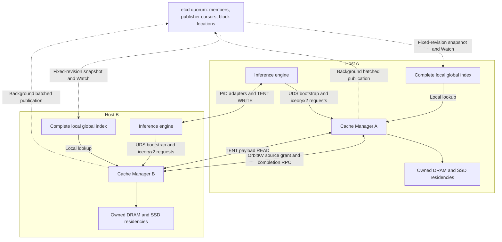

# Distributed cache design

Distributed discovery now uses a complete local global index on every Manager,
with block locations and membership replicated by etcd. Publication and
snapshot/Watch synchronization run in the background. Cold and warm discovery
perform local reads; source grants and completion remain OrbitKV gRPC, and
Mooncake TENT carries the payload. There is one implementation: the sharded
Catalog, fixed placement, TTL hints and directory RPCs have been removed.

This cutover changes metadata availability, not payload durability. Broad RDMA,
physical multi-host failure, large-cluster churn and permanently orphaned
transfer reclamation still require qualification. The new path passes same-host
and H20/A100 TCP serving, restart and forced-source-SSD gates on both engines;
see [shared-cache qualification](shared-cache-qualification.md) for its scope
and the separately labeled historical results.

## Local global index and etcd metadata


```mermaid
flowchart TB
    E[etcd quorum: members, publisher cursors, block locations]
    subgraph A[Host A]
        EA[Inference engine] -->|UDS bootstrap and iceoryx2 requests| MA[Cache Manager A]
        IA[Complete local global index] -->|Local lookup| MA
        MA --> SA[Owned DRAM and SSD residencies]
    end
    subgraph B[Host B]
        EB[Inference engine] -->|UDS bootstrap and iceoryx2 requests| MB[Cache Manager B]
        IB[Complete local global index] -->|Local lookup| MB
        MB --> SB[Owned DRAM and SSD residencies]
    end
    MA -.->|Background batched publication| E
    MB -.->|Background batched publication| E
    E -.->|Fixed-revision snapshot and Watch| IA
    E -.->|Fixed-revision snapshot and Watch| IB
    MA <-->|OrbitKV source grant and completion RPC| MB
    MA <-->|TENT payload READ| MB
    EA <-->|P/D adapters and TENT WRITE| EB
```

The [inspected FlexKV design](https://github.com/taco-project/FlexKV/blob/738ddc141a198b4e20de6c5d1f0128e387f7fdb2/docs/dist_reuse/README_en.md)
uses local global discovery with Redis metadata and Mooncake transfers.
OrbitKV uses etcd revisions and Watch. Every Manager has an index of the same
advertised namespace, with asynchronous visibility; independent local snapshots
are not themselves a consensus system. The etcd deployment supplies metadata
replication. Deploy its members across failure domains to protect against host
loss; three processes on one host only test process/leader failures.

### Ownership and consistency

| Owner | Responsibility |
| --- | --- |
| Engine | HBM, scheduling, page lifetime and legal recovery boundaries |
| Core inventory | Actual sealed DRAM and committed SSD residencies; generation and bounded journal |
| `orbitkv-catalog` | Local global index, applied revision, capacity and cached membership |
| `orbitkv-server/cluster` | etcd leases, fenced publication, snapshot/Watch and shutdown |
| Core planner and peer owners | Route selection, exact source grants, staging, READ and release |
| etcd | Replicated locations and membership; transaction ordering and Watch history |
| Mooncake TENT | Registered-memory transfer and native completion |

Index rows are hints. Only the source can pin actual residency and authorize
addresses. Publish completes locally without waiting for etcd. There is no
transaction across GPU memory, storage and metadata. A stale row can cause a
miss, but cannot authorize a reused address. A missing row is not proof that
no remote copy exists. Loss of a sole payload owner still needs recomputation.

### Identity and publication

All distributed Managers use `/orbitkv/v2/<cluster>/`:

| Key suffix | Value and lifetime |
| --- | --- |
| `format` | Persistent `orbitkv/global-index/v2` schema identifier |
| `epochs/<node>` | Persistent monotonically increasing registration epoch |
| `members/<node>` | Leased endpoint, runtime UUID and epoch |
| `publishers/<uuid>` | Leased operation cursor, inventory sequence and readiness |
| `blocks/<uuid>/<state-digest>/<dram-or-ssd>` | Leased protobuf StateKey, generation, representation and byte estimate |

The digest is domain-separated SHA-256 over the namespace length, namespace
and state hash. It organizes keys, not query placement. StateKeys retain their
existing model/layout/representation compatibility contract. DRAM and SSD are
independent entries; a DRAM eviction preserves committed SSD evidence. Metadata
contains no raw addresses, rkeys, transfer tickets or pins.

Each owner has one monotonic residency sequence. Every publication transaction
compares the exact member record, member lease and previous publisher cursor.
The cursor changes atomically with its puts/deletes. Lost replies reconcile
against that committed cursor before advancing; a delayed old Put cannot pass
the comparison after a newer Delete. Deletes retain the old medium in the
in-memory journal. Batches coalesce repeated changes to the same etcd key.

When the journal no longer covers publication progress, reconciliation:

1. Atomically withdraws publisher readiness and deletes that owner's advertised blocks.
2. Captures sequence S and publishes bounded pages of current residencies.
3. Replays every change from S through a captured end sequence.
4. Commits the final sequence and readiness. Readers hide the owner until then.

Another history gap restarts reconciliation. Local storage and lease renewal
remain independent; no partial publication is declared complete. Uncertain
transactions retry the same fenced operation with bounded exponential delay
while local registration remains valid. Startup lease acquisition tolerates a
balanced connection initially choosing an unavailable etcd endpoint.

### Snapshot and Watch

A Manager reads all metadata pages at one revision R while its index is hidden,
then Watches from R + 1. Normal reconnect resumes the last applied revision;
compaction, invalid metadata or decoder failure resets the index and rebuilds.
The client requests whole transaction Watch responses, not fragmented responses.
Oversized responses are recovered through paginated snapshots. A budget overflow
withdraws the entire view instead of silently dropping entries from a supposedly
complete index. Increase capacity or reduce advertised state before it can recover.

Membership renewal runs separately from publication and Watch. Admission uses
half the acknowledged lease TTL, measured from request send time. Expired or
fenced runtimes cannot revive; restart for a new UUID. Own-record replacement,
removal or coordinator identity change fences remote work. Local DRAM/SSD remains
usable. Metadata expiry never proves that a native payload transfer has drained.

### Request path and bounded work

1. Read local DRAM/SSD evidence and the local global index.
2. Retain up to four remote candidates **per medium**, preserving SSD alternatives.
3. Select a compatible route and ask its source to validate UUID and exact residency sequences.
4. Pin the source, execute TENT READ into requester-owned staging, and acknowledge release after drain.
5. Restore through the existing GPU path; newly resident requester copies publish in the background.

Batch rejection excludes the route from the current request. It does not erase
shared index rows: the response may identify neither the stale key nor a permanent
residency failure. Watch remains the sole owner of shared directory changes.

| Bound | Value |
| --- | --- |
| Owner replay journal | `--inventory-journal-bytes`, 16 MiB by default |
| Complete local index | `--index-budget`, 256 MiB of logical accounting by default |
| Inventory page | At most 1,024 records / 512 KiB |
| Publication transaction | At most 48 block operations plus its cursor; bounded bytes |
| Encoded block record | At most 128 KiB |
| Fixed-revision etcd page | 128 records |
| Membership | At most 4,096 members; 1 KiB per member record |
| Source authorization | Existing 128-key / 64 KiB demand segments and bounded sessions |

Index accounting includes conservative entry overhead, not a process RSS cap.
Every Manager pays memory and update CPU for the whole advertised namespace.
No cluster-size or sustainable-churn SLO is established yet.

### Synchronization and observability

`POST /cache/sync` waits for submitted saves and returns `published_revision`:
the etcd revision committing the captured local inventory. It does **not** wait
for other Managers. `GET /cache/metadata` reports index revision, accounted bytes,
registration validity, index availability, local inventory sequence and publisher
sequence/revision/readiness. Standalone Managers return JSON `null`.

For a controlled cross-Manager barrier, capture the source's published revision
and wait until the requester has an available index at or above it. The shared
cache qualification driver performs this barrier; ordinary requests remain
asynchronous and issue no directory query. A barrier does not retain payloads
against subsequent source eviction. See [metrics](metrics.md).

### Residency, proximity and access paths

The target model uses three independent dimensions: physical medium
(`HBM`, `DRAM`, `SSD`), owner/resource location, and an executable access path.
Local or peer proximity is derived relative to the consumer and its device.
Remote is not a fourth medium with a fixed priority after local SSD. GDS,
io_uring and Mooncake TE describe movement; GPU/host staging is temporary
workspace unless explicitly admitted as a retained cache replica.

| Residence | Owner and discovery contract | Access to a local consumer |
| --- | --- | --- |
| Engine HBM | Engine owns pages and export lifetimes; advertise only committed, exportable state with bounded metadata traffic | Existing local state or, later, authorized peer GPU transfer |
| Manager DRAM | Manager owns sealed retained objects and registered export memory | Local CUDA copy or peer TE transfer, followed by any decode/restore |
| Manager SSD | Manager publishes only complete writes and keeps extent generations independent of DRAM residency | Local io_uring/cuFile; peer owner prepares its own bytes before TE export |
| Shared/mounted storage, later | Storage authority and durability need a separate deployment contract | Qualified filesystem/NVMe-oF path; not automatically a peer Manager replica |

Each discoverable replica needs a residence identity within its owner, identifying
the medium and storage/engine resource where needed. Carry compatible state and
representation evidence, byte size and a residency generation. HBM evidence
also needs the exporting engine instance/rank and lifetime checks. Keep raw
addresses and transfer grants out of long-lived directory records. Current
`ReplicaLocation` carries owner, insertion sequence, medium, representation
family and optional stored bytes.
Keep the existing representation-bound StateKey until a separately qualified
logical-to-physical format mapping exists.

A key may reside in B's DRAM and SSD at the same time. Evicting its DRAM copy
must remove only that residence, leaving the SSD candidate discoverable. Source
SSD residency does not imply an immediately readable TE memory range: authorize
and lease the extent, acquire bounded staging credit, prepare locally, then
export the prepared memory. Return pending, backpressure or missing explicitly.
Use existing transfer lifetime owners; do not add a recursively fetching
remote cache or a second copy of the SSD storage index.

The source-side executor now implements this sequence for io_uring host staging.
It reserves a ticket session and the allocator-rounded staging footprint before
allocation. The detached SSD batch owns both exact extent leases and a two-phase
reservation until every read drains. Successful materialization replaces the
estimate with deduplicated actual allocation bytes and publishes the existing
transfer grant only after handing the result to the authorization owner.
Release-before-completion fences publication without freeing in-flight memory;
allocation, partial-read, queue and cancelled-receiver paths roll back. Requester
plans bind every segment to either peer DRAM or peer SSD and never mix media;
ordinary two-host TCP recovery is qualified; mixed-load performance,
source-staging cancellation and RDMA remain separate gates.

Restoring a peer replica creates destination state; retaining it in destination
DRAM or SSD is a separate admission decision. Copies may coexist and expire
independently, with no mandatory demotion chain or implied minimum replica count.
Prepared query buffers and P/D destinations do not become shared cache entries
merely because a transfer finished. HBM remains engine-managed; a future
dedicated GPU cache pool would require its own explicit capacity reservation.

Discover bounded candidates, then compare local DRAM, local SSD and available
peer residences by the cost of reaching the same required state. Use cached
evidence first, so considering peers does not require a full-cluster lookup or
payload read. Follow the [route eligibility contract](state-planning.md#candidate-routes-and-eligibility);
each additional residence/path needs its own capability and qualification gate.

## Transfer lifetime and resource control

Source preparation validates the requested incarnation, StateKeys, replica
generations, coverage and representation, then pins the exact source objects.
Only the resulting transfer capability exposes TE segments and ranges. Bind it
to the source incarnation, requesting session, operation and byte limits;
duplicate requests, completion and release must be idempotent.

Directory freshness and source pin lifetime are independent. Rejecting an
expired RPC token does not cancel an already submitted RDMA operation. Reuse
requires transport completion or a proven revocation/quiescence mechanism.
If requester loss prevents that proof, quarantine the referenced memory and
keep charging it until the transport is safely drained or revoked. Do not
implement timeout-only reclamation. Validating the pinned TE version's actual
failure/completion semantics is a blocking gate for distributed reliability.

Reuse existing destination query byte ownership through GPU completion. Add
source export limits per peer and globally, with separate staging credits for
SSD reads. Charge and bound both sides; pinning existing DRAM can still prevent
eviction. Cancellation stops unsubmitted work and drains submitted work before
credits or memory are released.

Remote SSD preparation reads only the owner's local storage into registered,
budgeted DRAM. It must not recursively fetch from another peer on a miss. Give
the destination explicit pending/backpressure/missing outcomes; no unbounded
retry while holding destination HBM. Keep its admission separate from retained DRAM exports.

## Planning and useful replication

The [decision owner is the Cache Manager below the engine](state-planning.md#cache-manager-decisions-below-the-engine).
The local global index and bounded peer resource summaries give it a cluster
view without a required request router.
The destination Manager chooses the plan; each source admits its own resources.
Optional Dynamo integration consumes summaries later and does not own cache
discovery or grant transfer authority.

Use the same [cost observations and deployment contracts](state-planning.md#policies-by-deployment-mode)
as local storage planning. Shared-cache DP, P/D handoff and TP/PP consumption
have different completion targets; do not assign one policy to every operation
on a physical node. The current narrow selector first requires equal coverage
and the same peer medium, then may choose an owner using fresh, incarnation-
scoped complete HostReady estimates. Cross-medium and local/peer selection remain
target design rather than inferred from these samples.

Represent a request as demand for a legal recovery boundary, with known bytes,
query ownership and later engine-supplied priority/first-use hints. Estimate
finish time from observed discovery, authorization, source preparation,
transfer queueing, Mooncake TE service and destination decode/H2D
cost. Compare legal restore/recompute options using critical-path accounting;
local SSD is not always cheaper than peer DRAM. The engine retains execution
admission and HBM allocation decisions.

Source-release acknowledgement and retained source byte-seconds affect resource
availability without necessarily delaying engine readiness. Bound sender and
receiver reservations together; never turn a wait timeout or a stale cost hint
into permission to reuse an in-flight buffer. Measurements carry peer
incarnation and transport context. Cached discovery does not replace source
authorization, and etcd is not on the per-read decision path.

Demand-driven remote reads may create local replicas. Admission uses reuse,
saved recomputation/transfer work and memory pressure; one remote hit need not
remain cached indefinitely. Hot-prefix replication and early DRAM warming follow
measured demand and explicit byte budgets. Directory redundancy is only a hint
for eviction unless a separate data-replication protocol guarantees coverage.

A later KV-aware router consumes summarized cache and engine events. It selects
a worker; the selected Manager still validates the recovery and transfer plan.
No router service is required for this distributed cache milestone.

## Availability and capacity contract

| Failure | Required behavior |
| --- | --- |
| One Manager/index fails | Other Managers retain their indexes; failed-owner payloads require another copy or recomputation |
| Source eviction/restart | Reject stale generations/incarnations; use another indexed owner or recompute |
| Watch disconnect/compaction | Resume retained history or rebuild; expose coverage and lag |
| One etcd member fails, quorum survives | Recover publication and Watches through the surviving service; qualify leader change |
| etcd quorum lost | Metadata stops; existing transfers drain; new remote admission stops when registration validity expires; local cache continues |
| etcd restored/new cluster | Fence the old coordination generation; reconcile live inventories before claiming complete coverage |
| Index/publisher budget exhausted | Bounded backpressure/resynchronization; no silent truncation of a complete view |
| Requester dies during transfer | Retain source memory until native drain or proven revocation, independently of metadata expiry |

Every Manager pays memory and update CPU proportional to global advertised
metadata and receives the update stream. etcd pays storage and replication costs
for block updates. Batching reduces RPC overhead, not those underlying writes.
This simplicity/lookup-latency tradeoff needs a measured scale limit.

[etcd limits](https://etcd.io/docs/v3.6/dev-guide/limit/) include a default 1.5 MiB
request limit and 2 GiB backend quota, with 8 GiB suggested for ordinary maximum
deployments. Measure actual encoded metadata, churn, lease deletion bursts,
compaction, defragmentation and quota exhaustion. A higher quota does not prove
sustainable throughput, and the quota is not KV-payload capacity.

## Qualification and remaining work

Run the [native and process gates](p2p.md#validation) sequentially with builds.
The new native gates use real etcd for fixed-revision bootstrap, compaction,
restart, duplicate identity, lost publication replies, delayed retry fencing,
leader loss and quorum loss. GPU gates use the same publisher/Watch path before
TENT READ and raw/encoded restoration; they do not emulate a directory.

Before production-scale claims, measure cold/warm TTFT, restore tail latency,
throughput, remote hit rate, index memory/update CPU, publication latency,
etcd database growth, Watch lag, compaction and quota exhaustion. Requalify
physical two-host serving on the new revision. RDMA, multi-rank deployment,
long-running churn and partition/rejoin remain separate gates. Permanently lost
requester reclamation still needs transport revocation proof. Current SSD files
are truncated on Manager restart; metadata redundancy does not change that.

## Quota and index-budget recovery

The S2.1 metadata gate uses real etcd and the production publisher, Watch,
membership and complete-index owners. It requires no GPU payload allocation.
After leader loss, an existing balanced channel can still route bootstrap
requests to the stopped endpoint. Startup now retries transient format/registration
requests under a finite budget while preserving the lease and runtime incarnation.
Permanent metadata/identity conflicts fail immediately. Retrying a committed
registration returns the same epoch only for the exact owner and lease; a new
incarnation or lease cannot take over a live node. A runtime whose conservative
registration deadline expires still has to restart with a new incarnation.

A 2 MiB etcd backend quota is exhausted with actual writes. The publication cursor
must remain unchanged while NOSPACE is active; after deleting the filler,
compacting, defragmenting and disarming each affected member's alarm, the pending
transaction must converge without restoring a retired replica. Quota checks use
committed backend size, so a rapid burst alone is not evidence that quota was hit.

The 2 KiB index case deliberately overflows with 24 residency records. Every
lookup stays empty while coverage is incomplete; lease renewal continues for
longer than the initial conservative registration window. Evicting 23 records
allows a fresh complete snapshot and restores the single surviving candidate.
These bounds are fault triggers, not production sizing recommendations.

Build Manager, extension, TENT and tests before starting services. Freeze the
printed test executable and native artifacts outside the checkout, then run:

```bash
ETCD_BIN=/path/to/frozen/etcd \
ORBITKV_METADATA_ARTIFACT_DIR=/var/tmp/orbitkv-evidence/metadata-publish \
  /path/to/frozen/server-tests cluster::publish::tests \
  --ignored --nocapture --test-threads=1

ETCD_BIN=/path/to/frozen/etcd \
ORBITKV_METADATA_ARTIFACT_DIR=/var/tmp/orbitkv-evidence/metadata-membership \
  /path/to/frozen/server-tests cluster::tests::etcd \
  --ignored --nocapture --test-threads=1
```

Use `cargo test --release -p orbitkv-server --no-default-features --features
cuda-13,mooncake --lib --no-run` during the build phase to obtain the executable.
`ORBITKV_METADATA_ARTIFACT_DIR` preserves each owned etcd data directory, logs and
fault summaries on success or failure and rejects a checkout-local destination.
Without it, the test helper uses ordinary temporary directories.

The current run evidence is under
`/root/orbitkv-artifacts/s2-s51-20260929/s2-1/`: `frozen-v5-manifest.json` identifies
the exact binaries, `publish-after-bootstrap-fix.log` and `membership-final.log` retain complete
gate output, and the `publish-after-bootstrap-fix/` / `membership-after-fix/` trees retain etcd data
and fault summaries. Failed quota setup attempts and their frozen binaries are
retained alongside the final run. No performance advantage is claimed.

This is metadata-owner qualification with synthetic records and same-host etcd
process faults. GPU compute has not passed in this container; storage-originated
journal churn and local-cache availability during metadata loss remain separate
gates. A three-process quorum is not three independent host failure domains.
Quota recovery must preserve registration/incarnation and cursor fencing; never
remove those checks to make a recovered publisher appear healthy.
