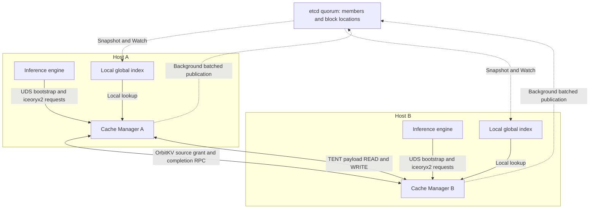

# Distributed cache design

**Implemented runtime, before the planned index cutover:** D0 inventory recovery and the D1 candidate index, source validation,
leased membership and embedded catalog are implemented. Managers host 16 fixed
logical shards, each with one directory copy, and route through cached member
information. The standalone MetaServer has been removed. The local global-index replacement below is not implemented; broad failure
qualification also remains open. Scoped two-host
TCP serving passes the [recorded gates](shared-cache-qualification.md); RDMA
remains unqualified. Source Managers can materialize an exact SSD generation into
bounded pinned DRAM; Mooncake TE carries all remote KV bytes.

Owners retain bounded journals and recover each shard independently using
paginated snapshots and a complete delta interval. Catalog epochs and member
incarnations trigger repair even for idle caches. See the
[implemented protocol and limits](../crates/orbitkv-catalog/README.md).
Upgrade all Managers together; there is no old-protocol fallback.

Implemented discovery behavior:

- Each row carries the exact StateKey and up to four candidates, qualified by
  owner endpoint, runtime UUID, insertion sequence, medium, representation and
  known stored bytes. Rows remain aligned with
  the request across gaps; empty rows do not prove global absence.
- An owner advertises live DRAM ahead of its committed SSD copy. SSD commit,
  DRAM eviction, ring overwrite and corruption update the same ordered stream;
  requesters accept DRAM and SSD evidence but still reject unknown/HBM media.
  Peer SSD is a fixed-priority fallback behind peer DRAM and eligible local SSD.
  Ordinary two-host TCP recovery is qualified; measured selection, cancellation
  during source staging and RDMA retain separate gates.
- Managers retain positive hints in an LRU index with a 16 MiB logical byte
  budget and a five-second TTL. Reads do not extend the TTL. Misses are not
  cached. A failed directory lookup preserves any already-known prefix.
  Concurrent misses recheck after an in-flight lookup; warm hits do not
  wait for the directory. Empty results cause waiting callers to look up again;
  this does not provide negative-result coalescing or a subscription stream.
- Cold lookups use batches of at most 128 keys and 64 KiB of namespace/hash
  bytes. Each cold query has a three-second total RPC budget after coalescing. The source-channel LRU retains
  at most 64 clients. These are initial fixed limits, not calibrated SLOs.
- The requester selects the longest contiguous span, using endpoint/incarnation
  ordering to break ties. Source authorization checks the runtime UUID and all
  insertion sequences before pinning under the cache lock. Rejection grants no
  addresses and creates no transfer session.
- A source rejection removes only the attempted candidate versions from the
  index. Planning can try existing alternatives at most twice per fetch; it
  issues no new directory RPC during these retries. Another query can refresh
  missing evidence. Payload-transfer failures stop the prefix without retries.
- A blocking READ owns its destination buffers and source-release guard until
  it returns, even if the asynchronous caller is cancelled. Source expiry now
  retains its pins and charges whole allocations against `--transfer-budget`
  (default: half the pool), with at most 1024 sessions. Completion release uses
  bounded idempotent retries. Reclaiming a permanently orphaned source hold
  still requires transport revocation; partition handling remains unqualified.

Implemented membership behavior (required on every distributed Manager):

- `--etcd-endpoints`, `--cluster-name`, `--node-id` and `--membership-ttl-secs`
  configure registration. A transaction requires an absent live Node ID,
  increments its persistent epoch and writes a leased record containing the
  peer endpoint and runtime UUID. The directory inventory uses that same UUID.
- Member snapshots use pages of 128 records at one revision, followed by Watch
  from the next revision. Reconnect, compaction, malformed records or overflow
  invalidate the view and trigger a fresh snapshot. The limit is 4,096 members,
  with at most 1 KiB of JSON per member. etcd stores no block hashes or payloads.
- Keepalives run separately from snapshot/Watch repair. Local registration is
  valid until half the acknowledged TTL, measured from sending the request.
  Delayed responses cannot revive an expired or explicitly fenced runtime.
  Restart the Manager to obtain a new incarnation after registration expires.
- Source admission and requester candidate selection consult only this local
  view. An incomplete view or expired registration disables new remote work;
  local DRAM/SSD operations continue. Existing transfer holds can still be
  released. Membership expiry does not forcibly free transfer buffers.
- Graceful shutdown revokes the lease. Abrupt shutdown stops renewal and lets
  etcd expire it. An observed own-record removal, changed epoch/lease binding,
  or coordinator cluster change
  fences the runtime. Watch evidence is a hint, not an authorization or transport
  revocation guarantee; bounded-clock assumptions and multi-host failure behavior
  still need qualification.

Implemented placement behavior:

- `--catalog-nodes` declares 1–16 stable Node IDs. etcd atomically installs the
  canonical host set at `/orbitkv/v1/<cluster>/placement`; mismatched joins fail.
- Domain-separated SHA-256 maps StateKeys to 16 shards; equal-weight rendezvous
  hashing chooses one configured host per shard. Temporary liveness changes do
  not alter assignments. Catalog endpoints and UUIDs come from cached membership.
- RPCs carry the shard, placement fingerprint and destination incarnation.
  Receivers reject wrong destinations, unregistered publishers and cross-shard keys.
- Every owner has independently ordered shard streams. Journals total 16 MiB;
  each catalog host defaults to 256 MiB of accounted index and retry storage
  across its assigned shards. Missing catalogs do not block local Publish.
- Configuration is immutable for this stage. Observed changes fence members;
  the selected D2 design replaces this placement mechanism. Missing hosts leave
  their shards unavailable until they return and owners rebuild the index.

The directory is distributed across Managers but each shard still has one copy;
this is not HA. [Catalog availability](p2p.md#catalog-availability-and-etcd)
distinguishes optional remote-cache discovery continuity from source correctness
and etcd availability. The initial etcd connector exposes HTTP endpoints, without
credential/TLS options. See [deployment](p2p.md#leased-manager-membership).

## Selected target: local global index and etcd metadata

**Selected on 2026-09-29; not yet implemented.** Every Manager maintains a complete
local index of advertised block locations in its configured OrbitKV cluster.
etcd stores those locations as well as membership and incarnations. Background
publication and revisioned snapshot/Watch synchronization replace Manager-hosted
Catalog shards and request-time directory RPCs. The target has no sharded-catalog
fallback on a cold lookup.

This supersedes replicated Catalog placement, migration and subscriptions, and
the proposed OrbitKV metadata message bus inside Mooncake TENT. Source grants
and completions remain bounded batched OrbitKV RPCs; TENT remains the registered
memory data plane. See the [control boundary](peer-control.md).

### Reference and consistency contract

The inspected [FlexKV design](https://github.com/taco-project/FlexKV/blob/738ddc141a198b4e20de6c5d1f0128e387f7fdb2/docs/dist_reuse/README_en.md)
uses a local global-index snapshot, Redis metadata and Mooncake transfers.
Its [metadata channel](https://github.com/taco-project/FlexKV/blob/738ddc141a198b4e20de6c5d1f0128e387f7fdb2/csrc/dist/redis_meta_channel.cpp)
batches per-block publications; its
[refresh worker](https://github.com/taco-project/FlexKV/blob/738ddc141a198b4e20de6c5d1f0128e387f7fdb2/csrc/dist/distributed_radix_tree.cpp)
periodically rebuilds the view. OrbitKV adopts local global discovery, using
etcd revisions and Watch instead of copying that Redis refresh implementation.
Using Redis alone does not establish coordinator HA.

The index contains candidate evidence for immutable, sealed cache state. Only
the owning Manager can authorize and pin actual source residency. Local Publish
completes independently of background advertisement; remote visibility is
asynchronous. There is no transaction across GPU memory, Manager storage and
etcd. Stale evidence may reduce reuse but cannot authorize a reused address.
Metadata redundancy does not preserve a payload held only by a failed owner.

### Responsibilities and deployment

| Component | Responsibility |
| --- | --- |
| Engine | HBM allocation, scheduling and valid recovery boundaries |
| Manager inventory | Actual local residencies, versions and bounded change journal |
| Manager global index | Complete advertised locations at an applied etcd revision; local discovery |
| Manager planner/source owner | Select routes; authorize, pin, transfer and release exact data |
| etcd cluster | Replicated member/incarnation and block-location metadata; revisions and Watch history |
| Mooncake TENT | Memory registration, payload READ/WRITE and native completion |

```mermaid
flowchart TB
    E[etcd quorum: members and block locations]
    subgraph A[Host A]
        EA[Inference engine] -->|UDS bootstrap and iceoryx2 requests| MA[Cache Manager A]
        IA[Local global index] -->|Local lookup| MA
    end
    subgraph B[Host B]
        EB[Inference engine] -->|UDS bootstrap and iceoryx2 requests| MB[Cache Manager B]
        IB[Local global index] -->|Local lookup| MB
    end
    MA -.->|Background batched publication| E
    MB -.->|Background batched publication| E
    E -.->|Snapshot and Watch| IA
    E -.->|Snapshot and Watch| IB
    MA <-->|OrbitKV source grant and completion RPC| MB
    MA <-->|TENT payload READ and WRITE| MB
```

Standalone mode still needs only one Manager. Distributed mode adds shared etcd
and peer connectivity. Qualify HA with three etcd members across failure domains;
three processes on one machine do not establish host-failure availability.

### Identity and metadata publication

Retain the representation-bound StateKey and complete hybrid recovery contract.
Records identify owner Node ID/incarnation, StateKey, residence, generation,
representation, stored bytes and update sequence. Keep raw addresses, rkeys,
transfer tickets and pins out of etcd. Advertise only sealed DRAM or committed
SSD data. Evicting one residence must preserve another surviving copy.

Use a new versioned metadata prefix, partitioned by owner incarnation for
lifecycle cleanup. This organizes storage keys, not directory query placement.
Records use the owner lease. Every write transaction also checks live member
incarnation and lease binding; an old publisher cannot write as its replacement.
A missing member invalidates its candidates even before all cleanup events arrive.

Drain the existing bounded inventory journal, coalesce repeated changes, and
batch by encoded bytes and transaction operations. Transactional publisher
watermarks must fence delayed retries, uncertain write outcomes and deletion/
recreation. Reconcile lost replies before advancing. An old Put retried after a
newer Delete must not resurrect evidence. Only the owner mutates its records.

Journal overflow requires explicit reconciliation, including obsolete advertised
entries and a complete concurrent-change interval. Bound its memory, work and
retries separately from foreground operations and lease renewal. Local Publish
must remain independent of coordinator latency; incomplete publication remains
observable rather than being declared synchronized.

### Consistent bootstrap and Watch repair

1. Capture revision R; read every metadata and membership page at that revision.
2. Build a staging index within its budget; do not expose partial coverage as
   a complete view.
3. Watch from R + 1. Preserve whole transaction revisions, including fragmented
   responses, before publishing the next applied revision.
4. Reconnect from the last fully applied revision. On compaction, cluster identity
   change or buffer overflow, mark coverage incomplete and take a fresh snapshot.

Old/staging indexes, decoded records and event buffers share a bounded budget.
If both views cannot fit, withdraw distributed-index readiness while rebuilding.
A complete global index cannot silently drop rows like today's LRU hints. If
the complete view itself exceeds capacity, expose that limit and retain local
caching; do not restore a cold Catalog lookup path.

An applied revision is a consistent historical view, not instantaneous freshness.
Track Watch progress, lag and registration validity separately. The
[etcd guarantees](https://etcd.io/docs/v3.6/learning/api_guarantees/) provide ordered,
resumable history subject to compaction; Watch is not a linearizable read. Source
checks remain mandatory even when the index is ready.

### Request path

1. Inspect local storage and the local global index. No foreground etcd call,
   Catalog RPC or cluster broadcast occurs.
2. Select candidate spans with existing layout/cost/resource checks. A local
   index miss becomes a miss or recomputation; background repair is independent.
3. Batch source grants. The source validates incarnation and exact residency,
   pins it and returns transfer capabilities. Try another indexed candidate
   within the same deadline if rejected.
4. TENT READ and local restore fill engine destinations. Release source holds
   only after native drain. P/D still uses WRITE under its handoff contract.

Once synchronized, both warm and previously unqueried keys avoid directory
network latency. Source grants and payload copies remain; an offloaded hit is
not equivalent to an engine-resident HBM hit.

### Residency, proximity and access paths

The target model uses three independent dimensions: physical medium
(`HBM`, `DRAM`, `SSD`), owner/resource location, and an executable access path.
Local or peer proximity is derived relative to the consumer and its device.
Remote is not a fourth medium with a fixed priority after local SSD. GDS,
io_uring and Mooncake TE describe movement; GPU/host staging is temporary
workspace unless explicitly admitted as a retained cache replica.

| Residence | Owner and discovery contract | Access to a local consumer |
| --- | --- | --- |
| Engine HBM | Engine owns pages and export lifetimes; advertise only committed, exportable state with bounded metadata traffic | Existing local state or, later, authorized peer GPU transfer |
| Manager DRAM | Manager owns sealed retained objects and registered export memory | Local CUDA copy or peer TE transfer, followed by any decode/restore |
| Manager SSD | Manager publishes only complete writes and keeps extent generations independent of DRAM residency | Local io_uring/cuFile; peer owner prepares its own bytes before TE export |
| Shared/mounted storage, later | Storage authority and durability need a separate deployment contract | Qualified filesystem/NVMe-oF path; not automatically a peer Manager replica |

Each discoverable replica needs a residence identity within its owner, identifying
the medium and storage/engine resource where needed. Carry compatible state and
representation evidence, byte size and a residency generation. HBM evidence
also needs the exporting engine instance/rank and lifetime checks. Keep raw
addresses and transfer grants out of long-lived directory records. Current
`ReplicaLocation` carries owner, insertion sequence, medium, representation
family and optional stored bytes.
Keep the existing representation-bound StateKey until a separately qualified
logical-to-physical format mapping exists.

A key may reside in B's DRAM and SSD at the same time. Evicting its DRAM copy
must remove only that residence, leaving the SSD candidate discoverable. Source
SSD residency does not imply an immediately readable TE memory range: authorize
and lease the extent, acquire bounded staging credit, prepare locally, then
export the prepared memory. Return pending, backpressure or missing explicitly.
Use existing transfer lifetime owners; do not add a recursively fetching
remote cache or a second copy of the SSD storage index.

The source-side executor now implements this sequence for io_uring host staging.
It reserves a ticket session and the allocator-rounded staging footprint before
allocation. The detached SSD batch owns both exact extent leases and a two-phase
reservation until every read drains. Successful materialization replaces the
estimate with deduplicated actual allocation bytes and publishes the existing
transfer grant only after handing the result to the authorization owner.
Release-before-completion fences publication without freeing in-flight memory;
allocation, partial-read, queue and cancelled-receiver paths roll back. Requester
plans bind every segment to either peer DRAM or peer SSD and never mix media;
ordinary two-host TCP recovery is qualified; mixed-load performance,
source-staging cancellation and RDMA remain separate gates.

Restoring a peer replica creates destination state; retaining it in destination
DRAM or SSD is a separate admission decision. Copies may coexist and expire
independently, with no mandatory demotion chain or implied minimum replica count.
Prepared query buffers and P/D destinations do not become shared cache entries
merely because a transfer finished. HBM remains engine-managed; a future
dedicated GPU cache pool would require its own explicit capacity reservation.

Discover bounded candidates, then compare local DRAM, local SSD and available
peer residences by the cost of reaching the same required state. Use cached
evidence first, so considering peers does not require a full-cluster lookup or
payload read. Follow the [route eligibility contract](state-planning.md#candidate-routes-and-eligibility);
each additional residence/path needs its own capability and qualification gate.

## Transfer lifetime and resource control

Source preparation validates the requested incarnation, StateKeys, replica
generations, coverage and representation, then pins the exact source objects.
Only the resulting transfer capability exposes TE segments and ranges. Bind it
to the source incarnation, requesting session, operation and byte limits;
duplicate requests, completion and release must be idempotent.

Directory freshness and source pin lifetime are independent. Rejecting an
expired RPC token does not cancel an already submitted RDMA operation. Reuse
requires transport completion or a proven revocation/quiescence mechanism.
If requester loss prevents that proof, quarantine the referenced memory and
keep charging it until the transport is safely drained or revoked. Do not
implement timeout-only reclamation. Validating the pinned TE version's actual
failure/completion semantics is a blocking gate for distributed reliability.

Reuse existing destination query byte ownership through GPU completion. Add
source export limits per peer and globally, with separate staging credits for
SSD reads. Charge and bound both sides; pinning existing DRAM can still prevent
eviction. Cancellation stops unsubmitted work and drains submitted work before
credits or memory are released.

Remote SSD preparation reads only the owner's local storage into registered,
budgeted DRAM. It must not recursively fetch from another peer on a miss. Give
the destination explicit pending/backpressure/missing outcomes; no unbounded
retry while holding destination HBM. Keep its admission separate from retained DRAM exports.

## Planning and useful replication

The [decision owner is the Cache Manager below the engine](state-planning.md#cache-manager-decisions-below-the-engine).
The local global index and bounded peer resource summaries give it a cluster
view without a required request router.
The destination Manager chooses the plan; each source admits its own resources.
Optional Dynamo integration consumes summaries later and does not own cache
discovery or grant transfer authority.

Use the same [cost observations and deployment contracts](state-planning.md#policies-by-deployment-mode)
as local storage planning. Shared-cache DP, P/D handoff and TP/PP consumption
have different completion targets; do not assign one policy to every operation
on a physical node. The current narrow selector first requires equal coverage
and the same peer medium, then may choose an owner using fresh, incarnation-
scoped complete HostReady estimates. Cross-medium and local/peer selection remain
target design rather than inferred from these samples.

Represent a request as demand for a legal recovery boundary, with known bytes,
query ownership and later engine-supplied priority/first-use hints. Estimate
finish time from observed discovery, authorization, source preparation,
transfer queueing, Mooncake TE service and destination decode/H2D
cost. Compare legal restore/recompute options using critical-path accounting;
local SSD is not always cheaper than peer DRAM. The engine retains execution
admission and HBM allocation decisions.

Source-release acknowledgement and retained source byte-seconds affect resource
availability without necessarily delaying engine readiness. Bound sender and
receiver reservations together; never turn a wait timeout or a stale cost hint
into permission to reuse an in-flight buffer. Measurements carry peer
incarnation and transport context. Cached discovery does not replace source
authorization, and etcd is not on the per-read decision path.

Demand-driven remote reads may create local replicas. Admission uses reuse,
saved recomputation/transfer work and memory pressure; one remote hit need not
remain cached indefinitely. Hot-prefix replication and early DRAM warming follow
measured demand and explicit byte budgets. Directory redundancy is only a hint
for eviction unless a separate data-replication protocol guarantees coverage.

A later KV-aware router consumes summarized cache and engine events. It selects
a worker; the selected Manager still validates the recovery and transfer plan.
No router service is required for this distributed cache milestone.

## Availability and capacity contract

| Failure | Required behavior |
| --- | --- |
| One Manager/index fails | Other Managers retain their indexes; failed-owner payloads require another copy or recomputation |
| Source eviction/restart | Reject stale generations/incarnations; use another indexed owner or recompute |
| Watch disconnect/compaction | Resume retained history or rebuild; expose coverage and lag |
| One etcd member fails, quorum survives | Recover publication and Watches through the surviving service; qualify leader change |
| etcd quorum lost | Metadata stops; existing transfers drain; new remote admission stops when registration validity expires; local cache continues |
| etcd restored/new cluster | Fence the old coordination generation; reconcile live inventories before claiming complete coverage |
| Index/publisher budget exhausted | Bounded backpressure/resynchronization; no silent truncation of a complete view |
| Requester dies during transfer | Retain source memory until native drain or proven revocation, independently of metadata expiry |

Every Manager pays memory and update CPU proportional to global advertised
metadata and receives the update stream. etcd pays storage and replication costs
for block updates. Batching reduces RPC overhead, not those underlying writes.
This simplicity/lookup-latency tradeoff needs a measured scale limit.

[etcd limits](https://etcd.io/docs/v3.6/dev-guide/limit/) include a default 1.5 MiB
request limit and 2 GiB backend quota, with 8 GiB suggested for ordinary maximum
deployments. Measure actual encoded metadata, churn, lease deletion bursts,
compaction, defragmentation and quota exhaustion. A higher quota does not prove
sustainable throughput, and the quota is not KV-payload capacity.

## Code ownership and implementation order

Keep existing Rust owners: `orbitkv-catalog` owns the local index, revision
application and membership evidence; `orbitkv-server/cluster` owns etcd clients,
leases, publication and Watch orchestration. Core storage owns residencies and
the journal; peer code owns selection, grants, staging and release. The transfer
crate owns TENT registration/completion. Do not add a generic metadata transport
facade or move engine P/D state machines into TENT.

| Step | Deliverable | Gate and deletion |
| --- | --- | --- |
| D0/D1, implemented | Owner recovery, source validation, sharded Catalog, candidate hints and transfer ownership | Scoped two-host TCP evidence is the baseline; runtime is unchanged by this design |
| D2 implementation | Fenced etcd publication, fixed-revision snapshot/Watch and complete local index wired into discovery | Lost replies, delete/recreate, compaction, journal overflow, memory limits and restart |
| D2 cutover | One local discovery and background synchronization path | Remove fixed placement, `--catalog-nodes`, Catalog serving/lookup RPCs, remote lookup coalescing and TTL hint cache together; no legacy fallback |
| D2 qualification | Three-member etcd and two-host serving with both engines | Manager/leader failure, quorum loss, restore/rejoin, bounded resources, output controls and zero foreground discovery RPCs |
| D3, separate | Calibrated local/peer selection and qualified remote SSD routes | Source admission and transfer lifetimes; no recursive peer fetches |

Permanent-requester-loss reclamation still needs native revocation proof. The
index cannot provide it. Current SSD files are truncated on Manager restart;
durable payload recovery remains separate.

## Measurements and acceptance

Compare current sharded Catalog and new local global-index revisions on matched
cold/warm, churn and failure workloads. Record:

- TTFT/restore P50/P95/P99, throughput, remote hit rate and recomputation;
- foreground discovery separately from grants/completions and background etcd
  writes, keepalives, snapshots and Watches;
- index resident/staging bytes, update CPU, encoded record bytes, Watch lag,
  etcd database size, write latency and quota headroom;
- bootstrap/rebuild duration and incomplete coverage after failure;
- source pins, destination staging and outstanding completions through failure.

After synchronization, both warm and cold-key discovery must issue zero network
requests. Include background metadata and source authorization in end-to-end
claims. Establish supported cluster-size and churn limits before declaring this
design production qualified.
