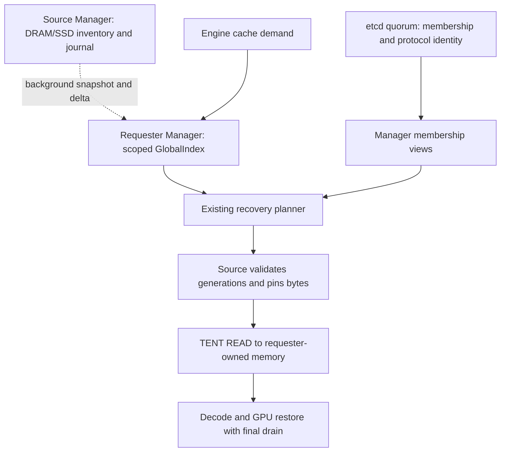

# Distributed inventory and recovery design

**Status: S2.10 same-host correctness implementation; performance qualification
partial.** S2.8 and S2.9 are independently accepted; the 16-owner visibility and
5% isolation gates fail and the cross-host/serving stage remains open. Nothing in
this document alone establishes new runtime, deployment or performance support. The
[completion plan](completion-plan.md) is the only execution queue and acceptance
ledger. This document specifies contracts consumed by S2, S3, S4, S6 and S7; it
does not create a second roadmap.

The frozen comparison baseline is S2.7 at `93abd676`. Preserve its binaries,
results and failed-run evidence for rollback and A/B qualification. Inspect
current code again before implementing any later item described here as missing.

## Outcome and design contributions

Keep discovery local while making the cost of etcd independent of block churn.
Each Manager owns its data, publishes bounded inventory streams, keeps local
candidate indexes for explicitly subscribed namespaces, and selects a legal
recovery route using observed time to usable state. Source authorization and
physical completion remain the authorities for memory access and reclamation.

Four concrete contributions are worth implementing and evaluating together:

| Mechanism | Concrete contribution | Required evidence |
| --- | --- | --- |
| Versioned inventory cuts | Coalesce mutations without losing delete/reinsert generations; make snapshot and incremental coverage explicit without a global block revision | Exact final-state oracle, adversarial replay and false-absence tests |
| Scoped local discovery | Local queries carry a coverage state; only relevant exact storage namespaces are replicated, without a directory RPC on misses | Same-scope hit equivalence, lower fanout bytes and bounded bootstrap |
| Recovery-aware selection | Compare complete, semantically legal recovery alternatives at the same completion target, including uncertainty and interference | Fixed-policy versus executed-policy serving results, not shadow scores alone |
| Separate progress and ownership | Metadata ACKs, receive credits, source grants and GPU drain have distinct lifetimes | Cancellation/crash tests plus bounded resource retention under contention |

These are engineering contributions to OrbitKV, not claims of research priority.
Local indexes, owner authority, batching, flow control and snapshots are established
ideas. The proposed differentiation is their consumed combination with OrbitKV's
state requirements and actual transfer ownership. Claim a benefit only after the
ablations below establish it.

## References and decisions

The reviewed FlexKV revision is
[`738ddc141a198b4e20de6c5d1f0128e387f7fdb2`](https://github.com/taco-project/FlexKV/commit/738ddc141a198b4e20de6c5d1f0128e387f7fdb2).
Its [distributed radix tree](https://github.com/taco-project/FlexKV/blob/738ddc141a198b4e20de6c5d1f0128e387f7fdb2/csrc/dist/distributed_radix_tree.cpp)
periodically rebuilds a local reference tree from other nodes' Redis metadata.
Its [metadata channel](https://github.com/taco-project/FlexKV/blob/738ddc141a198b4e20de6c5d1f0128e387f7fdb2/csrc/dist/redis_meta_channel.cpp)
pipelines block publication and lease updates. Borrow local discovery and batched
background work; do not assume periodic rebuilding or changing databases removes
the cost of distributing all records to all readers.

OrbitKV pins Mooncake at `719735896c86b56fabec6cf3e825fb2ea640597a`.
[Store](https://github.com/kvcache-ai/Mooncake/blob/719735896c86b56fabec6cf3e825fb2ea640597a/docs/source/design/store/mooncake-store.md)
uses a Master for object metadata and allocation, with peer payload movement.
Its [optional HA OpLog](https://github.com/kvcache-ai/Mooncake/blob/719735896c86b56fabec6cf3e825fb2ea640597a/docs/source/deployment/mooncake-store-deployment-guide.md#high-availability-ha)
can persist ordered batches in etcd. Transfer Engine metadata, Store object
metadata and Master HA are distinct responsibilities.
[RFC #1209](https://github.com/kvcache-ai/Mooncake/issues/1209) proposes colocating
data and authoritative metadata at clients while retaining an eventually
consistent routing Master. It was automatically closed after inactivity; it is
a proposal, not evidence of shipped P2P Store V3 support. Borrow owner authority;
retain OrbitKV's local discovery instead of adding a routing Master.

[etcd Watch guarantees](https://etcd.io/docs/v3.5/learning/api_guarantees/#watch-apis)
include ordered, resumable history and revision completeness. Removing block
Watches transfers those responsibilities to the inventory protocol. It does not
make them optional. Watch freshness is not a linearizable read guarantee.

## Present implementation and intended changes

| Responsibility | Present implementation | Intended change |
| --- | --- | --- |
| Local residency | `ResidencyInventory`, DRAM/SSD owners, bounded ordered journal | Preserve one authority and journal; add bounded coalesced reads and filtered scans |
| Identity | Namespace binds model, computation and representation; group hash includes group zero | Preserve exact bytes and generation semantics |
| etcd | Members, epochs, publisher cursors and leased block records | Members, epochs, protocol identity and infrequent configuration only |
| Discovery | Complete local `GlobalIndex` from etcd snapshot/Watch | Same owner, fed by per-source inventory streams with explicit coverage |
| Peer access | Source authorization, bounded pins/staging, TENT READ, terminal release | Preserve authority; extend planning after S3 and S6 gates |
| Execution | One READ overlaps authorization for the following segment | Preserve existing overlap; optimize only measured critical-path work |
| Selection | Bounded candidates; experimental cost choices among selected alternatives | Complete-route comparisons, bounded replanning and physical admission |
| Transport | TENT P2P metadata handshake already used | No block metadata added to Mooncake; no new payload backend |

The target has three planes. Solid edges below reuse existing responsibilities;
dotted edges are proposed inventory synchronization. The diagram describes the
target architecture, not an implemented deployment profile.



No standalone metadata server, directory lookup RPC, Python coordination loop,
generic region service or mandatory DHT is introduced. A background streaming
RPC is an inventory replication boundary, not an on-demand key lookup service.
Engine HBM export, durable SSD restart, active WRITE replication, cross-engine
byte interchangeability and a new request router are outside this delivery.

## Invariants

1. A local save completes against local storage semantics. Metadata transport
   cannot block source eviction or become a synchronous requirement for saving.
2. An index row is evidence, never a pointer or transfer grant. Only the source
   validates the current owner and exact residency sequence and pins resources.
3. `(incarnation, StateKey, medium, residency_sequence)` distinguishes residence
   generations. Equal content after eviction does not reuse an old generation.
4. Each stream advances through a contiguous source journal interval. Filtering
   and coalescing can remove records, but cannot remove interval coverage.
5. A snapshot becomes visible only after its entire scan and replay interval
   complete. Incomplete coverage cannot prove absence.
6. A scope view is a vector of owner watermarks, not a globally atomic snapshot.
   It cannot prove hybrid state completeness without the compiled demand checks.
7. Membership expiry irrevocably fences the runtime. Healing requires a new
   incarnation; inventory traffic never renews membership.
8. Metadata ACK, transfer admission, host readiness, GPU readiness and physical
   drain are different events. None substitutes for another's release proof.
9. All queues, frames, retained journal history, staging indexes, source pins and
   speculative preparation have explicit byte/count bounds and terminal owners.
10. Standalone and local-cache service remain usable when distributed metadata
    is unavailable. No expired incarnation is authorized to maintain availability.

The initial network profile inherits the existing trusted-cluster assumption.
Matching a supplied UUID to membership is fencing, not cryptographic peer
authentication. Do not advertise hostile multi-tenant isolation from namespace
filtering. Preserve existing deployment access controls and label that limit.

## Membership and etcd layout

Keep the existing coordination prefix `/orbitkv/v2/<cluster>/` as the common
format guard for old and new binaries. The `v2` in this historical path does not
mean that both wire formats are supported. Change its `format` value at an
offline cutover to a canonical record containing:

```text
protocol = orbitkv/inventory-stream/v4
cluster_uuid = randomly generated persistent UUID
```

Keeping this shared guard is deliberate: a separate `/v3/` root with the same
cluster name would let old and new Managers silently form disjoint populations.
The old binary already rejects a different format value. New registration must
compare the format value/revision in the transaction that claims membership.

| Key | Lifetime | Content |
| --- | --- | --- |
| `format` | Persistent | Protocol and cluster UUID; exact schema validation |
| `epochs/<node>` | Persistent | Monotonic registration epoch, preserving existing CAS fencing |
| `members/<node>` | One Manager lease | Node ID, epoch, incarnation, concrete peer endpoint and protocol capability |
| Configuration, if actually consumed | Infrequent persistent revisions | Only bounded operational policy; no per-block or per-batch heads |

Do not put block locations, per-transfer grants, physical addresses, load samples,
stream ACKs or snapshot watermarks in etcd. Membership record size remains bounded;
do not append the Manager's entire namespace inventory to it. Persisted epoch
keys require a documented inactive-node maintenance policy; membership count
alone does not bound historic node IDs forever.

Keep independent membership renewal and Watch tasks. Membership bootstrap uses
a fixed etcd revision and resumes after that revision; retain coordinator-cluster
identity validation and conservative lease deadlines. A membership snapshot gap
suspends remote admission until membership is repaired. Already submitted work
retains its ownership until drain. An inventory stream error alone must not
invalidate otherwise healthy membership.

Use three voting etcd members in real independent failure domains with low RTT.
Use five only if two-member failure tolerance is required. Isolate WAL latency
and CPU from cache I/O; larger quorum membership is not write sharding. See
[etcd hardware guidance](https://etcd.io/docs/v3.6/op-guide/hardware/) and
[fault tolerance](https://etcd.io/docs/v3.6/faq/#what-is-failure-tolerance).
Same-host process tests do not qualify these failure domains.

## Publication and coalescing

First improve the existing etcd publisher as an independently measurable change.
Read a bounded contiguous journal interval, coalesce by `(StateKey, medium)`, and
then form size-limited etcd transactions. Reuse the existing cursor CAS and
lost-reply reconciliation. A window is complete only after all of its mutations
are acknowledged. Never derive the acknowledged input cursor from the sorted
order of coalesced output keys. A flush request bypasses the coalescing timer,
while still obeying byte limits and cursor ordering.

When a coalesced window needs several etcd transactions, advance the operation
CAS for each transaction but retain the previous fully covered input sequence
until the last transaction commits. Replaying a partly committed window after
an ambiguous result remains idempotent. Do not publish a cursor for unsent keys
merely because the highest-sequence key happened to sort into the first chunk.

The initial evaluation settings are a 2 ms coalescing window, a 5 ms maximum
intentional wait, and the existing 1,024-input-record/512 KiB input bounds. These
are candidate settings, not latency guarantees. Evaluate 0, 2 and 5 ms under the
same trace before choosing the shipped default. Never extend a window indefinitely
to achieve a desired compression ratio. At low traffic, measure the introduced
publication delay explicitly.

For example, input records for one residence at sequences 10, 12 and 17 may be
`put(v10), delete(v12), put(v17)`. The output must be `put(v17)`, with coverage
through 17 after all other keys in the interval are delivered. It cannot be
discarded as an unchanged value. A final delete is transmitted even if this
connection did not observe the original put. A DRAM delete does not delete SSD.

Initially encode exact records. A frame may dictionary-encode repeated namespace,
owner and representation fields with strict decoded-size bounds. Do not infer
contiguous hashes, complete prefixes or state-group readiness from compression.
Probabilistic summaries and lossy sampling cannot replace exact scoped records.

## Background inventory protocol

Add an inventory service on the existing Manager peer listener. It owns no
payload and calls the existing inventory/index owners directly. A separate proto
service is appropriate for the distinct streaming contract; it does not require
another binary, catalog or transport abstraction.

The implemented operation is a bidirectional `InventorySession`. One directed
requester-to-source session multiplexes control and one canonical subscription
set. Reuse endpoint channels where safe, with independent bounded queues so bulk
snapshot encoding cannot starve grants, release ACKs or membership tasks.
The wire names below are the v4 protocol contracts.

### Identity and messages

The session header binds protocol, cluster UUID, source node/epoch/incarnation,
requester incarnation, canonical scope digest and a random session ID. Check
both memberships at open and before admitting more frames. A delayed frame from
a replaced session cannot modify the replacement receiver.

Scope canonicalization is a domain-separated SHA-256 of a versioned,
length-framed encoding of either `AllNamespaces` or a sorted, unique list of
exact namespace bytes. An empty explicit list means no subscriptions; it never
means all. UUID, digest and sequence widths are fixed; integer overflow or
unknown enum values reject the message.

| Direction | Message | Meaning |
| --- | --- | --- |
| Requester to source | `Open(scope, resume_sequence?, installed_view_id?)` | Start from retained receiver evidence, or request bootstrap |
| Source to requester | `SnapshotBegin(snapshot_id, start_sequence)` | Establish hidden bootstrap state; not yet queryable |
| Source to requester | `SnapshotPage(snapshot_id, page_number, records)` | Bounded, sorted scan records with their own residence sequences |
| Source to requester | `Delta(from_exclusive, through_inclusive, records)` | Final per-key effects for a contiguous input interval |
| Source to requester | `SnapshotCommit(snapshot_id, through_sequence, transcript_digest)` | Finish scan/replay and atomically install that owner view |
| Source to requester | `Progress(through_sequence)` | Empty interval progress; not permission to skip unsent changes |
| Requester to source | `Ack(consumed_frame_id, installed_view_id, applied_sequence)` | Batched frame credit and separately committed progress; never payload authority |
| Requester to source | `FlushThrough(target_sequence)` | Diagnostic or explicit barrier priority; not an ordinary query RPC |
| Source to requester | `ResetRequired(reason)` | Resume history or receiver state cannot be trusted; rebootstrap |

All data frames are bounded by decoded as well as encoded bytes. A digest checks
the transmitted snapshot transcript; it does not prove semantic completeness or
durability. Correctness comes from the scan/replay algorithm and source authority,
with independent final-state oracles in tests. The digest is not authentication.

Number frames monotonically within a session, including snapshot pages. The
source keeps a bounded ledger of outstanding frame bytes. A contiguous consumed
frame ACK returns only the bytes recorded in that ledger, once; duplicates or
fabricated future ACKs cannot enlarge the receive window. A page copied into
budgeted hidden staging may return frame credit without advancing the installed
view's watermark. This permits snapshots larger than the receive window without
mistaking a partially received snapshot for a resumable committed view.

### Incremental application

For a receiver at watermark `a`, an ordinary delta covers `(a, b]`. Every record
has a sequence in that interval. It may contain fewer records than sequence
positions because unrelated namespaces were filtered or repeated keys coalesced.
Only the source can assert coverage of the omitted positions.

Validate the complete frame, reserve its peak accounting, and apply its changes
and cursor atomically. Partition input history into contiguous intervals before
coalescing each frame. If encoding is too large, shorten that input interval and
coalesce again. Never split one coalesced interval's sorted keys into independent
frames that each claim the original interval is complete. An indivisible oversized
record is an explicit error. Do not hold the global query lock while decoding
or awaiting network I/O. Reject conflicting
records at the same generation. Source-record sequence and stream watermark are
separate: a live unchanged record can have a sequence older than the watermark.

If `b <= a`, discard a duplicate in the same installed view/session lineage.
If `from < a < b`, resume from `a`; do not partially apply an overlapping compacted
frame. If `from > a`, request repair rather than advancing. After a reconnect the
sender regenerates intervals from the receiver's applied cursor; it need not
retain an unbounded per-subscriber copy of every emitted batch.

`Progress` advances only across input intervals proven to have no changes for the
subscription, or repeats the already applied cursor. Transport liveness pings
carry no invented progress. ACKs are emitted after application, at least every
bounded credit window or 10 ms of pending progress; idle sessions need not send
empty ACK loops. Use a default 1 s idle liveness notification as an initial
qualification setting. Reuse a notifier per subscriber or a broadcast sequence
channel: the current single `Notify::notify_one` cannot wake every subscriber.

### Snapshot with concurrent mutation

The current paginated inventory is not an immutable snapshot. Do not advertise
one pass through `page()` as a point-in-time view. Use this explicit algorithm:

1. Capture source journal sequence `S0`. Create a hidden receiver staging view.
2. Walk the source's ordered resident map in bounded pages using a monotonically
   increasing `(StateKey, medium)` cursor. Release the inventory lock between
   pages. Keep each record's actual sequence; send only subscribed namespaces.
3. After the last page, capture `S1`. Replay the entire retained interval
   `(S0, S1]`, coalesced only with the same generation rules. Apply records by
   version so an older replay cannot overwrite a newer scanned residence.
4. If any required journal interval is unavailable, abort staging and retry from
   a new `S0` under backoff. Do not publish the scan or fake a complete cursor.
5. After all pages and replay are validated, commit the staging view at `S1` in
   one owner-view transition. Continue normal deltas from `S1`.

During bootstrap, deltas modify only the staging view and its replay cursor,
starting at `S0`; they do not advance the installed active view. Commit validates
all page/frame ordinals, the contiguous replay interval through `S1`, the maximum
scanned record sequence and the transcript digest. A commit marker by itself is
not evidence that missing pages arrived. Resume opens an installed view, never
a cursor acknowledged only for staging buffer credit.

An insertion behind the scan cursor is supplied by replay; a scanned row deleted
later is removed by replay. Deleted/reinserted keys retain the newest generation.
Finish all scan pages before replaying changes, so a late page cannot resurrect
a tombstone. `S1` is captured after scanning, not before. A disconnect before
commit discards that staging attempt. A lost commit ACK can resume only if the
requester still has the committed view ID and cursor; otherwise bootstrap again.

Old active rows may remain available as explicitly stale positive hints during
repair if membership is still valid. Hidden staging rows cannot. Charge old and
new views together. If replacement cannot fit the index budget, withdraw the
affected owner/scope view and release its old metadata before rebuilding; never
evict random rows while advertising complete coverage. Repeated failures become
observable degraded discovery with bounded retries, not blocked local storage.

### Receiver and membership transitions

| Event | Receiver action | Payload ownership |
| --- | --- | --- |
| Bootstrap | `Syncing`; staging is hidden | Unchanged |
| Snapshot commit | Atomically install owner view and watermark | No payload is pinned by installation |
| Stream interruption | Keep last installed positive hints; mark freshness unknown | Source revalidates every new grant |
| History gap | Repair affected owner view; completeness false until commit | Unchanged |
| Source member removed/replaced | Immediately exclude old owner from candidate admission; retire its rows in bounded batches | Submitted work waits for drain |
| Requester lease expires | Fence all remote admission and sessions | Existing owners remain until completion proof |
| Membership snapshot invalid | Suspend remote admission; repair membership first | Local service and draining work continue |
| Invalid frame or budget failure | No partial apply; close/reset affected session | Does not revoke a payload grant |

Owner invalidation must be O(1) on the admission path, with bounded asynchronous
metadata cleanup; avoid scanning millions of keys while holding the global index
lock. Keep a reverse owner index or owner partitions inside the same `GlobalIndex`,
charge their memory, and verify lookup/update lock hold times under churn.

## Subscription coverage and local query semantics

The first streaming cutover used `AllNamespaces` and all admitted members. S2.9
adds exact namespace scoping after full-domain equivalence passed. Membership is
the source list; do not add per-key routing or a central namespace directory. An
owner with no records for a scope sends a completed empty view, which is different
from an owner that has not answered.

The scoped profile uses a startup allowlist of exact storage namespaces, selected
from actual engine registration identities. Repeat
`--metadata-namespace <exact-namespace>`; omission retains `AllNamespaces`, while
`--metadata-empty-scope` explicitly subscribes to no remote namespace. The exact
set is sorted and deduplicated, limited to 256 namespaces and a 64 KiB encoded
Open. No model-name string, LoRA name or rank omission substitutes for the
representation-bound namespace. A Manager can serve its local cache outside its
remote subscription set.

An explicit scope change starts a new local scope generation and bootstrap. The
first implementation requires reconfiguration/restart; automatic query-triggered
subscription and dynamic learned interest are not required. If subsequent engine
registration-driven updates are added, they run asynchronously and retain the
same bootstrap contract; a request never waits on an etcd/key lookup.

Expose three discovery states through the existing result/diagnostic owners:

| State | Meaning | Permitted use |
| --- | --- | --- |
| `CompleteAtWatermarks` | Every expected owner at captured membership revision has a committed view for this scope | Local candidates; absence only at these owner cuts |
| `PartialHints` | Some owner views are missing, repairing or stale beyond the declared freshness bound | Validated positive hints may be attempted; no negative completeness claim |
| `Unavailable` | Membership invalid, scope not subscribed or no usable installed evidence | Local storage or framework-supported recomputation |

Maintain coverage incrementally when members and owner views change. Ordinary
lookup must not construct an O(member-count) vector on every request. Detailed
owner watermarks are available through bounded/paginated diagnostics; the hot
result needs a coverage state and view generation, not the entire vector.
Keep candidate limits at 128 keys/64 KiB and four replicas per medium until
measurement justifies another bound. A truncated candidate list is still positive
evidence, not the complete replica set.

Report coverage and freshness separately even when the admission policy downgrades
old evidence to `PartialHints`. `CompleteAtWatermarks` is never a statement that
the source has not changed since those cuts. Include the source's current head
sequence in bounded liveness frames, separately from covered/applied sequence;
head advertisement cannot advance a receiver cursor. Evaluate an initial 5 s
freshness budget for normal discovery, and use explicit fences for strict test
barriers. Measure receipt age on the requester; wall clocks need not agree.

Member addition changes the expected owner set and temporarily weakens coverage;
healthy owner candidates remain usable. Member removal excludes its incarnation
immediately. No globally simultaneous snapshot is implied by watermarks from
different sources. Prefix/window/checkpoint completeness must still be checked
against the compiled engine demand before reporting recoverable tokens.

## Synchronization API cutover

Replace the etcd `published_revision` barrier with an inventory fence when the
streaming protocol becomes the runtime. After waiting for the same submitted
local saves as today, `POST /cache/sync` returns:

```text
inventory_fence = {
  protocol, cluster_uuid, source_node_epoch, source_incarnation,
  inventory_sequence
}
```

This captures authoritative inventory progress, not durable metadata publication
and not visibility at every requester. It forces any coalescer to expose the
captured interval promptly. It does not wait for all subscribers or retain saved
payloads. Standalone behavior remains explicitly documented rather than returning
an invented distributed fence.

For controlled tests/operations, add a bounded requester-side
`POST /cache/metadata/await` taking that fence, the requester's scope digest and a
timeout capped at 30 s. It succeeds only when the matching source view is committed
and applied through the target and membership still permits that incarnation.
An empty filtered interval may satisfy progress but proves nothing about keys
outside the scope. At most 64 concurrent waiters are admitted initially.

The await handler observes the existing subscription and can issue a coalesced
`FlushThrough`; it does not open an on-demand key query. Old incarnation, cluster
mismatch and expired membership fail explicitly. Regular cache lookups never call
this endpoint. Update Python support, benchmarks, diagnostics, docs and the
server-ops skill together; remove the old field at cutover instead of silently
reinterpreting an etcd revision as a source sequence.

## Resource bounds and scheduling

The following are initial implementation/qualification settings, not a claimed
production capacity. Keep related limits in their existing owners and expose only
settings with an operational consumer. Reject unsafe combinations at startup.

| Resource | Initial bound / behavior |
| --- | --- |
| Source journal | Existing 16 MiB default; no unbounded subscriber retention |
| Input interval | Existing 1,024 records / 512 KiB; record cap 128 KiB |
| Wire frame | At most 512 KiB encoded content and 512 KiB expanded record accounting, plus a bounded header; gRPC receive cap 1 MiB |
| Index | Existing 256 MiB logical budget includes active, staging, reverse maps and transient apply growth; report actual RSS separately |
| Stream queues | At most 1 MiB per stream and 32 MiB aggregate per Manager; shared frames counted once, references accounted |
| Source/receiver sessions | At most 128 in each direction initially; 4,096-member parser bound is not a supported all-to-all size |
| Subscription description | At most 256 exact namespaces and 64 KiB encoded `Open`; reject oversized sets rather than truncating them |
| Snapshot work | At most two served and two received snapshots per Manager; admission also requires byte budget |
| Metadata pacing | Initial aggregate 16 MiB/s outbound per Manager with a 1 MiB burst; fair scheduling between subscribers |
| Reconnect | Jittered exponential backoff from 100 ms to 3 s; avoid synchronized full-cluster rebuild |
| Apply ACK | At credit threshold or within 10 ms while progress is pending; no per-record ACK |
| Coalescing | Initial 2 ms window, 5 ms maximum intentional wait; flush bypasses timer |
| Idle liveness | Initial 1 s stream notification; membership keeps its own lease rules |

Limits apply before allocation and decompression. Metadata and payload credits
are separate pools. Run encoding outside storage locks; put byte-limited yields
between apply batches. Membership renewal and transfer releases cannot queue
behind snapshot serialization. HTTP/2 flow control alone is not the memory budget.

If all-to-all subscription exceeds the session limit, report incomplete capacity
explicitly; do not silently skip members and claim a complete index. Operators
must reduce the sharing domain or use a subsequently qualified larger profile.
Namespace filtering reduces transferred records, not the number of peer sessions
when every subscriber still contacts every member.

For `N` Managers, `U` aggregate effective mutations/s and mean record size `B`, full-domain
distribution still costs approximately `(N - 1) * U * B` aggregate payload bytes/s.
Each requester stores its subscribed residence set, not O(1) metadata. etcd's
resident key count becomes proportional to members, retained node epochs and
configuration, while reconnect snapshots remain proportional to inventory size.
Measure TLS/HTTP2 framing, allocator overhead and source filtering CPU separately.
Removing Raft from block publication does not remove these information costs.

Share immutable encoded intervals between subscribers with the same scope and
cursor when useful, charged to the existing aggregate queue budget. Group exact
namespace filtering within a bounded input batch rather than cloning the full
resident map per subscriber. A slow subscriber regenerates from the authoritative
journal or snapshots; a cached encoded interval is never a second authoritative
log. Sparse scopes can save network bytes while still spending filtering CPU;
report both. Beyond the measured session/fanout envelope, split explicit sharing
domains and document that automatic cross-domain discovery is unavailable. A
relay overlay or sharded directory requires its own measured scope decision.

For retained changes at rate `u` bytes/s and snapshot duration `d`, journal sizing
needs headroom beyond `u * d`, including bursts and retries. This is a sizing
model, not a guarantee. When a workload cannot fit the bounded recovery envelope,
report it and preserve local service. Do not block residency mutations to keep a
slow snapshot alive or turn the journal into an unbounded log.

## Complete recovery route selection

This part is consumed under S6 after S3 lifetime gates and the relevant S4/S5
paths. Metadata optimization alone does not implement it.

### Inputs and eligibility

Use existing compiled state demands, replica evidence, `CompletionIntent`,
`planning/`, `cost/` and admission owners. A route is eligible only if it covers
the same required state at the same legal recovery boundary and completion target,
with a supported representation and physically qualified path. Retain explicit
extent and destination generations. An HBM hit and HostReady are not equivalent
targets. A candidate for one recurrent component does not establish all-state
readiness.

The candidate set can include local DRAM, local SSD, peer DRAM and peer SSD.
Engine recomputation is eligible only when an actual adapter contract supplies
that option and its measured cost; do not invent a cache-side compute command or
change matched-token claims after the engine has committed a boundary.

### Objective and bounded search

Minimize predicted time until the requested state is usable, subject to memory,
network, device, semantic and deadline constraints. Use an empirical upper error
bound as a risk margin. Bytes and capacity are constraints/tie-breakers, not
unscaled numbers added to seconds. Explain the selected route in bounded traces.

Extend the present longest-span preference into bounded comparisons of complete
alternatives. Preserve a maximal-coverage deterministic candidate; additionally
consider legal split boundaries where owner/medium changes. Initial search limits
are eight non-dominated alternatives at a boundary and 128 evaluated alternatives
per demand batch. Exhaustion falls back to the deterministic eligible plan and
records the reason. Do not manufacture illegal splits of recurrent/checkpoint
state to meet the search budget.

Estimate the execution dependency critical path. Overlapped authorization, SSD
preparation, transfer and GPU work must not be summed twice. Existing composite
observations and leaf observations need explicit measurement boundaries. Start
with already observed whole routes; model additional overlap only after matching
execution traces. A new generic graph optimizer is not a prerequisite.

Use the fixed policy when an estimate is unknown or under-sampled. Initial
evaluation requires 32 comparable successful observations before a cost-driven
switch; retain failures and timeouts in risk/admission evidence rather than
training only fast survivors. Switching needs predicted improvement larger than
the measured uncertainty and hysteresis margin. Validate this policy across
workloads before enabling a new default. A shadow candidate produces a prediction,
not an observation of an unexecuted route.

### Consumption and replanning

The selected plan must acquire real source/extent leases, destination ownership
and byte credits. If pre-submission admission or source generation validation
fails, try at most two alternative eligible plans within the original deadline.
Update only request-local rejected evidence; a rejected batch cannot delete
shared index rows whose individual status is unknown.

After native submission, retain the original operation and resources until
terminal evidence. Do not race a new route into the same destination, count a
cancelled wait as drain, or blindly retry another medium after payload failure.
Preserve the existing one-READ/one-next-authorization overlap as the initial
execution bound. Any increased concurrency requires independent ownership and
interference qualification.

### Freshness and resource evidence

Replica generations use the inventory sequence. Rapid queue/load evidence is
separate, disposable and never authorizes a grant. Prefer local observations and
piggyback bounded resource summaries on existing peer responses/stream liveness
frames; do not publish every queue change into etcd or inventory history.
Tag summaries with incarnation and a measurement window; expire them using local
receipt age plus a conservative validity bound. Do not assume synchronized clocks
or translate an old load sample into a guaranteed queue wait.

Compare whether metadata age predicts rejection/miss and whether resource age
predicts cost error. Only then tune stream/coalescing priority. Scheduling can
prioritize a whole subscription or explicit barrier, but cannot send an urgent
key out of order and falsely advance its stream watermark past omitted changes.
Ordinary queries continue to use local evidence without fresh network probing.

## Receive credits, interference and retention

S6 admission uses both a bounded in-flight byte window and pacing for each
physical NIC/direction. The node-local owner must account for participating
Manager READ and engine P/D WRITE submitters through a consumed native boundary.
Credits are leased in bounded batches; payloads still move directly through
TENT. A Manager-only limit cannot claim node-wide control while P/D bypasses it.

Source egress caps complement receiver admission. Schedule by eligible deadline,
remaining required state work, per-instance fairness and aging. Preserve headroom
for measured engine collectives; OrbitKV cannot directly control every NCCL flow
or switch queue. Native receive/transport progress returns network credits;
host buffers, source grants and GPU destinations follow their own final users.
On submitter loss, uncertain outstanding work remains charged or quarantined
until termination/revocation evidence exists. A credit expiry must not replenish
capacity that an old submitter may still spend.

S7 first consumes recovery cost in retention of already fetched or explicitly
queued-demand state. Demand fetch is not an unconditional instruction to keep a
second DRAM/SSD copy. Retain only with a real storage reservation and an estimated
reuse benefit exceeding preparation/eviction cost at the same accounting horizon.
Use bounded declared-demand prefetch before predictive global replication.
Initial speculative work has one job per peer and at most 5% of the qualified
network budget; demand traffic can stop new speculation, while submitted work
still drains. Evaluate admission policies with identical demand traces.

General semantic retention still requires the S7 `may_read` compiler and bounded
oracle. Active WRITE replication, minimum replica-count guarantees, automatic
cross-domain migration and request-router control remain separate research
decisions. A data copy becoming physically complete does not itself authorize
advertising an engine-owned page or dropping the original source.

## Diagnostics

Extend the existing metadata status and metrics instead of adding a second
monitoring API. Include protocol, cluster identity, scope digest/generation,
membership revision/validity, coverage state, source inventory sequence, journal
oldest/current/peak bytes, applied cursor/receipt age, reset cause and snapshot
progress. Detailed per-owner data must be paginated; metrics must not have labels
per block, request, full namespace or unbounded incarnation.

Measure original mutations, coalesced mutations, frames, encoded/decoded bytes,
snapshot/replay bytes, stale-source rejections, missing coverage, publication to
observed visibility, bootstrap time, apply/lookup lock hold time, CPU/RSS and
queue high-water marks. Separate intentional coalescing wait from transport lag.
Measure etcd request/byte/WAL behavior against an idle membership control; lease
traffic means total etcd traffic is not literally zero.

For route policy record coverage/target, eligible alternatives, chosen owner and
medium, prediction/error/age, admission outcome, actual readiness, final drain,
replan reason and retained/quarantined bytes. Store detailed sampled traces outside
the checkout with bounded collection overhead.

## Failure and correctness qualification

These are contract gates, not a request to put every expensive test in default CI.
Use table-driven deterministic units for interval/state rules, then real-etcd and
real-Manager tests for their boundaries. Keep implementations under `tests/`.

| Fault/workload | Required assertion |
| --- | --- |
| Put/delete/reinsert, both media, group zero | Exact final keys and latest sequences; no resurrection or cross-medium delete |
| Filtered intervals and zero-record owner | Watermark advances only with proven interval coverage; empty completed view differs from missing view |
| Duplicate, overlap, gap, invalid identity/enum/size | Idempotence or explicit repair; no partial apply or cursor advancement |
| Coalesced interval exceeds frame/transaction size | No early watermark from sorted output; every covered key commits before barrier success |
| Snapshot insert behind cursor, delete after page, repeated reuse | Exact convergence to an independent source-state oracle |
| Journal overflow during scan/replay | Abort hidden snapshot, bounded retry, local service continues |
| Lost snapshot commit ACK, reconnect, receiver restart | Resume only retained committed evidence; otherwise bootstrap |
| Slow subscriber, blocked stream writes, frame decode pressure | Global/per-stream bounds hold; source mutation and lease tasks progress |
| Index budget exceeded with active plus staging | Explicit coverage downgrade; never expose a truncated complete index |
| Member join/leave, endpoint reuse, source restart | Old sessions and generations cannot authorize new reads |
| etcd quorum loss beyond lease validity, heal | No old-incarnation revival; local cache works; new runtime rejoins |
| Source/requester crash with submitted READ | Byte correctness, retained pins/credits and eventual safe reclamation where S3 provides proof |
| SSD-only source and receiver-local eviction | Actual SSD reads and remote fetches; DRAM hits cannot mask the route |
| Mixed namespaces and incompatible representations | No cross-scope lookup leakage or semantic compatibility shortcut |
| Native engine serving and hybrid boundary | Required groups complete before matched-token/ready claims; strict output controls |

Streaming gates cannot use etcd block keys as their data oracle because those
keys are removed. The test workload maintains independent expected operations
and known payloads, and uses explicit captured source fences plus requester await
barriers. A bounded test fixture can inspect inventory snapshots under test access;
do not add a production full-inventory dump RPC solely for tests.

The existing heavy entry points are the frozen Rust test
`cluster::publish::tests::capacity::sustained_churn_bounds_batches_and_rebuilds_exactly`
and Python integration test
`test_manager_process_metadata_faults_preserve_exact_dram_and_ssd`. Preserve their
workload intent while changing the metadata oracle at streaming cutover. Follow
the maintained [capacity recipe](distributed-cache.md#sustained-metadata-churn-and-capacity),
[Manager recipe](distributed-cache.md#manager-process-dram-and-io_uring-metadata-faults)
and [shared-cache engine gate](shared-cache-qualification.md) for commands and
environment setup. Use the existing `integration`/`e2e` markers and ignored Rust
gates; do not introduce an all-tests runner or start GPU services from default
source-only Python tests. Native builds run before frozen runtime gates and never
concurrently in the same checkout.

## Performance acceptance and ablations

Freeze the workload, candidate settings and thresholds before executing a gate.
Keep misses caused by stale/incomplete metadata visible in results. Reducing
sharing or waiting for a warm cache cannot be reported as an unconditional latency
improvement. S2.6's 60-second synthetic-publisher cell remains a baseline; it does
not replace live-store or long-run qualification.

Use the existing S2.6 16-publisher workload first. Then increase one dimension at
a time: 1/4/16/32/64 Managers; 512/4,096/32,768 residences per owner; constant and
bursty updates; 0/50/90% repeated-key churn; 1/4/16 independent namespaces. Test
within and beyond the configured index/session envelope. An expected bounded
refusal beyond the envelope is not a supported-capacity result. Avoid an
unnecessary full Cartesian product. Add a 30-minute live DRAM/io_uring cell and
a two-hour contention/fault soak for the advertised deployment profile.

| Gate | Initial acceptance target |
| --- | --- |
| Correctness | Zero incorrect bytes, lost final mutations, stale-incarnation authorizations or incomplete-as-complete claims |
| Hot discovery | Zero coordinator/directory RPCs per ordinary lookup; source grants remain allowed and counted separately |
| etcd decoupling | Zero block/cursor publication mutations in the streaming profile; fixed-membership etcd load must not grow with injected block churn |
| Visibility | Initial same-host TCP, 16-owner baseline target: p99 at most 50 ms; report cold/barrier-forced and ordinary asynchronous cases separately |
| Bounds | No configured queue/journal/index/credit overshoot; include active plus staging and report measured RSS separately |
| Isolation | Local save/query p99 regression at most 5% versus matched baseline during metadata-only pressure, with per-run uncertainty |
| Recovery | For the baseline envelope, p99 bootstrap/repair no worse than 1.10 times frozen baseline; exact convergence required independently |
| Scoped fanout | Delivered residency events equal the matching-scope oracle; lower bytes demonstrated without losing in-scope candidates |
| Executed routing | At least 10% p95 or p99 ready-time improvement on two predeclared contention cases, with no more than 5% cold/noncontended serving regression |

The S2.10 same-host performance rerun uses measurement contract
`s2.10-performance-v2`. Source inventory changes and observer owner-view commits
record `CLOCK_MONOTONIC` nanoseconds in their existing bounded status fields.
Same-host samples bind node, epoch, incarnation, scope digest and sequence before
subtracting those timestamps. The harness verifies the same boot ID, Linux time
namespace and time offsets. They are not comparable across hosts. Publication is
timestamped after residency/journal mutation under the inventory lock; installation
is timestamped after reverse rows, coverage and accounting are committed under the
index lock. Duplicate frames and progress confirmation do not rewrite that time.
The bounded diagnostics retain the latest sequence only. The workload therefore
stops each owner's mutations at a predetermined terminal sequence, requires exact
sequence and view identity (not `>=`), and observes it before the next mutation.
Superseded or replacement-view samples fail collection. This measures the terminal
watermark of a controlled burst, not every record's first installation in unbounded
concurrent churn.

Visibility reports four distinct endpoints:

- historical serial barrier verification, after every source fence is captured;
- bounded concurrent barrier verification with an unchanged exact per-owner
  check and a fixed concurrency limit;
- ordinary source publication to observer owner-view installation, without
  `/cache/sync`, flush or `/cache/metadata/await` in the measured path;
- save start to observer installation, when an application-facing end-to-end
  diagnostic is required.

HTTP observation completion is reported after the install timestamp and cannot
replace it. Barrier-forced results do not qualify ordinary production visibility.
Cold/bootstrap and repair remain separate phases.

Filtering benefit and local isolation use different controls. All-domain versus
scoped runs keep the same mutation/payload oracle and establish byte/resource
effects. Isolation fixes the scope and compares a full Manager's identical local
save/query/restore workload under an idle inventory peer versus a test-owned
metadata-only inventory peer. Live-store mixed pressure is labeled separately.
The formal isolation matrix has a fixed warm-up, at least 1,000 measured rounds
per run, five order-balanced independent pairs per medium and the declared
cadence. Per-run p99 ratios must all be at most 1.05, and the paired-run geometric
mean ratio's predeclared 95% bootstrap upper bound must also be at most 1.05.
Qualification commands require at least 50 warm-up cycles and 1,000 measured
samples, with real restore checks enabled. Short duration runs cannot qualify
visibility. The pressure profile has an independent source cadence (17 ms),
1-second foreground cadence and symmetric 25 ms observer sampling. Actual
publication times, operation endpoints and observed installed timestamps must
show pressure across the entire measured interval, advancing observer windows
and all four offered phase quarters. Source rate must stay within 5% of the
predeclared cadence; source scheduling lateness, source gaps and observer polling
gaps are bounded at 100 ms, and inter-burst intervals below half the source
period fail collection as catch-up. Report sampler CPU/HTTP cost and conservative
positive install-overlap counts; a missed/superseded install is unknown. The
initial 1 Hz burst profile remains rejected evidence for sustained isolation.

Requests within one run are never bootstrap units; increasing bootstrap resamples
cannot compensate for fewer independent pairs. Warm-up runs at the same cadence
and with the selected pressure condition; both warm-up and measured raw samples
are retained. The foreground save endpoint is the native `save` call's submission,
not SSD durability; query ends at `QueryReady` and includes any prefetch waiting,
but excludes restore. Native restore completion and GPU-consumable completion
are separate endpoints. SSD samples wait for writes, clear DRAM and require
actual SSD read counters plus exact GPU bytes. Pressure records have no GPU or
SSD payload. The final source window is checked key-by-key, including generation
and medium, then the observer must have that exact source watermark before the
fixture is allowed to revoke membership. Context-switch snapshots cover live
threads; deltas identify surviving/new/exited threads and do not count missing
threads as zero. Pre-experiment summaries cannot qualify isolation.

These are design targets, not measurements. If a target is infeasible or noisy,
report the failed run and have the reviewer assess a revised contract before a
new run; do not change a threshold after observing a result and call the old run
passed. A declared improvement requires repeated matched runs and uncertainty
that distinguishes it from noise. Use at least five independent runs for policy
comparisons; resample runs, not correlated requests treated as independent trials.
Record models, seeds, request arrival traces, cache budgets, warmup, errors,
effective hits, TTFT/ITL, readiness, throughput and interference.

Required ablations are: frozen current publisher; coalescing only; full-domain
inventory streams; scoped streams; fixed versus shadow versus executed route
selection; and pacing disabled/enabled within a safe test budget. Keep raw TCP,
RDMA, io_uring and native GDS results separate. Collect metadata-only and live
serving results separately so transport improvements are not confused with index
improvements. Claims against FlexKV/Mooncake require matched actual deployments;
source inspection alone is not a comparative benchmark.

## Code ownership and removal map

| Existing owner | Required work |
| --- | --- |
| `orbitkv-state/src/inventory.rs`, `discovery.rs` | Shared bounded inventory/coverage/fence contracts only where actually consumed |
| `orbitkv-core/src/storage/inventory.rs` | Coalesced contiguous reads, ordered filtered pages, multi-subscriber notifications, precise status |
| `orbitkv-server/src/cluster/` | Preserve member/epoch/lease ownership; serve/follow inventory streams; remove block publisher/Watch decoding at cutover |
| `orbitkv-catalog/src/index.rs` | Per-owner install/reset/apply, scoped coverage, reverse cleanup and accounted staging; no etcd I/O |
| `orbitkv-catalog/src/membership.rs` | Retain conservative admission/fencing; separate membership health from inventory freshness |
| `orbitkv-proto/proto/` and Manager listener setup | Inventory wire messages and streaming service on the existing peer endpoint |
| `orbitkv-server/src/http_server.rs`, core metadata status | Fence/await and bounded diagnostics; retire `published_revision` contract |
| `orbitkv-core/src/planning/`, `cost/`, `query/` | Complete-route alternatives, uncertainty, consumed admission and bounded replanning |
| `orbitkv-core/src/peer/` | Preserve grant/pin/drain authority; consume selected routes and real transfer progress |
| Channel and actual P/D submitters | Consume node-local credits under S6, keeping payloads direct and engine authority intact |
| Python test support and qualification programs | New barriers and independent oracles; no production Python state machine |
| Docs, skills and website | Current/future distinction, field/recipe updates, no duplicate technical content |

Do not expose core internals merely to test them. Do not keep both etcd block
publication and streaming indexes as production truth sources. Historical frozen
binaries are the A/B baseline; a separate compatibility implementation is not.
The current `core/src/peer/README.md` still describes an older sharded Catalog
RPC path; reconcile it against actual owners during documentation cutover rather
than reintroducing that retired design.

## Cutover, rollback and handoff

This is a coordinated pre-1.0 protocol change, not a rolling mixed-version upgrade.
Before cutover: freeze accepted binaries and evidence, drain in-flight operations,
stop every old Manager, confirm its registrations/leases are gone, and back up
the selected etcd namespace. Dry-run the migration and print affected keys.
Change the common format guard with an exact CAS, preserving node epochs; retire
old block/publisher keys only after verifying their owners are stopped and the
archive exists. New Managers bootstrap with fresh incarnations and reject old
protocol peers. Test old-binary rejection explicitly. A namespace-level CAS alone
cannot replace stopping old processes that may already be mid-registration.

Rollback also drains/stops every new Manager, uses the reviewed offline migration
to restore the old format without decreasing persisted epochs, and starts the
frozen old binary with fresh incarnations and freshly rebuilt metadata. Never
restore live leases/grants or reuse old sequence cursors. Current SSD files are
truncated at Manager start; record the cold-cache consequence. This design does
not add durable SSD restart support. No forced source-memory reclamation is a
rollback shortcut.

The implementation handoff must include commit and parent, changed contracts,
current stage status, exact gates, revisions and hardware, frozen artifact hashes,
external evidence paths, failed runs, cleanup evidence, remaining implementation
and qualification limits, and the next dependency eligible for review. All
commits use author and committer `feichai0017 <songguocheng348@gmail.com>`; PRs are
created by GitHub account `feichai0017`. Do not append automated co-author trailers
or rewrite accepted frozen history. PR account identity is not set by Git email.

Implement one coherent substage from the completion plan, then hand it to the
independent reviewer. An implementation run is not independent acceptance.
Missing hardware leaves its qualification cell open; it does not justify unsafe
substitutes or prevent unrelated implementation. Do not skip S3 to enable new
reuse, speculative concurrency or reclamation. Do not mark the current S2.6 or
any new protocol stage accepted because this design exists.
