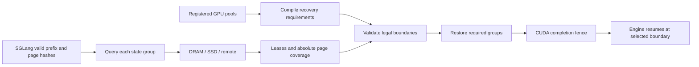

# Compiled hybrid recovery

OrbitKV's SGLang adapter compiles the registered GPU pools into a recovery
contract. Every lookup must supply enough leased state to resume at one legal
token boundary. An attention hit alone is insufficient for a hybrid model.

## Rules and runtime ownership

| Registered group | Rule at token boundary t | Physical state |
| --- | --- | --- |
| Full attention / MLA | Contiguous prefix through t | Engine-owned attention pages |
| Sliding window | Complete trailing window through t, rounded up to pages | Independent SWA K/V pages |
| Recurrent / convolution | Checkpoint exactly at t | All conv and temporal tensors in one sealed group |

`orbitkv-state::RecoveryContract` validates declarations at registration. The
adapter derives the absolute query origin from SGLang's valid HBM prefix and
converts each leased hit position into an absolute token end. The validator
rejects mismatched namespaces, malformed coverage, unknown groups and gaps.
It returns every legal boundary: ranks intersect these sets, since taking the
minimum of their largest checkpoints could select a checkpoint missing on one rank.



Earlier attention pages can be saved after their auxiliary state has been
evicted. Completeness is checked when joining groups for recovery. Sparse
membership fetches missing group pages through the existing backing-tier path
with at most eight independent reads per query. These reads share preparation
and cancellation ownership; an absent checkpoint does not wait for a future
publisher. Sparse remote discovery still issues per-key fetches, so batching
that metadata work remains a distributed optimization.

At load time, copied destinations plus engine-attested retained pages must
cover exactly the chosen plan. All group leases remain held until the combined
restore completes. Cancelling a request whose destinations are already inserted
into the radix tree first finishes their queued restore, then releases tree pins.
Transfer errors do not acknowledge partially restored destinations.
The consumer handoff waits for the whole restore before forward construction;
CUDA graph replay must not depend on Python per-layer accessors being invoked.

SGLang owns HBM allocation, eviction and checkpoint copy-on-write. The pinned
0.5.20 external-linker component does not implement Mamba transfers; OrbitKV's
`RecurrentComponent` supplies that behavior through the component registry.
It saves sealed tree checkpoints, restores them into tree slots, and hands off
to SGLang's normal request-state copy-on-write after the transfer fence. There
is no second radix tree or patched engine submodule.

## Deployment and limits

Use the same per-host Cache Manager and SGLang flags as
[single-node deployment](single-node.md). No additional service is required:

```bash
orbitkv-cache-manager --addr 127.0.0.1:50055 --pool-size 8gb \
  --ssd-cache-path /data/orbitkv/cache.bin --ssd-cache-capacity 100gb

ORBITKV_SGLANG_ENDPOINT=unix:///tmp/orbitkv-50055.sock \
  sglang serve --model-path /path/to/Qwen3.5-0.8B --page-size 64 \
  --enable-unified-cache-external-linker --radix-cache-backend orbitkv
```

Omit the SSD arguments for DRAM-only caching. A repeated 512-token prompt may
not reuse a checkpoint at 512: SGLang must compute its last token, so its match
limit is 511. A 513-token prompt can reuse checkpoint 512. OrbitKV never rounds
the recovery boundary forward past the requested match limit.

Supported pool combinations are Full MHA/MLA, Full + SWA, and Full +
recurrent/conv. GPU buffers must be contiguous and page aligned; registered
layer groups must cover every model layer without overlap. DSA, draft state,
ReplaySSM, speculative sibling state, int8 checkpoint storage, SWA request rings
and unknown pool combinations are rejected. Full + SWA + recurrent together is
not yet supported. Optional queue warming currently prepares attention only and
is therefore bypassed for hybrid pools.

This is validation of engine-declared recovery requirements and registered
formats. It is not a formal proof of the model's numerical implementation.
Page-generation fencing, live weight changes and cross-engine byte reuse remain
open. vLLM retains its existing adapter-level hybrid reconciliation; migrating
it to the same validator is a separate step. Multi-rank and remote hybrid
serving require additional qualification.

## Reproducible gates

Use the pinned SGLang 0.5.20 environment and a freshly built extension/Manager.
From `python/`:

```bash
../.venv/sglang-release/bin/python -m pytest -m integration \
  tests/integration/test_sglang_admission.py \
  tests/integration/test_sglang_direct_transfer.py \
  tests/integration/test_sglang_recovery.py

../.venv/sglang-release/bin/python -m pytest -m e2e \
  tests/e2e/test_sglang_direct_e2e.py --model /path/to/Qwen3.5-0.8B

../.venv/sglang-release/bin/python -m tests.support.sglang_swa_fixture \
  --tokenizer-path /path/to/local/qwen-tokenizer --output /tmp/orbitkv-swa-model
../.venv/sglang-release/bin/python -m pytest -m e2e \
  tests/e2e/test_sglang_direct_e2e.py --model /tmp/orbitkv-swa-model
```

The SWA fixture has deterministic random weights, four layers alternating full
and sliding attention, and a 256-token window. It uses SGLang's native Mellum
implementation. It validates cache recovery rather than pretrained-model quality
or throughput. Changing `sliding_window` in a Qwen2.5 config does not activate
this execution path in SGLang and is not an equivalent test.

The GPU integration gate restores poisoned attention/window/conv/temporal
destinations from DRAM and forced SSD, checks sparse legal boundaries, rejects
incomplete plans and exercises cancellation after destination publication. The
serving gate checks HBM flush, engine restart, concurrent requests, positive GPU
load bytes and forced SSD prefetch bytes. Restored output IDs must match a native
HBM-hit control that performs no external GPU load; a changed identity must miss
and match the cold control. Generated-token log probabilities must be finite
and match the corresponding control within 0.05 absolute log-probability units.
The random SWA fixture produces different cold and warm outputs even with native
SGLang, so comparing identical execution paths is essential. CUDA graphs remain
enabled. These are TP=1 correctness gates,
not throughput measurements or a claim that all hybrid architectures work.
