# Compiled hybrid recovery

OrbitKV's SGLang and vLLM hybrid adapters use the same compiled recovery
contract for page demand and leased evidence. Every hybrid lookup must supply
enough state to resume at one legal token boundary. An attention hit alone is
insufficient.

The adapters accept Full + SWA, Full + recurrent/conv, and Full + SWA +
recurrent/conv layouts. Full attention and MLA keep their single-group path.
vLLM groups must share a logical block size and Mamba groups must use `align`.
SGLang requires ordinary contiguous pools; moving unified-memory pools and SWA
request rings require additional address-lifetime integration. Supporting these
state combinations does not establish compatibility with every model or pool
implementation.

## Rules and runtime ownership

| Registered group | Rule at token boundary t | Physical state |
| --- | --- | --- |
| Full attention / MLA | Contiguous prefix through t | Engine-owned attention pages |
| Sliding window | Complete trailing window through t, rounded up to pages | Independent SWA K/V pages |
| Recurrent / convolution | Checkpoint exactly at t | All conv and temporal tensors in one sealed group |

`orbitkv-state::RecoveryContract::compile` normalizes declared groups at adapter
setup: a prefix needs the whole queried tail, a window needs
`ceil(window / page_size)` pages capped by that tail, and a checkpoint needs only
its final page. The Python `required_ranges(namespace, start, end)` method
returns `list[(group, start, end)]`: absolute, half-open, page-aligned intervals
for each group, with `end` the chosen boundary. Complete valid engine state at
the HBM prefix origin `start` is a prerequisite; the contract does not establish
it. An empty span returns `(group, start, start)` for every registered group
and creates no new restorable boundary.

The same normalized requirements drive `restorable_boundaries`. Each adapter
converts leased hit positions to absolute token ends; validation rejects
mismatched namespaces, malformed coverage, unknown groups and gaps. It returns
every legal boundary: ranks intersect these sets, since taking the minimum of
their largest checkpoints could select a checkpoint missing on one rank.
Required ranges describe demand; live leased evidence establishes availability.

### Known-range example

With 64-token pages, a valid HBM origin at 128 and a selected boundary at 512:

| Declared layout | `required_ranges(namespace, 128, 512)` |
| --- | --- |
| Full attention (group 0) + 100-token SWA (group 1) | `[(0, 128, 512), (1, 384, 512)]` |
| Full attention (group 0) + recurrent/conv (group 1) | `[(0, 128, 512), (1, 448, 512)]` |

Combining the two auxiliary groups requires all three ranges at the same
boundary. The window rounds up to two pages; for
the shorter tail `[128, 192)` it needs only `[128, 192)`. The checkpoint requires
the page ending at the selected boundary, including all its conv/temporal tensors.
The output does not assert that any of these pages are cached or leased.

### SGLang lookup and restore

```mermaid
flowchart LR
  Pools[Declared group rules] --> Compile[Compiled page requirements]
  Tree[Valid HBM origin and known hashes] --> Query[Metadata-only discovery]
  Query --> Tiers[DRAM / SSD indexes / catalog]
  Tiers --> Evidence[Candidate group positions]
  Compile --> Validate[Validate legal boundaries]
  Evidence --> Validate
  Validate --> Select[Select common boundary]
  Select --> Demand[required_ranges]
  Compile --> Demand
  Demand --> Read[Read selected ranges and acquire leases]
  Read --> Check[Validate actual leased coverage]
  Check --> Restore[Restore required groups]
  Restore --> Fence[CUDA completion fence]
  Fence --> Resume[Engine resumes at selected boundary]
```



SGLang discovers positions in each registered group without loading payloads or
reserving payload bytes. Discovery inspects DRAM presence, the SSD index and
batched catalog candidates. Rust intersects the compiled legal boundaries;
SGLang then intersects those sets across attention ranks. Metadata is a hint:
concurrent eviction or a remote restart can invalidate it.

Only the selected boundary enters `read_recovery`. Rust translates its
`required_ranges` into shared views of the original hash batch and reads those
pages. Attention needs the selected tail, SWA needs its trailing window, and a
recurrent group needs one checkpoint. Each returned group must have a live
lease covering its entire selected range; a partial result is released and
becomes a miss. Completed groups stay owned while others load. SGLang reports
host hits only once all ranks have complete leased state, before tree/GPU
allocation. Missing selected state falls back to the engine's valid HBM origin
and recomputation. Candidate discovery does not initiate warming.

Demand uses the existing bounded backing-read and cancellation machinery.
Sparse payload reads still have up to eight independent operations per group;
only metadata discovery is batched across missing hashes. Extra lookup rounds
are the cost of avoiding speculative payload reads; this change alone makes
no TTFT claim.

At load time, transferred keys and engine-attested retained keys must be
disjoint and together equal the keys in each compiled range. SGLang uses the
contract instead of Python formulas for each pool kind. All group leases remain
held until the combined restore completes. Cancelling a request whose
destinations are already inserted into the radix tree first finishes their
queued restore, then releases tree pins.
Transfer errors do not acknowledge partially restored destinations.
The consumer handoff waits for the whole restore before forward construction;
CUDA graph replay must not depend on Python per-layer accessors being invoked.

SGLang owns HBM allocation, eviction and checkpoint copy-on-write. The pinned
0.5.20 external-linker component does not implement Mamba transfers; OrbitKV's
`RecurrentComponent` supplies that behavior through the component registry.
It saves sealed tree checkpoints, restores them into tree slots, and hands off
to SGLang's normal request-state copy-on-write after the transfer fence. There
is no second radix tree or patched engine submodule.

## vLLM hybrid handoff

`CacheGroupLayout` maps vLLM's full-attention groups to storage group zero.
Each sliding-window or aligned Mamba group gets an independent storage key and
window/checkpoint requirement. vLLM includes the next query token in its window,
so a window of W requires W-1 past tokens, rounded to complete pages. Windows
must include at least one past token. The scheduler compiles these
requirements once in `RecoveryContract`. Rust computes the legal boundary
intersection from candidate positions on every shard. Before materialization,
the scheduler limits selection to the last token boundary usable by vLLM;
the final prompt token still needs forward computation for logits. This avoids
fetching a later checkpoint only to discard it during allocation.

The selected attention prefix, trailing windows and exact checkpoints use `read_recovery`.
Ready groups remain leased while other groups load; `Loading` defers admission.
If any actual range is missing, all owned groups are released and the request
recomputes. The existing five-second preparation limit, request drift, cancel,
shutdown and session teardown retire interests; submitted I/O retains its
buffers until completion. The operation and lease lifecycle is shared with
dense queries, including byte-budget admission.

Allocation must preserve the selected checkpoint exactly. Lease positions stay
relative to the original queried tail so the worker can map a one-page
checkpoint to the right GPU slot. Required attention pages and conv/temporal
state move into one restore operation, owned through GPU completion. There are
no surplus attention/checkpoint leases after final-token clamping. HBM
allocation and inference scheduling stay in vLLM. Dense queries and P/D's
explicit handoff want-sets retain their separate existing demand behavior;
hybrid P/D partial tails and cross-engine byte reuse remain unsupported.

The worker maps window leases by their query-relative page positions, preserving
null destinations outside the required window. Window pages can retire while
their request is still executing. Their save jobs pin GPU blocks independently
of request lifetime and release them only after every worker reports completion.

## Scope and production-cache lessons

Compilation here turns declared semantic requirements into deterministic page
demand for a known range. It removes duplicate adapter arithmetic and bounds
payload reads by the selected recovery boundary. No latency or throughput improvement has
been measured for this increment. General model-graph analysis, numerical proofs,
future-token prediction, retention policy and physical planning remain outside its scope.
A required range grants neither a lease nor permission to reclaim state, and
does not enable automatic hybrid warming.

The [pinned production-cache source review](queued-warming.md#reference-implementations-and-policy-order)
informs this work. OrbitKV applies the usable-boundary lesson to demand that
includes every required component. LMCache's request reader locks and Dynamo's
session holders illustrate consumer ownership; existing OrbitKV leases retain
pages through GPU completion. HiCache's stopping policies inform
[bounded preparation](request-preparation.md): stop new reads, drain submitted
work and return only completed legal boundaries. Automatic hybrid preparation
remains open. These are established cache lessons,
not a novelty or performance claim.

## SGLang deployment and limits

Use the same per-host Cache Manager and SGLang flags as
[single-node deployment](single-node.md). No additional service is required:

```bash
orbitkv-cache-manager --addr 127.0.0.1:50055 --pool-size 8gb \
  --ssd-cache-path /data/orbitkv/cache.bin --ssd-cache-capacity 100gb

ORBITKV_SGLANG_ENDPOINT=unix:///tmp/orbitkv-50055.sock \
  sglang serve --model-path /path/to/Qwen3.5-0.8B --page-size 64 \
  --enable-unified-cache-external-linker --radix-cache-backend orbitkv
```

Omit the SSD arguments for DRAM-only caching. A repeated 512-token prompt may
not reuse a checkpoint at 512: SGLang must compute its last token, so its match
limit is 511. A 513-token prompt can reuse checkpoint 512. OrbitKV never rounds
the recovery boundary forward past the requested match limit.

Supported pool combinations are Full MHA/MLA, Full + SWA, Full +
recurrent/conv, and Full + SWA + recurrent/conv. GPU buffers must be contiguous
and page aligned. Full/SWA groups must cover disjoint attention layers;
convolution/checkpoint state may accompany attention in the same layer. The
union must cover all model layers. Empty temporal state in a convolution-only
checkpoint is not registered as a zero-byte GPU buffer. DSA, draft state,
ReplaySSM, speculative sibling state, int8 checkpoint storage, SWA request rings,
moving unified-memory pools and unknown pool combinations are rejected.
Optional queue warming currently prepares attention only and
is therefore bypassed for hybrid pools.

This is validation of engine-declared recovery requirements and registered
formats. It is not a formal proof of the model's numerical implementation.
Page-generation fencing, live weight changes and cross-engine byte reuse remain
open. Multi-rank and remote hybrid serving require additional qualification.

## Reproducible gates

The 2026-09-23 single-GPU qualification used vLLM 0.29.0 and SGLang 0.5.20:

| State layout | vLLM evidence | SGLang evidence |
| --- | --- | --- |
| Full + SWA | Mellum native serving/restart; exact DRAM/SSD GPU recovery | Mellum DRAM/SSD serving, concurrent restore and restart |
| Full + recurrent/conv | Qwen3.5-0.8B native serving/restart; exact DRAM/SSD GPU recovery | Qwen3.5-0.8B DRAM/SSD serving, concurrent restore and restart |
| Full + SWA + recurrent/conv | Exact DRAM/SSD GPU recovery with real adapter/spec objects; native model serving remains unqualified | Exact DRAM/SSD recovery for temporal and conv-only checkpoints; native Inkling conv-only DRAM/SSD serving, concurrent restore and restart |

Final gates passed: 345 source-only unit cases; 16 native-contract/vLLM recovery
cases; four combined SGLang GPU cases; seven vLLM Qwen3.5 serving checks;
six vLLM Mellum checks (one recurrent-only check is inapplicable); and two
SGLang serving cases for each of Qwen3.5, Mellum and Inkling. The combined
temporal-state GPU fixtures do not establish native model-serving compatibility
in either engine. Full-attention/MLA support retains its existing gates.
Raw logs and generated model files are not stored in the repository.

The compiled-demand increment has passed Rust/Python unit and native/CUDA
DRAM/SSD exact-byte gates. The SGLang GPU gate checks mixed
retained and copied pages against the shared plan. It also stores orphan
auxiliary pages beyond the available attention prefix and requires no fetch of
them, including no increase in SSD read bytes. vLLM checks destination masking
with the original lease vector preserved. These gates qualify exact recovery
and lookup scope; they do not measure a latency improvement.

For vLLM 0.29.0, run from `python/`:

```bash
../.venv/vllm-release/bin/python -m pytest -m integration \
  tests/integration/test_vllm_recovery.py
../.venv/vllm-release/bin/python -m pytest -m e2e \
  tests/e2e/test_vllm_e2e_correctness.py \
  --model /path/to/Qwen3.5-0.8B --max-model-len 4096
```

The native integration gate checks nonzero origins, missing checkpoints,
partial attention coverage, final-token clamping and malformed evidence. The
GPU cases use real vLLM scheduler/worker adapters to restore poisoned attention,
conv and temporal destinations from DRAM and forced SSD. They also check that
unrequested GPU pages remain untouched and SSD bytes equal the selected ranges. Unit tests separately cover pending
group cancellation, query drift/expiry, shard intersection and allocation
changes. The vLLM SSD fixture stores four attention pages and two checkpoints, then
selects an earlier boundary under the logits limit. Actual reads are exactly
**8,704 bytes** (two attention pages plus one checkpoint), versus the former
17,408-byte candidate materialization. SGLang fixtures also store an unused
early checkpoint/window page and an orphan outside the attention prefix;
metadata discovery reads zero payload bytes and materialization reads only
the selected ranges. These synthetic byte controls establish read reduction,
not serving latency or throughput gains.

The serving gate compares matching native-vLLM cache execution plans
and requires real GPU loads after engine restart.

Use the pinned SGLang 0.5.20 environment and a freshly built extension/Manager.
From `python/`:

```bash
../.venv/sglang-release/bin/python -m pytest -m integration \
  tests/integration/test_state_demand.py \
  tests/integration/test_sglang_admission.py \
  tests/integration/test_sglang_direct_transfer.py \
  tests/integration/test_sglang_recovery.py \
  tests/integration/test_sglang_combined_recovery.py

../.venv/sglang-release/bin/python -m pytest -m e2e \
  tests/e2e/test_sglang_direct_e2e.py --model /path/to/Qwen3.5-0.8B

../.venv/sglang-release/bin/python -m tests.support.attention_fixture \
  --tokenizer-path /path/to/local/qwen-tokenizer --output /tmp/orbitkv-swa-model
../.venv/vllm-release/bin/python -m pytest -m e2e \
  tests/e2e/test_vllm_e2e_correctness.py --model /tmp/orbitkv-swa-model \
  --max-model-len 2048
../.venv/sglang-release/bin/python -m pytest -m e2e \
  tests/e2e/test_sglang_direct_e2e.py --model /tmp/orbitkv-swa-model
```

The SWA fixture has deterministic random weights, four layers alternating full
and sliding attention, a 256-token window, and one sparse MLP layer. It uses
both engines' native Mellum implementations. It validates recovery rather than pretrained-model quality
or throughput. Changing `sliding_window` in a Qwen2.5 config does not activate
this execution path in SGLang and is not an equivalent test.

The GPU integration gate restores poisoned attention/window/conv/temporal
destinations from DRAM and forced SSD, checks sparse legal boundaries, rejects
incomplete plans and exercises cancellation after destination publication. The
serving gate checks HBM flush, engine restart, concurrent requests, positive GPU
load bytes and forced SSD prefetch bytes. Restored output IDs must match a native
HBM-hit control that performs no external GPU load; a changed identity must miss
and match the cold control. Generated-token log probabilities must be finite
and match the corresponding control within 0.05 absolute log-probability units.
The random SWA fixture produces different cold and warm outputs even with native
SGLang, so comparing identical execution paths is essential. CUDA graphs remain
enabled for Qwen3.5 and Mellum. These are TP=1 correctness gates,
not throughput measurements or a claim that all hybrid architectures work.

The combined SGLang serving fixture uses the native Inkling model with full and
sliding attention plus short-convolution state in every layer:

```bash
../.venv/sglang-release/bin/python -m tests.support.sglang_combined_fixture \
  --tokenizer-path /path/to/local/qwen-tokenizer --output /tmp/orbitkv-combined-model
ORBITKV_MODEL_FINGERPRINT=7777777777777777777777777777777777777777777777777777777777777777 \
  ../.venv/sglang-release/bin/python -m pytest -m e2e \
  tests/e2e/test_sglang_direct_e2e.py --model /tmp/orbitkv-combined-model \
  --sglang-load-format dummy
```

This fixture declares a fixed test-only identity for seed-42 dummy weights; do
not use that identity for a deployment or changed configuration. It uses BF16,
four dense MLP layers, a 256-token window, and a sufficiently large SWA pool for
the 513-token prefill. The gate disables prefill CUDA graphs because the pinned
deterministic Triton backend does not capture Inkling EXTEND; decode graphs stay
enabled. Full + SWA + temporal recurrent state also has exact GPU-byte gates;
these are separate from the convolution-only model-serving fixture.
