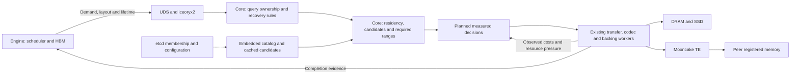

# Implementation plan and agent handoff

Design and source review: **2026-09-24**. This is the execution map for local
transfer planning, LMCache-style service deployment and distributed cache
qualification. It combines the decisions in [state planning](state-planning.md),
[deployment](deployment.md) and the [distributed design](distributed-cache.md).
[TODO](../TODO.md) tracks completion; a design or upstream feature never closes
an OrbitKV implementation or qualification item.

## Decisions to preserve

- Run an independent Cache Manager on each inference host, shared by compatible
  engine instances. Use separate Managers where budgets or runtime environments
  need isolation. Follow LMCache MP's service topology.
- Keep vLLM/SGLang responsible for scheduling, active HBM allocation and valid
  page lifetimes. Put shared cache policies, batching, waiting and cost estimates
  in Rust. Python supplies engine callbacks and registration evidence.
- Keep UDS/iceoryx2 for engine-to-Manager control and CUDA allocation sharing for
  GPU access. Local and peer placement remain invisible to the cache API.
- Use Mooncake TE for OrbitKV remote payload transfer. Embedded catalog shards
  provide candidate evidence; etcd provides membership/configuration. There is
  no additional central metadata service or per-block etcd request path.
- Keep cluster-aware cache decisions [below the engine](state-planning.md#cache-manager-decisions-below-the-engine).
  Each Manager combines bounded replica/resource evidence with local costs and
  authoritative source admission. Discovery and source/path choice work without
  Dynamo or router-provided hints; optional routing can consume Manager summaries.
- Treat io_uring host staging and native cuFile GPU staging as independent
  candidate routes over one SSD store. Separate eligibility, measured choice
  and failure handling; a healthy GDS route need not win every operation.
- Describe replicas by physical medium plus owner/resource location. Peer
  DRAM/SSD/HBM are candidate residences, not one last-priority remote tier;
  temporary staging and P/D destinations require explicit cache admission.
- Share measured path costs and resource accounting across deployments, while
  preserving distinct DP reuse, P/D handoff and TP/PP completion requirements.
  These dimensions compose; engine instances and operations carry their roles.
- Keep exact storage as the default. Preparation, selective retention/writes
  and lossy formats need workload-specific evidence before default enablement.
- Interfaces may break before 1.0. Remove obsolete forwarding/compatibility
  layers; extend existing resource owners instead of creating a policy framework.

## Current baseline and evidence

The implementation in [PR #182](https://github.com/feichai0017/orbitkv/pull/182)
was merged at `b1aef401`; the design in
[PR #183](https://github.com/feichai0017/orbitkv/pull/183) was merged at `13ac3a9d`.
The first structural implementation is in
[PR #184](https://github.com/feichai0017/orbitkv/pull/184), on
`refactor/replica-route-planning`, based on that merge. Recheck Git status before
working and preserve existing changes. P4.1
observations, independent SSD demand routes and the fixed DMA/kernel comparison
are recorded below; dynamic execution selection remains planned.

| Area | Implemented or recorded | Open boundary |
| --- | --- | --- |
| Engine integration | vLLM 0.29.0 and SGLang 0.5.20; shared Rust client and direct GPU-page restoration | Qualify release upgrades separately from policy comparisons |
| Recovery semantics | Model/storage identity, compiled prefix/window/checkpoint requirements, complete selected-boundary demand sent to Manager, validated group reads | Joint multi-group physical planning, allocation-generation evidence, further auxiliary state and wider native hybrid serving remain separate work |
| Local storage | Pinned DRAM, neutral SSD extent leases, independently executable io_uring/cuFile demand reads, reusable GPU staging and encoded recovery | New route validation recorded separately below; native GDS performance and direct engine-page I/O unqualified |
| Codecs | Batched GPU ANS/FP8/TurboQuant, reusable workspace, CRC; CPU FP8 scalar/AVX2/AVX-512 | General lossy quality qualification and adaptive representation selection |
| Lifecycle | Query budgets, shared reads, cancellation, completion ownership, restart and process-fault gates | Multi-rank and sustained fault soak; no timeout-only DMA reclamation |
| Policies | Optional preparation, protected retention, reuse-based SSD admission and opt-in bounded cost/shadow observations | Calibration under shared-device contention, first-use prediction and dynamic path/boundary selection |
| Peer cache | Embedded catalogs, etcd Watch, bounded per-query coalescing and per-owner discovery concurrency, source authorization, bounded TE transfers and release recovery | Recorded serving evidence is same-host TCP; two-host TCP/RDMA, catalog replication and orphan revocation remain open |
| Packaging | Source-buildable CUDA wheels and installed-artifact checks | First Python release, qualified container images, shared-instance deployment and Kubernetes installation |

Use the maintained [storage-format results](storage-formats.md#qualification),
[fault gates](fault-qualification.md), [preparation controls](request-preparation.md)
and [shared-cache result](shared-cache-qualification.md#recorded-result). These
are existing evidence, not tests rerun for this handoff. ANS's recorded SSD
benefit and DRAM median-TTFT regressions support measuring policy tradeoffs;
they do not prove a universal advantage over LMCache or FlexKV.

SSD files currently reset on Manager restart. Catalog replay reconstructs
evidence from surviving inventories; it cannot recover lost payloads. Persistent
SSD manifests would be a separate feature, not an implied HA guarantee.

## Upstream mechanisms and how to apply them

The official [latest release](https://github.com/LMCache/LMCache/releases/tag/v0.5.5)
was v0.5.5 when checked. Source review uses clean commit
`05a013b29da78cf2321b9b46ec5039dde2fb0bb0`, not a moving documentation default.
FlexKV references use `738ddc141a198b4e20de6c5d1f0128e387f7fdb2`.
Mooncake TE stays at the repository's pinned `v0.3.13.post1`, commit
`719735896c86b56fabec6cf3e825fb2ea640597a`.
The [routing and transfer reuse audit](state-planning.md#reuse-dynamo-for-request-routing)
also checks Dynamo v1.5.0, NIXL v1.4.1 and the experimental KVCR source.

| Pinned reference | Observed mechanism | OrbitKV application |
| --- | --- | --- |
| [LMCache MP deployment][lm-deploy] | Independent cache service; per-node service shared by inference processes; Docker and DaemonSet/Deployment examples | Adopt the topology and operational separation; qualify OrbitKV's actual GPU, IPC and PID requirements |
| [LMCache prefetch controller][lm-prefetch] | Lookup/locking, load planning, destination reservation and transfer into reader ownership; window-aware trimming | Preserve discovery/read separation and complete `required_ranges`; bounded preparation hands ownership to the real consumer |
| [LMCache prefetch policy][lm-prefetch-policy] | Default load selection takes the first matching adapter by index; fetched data is temporary unless retention policy says otherwise | Separate source selection from retention. Measured costs are new OrbitKV work, not a copied upstream default |
| [LMCache store policy][lm-store-policy] | Independent write-target and post-store L1-retention decisions; default stores to all adapters | Tune write admission separately from restore and eviction, using current Rust owners |
| [LMCache lazy offload][lm-lazy] | Optional vLLM FIFO batching of finished requests; revalidate unpinned GPU blocks before store | Evaluate bounded deferred publication only with valid source evidence, explicit dropped-save accounting and an idle-tail policy |
| [LMCache isolated LRU][lm-isolation] | Per-cache-salt eviction can work with quota accounting | Distinguish model compatibility, trust namespace, resident quota and in-flight budget; qualify noisy-neighbor behavior before shared service claims |
| [LMCache serde][lm-serde] | Encoding is independently configured per L2 adapter | Separate logical state from physical representation before adaptive format choice; require explicit lossy-quality policy |
| [LMCache raw/VMM allocation sharing][lm-ipc] and [timeline events][lm-events] | Explicit allocation handles and a separate completion-ordering mechanism | Plan Rust-owned registration and completion to reduce the Torch/pickle bridge; qualify allocation types and namespace isolation independently |
| [LMCache P2P][lm-p2p] | Membership discovery, peer source locking and remote loads into requester L1 | Keep membership off payload lookup and budget both endpoints; use OrbitKV's catalog evidence and Mooncake TE |
| [LMCache P/D composition][lm-pd] | Current-request handoff and cross-request cache reuse are distinct connectors | Preserve that semantic separation with OrbitKV's Mooncake handoff; qualify cached-P-prefix and later D-to-P reuse |
| [FlexKV transfer scheduler][flex-scheduler], [GDS][flex-gds] and [ANS][flex-ans] | Dependency-driven movement, reusable GPU storage staging and GPU compression | Extend existing Rust queues, coalescing and codec arenas; retain resource ownership across dependencies |
| [FlexKV distributed reuse][flex-distributed] | Local index snapshots, Redis metadata and Mooncake movement | Reuse bounded cached discovery ideas; retain etcd membership and embedded catalogs rather than replacing them with Redis |
| [Mooncake TE][mc-te] and [RFC #3504][mc-rfc] | Released memory-transfer API; separate draft for cached membership and peer authorities | Reuse TE directly. Treat the RFC as design input, not an implemented HA store dependency |
| [Dynamo v1.5.0 routing](state-planning.md#reuse-dynamo-for-request-routing) | Rust selection service, tier credits, topology constraints and experimental custom scoring | Reuse upstream selection; integrate compatible events and qualified Manager estimates. Avoid deprecated KVBM |
| [NIXL v1.4.1](state-planning.md#reuse-dynamo-for-request-routing) | Unified transfers, optional cost estimates and a Preview Mooncake backend | Evaluate native integration before adding another generic transfer layer; the Mooncake backend does not implement its own estimator |
| [KVCR design](https://github.com/ai-dynamo/kvcr/blob/317e62f301300c101bf9c911e020fb89b35f1583/docs/design_overview.md) | Experimental cache controller with router-owned global inventory, source hints and explicit claims | Borrow lifecycle contracts; keep discovery and cost decisions in OrbitKV Managers, independent of request routing; qualify both engines |

Two deployment details need explicit qualification. LMCache v0.5.5's release
notes describe isolated IPC as the default, while the pinned
[server parser][lm-config] and [vLLM adapter defaults][lm-adapter] set it to
false. Set both endpoints explicitly in comparisons and probe the selected
allocation/event path. Raw CUDA IPC, exportable VMM allocations and timeline
events have separate support conditions; a feature name is not proof that
every engine allocator or container arrangement works.

The pinned [multi-server connector][lm-connector] rejects PP > 1 and DP > 1
when multiple servers are assigned to one vLLM deployment. This is distinct
from P2P reuse between independent replicas. Its P2P guide also requires a
contiguous L1 region and excludes its GDS-L1/Device-DAX configurations. Do not
translate those limits into a claim that all LMCache SSD caching excludes P2P.
OrbitKV must qualify its own SSD-plus-peer combinations.

## Deployment profiles

Use the same Manager and cache API across profiles. Start with the existing
[engine commands and capacity settings](deployment.md#configure-capacity-then-connect-engines);
the table describes target packaging and gates, not new launch flags.

| Profile | Processes and placement | Required gate |
| --- | --- | --- |
| Development / single engine | One engine and one Manager; DRAM, optional SSD | Existing standalone recovery/fault gates and installed-wheel smoke |
| Shared node | Several engine instances connect to one Manager on their host | Distinct registrations, simultaneous serving, budgets, cache-domain isolation, engine/Manager restart and device mapping |
| Containers | Separate pinned Manager and engine images; same-host resource access | First qualify explicit shared IPC/PID wiring, then the isolated profile below; check from installed images, not the source tree |
| Kubernetes | Manager DaemonSet on selected inference nodes; vLLM/SGLang Deployments connect to their node's Manager | Node-local endpoint wiring, GPU access without duplicate exclusive allocation, SSD mounts, startup/readiness, drain and rolling restart |
| DP / independent replicas | One Manager per host, embedded catalogs and etcd membership; peer bytes through TE | Two physical hosts, matching model/engine/layout, separate TCP and RDMA evidence; then same-host TP within a replica |
| P/D pools | P and D workers use their respective host Managers plus a P/D-aware router and explicit TE handoff | Complete current-request state, P-side cache hits reaching D, later reuse of D-published state, cancellation/restart and backpressure |
| Cross-host TP/PP | Each worker reaches its own host Manager; rank/stage work is coordinated by the engine | Common legal boundary, shard/stage dependencies and bounded fan-out; resharding is separately implemented |
| Dedicated cache nodes | Later DRAM/SSD contributors reached by inference-host Managers | A cache-only service profile, source-local SSD staging, capacity and failure gates; not currently a qualified CPU-only deployment |

The LMCache P/D reference uses separate cache servers for P and D. Use that as
the initial qualification layout. Sharing a physical host Manager between P
and D is a later concurrent-instance gate, even though the architecture permits
multiple registered roles. The LMCache reference uses NIXL for its handoff;
OrbitKV's TE choice does not require adopting that transport. Existing upstream
NIXL examples remain distinct interoperability examples.

Size resources separately: engine KV HBM, Manager GPU staging/codec arenas,
shared pinned DRAM, SSD capacity, active query ownership and peer exports.
Manager GPU allocations need headroom in engine memory configuration. Current
per-instance query limits bound live operations; they are not resident-cache
quotas. Track physical allocations once while retaining each consumer's lease
accounting. Shared-service fairness must cover both residency and active work.

### Container and service engineering

The current Manager imports CUDA buffers through the Python/Torch bridge and
needs GPU visibility. Do not copy a CPU-only cache-service manifest and assume
registration will work. The existing [container contract](deployment.md#containers-and-kubernetes)
requires shared process-channel resources, IPC and PID visibility.

First package and qualify that contract. Then implement explicit allocation
registration and device-visible completion in Rust; resolve GPUs by stable
identity, qualify legacy/VMM allocations, and preserve unregister/restart
fences. Rework UDS/iceoryx2 bootstrap resources and process-death evidence so
isolated PID/IPC namespaces work deliberately. Removing Torch memory sharing
alone does not remove control-channel or pidfd requirements. Prefer one
qualified registration protocol over a permanent compatibility branch.

Ship pinned image versions, capacity configuration, health/readiness semantics,
graceful admission stop/drain and diagnostics for the selected transport/backend.
Distinguish local service readiness from peer availability so a coordinator
outage can stop new remote work while healthy local recovery continues.
Keep administrative endpoints inside the deployment's control boundary. Provide
Compose/manifests before considering an operator; no manifest is labeled
production-ready before the target cluster/runtime gate passes. Replicas on
other nodes communicate as peers, not through a load-balanced replacement for
the local engine-to-Manager endpoint.

## Target architecture and request decisions

This diagram includes the planned cost model. Existing ownership stays in place.



For ordinary recovery: discover candidates without materializing payloads,
enumerate a bounded set of legal boundaries, obtain their exact required ranges,
estimate feasible source/path costs, reserve and validate the selected sources,
then read/decode/restore and publish completion. A changed source or incomplete
bundle returns to bounded replanning or engine-approved recomputation.

For each candidate, carry residence, representation, coverage, generation and
resource identity. Model transfers as dependent operations sharing SSD, PCIe,
GPU, CPU/NUMA and NIC resources. Initial decisions enumerate supported paths;
they do not need a generic graph optimizer or a new transport plugin registry.
See the [cost model](state-planning.md#choose-a-legal-boundary-and-completion-target).

Use the [candidate route set](state-planning.md#candidate-routes-and-eligibility)
to distinguish current peer-DRAM recovery, experimental GPU-to-GPU P/D and
future direct engine destinations or source-local SSD staging. Neither TE's
GPU-memory capability nor a successful host-memory transfer qualifies those
additional routes. Compare complete plans to the same consumer-ready state.
Extend the [residence contract](distributed-cache.md#residency-proximity-and-access-paths)
and inventory together before advertising peer SSD or general peer HBM. A DRAM
eviction must not erase the same owner's surviving SSD copy. Preserve current
state/format identity and grant actual memory access only at the source.

For DP, include discovery, source authorization, source wait, TE and destination
decode/H2D. Directory hints never authorize a memory read. A pending remote SSD
replica must be staged by its owner with bounded credits; that owner cannot
recursively fetch another peer. A peer-HBM source requires an engine lease.

Keep candidate indexes bounded by useful model/format domains, coalesce misses,
batch catalog requests by host and cap fan-out. Repair incomplete evidence
through bounded snapshots/deltas. Catalog replication preserves owner sequences
and placement generations; the source remains authoritative for its payload
generation and export lifetime. Directory redundancy does not guarantee multiple
data replicas. Avoid per-page consensus or a full-cluster query broadcast.

For P/D, the completion target is the decode consumer's required state, not a
historical cache hit. Protect producer and consumer generations, transfer cached
P-side state that D lacks, and explicitly handle failed handoff. For TP/PP,
evaluate the critical rank/stage dependency; a fast local shard is not global
readiness. Different parallel shapes need compatible bytes or explicit conversion.

Use separate decisions for restore, retention/write admission and scheduling.
Keep prepared-but-unconsumed pages budgeted. A deadline stops new submissions;
already submitted I/O retains source, destination and scratch until safe
completion or proven revocation. Track one request wait budget across retries,
using local clocks rather than comparing monotonic timestamps across hosts.

## Delivery plan

These work packages map to existing roadmap stages. Local tuning and deployment
work proceed alongside distributed qualification; no warming speedup gates DP.

| Order / existing stage | Deliverable | Main owners | Exit evidence |
| --- | --- | --- | --- |
| First: P4.1 | Bounded Rust cost observations and shadow decisions | Core transfer/backing/query; existing metrics and benchmarks | Prediction error on executed work, bounded state, measured instrumentation overhead; unchanged recovery behavior |
| Alongside: deployment packaging | Installed Manager/engine images, shared-node qualification, explicit container profile; then isolated registration | Server registry/endpoint, channel, core transfer, thin adapters, release tooling | Both engines in separate processes/containers, concurrent instances, device remapping and restart/drain; real cluster gate before Kubernetes claims |
| P4.2 | Independent io_uring/cuFile SSD routes, full-restore shadow and fixed DMA/kernel controls implemented; qualify per-batch choice next | Transfer workers, neutral SSD extent leases/queues and cost state | Route correctness and fixed-backend results below; io_uring/native-GDS comparison on a qualified host; shared-device budget, switching margin and conservative selection with weak evidence |
| P4.3 / remaining P3 | Choose legal restore boundary vs recompute; first-use preparation and queue shares | Recovery contract, query/prefetch, engine admission callbacks | TTFT/ITL targets, bounded unused prepared bytes, cancellation/expiry/reordering and other-request progress |
| P4.4 | Useful retention and writes, optional deferred publication and representation admission | Read cache, write path, codec and worker ownership | Independent policy ablations, write/read amplification and source-hold measurements; lossy quality is a separate gate |
| D1, in parallel | Real two-host independent-replica recovery, first TP=1 | Catalog/cluster, peer authorization, TE and existing serving driver | Output controls, positive remote/GPU bytes, incarnation rejection, loss/partition cleanup; TCP and RDMA reported separately |
| After D1: P/D plus reuse | Compose the existing vLLM handoff with cache; integrate SGLang's own handoff lifecycle | Engine adapters/P-D integration plus shared Rust lifetime logic | Cached P prefix reaches D; later P reuses D state; failed/cancelled handoffs cannot expose partial state |
| D2, before production distributed use | Replicated catalog evidence, placement generations, repair and operational recovery | Catalog, inventory sync and server cluster | Three failure domains, coordinator/catalog outage, bounded replay and source holds; etcd replication alone is insufficient |
| D3 | Measured peer selection and source-local SSD staging; evaluate dedicated cache nodes | Existing backing/peer workers and common cost observations | Forced source DRAM eviction, real SSD/TE bytes, bounded two-sided credits and useful latency under mixed load |
| Later topology gates / P6 | Same-host TP per replica, then cross-host TP/PP and layer overlap | Engine coordination, state contract and transfer dependencies | Rank/stage completion, compatible layouts, graph-capture/overlap tests; resharding separately gated |
| R1 | Optional pinned Dynamo worker routing fed by cache/engine summaries | Server-side optional integration | Correct event/hash mapping and request reservations; selected Manager revalidates actual state |

Same-host TP qualification can follow TP=1 D1 without waiting for D3. Identity
and lifetime defects in any supported path are fixed immediately, irrespective
of stage labels. Broader hybrid serving and lossy model quality remain parallel
qualification tracks, not assumptions inherited from a constructed GPU layout.

The single-node Python release can proceed once its installed-artifact gates
pass; it does not promise the unfinished distributed modes. Publishing is a
separate release action. Keep CacheBlend-style non-prefix reuse, arbitrary model
graph analysis, storage backend proliferation and general cross-engine conversion
outside the first planning changes.

## P4.1 implementation contract

P4.1 extends the existing execution owners. Preserve the actual timing boundaries:
the current SSD prefetch duration includes
queue/allocation/reconstruction and excludes H2D; codec timing may include
transfers. Adding these timers together would double count work.

1. Observe enqueue, resource admission, submission and completion at existing
   owners. Distinguish host-observed waiting from device service time, logical
   bytes from stored/wire/alignment bytes, and one shared physical read from its
   multiple consumers. Avoid extra GPU synchronization for measurement.
2. Maintain bounded estimates for direction/path, device or peer incarnation,
   representation and size/fragmentation buckets. Track sample age, count and
   error; cold or sparse estimates remain uncertain. Requests/StateKeys must
   not create unbounded estimator entries or metric labels.
3. Separate failed/cancelled/timeout outcomes from completed service samples.
   Submitted work can still complete after caller timeout; do not lose ownership
   or record the timeout as its exact service duration.
4. Add a shadow consumer for feasible candidate paths where current metadata
   suffices. It reports predictions without fetching alternatives, changing
   readiness or selecting another backend. Unknown alternatives stay unknown;
   a fixed tier rank is not measured evidence.
5. Add focused estimator/replay and lifecycle tests, then measure overhead in
   matched DRAM and pressured-SSD serving on both engines. Record only final
   summaries in tracked documentation; keep raw traces outside the PR.

| Existing owner | Work location |
| --- | --- |
| GPU copy shape and completion | `crates/orbitkv-core/src/transfer/{mod.rs,memcpy.rs,kernel.rs,worker/}` |
| Codec time, payload and workspace | `crates/orbitkv-core/src/codec/`, `transfer/worker/codec.rs`, `transfer/worker/ssd/decode.rs` |
| SSD queue and operation time | `crates/orbitkv-core/src/backing/ssd/`, `transfer/worker/ssd/` |
| Peer discovery/authorization/TE stages | `crates/orbitkv-core/src/internode/`, `backing/mooncake_fetch.rs`, `crates/orbitkv-transfer/` |
| Budget, candidate selection and leases | `crates/orbitkv-core/src/query/`, `engine/query.rs` |
| Exported metrics / request timelines | `crates/orbitkv-core/src/metrics.rs`, `crates/orbitkv-server/src/metric/timeline.rs` |
| Tests / serving measurements | Crate `tests/unit/` and integration tests, `python/tests/`, repository-root `benches/` |

The shared cost module serves these execution owners and the raw-copy/SSD-route shadow
consumer. Keep per-batch observations off Python hot loops; avoid
per-page allocation, unbounded logs and blocking telemetry I/O. Do not change
transport, codec defaults, cache key meaning or registration solely to land P4.1.

## Acceptance and comparison protocol

- Preserve exact raw/lossless restoration, compatible complete-state boundaries,
  old-incarnation rejection and safe page release. Lossy output/quality findings
  cannot weaken the exact-storage gate.
- Cover cold/shared/mixed traffic, working sets beyond DRAM, small/fragmented
  copies, large contiguous copies, duplicate readers, competing writes and
  multiple instances. Add a representative encoded case to catch hidden CPU/GPU
  staging; repeat the full codec matrix only when the change affects it.
- Cover cancellation before/after submission, slow SSD/peer, lost completion,
  source/Manager/engine restart and a request that never polls again. Require
  unrelated progress and eventual release after terminal completion or safe
  revocation; explicitly report quarantined holds after requester loss.
- Compare native engine, current OrbitKV and the changed policy first. Then
  compare compatible LMCache MP/FlexKV releases on the same model, engine
  release, request trace, HBM/DRAM/SSD capacity and physical host. Mark unsupported
  combinations rather than changing one project's workload silently.
- Use at least three paired repetitions with reversed order for policy claims.
  Declare TTFT/ITL SLOs and the instrumentation-overhead budget before measuring.
  Report p50/p95/p99, goodput/throughput, prediction error, actual read/write/
  wire bytes, CPU/GPU contention and retained/unused byte-seconds. A finite
  64-request codec cohort is not a general serving throughput ceiling.
- Keep same-host TCP, physical two-host TCP, two-host RDMA, cuFile compatibility
  and native GDS results separate. Native GDS needs its own path statistics;
  a successful cuFile call is insufficient. Follow [native GDS acceptance](gds.md)
  and [shared-cache qualification](shared-cache-qualification.md).

## P4.1 final evidence

This section records the earlier observation-only revision, before independent
SSD demand-route execution. Its test counts, artifact hashes and 36-run matrix
do not qualify the subsequent source/path changes; their final evidence belongs
in [the next section](#ssd-sourcepath-separation-final-evidence).

That P4.1 revision added opt-in Rust batch observations at the existing GPU,
SSD and peer owners, a 512-entry estimator, and raw-copy DMA/kernel shadow predictions.
It did not change backend selection, source authorization, recovery boundaries
or completion ownership. The [measurement contract](state-planning.md#p41-observation-contract)
and [metric definitions](metrics.md#bounded-cost-observations) distinguish nested
host timers, known logical sizes, unknown padded raw sizes and actual I/O.

Validation uses the existing container on one NVIDIA H20 with Qwen3-8B,
vLLM 0.29.0 and SGLang 0.5.20. Device access uses the container's exposed GPU;
this is not a bare-metal or two-host qualification. The measured Manager artifact
has SHA256 `c3fff69df0c568042198c6cef75051222f85f778fa9d97d370039ee118c924ff`.
The final startup-default revision disables observations unless
`ORBITKV_COST_OBSERVATIONS=1`; the measured explicit `0`/`1` paths are unchanged.
Its separately built Manager has SHA256
`5a78da7777bbe559e1b1ca95e7c8477350a35b591d7e493183d1d0038c0bdbcd`.
The full matrix was not rerun for this default-only revision; the startup switch
is covered by isolated-process tests.

| Final gate | Result |
| --- | --- |
| Rust format and workspace Clippy, all targets, CUDA 13 + Mooncake | Passed |
| Precompiled workspace Release tests | 365 passed; four untouched coordinator tests remain opt-in |
| Cost metric exporter contract | Passed: real Prometheus names, labels and microsecond histogram buckets |
| Final estimator and startup-switch tests | 6 passed, including isolated processes with unset, `0`, `1` and invalid switch values |
| Explicit GPU/codec tests | 10 passed, including heterogeneous ANS and direct/kernel equality |
| cuFile functional tests | 8 passed with forced CPU compatibility and workspace temporary files; not native GDS |
| Mooncake peer tests | 2 passed, raw and encoded restoration, same-host TCP only |
| vLLM DRAM and io_uring SSD recovery | Each 6 passed, 1 recurrent-model-only skip; native output comparison and GPU loads after engine restart |
| SGLang DRAM and io_uring SSD recovery | 2 passed, GPU loads after engine restart and cold-identity controls |
| Targeted fault integration with a separate test-hooks Manager | 6 passed: submitted/shared SSD cancellation, unpolled preparation expiry, lost completion/restore timeout and Manager-incarnation rejection |
| Source-only Python unit gate | 347 passed, 1 skipped; isolated test dependencies without native/engine imports |
| Benchmark harness tests and Ruff | 109 passed; lint and formatting passed |
| Website check, build and tests | Passed: no Astro diagnostics; 40 pages built; 1 test passed |

The serving matrix completed **36 runs / 4,608 requests**, with three pairs per
cell and reversed order in the second pair. Every run passed fixed-cohort,
physical-path, drain and absolute SLO checks. **Five of six overhead cells pass**;
SGLang ANS SSD exceeds the TTFT p50 budget. Observations and shadow work therefore
remain disabled by default. No dynamic path policy is enabled.

The [predeclared protocol](../benches/README.md#cost-observation-overhead) uses
128 requests per run, concurrency four, 1024/4096-token prefixes, 75% planned
reuse and seed 20260924. The 12-prefix working set is 4.219 GiB; SSD cells have
1 GiB DRAM, 16 GiB SSD and 8192 engine KV tokens (1.125 GiB). DRAM-only cells use
16 GiB host memory. Positive O_DIRECT SSD reads and writes are required.

All values below are **medians of paired percentage changes**. Budgets are 3%
throughput loss, 3% TTFT p50 growth and 5% p95/p99 growth. Negative values are
finite-cohort variation, not a claimed optimization benefit.

| Engine / tier / format | Throughput loss | TTFT p50 | TTFT p95 | TTFT p99 | Budget |
| --- | ---: | ---: | ---: | ---: | --- |
| vLLM / DRAM / raw | -0.050% | -0.513% | +0.268% | +0.177% | Pass |
| vLLM / SSD / raw | -0.039% | -0.906% | -0.036% | +0.124% | Pass |
| vLLM / SSD / ANS | +0.323% | -1.617% | -0.244% | +0.109% | Pass |
| SGLang / DRAM / raw | -0.547% | -7.577% | -1.832% | -2.656% | Pass |
| SGLang / SSD / raw | +0.010% | +0.330% | -1.524% | +1.217% | Pass |
| SGLang / SSD / ANS | +0.762% | **+5.915%** | +0.665% | +0.144% | **Fail: p50** |

The failing cell's three p50 changes are +1.407%, +14.376% and +5.915%; its
off/on p50 ranges are 296.240–327.792 / 329.959–338.827 ms. This is an unmet
budget, not a discarded outlier. The current measurements do not isolate its
cause. The existing 25 ms metrics scraper includes additional serialization
and Python parsing in the measured delta; this is not isolated Rust hot-path
cost. Manager CPU includes preparation/drain; engine CPU and GPU contention
are not measured.

The following enabled-run values are medians of each run's quantiles, not pooled
percentiles or ratios of medians. Goodput equals throughput here: every request
meets the TTFT/response-average-decode SLO. Each run has 1,920 official ITL
samples; the minimum fraction within 100 ms across all 36 runs is 97.917%.
ITL quantiles are bucket-interpolated, and the two engines have different timing
boundaries as documented in the protocol.

| Engine / tier / format | TTFT p50 / p95 / p99 (ms) | ITL p50 / p95 / p99 (ms, approximate) | Goodput (requests/s) |
| --- | ---: | ---: | ---: |
| vLLM / DRAM / raw | 168.08 / 1095.74 / 1288.16 | 5.19 / 9.86 / 130.59 | 8.239 |
| vLLM / SSD / raw | 200.33 / 1062.28 / 1290.97 | 5.13 / 9.74 / 119.60 | 7.896 |
| vLLM / SSD / ANS | 263.48 / 1236.23 / 1607.29 | 5.28 / 11.10 / 122.07 | 7.176 |
| SGLang / DRAM / raw | 221.66 / 1173.98 / 1360.37 | 6.96 / 7.95 / 9.50 | 7.915 |
| SGLang / SSD / raw | 243.81 / 1147.85 / 1409.08 | 6.95 / 8.40 / 51.00 | 7.377 |
| SGLang / SSD / ANS | 332.40 / 1275.77 / 1478.76 | 7.03 / 9.43 / 52.00 | 6.692 |

Restore prediction error is for `gpu_load_direct` in raw cells and `gpu_decode`
in ANS cells, not request TTFT. SSD bytes come only from completed `ssd_read`
and `ssd_write` I/O owners, excluding their aggregate aliases and parent/GPU
paths. These are three-run medians; CPU columns are off → on.

| Engine / tier / format | Restore prediction samples | Restore MAE (ms) | Actual SSD read / write (GiB) | Manager CPU (s) |
| --- | ---: | ---: | ---: | ---: |
| vLLM / DRAM / raw | 80 | 0.841 | N/A | 3.95 → 4.02 |
| vLLM / SSD / raw | 84 | 0.917 | 29.452 / 7.989 | 6.68 → 7.11 |
| vLLM / SSD / ANS | 86 | 3.415 | 17.681 / 6.529 | 12.34 → 12.51 |
| SGLang / DRAM / raw | 72 | 0.642 | N/A | 3.85 → 3.99 |
| SGLang / SSD / raw | 69 | 0.536 | 25.497 / 8.227 | 7.48 → 7.61 |
| SGLang / SSD / ANS | 69 | 1.414 | 17.573 / 6.562 | 13.46 → 13.04 |

All raw shadow decisions remain `unknown`: the selected path has evidence,
but the unexecuted alternative does not. ANS has no matched shadow alternative.
No path-ranking benefit is claimed. Warming/preparation are off, so these
windows export no retained/unused byte-second series; absence is not zero.
Concurrent text differences remain diagnostics, with exact recovery checked
separately by the Rust and engine gates above. Same-host TCP, forced cuFile CPU
compatibility and this container's io_uring path do not qualify native GDS,
physical two-host TCP/RDMA, multi-instance isolation or dynamic selection.

Final machine-readable summaries are in ignored
`benches/results/runs/20260924-p41-cost-final/final/`; request traces remain under
its `runs/` directory. The paired driver can reproduce and validate this
protocol without building native artifacts.

The source references remain clean at LMCache
`05a013b29da78cf2321b9b46ec5039dde2fb0bb0` and FlexKV
`738ddc141a198b4e20de6c5d1f0128e387f7fdb2`. This observation-only comparison does
not claim a policy improvement or a performance advantage over those projects.
Raw traces and intermediate outputs remain in ignored run directories.

## SSD source/path separation final evidence

The first local source/path separation is implemented. A neutral immutable
`SsdReadLease` identifies one stored generation independently of its executor.
The explicit io_uring route materializes that generation through the existing
bounded reader queue on a separate SSD host-restore lane, then uses existing GPU
copy/codec completion. The cuFile route retains bounded GPU staging and its
existing completion owners. Caller cancellation cannot release a submitted
read's extent or buffer; GPU destinations remain owned until terminal completion.

`--ssd-backend` still configures cuFile capability initialization and existing
write behavior. `--ssd-read-path uring|cufile` selects a demand route for controlled
comparisons, including io_uring while cuFile is healthy. Leaving the route unset
preserves existing selection; prepare/warmup still fills DRAM. An unavailable
explicit SSD route is not silently converted to host prefetch, while ordinary
remote recovery remains available. Shared reads coalesce only when their SSD
prefetch permissions match, so preparation cannot bypass an explicit demand route.

Opt-in route shadow compares `ssd_uring_restore` and `ssd_cufile_restore` on the
same leased sources and GPU targets without changing execution. These estimates
use enqueue-to-GPU-terminal totals; individual operations retain service-time
estimates. Bounded keys distinguish whole stored source-image bytes/fragments and
SSD-derived target bytes/fragments, in addition to the full task shape and
resource identity. Parent/child times and bytes are not summed. Unknown evidence,
failed/cancelled samples and physical-I/O ownership retain the P4.1 contract.

The benchmark CLI records backend initialization and demand-read path separately.
Explicit-path qualification disables warming/preparation because aggregate I/O
counters cannot distinguish their legal host reads from demand reads. An io_uring
control never qualifies native GDS reads, including when cuFile writes are healthy.

This does not complete a planner across all tiers. General shared-cache peer
recovery remains peer DRAM → local DRAM → engine HBM; the experimental GPU P/D
handoff is separate. Dynamic cross-tier/path selection, native GDS qualification,
remote SSD staging and general peer-HBM cache sourcing remain open. Observations
stay off by default, and the earlier SGLang ANS SSD overhead gate remains open.

Validation ran in the existing container with its exposed NVIDIA H20,
Qwen3-8B, vLLM 0.29.0 and SGLang 0.5.20. cuFile tests forced CPU compatibility
on the writable workspace filesystem. They do not qualify native GDS or the
host's physical NVMe path.

| Final gate | Result |
| --- | --- |
| Rust format and workspace Clippy, all targets, CUDA 13 + Mooncake | Passed |
| Workspace Release tests, including the final Core and exporter checks | 377 passed; four untouched coordinator tests remain opt-in |
| Same immutable SSD generation through independent io_uring/cuFile paths | 2 passed: raw and ANS, exact GPU bytes, cuFile healthy during host reads |
| GPU direct/kernel equality and cuFile functional checks | 1 + 8 passed; cuFile compatibility only |
| Mooncake peer recovery | 2 passed, same-host TCP; encoded recovery across four codecs remains available with an empty local SSD and explicit io_uring or unavailable cuFile route |
| vLLM DRAM, default io_uring SSD, cuFile SSD, cuFile-backed explicit io_uring ANS | Each 6 passed, 1 recurrent-model-only skip; 24 passed across four configurations |
| SGLang, the same four tier/route configurations | 4 passed; cold-output controls and actual GPU recovery after engine restart |
| Fault integration, separate test-hooks Manager | 9 passed, including submitted host/SSD cancellation, unregister retention, shared preparation, unpolled expiry, lost completion/timeout and Manager-incarnation rejection |
| Source-only Python gate | 347 passed, 1 skipped; isolated test dependencies |
| Benchmark harness and Python lint/format | 137 passed; Ruff passed; manifests record unset/invalid cost switches as disabled |
| Website check, build and link tests | Passed: no Astro diagnostics, 40 pages, 1 test |

The final shared-read permission test holds an initializer pending and checks both
demand/preparation orders; default-policy reads still coalesce. Final Core,
same-generation GPU, peer and exporter checks include that guard. Engine and fault
gates used the frozen executor artifacts below, before the guard; that final
coalescing-key change was not rerun through the engine matrix.

| Artifact | SHA256 |
| --- | --- |
| Engine-gate Manager | `e972b586d81d37f0b3d141812276d356119608d3d138afa2c5778461d5fda2e4` |
| Fault-gate test-hooks Manager | `ceec9566661b3dca52e74cb0b303acae641ea03a55d37c67db62351f6f97c6e5` |
| Final Manager, including the shared-read permission guard, without test hooks | `b4305681cba5328c34fd985c1e9d0915ecbc465853ef5201a3b3f676558a9ed4` |

Raw logs, executable artifacts and machine-readable `rust-summary.json`,
`final-rust-summary.json` and `engine-summary.json` remain in ignored
`benches/results/runs/20260924-p42-routes/`. Native builds and runtime gates ran
sequentially; no Manager was running while Cargo could restage Mooncake.

This revision establishes functional route separation and lifecycle evidence.
The earlier 36-run overhead matrix was not rerun for these executor changes;
neither lower overhead nor a route-ranking improvement is claimed. Native GDS,
physical two-host/RDMA and shared-device policy qualification remain separate gates.

## DMA/kernel comparison final evidence

The next P4.2 slice records actual raw-copy descriptor counts and DMA-coalesced
range counts in the bounded cost key. Observation and execution share the same
allocation-free merge iterator; refinement preserves the original enqueue and
admission clocks. Contiguous ranges merge only within the same host and device
allocations. Encoded composites and full SSD restores retain their own keys.

Both engines now support fixed `direct`/`kernel` registration through the
existing benchmark option. SGLang also accepts `ORBITKV_TRANSFER_BACKEND` before
registration. Normal defaults remain direct for SGLang and non-MLA vLLM, kernel
for vLLM MLA. These controls affect raw host/GPU saves and restores; codec and
cuFile retain their own execution paths. No per-batch selector is enabled.

Validation on **2026-09-25** uses the same exposed H20, Qwen3-8B, vLLM 0.29.0 and
SGLang 0.5.20 container environment. The frozen, non-test-hooks Manager has
SHA256 `605784bbafad0b2cfb090afb7b7cedfe316f3fc986c6c565f3651bc07e729487`.
The Rust and engine gates include the shared-read permission guard described
above. Native builds finished before runtime validation; no live Manager's
Mooncake libraries were rebuilt or restaged.

| Final gate | Result |
| --- | --- |
| Rust format and workspace Clippy, all targets, CUDA 13 + Mooncake | Passed |
| Precompiled workspace Release tests | 380 passed; four untouched coordinator tests remain opt-in |
| GPU direct/kernel equality | Passed: contiguous, shuffled and allocation-boundary shapes, both directions, four alternating rounds and unaligned tails |
| Same-generation SSD routes, cuFile and peer regression gates | 2 + 8 + 2 passed; raw/ANS route equality, forced cuFile CPU compatibility and same-host TCP only |
| vLLM kernel DRAM recovery | 6 passed, 1 recurrent-model-only skip; native output and restarted-engine recovery checks |
| SGLang kernel DRAM recovery | 1 passed; registered backend, native output, restarted-engine GPU recovery and cold-identity controls |
| Source-only Python gate | 353 passed, 1 skipped |
| Benchmark harness and Python lint/format | 162 passed; Ruff passed; actual worker backend, both copy directions and disabled observations are required evidence |
| Website check, build and link tests | Passed: no Astro diagnostics, 40 pages, 1 test |

The DRAM/raw serving matrix completed **12 runs / 1,536 requests**, three pairs
per engine with the second pair reversed, using source commit `ea7b3391` and
the frozen Manager above. Both sides explicitly disable observations. The
predeclared seed is 20260925, with 128 requests per run, concurrency four,
1024/4096-token prefixes, 75% planned reuse, a 4.219 GiB prefix working set,
16 GiB DRAM and 8192 engine KV tokens (1.125 GiB). This matrix performs no SSD I/O.

All runs pass the fixed-cohort, registered-backend, positive save/restore byte,
drain and absolute SLO checks. **Neither engine passes the relative regression
budget for fixed kernel execution.** The following values are medians of the
three paired percentage changes, kernel relative to direct; the budgets remain
3% throughput loss, 3% TTFT p50 growth and 5% p95/p99 growth.

| Engine / DRAM / raw | Throughput loss | TTFT p50 | TTFT p95 | TTFT p99 | Budget |
| --- | ---: | ---: | ---: | ---: | --- |
| vLLM | +4.246% | +5.370% | +0.658% | +2.233% | Fail: throughput, p50 |
| SGLang | +3.870% | +3.392% | +3.068% | +3.225% | Fail: throughput, p50 |

SGLang's individual p50 changes are +3.392%, -10.473% and +9.801%; this
variation does not remove the failed median gate. These results do not support
replacing direct with kernel on this workload. They do not qualify MLA layouts;
registration defaults remain unchanged.

The following are medians of each run's measurements, not pooled percentiles.
All 1,536 requests meet the TTFT/response-average-decode SLO, so goodput equals
throughput. Each run has 1,920 official ITL samples; at least 98.177% are within
100 ms. ITL quantiles use histogram interpolation with engine-specific timing
boundaries. Matched concurrent outputs have zero text differences; exact
recovery is separately covered by the gates above.

| Engine / backend | TTFT p50 / p95 / p99 (ms) | ITL p50 / p95 / p99 (ms, approximate) | Goodput (requests/s) | Manager CPU (s) | Logical save / restore (GiB) |
| --- | ---: | ---: | ---: | ---: | ---: |
| vLLM / direct | 268.18 / 1010.28 / 1276.08 | 5.15 / 9.79 / 134.35 | 7.579 | 4.27 | 9.984 / 30.929 |
| vLLM / kernel | 281.32 / 1017.08 / 1301.77 | 5.77 / 20.78 / 130.83 | 7.257 | 5.28 | 9.984 / 30.551 |
| SGLang / direct | 324.10 / 1133.08 / 1315.39 | 6.92 / 7.94 / 9.23 | 7.409 | 4.24 | 9.984 / 30.771 |
| SGLang / kernel | 337.75 / 1153.96 / 1358.53 | 7.03 / 9.50 / 14.11 | 7.150 | 4.84 | 9.984 / 30.902 |

The [fixed-backend protocol](../benches/README.md#fixed-dmakernel-comparison)
compares both D2H saves and H2D restores with observations disabled on both
sides. Each session starts a fresh Manager, so this does not train both
candidates in one production estimator. Completed logical GPU byte counters
prove that saves and restores ran; they do not measure PCIe traffic. Manager CPU
includes preparation and drain; engine CPU and GPU contention are not measured.
The new raw-shape observation overhead was not requalified by this disabled
comparison. Native GDS, shared-device admission, per-batch switching and the
earlier SGLang ANS SSD observation-overhead gate remain open.

Raw logs, frozen artifacts and machine-readable summaries remain in ignored
`benches/results/runs/20260925-p42-dma/`; paired results are under `paired/final/`.

## Recovery demand and residency candidates

This slice connects existing execution owners without introducing a backend
trait, a second cache service or new configuration:

- `orbitkv-state` compiles `RecoveryDemand` for one selected boundary; the
  existing channel carries every group range with the selected group's hashes.
  The Manager checks the complete registered group set before admission and
  refuses incomplete selected-group leases. Full demand participates in query
  revisions and preparation claims. The registered instance/session binds the
  physical namespace; the adapter's logical namespace is not a second authority.
- Core discovery retains local DRAM, local SSD and known peer DRAM evidence
  together. Weak DRAM references and SSD index snapshots do not pin payloads;
  an SSD candidate acquires a lease only after generation revalidation under
  the index lock. SSD prefix discovery stops at the first missing entry.
  Engine-facing discovery still projects positions, and reads reacquire
  evidence; joint source ranking and an owned multi-group plan remain open.
- Directory coalescing uses owner incarnation, placement and the exact query
  batch. Pending metadata is bounded; each owner admits one RPC before the
  shared four-response budget. Unrelated peers progress independently. Last
  waiter cancellation cleans the shared entry, while another waiter may take
  over initialization. Bounded discovery batches share one absolute deadline,
  preserving later local/cache hits after directory time expires.
- Native prefix preparation preserves ordinary partial-prefix admission and
  foreground lookup accounting. Selected-boundary preparation remains strict.
  Query-body version 6 requires a matching native client and Manager update.
- Remove unused `LocalPageRef`/`RegionId` types rather than implying generation
  validation in the current block-ID restore protocol. The experimental P/D
  sender does bind queued tasks to request generations; request release and
  cancellation drain admitted writes before retiring authorization, including
  after an error. Its test
  port now lives under Python tests; descriptor construction remains Python.

These changes keep the existing defaults: observations/shadow and speculative
preparation remain off; registered DMA/kernel and capability/configured SSD
routes still determine execution. Engine HBM allocation and rank coordination
stay with the engine. Remote SSD, general peer HBM, destination page generations,
joint multi-group admission and calibrated cross-tier choice are not implemented
by this slice.

### Demand/candidate final evidence

Native source `cfb4418a` was validated on the single H20 in this container with CUDA 13,
vLLM 0.29.0, SGLang 0.5.20 and Qwen3-8B. Native builds completed before runtime
tests. The normal Manager SHA-256 is
`514a0a5ffe63b48879b9d0c4091dc7ce8d449a804d69e3477e78052c84904b33`;
the separately frozen test-hooks Manager is
`5de2fb1b164bd5b0b1554aa1e9ddd3393a9b2307baaa5bbe91c36065abbe3d15`.
Both use the matching query-body-v6 client extension.

| Gate | Final result |
| --- | --- |
| CUDA 13 workspace Clippy, Rust formatting | Passed |
| Rust workspace debug tests | 393 passed, including bounded/coalesced discovery, stale SSD generations and complete-demand revisions |
| Explicit GPU/cuFile/peer tests | 14 passed: Manager demand admission/partial-prefix claim, copy equality, same-generation raw/ANS SSD routes, cuFile CPU compatibility and same-host TCP |
| Source-only Python; Ruff and formatting | 364 passed, 1 skipped; 134 Python/benchmark files checked |
| GPU recovery integration | vLLM 14 passed; SGLang 8 passed, covering prefix/window/checkpoint and combined state through DRAM/SSD |
| Preparation, cancellation and read-lifetime faults | 8 passed with the frozen test-hooks Manager |
| vLLM Qwen3-8B serving | DRAM with preparation enabled and cuFile-backed SSD with explicit io_uring/ANS: 6 passed, 1 recurrent-model-only skip per configuration |
| SGLang Qwen3-8B serving | 2 passed: DRAM and io_uring SSD, actual GPU restore after restart and cold-control output equality |
| Shared-cache serving | vLLM and SGLang each passed: three remote GPU restores, catalog replay after restart, source-loss recomputation, matching outputs and drained resource counters; 288 MiB transferred and restored per engine |
| Benchmark fixture tests; website/documentation | 42 passed; website checks, build and link tests passed |

These are source-artifact correctness and lifecycle results. The new candidate
metadata overhead was not requalified under matched pressure workloads; earlier
observation and fixed-backend measurements retain their original artifact scope.
No measured-selection default changes follow from this gate. cuFile uses forced
CPU compatibility and peers use same-host TCP; native GDS, physical two-host/RDMA,
multi-rank serving and installed-container qualification remain open.

Frozen artifacts, commands and raw logs are in ignored
`benches/results/runs/20260925-recovery-demand/`. Use the existing
[GPU recovery gates](../python/tests/README.md) and
[shared-cache serving commands](shared-cache-qualification.md#restart-and-ownership-gates)
with the matching prebuilt Manager/client; do not run Cargo while those processes
have Mooncake libraries mapped.

## Replica collection and source planning

Core separates metadata planning, query lifetime and physical I/O without new
crates, backend traits or configuration:

- `planning/replica.rs` retains bounded weak DRAM/index evidence and peer
  owner/incarnation/sequence records. Discovery does not materialize or pin data.
- `planning/read.rs` keeps unresolved candidates for one admitted query batch,
  its required coverage and host-ready versus engine-restore target. Already
  acquired DRAM prefix holds remain with the query coordinator.
- `planning/ssd.rs` and `planning/peer.rs` borrow those records for route
  eligibility/acquisition and bounded peer segments. Rejection preserves other
  sources. Strict acquisition releases partial holds when coverage disappears.
- `query/read.rs` owns coalescing, materialization and producer waiting, moved
  from `storage/prefetch.rs`. Default priority is unchanged: local DRAM, eligible
  deferred SSD restore, then peer-first host materialization and permitted SSD
  io_uring. Explicit SSD routes keep their existing no-silent-switch rule.
- SSD host batches now contain acquired version leases, retained by the queue
  and batch completion owner until all reads drain. Key-based rescans, optional
  request leases, the remote forwarding wrapper and temporary argument wrappers
  are removed. Existing query leases, reservations and GPU/TE completion owners
  continue to own admitted work; no second lease registry is introduced.

This is batch-scoped physical planning. Complete demand is still validated at
Manager admission and before leasing a selected group; joint multi-group/rank
planning, reusable discovery grants, full endpoint descriptors, live admission
and complete-route cost selection remain open. Observations stay opt-in and
measured estimates do not change execution. The existing source representation,
byte metadata and version authority stay in actual source evidence rather than
being copied into an unconsumed public descriptor.

GPUDirect RDMA remains inside TE, with separately validated GPU endpoints and
topology. It is neither another medium nor implied by host-memory TCP success.
General peer HBM still needs engine source/destination lifetime grants; remote
SSD needs source-side preparation. Neither is enabled by this refactor.

### Replica/source planning final evidence

Validation on **2026-09-25** uses the container's exposed H20, CUDA 13, Qwen3-8B,
vLLM 0.29.0 and SGLang 0.5.20. All native builds finished before runtime gates;
no active Manager's Mooncake libraries were rebuilt or restaged. The frozen
normal Manager SHA-256 is
`413ae7ed9f0ead9598439609fbbacfac356212b018ad6b1403444a3d2b5eda90`;
the test-hooks Manager is
`87a772d91f614b62cd07656b5703aff0f96b0f5e670819e2abcfbb4daabb28f4`.

| Gate | Final result |
| --- | --- |
| CUDA 13 + Mooncake workspace Clippy, Rust formatting | Passed |
| Rust workspace debug tests | 397 passed, including bounded replica refresh, owner-incarnation rejection, metadata-only SSD planning and strict acquisition cleanup after source invalidation |
| Explicit GPU/cuFile/peer tests | 14 passed: complete-demand admission, copy equality, same-generation io_uring/cuFile raw/ANS reads, cuFile compatibility and same-host TCP |
| Source-only Python gate | 364 passed, 1 skipped |
| GPU recovery integration and lifecycle faults | vLLM 14, SGLang 8 and fault tests 8 passed |
| vLLM serving | DRAM with preparation and cuFile-backed SSD with explicit io_uring/ANS: 6 passed, 1 recurrent-model-only skip per configuration |
| SGLang serving | 2 passed: DRAM and io_uring SSD, restarted-engine GPU restoration and cold-identity output controls |
| Shared-cache serving | vLLM and SGLang each passed: three remote GPU restores, catalog replay after restart, source-loss recomputation and drained resources; 288 MiB transferred/restored per engine |
| Website/documentation | Check, 40-page build and link test passed |
| GitHub CI on implementation commit `18617a74` | Passed, including CUDA 12/13 checks, Clippy, Python 3.14 wheel builds, Python tests, formatting and documentation |

This establishes correctness and lifecycle behavior for the structural refactor.
Matched pressure overhead was not remeasured, and no cost-based selection or
default observation change follows from these results. cuFile uses forced CPU
compatibility; native GDS, GPUDirect RDMA, physical two-host transfers and general
peer HBM/SSD remain separate qualification and implementation work. The earlier
SGLang ANS SSD observation-overhead gate stays open.

Frozen artifacts, commands, logs and final machine-readable summaries remain in
ignored `benches/results/runs/20260925-replica-planning/`. Reproduce with the
existing [engine gates](../python/tests/README.md) and
[shared-cache gates](shared-cache-qualification.md#restart-and-ownership-gates),
using a matching prebuilt Manager/client and no concurrent native builds.

## Session startup and working constraints

Read [AGENTS.md](../AGENTS.md), this plan, the affected owners and the relevant
test gates. In the current environment the repository is `/workspace/orbitkv`,
with one H20 and Qwen3-8B under `/workspace/models/qwen3-8b`. Engine environments
are `.venv/vllm-release` and `.venv/sglang-release`. Source references are available
at `/workspace/benchmarks/dependencies/lmcache-0.5.5` and
`/workspace/benchmarks/dependencies/flexkv`; verify their commits and clean status.
These paths are conveniences, not portable test prerequisites.

The user has no available bare-metal/two-host entry point for native acceptance.
Continue implementation and reproducible scripts while that hardware gate is
open. Do not repeat a request for the same unavailable access or relabel the
current container as bare metal.

```bash
git status --short
git log -3 --oneline
git submodule status
```

Before Cargo builds/checks/Clippy, stop source-built Managers and Mooncake runtime
tests in this checkout. Native builds restage `.orbitkv/mooncake` libraries;
overwriting mapped libraries can crash live tests. Build first, then run native
tests and engine gates sequentially as needed. On this CUDA 13 machine use
`--no-default-features --features cuda-13,mooncake` for relevant Cargo commands.
Use [Python/native test triggers](../python/tests/README.md) and
[benchmark recipes](../benches/README.md), rather than running every model test
for a documentation-only change.

Use commits by `feichai0017 <songguocheng348@gmail.com>`. Keep PR descriptions
short, update the final evidence and docs with each behavior change, and retain
the website's visual style. The site renders canonical `docs/`; register any new
document in `website/src/data/docs.ts`. For documentation changes run:

```bash
cd website
npm run check
npm run build
npm test
```

Continue with the [unified replica/route refactor](state-planning.md#unified-replicas-routes-and-execution-ownership)
and its [code ownership and migration](state-planning.md#code-ownership-and-migration).
Build on the implemented bounded replica collection and SSD/peer plans. Complete
the consumed owner/node/resource, representation and byte descriptors while
preserving immutable versions and explicit unknown evidence. Locality is relative
to the consumer; io_uring/cuFile/Mooncake are access methods. Preserve the current
physical namespace, and do not expose unsupported peer SSD/HBM as executable
candidates. Source and destination engine HBM need real page-lifetime grants;
Manager staging is not automatically a retained replica.

Build on batch-owned candidate retention, declared preparation/restore targets
and selected sources bound to the existing query leases and completion owners.
Extend this into complete route comparisons and joint demand coverage as their
consumers are implemented. Keep default choice unchanged while this structure replaces
the distributed selection branches. Apply the [complete-route cost contract](state-planning.md#cost-model-for-complete-routes):
operation samples and composite totals cannot be added together, live resource
evidence is advisory until actual admission, and unknown/error margins matter.
Move modules as their behavior is connected; add no forwarding layer, empty
backend framework or new per-tier configuration.

Before per-batch selection, establish shared
admission across registrations on the same GPU,
prepare both legal backends outside request execution, and require fresh matched
estimates with gains exceeding measured error and a declared switching margin.
The admission permit must survive caller cancellation through the existing
completion/drain owner; a partially submitted copy cannot be replayed through
another backend. Offline fixed-backend results do not populate online estimates
or measure a share of inference SM capacity.

Close the SGLang ANS SSD overhead gate before enabling observations by default.
Deployment and physical two-host gates can proceed independently. Do not mark
dynamic selection, container isolation or distributed HA complete until their
own gates pass.

[lm-deploy]: https://github.com/LMCache/LMCache/blob/05a013b29da78cf2321b9b46ec5039dde2fb0bb0/docs/source/mp/deployment.rst
[lm-prefetch]: https://github.com/LMCache/LMCache/blob/05a013b29da78cf2321b9b46ec5039dde2fb0bb0/lmcache/v1/distributed/storage_controllers/prefetch_controller.py
[lm-prefetch-policy]: https://github.com/LMCache/LMCache/blob/05a013b29da78cf2321b9b46ec5039dde2fb0bb0/lmcache/v1/distributed/storage_controllers/prefetch_policy.py
[lm-store-policy]: https://github.com/LMCache/LMCache/blob/05a013b29da78cf2321b9b46ec5039dde2fb0bb0/lmcache/v1/distributed/storage_controllers/store_policy.py
[lm-lazy]: https://github.com/LMCache/LMCache/blob/05a013b29da78cf2321b9b46ec5039dde2fb0bb0/docs/source/mp/lazy_offload.rst
[lm-isolation]: https://github.com/LMCache/LMCache/blob/05a013b29da78cf2321b9b46ec5039dde2fb0bb0/lmcache/v1/distributed/eviction_policy/isolated_lru.py
[lm-serde]: https://github.com/LMCache/LMCache/blob/05a013b29da78cf2321b9b46ec5039dde2fb0bb0/docs/source/mp/serde.rst
[lm-ipc]: https://github.com/LMCache/LMCache/blob/05a013b29da78cf2321b9b46ec5039dde2fb0bb0/lmcache/v1/platform/cuda/ipc_wrapper.py
[lm-events]: https://github.com/LMCache/LMCache/blob/05a013b29da78cf2321b9b46ec5039dde2fb0bb0/lmcache/v1/platform/cuda/timeline_semaphore_event_ipc.py
[lm-p2p]: https://github.com/LMCache/LMCache/blob/05a013b29da78cf2321b9b46ec5039dde2fb0bb0/docs/source/mp/p2p.rst
[lm-pd]: https://github.com/LMCache/LMCache/blob/05a013b29da78cf2321b9b46ec5039dde2fb0bb0/docs/source/mp/disaggregated_prefill.rst
[lm-config]: https://github.com/LMCache/LMCache/blob/05a013b29da78cf2321b9b46ec5039dde2fb0bb0/lmcache/v1/multiprocess/config.py
[lm-adapter]: https://github.com/LMCache/LMCache/blob/05a013b29da78cf2321b9b46ec5039dde2fb0bb0/lmcache/integration/vllm/vllm_multi_process_adapter.py
[lm-connector]: https://github.com/LMCache/LMCache/blob/05a013b29da78cf2321b9b46ec5039dde2fb0bb0/lmcache/integration/vllm/lmcache_mp_connector.py
[flex-scheduler]: https://github.com/taco-project/FlexKV/blob/738ddc141a198b4e20de6c5d1f0128e387f7fdb2/flexkv/transfer/scheduler.py
[flex-gds]: https://github.com/taco-project/FlexKV/blob/738ddc141a198b4e20de6c5d1f0128e387f7fdb2/csrc/gds/gds_manager.cpp
[flex-ans]: https://github.com/taco-project/FlexKV/tree/738ddc141a198b4e20de6c5d1f0128e387f7fdb2/flexkv/transfer/compression
[flex-distributed]: https://github.com/taco-project/FlexKV/blob/738ddc141a198b4e20de6c5d1f0128e387f7fdb2/docs/dist_reuse/README_en.md
[mc-te]: https://github.com/kvcache-ai/Mooncake/blob/719735896c86b56fabec6cf3e825fb2ea640597a/mooncake-transfer-engine/include/transfer_engine.h
[mc-rfc]: https://github.com/kvcache-ai/Mooncake/issues/3504
