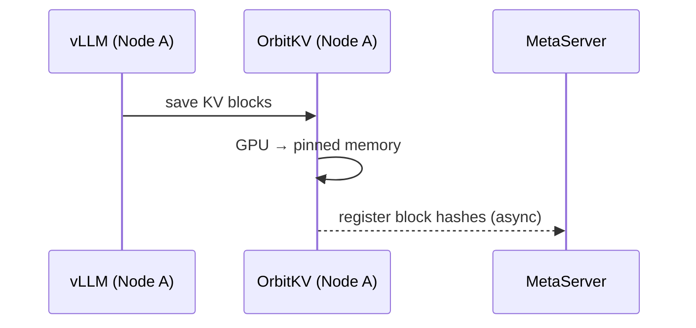
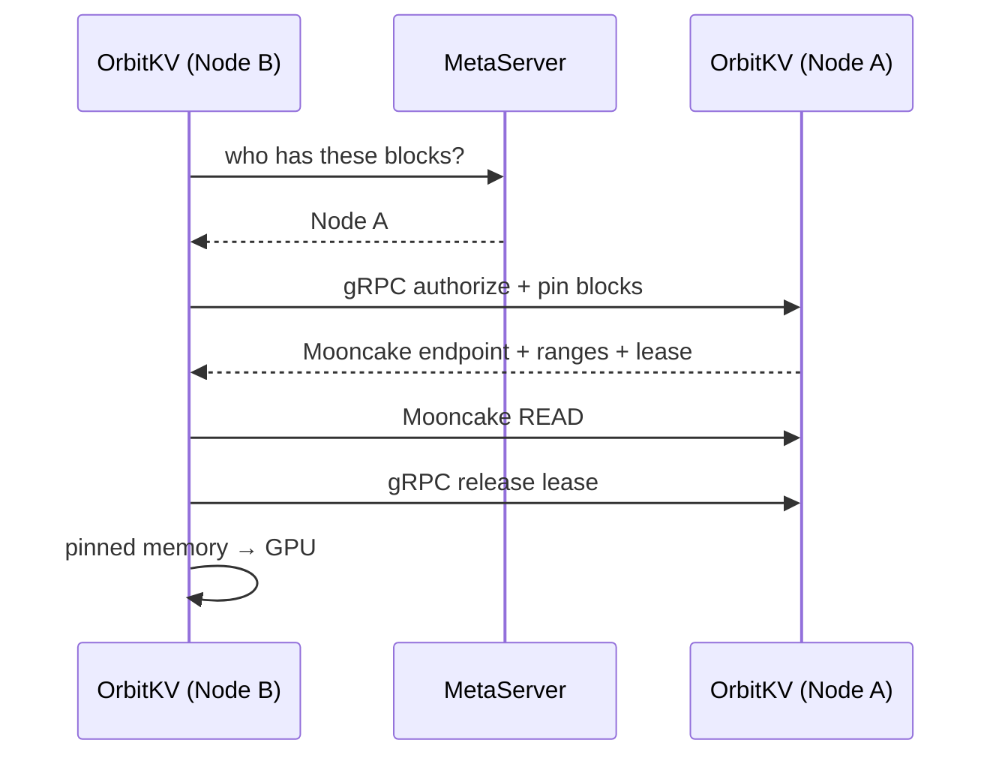

# P2P KV Cache Sharing

Share KV cache across OrbitKV nodes through Mooncake Transfer Engine. When node
B needs blocks that node A already has, OrbitKV authorizes the block ranges and
Mooncake reads them over RDMA (or TCP fallback).

**When to use**: multiple OrbitKV instances serving the same model, shared prefixes are common, and you want to reduce TTFT by avoiding redundant prefill.

## How It Works

### Step 1: Save & Register

Node A saves KV blocks to pinned memory. Block hashes are registered with the MetaServer in the background.



### Step 2: Discover & Fetch

Node B needs the same blocks. It queries the MetaServer, discovers Node A has
them, and reads them through Mooncake's selected transport.



## Quick Start

### 1. Start MetaServer

One per cluster. Lightweight, in-memory only.

```bash
orbitkv-metaserver --addr 0.0.0.0:50056
```

### 2. Start OrbitKV nodes

`--metaserver-addr` enables P2P. `--nics` is optional:

- **`--nics <NAME>...`** — optional Mooncake RDMA allow-list (for example
  `mlx5_0`, `mlx5_0 mlx5_1`). OrbitKV passes it to `MC_TE_FILTERS`. When it is
  omitted, Mooncake selects the available transport and can fall back to TCP.

- **`--metaserver-addr <URL>`** — the MetaServer address. Once set, this node
  starts Mooncake, registers its block hashes, and fetches remote blocks when needed.

When P2P is enabled, `--addr` must use a routable IP. The gRPC service and the
Mooncake P2P endpoint use that host with separate ports.

**Node A** (e.g. `10.0.0.1`):

```bash
orbitkv-cache-manager \
  --addr 10.0.0.1:50055 \
  --pool-size 30gb \
  --nics mlx5_0 \
  --metaserver-addr http://10.0.0.100:50056
```

**Node B** (e.g. `10.0.0.2`):

```bash
orbitkv-cache-manager \
  --addr 10.0.0.2:50055 \
  --pool-size 30gb \
  --nics mlx5_0 \
  --metaserver-addr http://10.0.0.100:50056
```

### 3. Launch inference engine

Same as single-node — OrbitKV server handles P2P transparently.

```bash
vllm serve Qwen/Qwen3-0.6B \
  --kv-transfer-config '{"kv_connector": "OrbitKVConnector", "kv_role": "kv_both", "kv_connector_module_path": "orbitkv.vllm"}'
```

### 4. Verify

Use `--log-level debug` to confirm P2P is working. Look for MetaServer
registration, the advertised Mooncake endpoint, and fetch summaries.

## Fallback Behavior

P2P is opportunistic. Failures degrade gracefully to single-node operation — no crashes, no significant performance impact in most cases.

| Scenario | What happens |
|---|---|
| MetaServer unreachable | Hash registration silently dropped. No remote discovery attempted. |
| Remote node unreachable | Authorization or Mooncake segment open fails; the request proceeds without remote blocks. |
| Transfer timeout | Mooncake segment cache entry is invalidated and the transfer lease is released. |

## Tuning

### Hugepages

For pools >64 GB, hugepages significantly reduce RDMA memory registration overhead and transfer latency. Configure before starting OrbitKV:

```bash
# Allocate hugepages (example: 64 GB of 2MB pages)
echo 32768 > /proc/sys/vm/nr_hugepages

orbitkv-cache-manager --pool-size 64gb --use-hugepages --nics mlx5_0 ...
```

### NUMA affinity

OrbitKV automatically detects GPU–NIC NUMA affinity at startup. For best performance, ensure GPUs and RDMA NICs share the same NUMA node. Check the topology log at startup.

### MetaServer sizing

| Cluster size | Recommendation |
|---|---|
| 2–8 nodes | Defaults are fine (`120 min` TTL) |
| 8+ nodes | Memory scales with unique blocks across all nodes; no capacity cap needed. Monitor MetaServer memory. |

### Metrics

P2P-related Prometheus metrics (on `:9091/metrics` by default):

| Metric | Type | Description |
|---|---|---|
| `orbitkv_remote_fetch_total` | Counter | Total per-segment Mooncake fetch operations |
| `orbitkv_remote_fetch_duration` | Histogram | Mooncake fetch latency distribution |
| `orbitkv_remote_fetch_bytes` | Counter | Total bytes fetched via Mooncake |
| `orbitkv_remote_fetch_plan_segments` | Histogram | Planned segment count per executed Mooncake fetch plan |
| `orbitkv_remote_fetch_plan_completed_segments` | Histogram | Completed segment count before a plan stops |
| `orbitkv_transfer_lock_active` | UpDownCounter | Currently held transfer locks |
| `orbitkv_transfer_lock_timeouts_total` | Counter | Transfer lock timeout events |
| `orbitkv_prefetch_stale_gc_total` | Counter | Stale prefetch active entries removed by background GC |

## Troubleshooting

**Blocks not discovered on remote nodes**

- Both nodes must point to the same MetaServer and serve the same model. Namespace is derived from model name and TP config — mismatched models or TP sizes will result in different namespaces.
- Check MetaServer logs for `InsertBlockHashes` — if absent, the source node isn't registering.

**High Mooncake fetch latency**

- Check NUMA affinity in the startup topology log — cross-NUMA transfers add latency.
- Enable hugepages for large pools (`--use-hugepages`).

For all P2P issues, `--log-level debug` shows the authorization and Mooncake
fetch flow.
