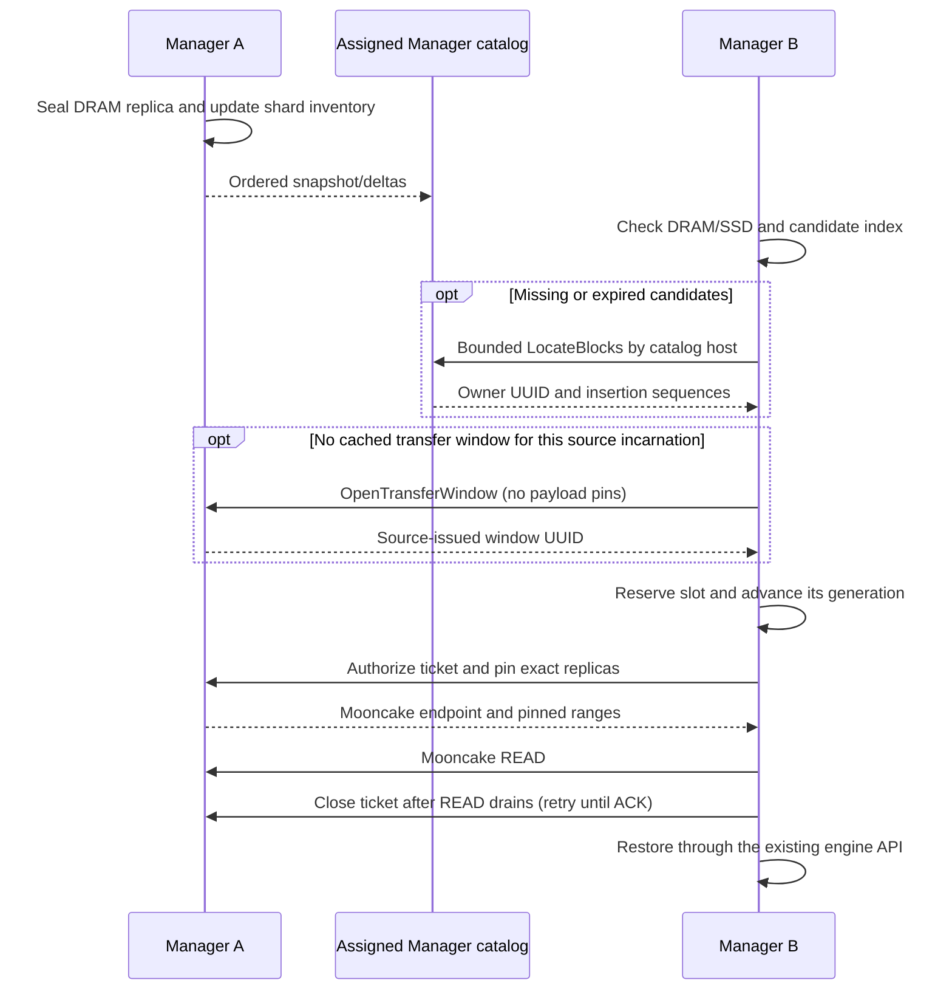

# Distributed KV cache

Managers embed the replica catalog and use Mooncake Transfer Engine for KV bytes.
Distributed mode needs etcd for members and fixed placement configuration; etcd
stores no block hashes and receives no lookup on the cache request path. This is
an experimental deployment with one directory copy per logical shard, not HA.

## Leased Manager membership

Start etcd using your cluster's normal deployment. All Managers use the same
`--cluster-name` and `--catalog-nodes`; each has a distinct stable `--node-id`.
A configured catalog host must be an actual Manager Node ID. Other Managers can
join as storage owners without being selected as catalog hosts.

On host A:

```bash
orbitkv-cache-manager \
  --addr 10.0.0.1:50055 --pool-size 30gb \
  --etcd-endpoints http://10.0.0.101:2379 \
  --cluster-name inference --node-id cache-a \
  --catalog-nodes cache-a,cache-b
```

On host B:

```bash
orbitkv-cache-manager \
  --addr 10.0.0.2:50055 --pool-size 30gb \
  --etcd-endpoints http://10.0.0.101:2379 \
  --cluster-name inference --node-id cache-b \
  --catalog-nodes cache-a,cache-b
```

Use concrete peer addresses reachable from the other hosts. Peer gRPC and
Mooncake's P2P handshake/data endpoints use separate ports on that host. Optional
`--nics mlx5_0,mlx5_1` filters RDMA rails; omitted, Mooncake selects an available
transport including TCP. For a same-host TCP test set `MC_FORCE_TCP=1`.

There is no separate MetaServer process or `--metaserver-addr` flag. Upgrade all
Managers together for this breaking protocol change. Engine processes retain the
same UDS/iceoryx2 and CUDA IPC integration described in the
[vLLM and SGLang deployment guide](deployment.md).

## Lookup and transfer



State identity must match model artifacts, computation, rank topology and storage
geometry. Source authorization, rather than metadata freshness, protects memory
reads. Validate vLLM-to-vLLM and SGLang-to-SGLang separately; these tests do not
establish cross-engine byte compatibility or hybrid-state completeness.

## Failure and configuration behavior

- Registration rejects an already live Node ID. etcd persists restart counters
  under `/orbitkv/v1/inference/epochs/`, leased members under `members/`, and the
  immutable catalog host set under `placement`.
- Snapshots and revisioned Watch populate the cached member view. Watch repair,
  incomplete membership or an expired registration disables new remote work;
  local DRAM/SSD operations continue. The lease TTL defaults to 30 seconds, with
  conservative local admission through half the acknowledged TTL.
- After expiry or fencing, restart the Manager for a new incarnation. Graceful
  shutdown revokes registration; crashes rely on lease expiry. Do not delete a
  live member key to replace a running process.
- Catalog placement uses 16 fixed shards and equal-weight rendezvous hashing of
  configured Node IDs. Missing nodes do not trigger reassignment. Their cold
  lookups miss until they return; other shards and valid cached candidates still
  work. Background inventory replay repairs a restarted catalog.
- Placement changes are not supported online. Incompatible joins fail, and an
  observed changed/deleted placement fences existing members. Use a new cluster
  name and a coordinated restart for configuration replacement.
- Directory recovery does not restore lost KV payloads. Overdue source transfers
  retain their allocations; neither timeout nor membership fencing proves a READ
  has stopped. Rust retains completed release records until the source acknowledges
  them, with a three-second RPC timeout and retry backoff capped at five seconds.
  Capacity is reserved before window setup: 1024 records per requester Manager,
  at most 64 per source incarnation, including active READs. A full budget skips new
  remote authorizations; local caching and other peers can still progress.
- Rust caches a source-issued transfer window per source incarnation. Each window
  has 64 reusable slots; each use advances that slot's generation. The requester
  knows the full ticket before authorization, so cancellation, timeout or a lost
  grant reply can close it without learning anything from the reply. A close that
  arrives before authorization fences the queued request; old authorizations and
  old completions cannot affect a newer generation. Authorization is single use,
  including failed source-budget admission.
- Window setup is single-flight and pins no payload. Each source keeps at most
  1024 windows, evicting only idle windows. An evicted UUID cannot be recreated by
  a delayed authorization; the next attempt opens a fresh window after rejection.
  Active windows survive churn and timeout. Requester peer connections share this
  lifecycle owner; idle entries are evicted above 64, while busy entries stay
  bounded by the 1024-record budget. No per-transfer setup RPC is needed while a
  window remains cached.
- Submitted READs keep their source and destination ownership until Mooncake
  accepts freeing the complete batch, including after partial submission, native
  timeout or status-query errors. Persistent uncertainty retains resources.
- Completion records are in memory. A requester Manager crash can still leave an
  orphaned source hold. Restarting a requester or expiring its membership cannot
  free that hold. Coordinated transport/Manager teardown remains necessary until
  safe revocation is implemented and qualified. Windows and tickets are not an
  authentication mechanism; keep peer endpoints isolated within the cluster.

The etcd connector currently exposes HTTP endpoints; TLS/auth, multi-host clock
qualification and replica failover remain open. A three-member etcd deployment
protects its own control plane; it does not replicate the embedded catalogs.

## Limits and observability

`--inventory-journal-bytes` defaults to 16 MiB divided across shard streams.
Overflow triggers bounded snapshot repair. `--catalog-budget` defaults to 256 MiB
of accounted metadata per Manager, divided across its assigned shards. The
positive candidate cache is 16 MiB with a five-second TTL. Cold lookup batches
contain at most 128 keys and 64 KiB of namespace/hash bytes. Missing keys are grouped
by catalog Manager, so one request can cover all shards assigned to that host.
Each included shard still carries its placement and runtime checks. At most four
hosts are queried concurrently over one cached channel per current host incarnation;
coalescing and all batches share a three-second deadline. Positive hits bypass
that wait. Upgrade peer Managers together for the batched-route protocol.

The Manager's `:9091/metrics` includes catalog per-shard byte/key/replica gauges,
inventory progress counters and Mooncake transfer metrics. Repeated snapshot
starts without commits indicate insufficient history, capacity or connectivity.
See the [catalog protocol](../crates/orbitkv-catalog/README.md) and
[metrics](metrics.md). No tested cluster-scale capacity recommendation exists yet.

## Validation

For independent engine replicas, see [shared-cache qualification](shared-cache-qualification.md).
The source reservation budget is `--transfer-budget` (default: half the pinned
pool), with a maximum of 1024 active or overdue sessions. It charges entire pinned
allocations, deduplicated within each session, so a small slice cannot retain an
unaccounted large slab. Concurrent sessions each reserve their full allocation
footprint. Exhaustion returns a bounded miss to the requesting cache path.

Run native builds and runtime gates sequentially in a checkout; builds restage
shared Mooncake libraries. The etcd gate starts isolated temporary processes:

```bash
ETCD_BIN=/path/to/etcd cargo test --release \
  --no-default-features --features cuda-13,mooncake \
  --lib cluster::tests::etcd -- --ignored

MC_FORCE_TCP=1 cargo test --release -p orbitkv-server \
  --no-default-features --features cuda-13,mooncake \
  --test p2p_mooncake -- --ignored
```

The first gate covers duplicate identities, epochs, Watch/compaction repair,
coordinator stalls, membership bounds and immutable placement fencing. The second
hosts catalog and source control on one Manager endpoint, verifies actual
Mooncake/CUDA bytes, and checks local loads after remote admission is fenced.
The ordinary Rust suite also exercises two catalog endpoints and restart repair.
These are same-host gates; multi-host serving and HA qualification remain next.

The Python process gate starts real etcd plus two Manager binaries, uses the
shared engine-facing client to restore GPU bytes remotely, then verifies local
restoration after stopping etcd. Set the binary path to prevent runtime tests
from starting a concurrent Cargo build:

```bash
cd python
ETCD_BIN=/path/to/etcd \
ORBITKV_CACHE_MANAGER_BINARY=/path/to/orbitkv-cache-manager \
PYTHONPATH=. ../.venv/vllm-release/bin/python -m pytest -m integration \
  tests/integration/test_distributed_cache.py
```
