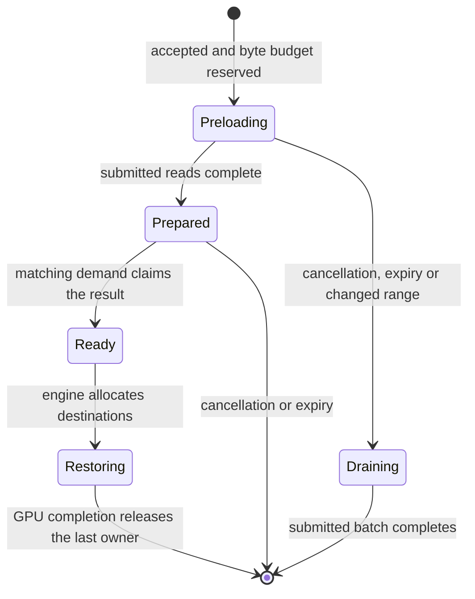

# Consumer-owned request preparation

Request preparation is an opt-in single-node experiment for the pinned vLLM
and SGLang dense-attention paths. It starts host reads for a small number of
accepted requests before ordinary cache admission. Engines still own GPU
allocation, request ordering and the decision to recompute. This is bounded
queue lookahead, not a prediction of future tokens or a replacement scheduler.

## Ownership and selection

Set `ORBITKV_PREPARE_REQUESTS=1` in the inference process. The enqueue adapters
consider at most the first four requests that have not reached execution;
SGLang uses its actual waiting queue and vLLM tracks accepted, not-yet-executed
requests through connector callbacks. They exclude resident HBM pages and
multi-group models. Reordering or changed HBM residency can make the forecast
obsolete: ordinary demand compares the actual hash range and revises the
operation instead of using stale pages. This arrival-order heuristic is
qualified with the default serving policies; it does not predict priority,
preemption, token-budget or cross-rank admission.

The native `prepare_recovery` call applies the compiled contract's
`required_ranges` to the immutable hash batch in Rust. It can represent an
attention prefix, sliding window or checkpoint range. Automatic hybrid-model
lookahead is not enabled: those models continue through candidate discovery,
rank-common boundary selection and revalidated ordinary recovery. A preparation
is never proof that all model components can be restored.

The Manager retains the result until a demand claim. Its existing operation ID,
revision, session epoch, query budget and result lease remain the owners:



Preloading and prepared pages share the speculative quarter of the global and
per-instance query budget with optional warming. Owned preparation can overlap
foreground requests only within that share and the remaining total budget;
unowned warming still yields whenever foreground ownership exists. A range
larger than this quarter is skipped, not truncated into an unproved hybrid
state. Limits are four prepared
operations per native client and Manager session, with the existing global
speculative-operation cap. Ready results retain their byte reservation and
operation permits. Claiming moves their bytes into foreground accounting without
freeing memory; GPU consumers keep that reservation until completion.

Unclaimed results expire after one second without client polling. The client
uses a 900 ms interest deadline to retire stale tickets before that lifetime;
the Manager also rejects an expired claim between sweeps. Session maintenance
runs every 250 ms, so idle reclamation can lag expiry by that interval. Submitted
I/O may take longer: its buffers and budget remain charged until it drains.
The existing `ORBITKV_QUEUE_WARMUP=1` control instead leaves reclaimable pages
in the cache without a consumer lease. Compare the two policies separately.

## Batches and waiting limits

Prepared reads use batches of at most 32 MiB of registered page payload, or one
page when a page exceeds that size. Ordinary demand keeps its existing default
until the experimental controls are explicitly selected on the Manager:

```bash
orbitkv-cache-manager --pool-size 4gb --query-budget 3gb \
  --query-read-batch 32mb --query-read-timeout-ms 100
```

`--query-read-batch` bounds each payload submission. `--query-read-max-batches 1`
is a best-effort, one-batch control; zero means no batch-count limit.
`--query-read-timeout-ms` is a relative deadline measured from operation
submission, including budget waiting. Zero disables this additional deadline.
The ordinary 60-second operation lifetime still applies.

After cancellation or the submission deadline, Rust submits no further batches.
On a demand poll after the read deadline, the Manager retires the caller's
interest and returns a miss so the engine can recompute. A submitted I/O future
continues independently and releases its buffers, reservation and permits only
when it finishes. The current deadline fallback conservatively returns no
prefix; it does not hand off partially accumulated state from a running future.
Best-effort completion can return a completed dense prefix; strict recovery
still validates every selected window/checkpoint lease and rejects incomplete
coverage. Stopping one owner does not cancel another owner's shared read.

Producer-wait P/D queries retain their existing whole-prefix wait semantics;
these experimental read cutoffs target ordinary non-waiting recovery. GPU copy
and Publish deadlines never authorize early page reuse.

## Measurement

Use Qwen3-8B with fixed capacities, prompt sequence, concurrency and tracing:

```bash
.venv/vllm-release/bin/python -m benches.single_node \
  --engine vllm --backend orbitkv --model /workspace/models/qwen3-8b \
  --workload sustained --lengths 1024 4096 --concurrencies 1 4 8 \
  --host-gib 4 --ssd-gib 16 --query-budget-gib 3 \
  --prepare-requests on --read-batch-mib 32 --trace-transfers
```

Use the SGLang environment and `--engine sglang` for its own comparison. Keep
ordinary demand, unowned warming, owned preparation and stopping controls in
separate runs. Record TTFT, throughput, read bytes, speculative/total query
peaks, useful/unused speculative reads and resource drain. The existing
`orbitkv_warmup_*` physical-page counters cover both forms of speculation;
`query_reserved_bytes` distinguishes `preloading` and `prepared` from ordinary
`preparing`, `ready` and `restoring`. Tracing adds `prepared_read_ms`,
`read_stopped` and `read_deadline` observations. Never interpret a prepared-page
hit as evidence of causal latency savings. Default activation requires repeated
paired measurements, including order reversal, with bounded cleanup and no
material read amplification.
