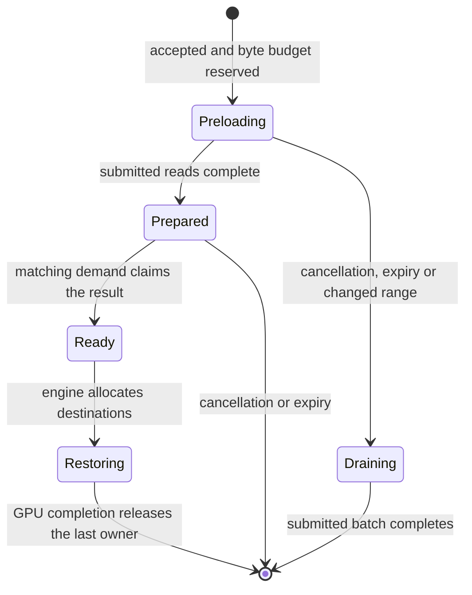

# Consumer-owned request preparation

Request preparation is an opt-in single-node experiment for the pinned vLLM
and SGLang dense-attention paths. It starts host reads for a small number of
accepted requests before ordinary cache admission. Engines still own GPU
allocation, request ordering and the decision to recompute. This is bounded
queue lookahead, not a prediction of future tokens or a replacement scheduler.

## Ownership and selection

Set `ORBITKV_PREPARE_REQUESTS=1` in the inference process. The enqueue adapters
consider at most the first four requests that have not reached execution;
SGLang uses its actual waiting queue and vLLM tracks accepted, not-yet-executed
requests through connector callbacks. They exclude resident HBM pages and
multi-group models. Reordering or changed HBM residency can make the forecast
obsolete: ordinary demand compares the actual hash range and revises the
operation instead of using stale pages. This arrival-order heuristic is
qualified with the default serving policies; it does not predict priority,
preemption, token-budget or cross-rank admission.

vLLM's ordinary single-group lookup uses native `prepare_prefix`: it preserves
partial-prefix results and counts a logical lookup only when foreground demand
claims the result. Native `prepare_recovery` applies the compiled contract's
`required_ranges` to the immutable hash batch in Rust. It can represent an
attention prefix, sliding window or checkpoint range. Automatic hybrid-model
lookahead is not enabled: those models continue through candidate discovery,
rank-common boundary selection and revalidated ordinary recovery. A preparation
is never proof that all model components can be restored.

Selected-boundary preparation carries the complete `RecoveryDemand`, including
other groups' required ranges. Claiming requires the same demand as well as
the same selected hashes; an incomplete selected group returns no lease. An
ordinary prefix query does not implicitly claim a selected-boundary operation.

The Manager retains the result until a demand claim. Its existing operation ID,
revision, session epoch, query budget and result lease remain the owners:



Preloading and prepared pages share the speculative quarter of the global and
per-instance query budget with optional warming. Owned preparation can overlap
foreground requests only within that share and the remaining total budget;
unowned warming still yields whenever foreground ownership exists. A range
larger than this quarter is skipped, not truncated into an unproved hybrid
state. Limits are four prepared
operations per native client and Manager session, with the existing global
speculative-operation cap. Ready results retain their byte reservation and
operation permits. Claiming moves their bytes into foreground accounting without
freeing memory; GPU consumers keep that reservation until completion.

Unclaimed results expire after one second without client polling. The client
uses a 900 ms interest deadline to retire stale tickets before that lifetime;
the Manager also rejects an expired claim between sweeps. Session maintenance
runs every 250 ms, so idle reclamation can lag expiry by that interval. Submitted
I/O may take longer: its buffers and budget remain charged until it drains.
The existing `ORBITKV_QUEUE_WARMUP=1` control instead leaves reclaimable pages
in the cache without a consumer lease. Compare the two policies separately.

## Batches and waiting limits

Prepared reads use batches of at most 32 MiB of registered page payload, or one
page when a page exceeds that size. Ordinary demand keeps its existing default
until the experimental controls are explicitly selected on the Manager:

```bash
orbitkv-cache-manager --pool-size 4gb --query-budget 3gb \
  --query-read-batch 32mb --query-read-timeout-ms 100
```

`--query-read-batch` bounds each payload submission. `--query-read-max-batches 1`
is a best-effort, one-batch control; zero means no batch-count limit.
`--query-read-timeout-ms` is a relative deadline measured from operation
submission, including budget waiting. Zero disables this additional deadline.
The ordinary 60-second operation lifetime still applies.

After cancellation or the submission deadline, Rust submits no further batches.
On a demand poll after the read deadline, the Manager retires the caller's
interest and returns a miss so the engine can recompute. A submitted I/O future
continues independently and releases its buffers, reservation and permits only
when it finishes. The current deadline fallback conservatively returns no
prefix; it does not hand off partially accumulated state from a running future.
Best-effort completion can return a completed dense prefix; strict recovery
still validates every selected window/checkpoint lease and rejects incomplete
coverage. Stopping one owner does not cancel another owner's shared read.

Producer-wait P/D queries retain their existing whole-prefix wait semantics;
these experimental read cutoffs target ordinary non-waiting recovery. GPU copy
and Publish deadlines never authorize early page reuse.

## Measurement

Use Qwen3-8B with fixed capacities, prompt sequence, concurrency and tracing:

```bash
.venv/vllm-release/bin/python -m benches.single_node \
  --engine vllm --backend orbitkv --model /workspace/models/qwen3-8b \
  --workload sustained --lengths 1024 4096 --concurrencies 1 4 8 \
  --host-gib 4 --ssd-gib 16 --query-budget-gib 3 \
  --prepare-requests on --read-batch-mib 32 --trace-transfers
```

Use the SGLang environment and `--engine sglang` for its own comparison. Keep
ordinary demand, unowned warming, owned preparation and stopping controls in
separate runs. Record TTFT, throughput, read bytes, speculative/total query
peaks, useful/unused speculative reads and resource drain. The existing
`orbitkv_warmup_*` physical-page counters cover both forms of speculation;
`orbitkv_query_speculative_reserved_bytes` measures the speculative budget;
`orbitkv_query_reserved_bytes_by_phase` distinguishes `preloading` and `prepared`
from ordinary `preparing`, `ready` and `restoring`. Tracing adds `prepared_read_ms`,
`read_stopped` and `read_deadline` observations. Never interpret a prepared-page
hit as evidence of causal latency savings. Default activation requires repeated
paired measurements, including order reversal, with bounded cleanup and no
material read amplification.

## Measured results

The 2026-09-23 qualification completed 20 Qwen3-8B runs on one H20:
18 SSD-backed policy runs and two DRAM-only runs. Source `ffada83e`, vLLM 0.29.0,
SGLang 0.5.20, BF16, TP=1. See the
[final CSVs and reproduction script](../benches/results/20260922-preparation/README.md).

Each policy run uses the same 64-request sequence at concurrency four, 75%
reuse selection, 12 prefixes, 1,024/4,096-token inputs and 16-token outputs.
GPU capacity is 16,384 tokens; host/SSD/query capacities are 4/16/3 GiB.
There are three matched 32 MiB demand/preparation pairs per engine; the middle
pair reverses execution order. Tracing is on and unowned warming is off.
These short windows finish in 6–15 seconds; they do not replace a long soak.

| Engine / pair | Throughput change | P95 TTFT change | SSD bytes/request change |
| --- | ---: | ---: | ---: |
| vLLM / 1 | +1.9% | −3.7% | −17.7% |
| vLLM / 2 | +2.7% | −11.7% | −19.0% |
| vLLM / 3 | +2.9% | −14.9% | −20.7% |
| SGLang / 1 | +2.9% | +13.2% | −16.4% |
| SGLang / 2 | +8.4% | +11.6% | −17.8% |
| SGLang / 3 | +5.8% | +7.5% | −17.8% |

**Keep preparation disabled by default.** vLLM improves both measures in these
controls, but SGLang trades worse tail latency for throughput. Every paired
prepared page footprint eventually reaches H2D, with no unused or pending
footprints at the final sample. That proves consumption, not a causal latency
saving: engine admission and scheduling can still increase exposed waiting.

Stopping policies use preparation with 32 MiB batches. The unbounded control
uses ordinary demand; it isolates the default behavior rather than pairing
another policy change with preparation.

| Engine / policy | P95 TTFT (ms) | Output tokens/s |
| --- | ---: | ---: |
| vLLM / unbounded demand | 517.4 | 154.8 |
| vLLM / 100 ms deadline | 771.6 | 94.9 |
| vLLM / one batch | 934.0 | 74.6 |
| SGLang / unbounded demand | 583.0 | 142.8 |
| SGLang / 100 ms deadline | 1517.7 | 84.1 |
| SGLang / one batch | 1353.3 | 68.8 |

These cutoffs increase recomputation and reduce throughput in this workload.
Keep ordinary read cutoffs at zero. Submitted reads retain their owners until
completion even when the engine abandons waiting.

All measured windows drain query reservations and submitted I/O to zero. Sampled
query peaks are at most 2,304 MiB and speculative peaks at most 720 MiB, within
the 3 GiB total and 768 MiB speculative limits. Settle-plus-drain takes at most
1.413 seconds, including the fixed 1.2-second settle; it is not page-release
latency. Physical prepared footprints can remain as reclaimable cached pages
after a stopping control. `pending_mib_after` preserves those bytes separately
from the zero final query reservation.

The DRAM supplement uses an 8 GiB host pool, no SSD and C1/C4. All restored
phases have positive H2D bytes and zero SSD reads. At C4, shared/mixed post-HBM-
pressure P95 TTFT is 184.6/153.8 ms for vLLM and 83.3/106.7 ms for SGLang.
The different capacity means these runs are not a matched DRAM/SSD speed ratio.
The container's SSD path does not establish physical NVMe performance.

Ordinary greedy runs retain output differences against their cold references:
48/576 vLLM and 35/576 SGLang policy requests, plus one of 60 requests in each
DRAM supplement. The CSVs preserve per-run counts. Deterministic serving faults
and exact GPU-byte recovery gates passed separately; they do not erase these
diagnostics. Automatic hybrid lookahead, multi-rank serving and priority-based
selection remain outside this qualification.
