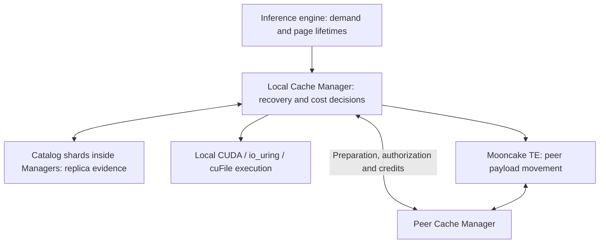
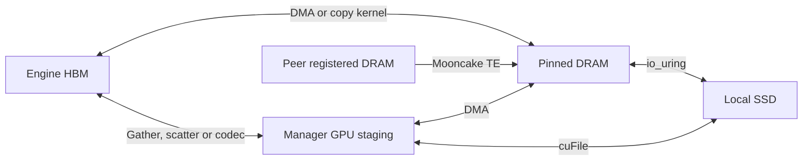
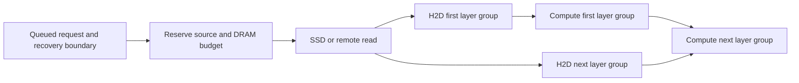

# State demand and transfer planning

Status: readiness, query ownership, compiled page demand and the first SSD
source/path separation are implemented. Cost observations and raw-copy/SSD-route
shadow are opt-in; measured execution selection and predictive planning remain proposals. The
existing cache API, engine-owned HBM, and one Cache Manager per host remain
the foundation.
The [SSD experiment](ssd-performance.md) supplies initial
measurements; predictive policies require separate evaluation.

The [implementation sequence](#implementation-sequence) below turns the
proposal into reviewable changes. [Manager decisions below the engine](#cache-manager-decisions-below-the-engine)
define the primary planning boundary; [Dynamo reuse](#reuse-dynamo-for-request-routing)
is a later integration for worker selection.
The design covers local tiers and Mooncake TE peer transfers with shared cost
observations, resource accounting and recovery checks. Implement local decisions
first; qualify distributed modes separately. Worker routing remains a later
milestone and is not required for transfer planning.
The [implementation plan](implementation-plan.md) connects these contracts to
LMCache/FlexKV/Mooncake source references, deployment packaging and the next
agent's bounded implementation packet.

## Cache Manager decisions below the engine

Target behavior: an engine already assigned a request asks its local Manager
for compatible state. That Manager discovers local and peer replicas, selects
the recovery boundary and movement plan, acquires resource ownership and
executes it. This must work without a KV-aware request router. It does not
move the inference request to another worker or take over engine HBM allocation.



The cluster view is queryable across the cache deployment. Each Manager keeps
its exact local inventory, its assigned catalog shards and bounded evidence
for relevant peers and state domains. It does not synchronously mirror every
block or queue in the cluster. Extend the existing [catalog design](distributed-cache.md)
rather than introducing another central decision service.

| Planning evidence | Distribution and use | Authority at execution |
| --- | --- | --- |
| Membership, incarnation, capabilities and topology | Cached membership/configuration; etcd stays off per-read paths | Current owner incarnation and operation compatibility |
| Key, residence, representation, bytes and generation | Ordered owner inventory into catalog shards; batched lookup and bounded hot subscriptions | Source validates and pins the selected residence |
| Source preparation pressure and export/staging capacity | Bounded, timestamped summaries; optionally refresh only a shortlisted owner | Source admits or rejects against its current credits |
| Transfer, decode and consumer-ready costs | Destination observations keyed by route, source/resource, representation and size; source supplies its own preparation evidence | Actual completion updates the estimates |

Resource summaries need sequence, incarnation, age and uncertainty. A queue
summary from another host is not a reservation or a synchronized clock reading.
Expire derived estimates conservatively, bound discovery fan-out, and coalesce
duplicate lookups. Incomplete catalog coverage remains unknown. Correctness
comes from source ownership and destination completion, independently of how
fresh the planning hints are.

For each request, first derive legal `required_ranges`. Discover a bounded set
of compatible replicas without reading payloads, then compare executable local
and peer routes to the same engine-ready state. Account for source preparation,
queueing, transfer, decode and GPU completion along their dependency critical
path; retain confidence and first-use deadlines. Use hard resource budgets and
tenant shares before comparing eligible completion times. The engine may resume
recomputation through its existing miss/admission contract; the Manager cannot
independently schedule engine compute.

Only selected work obtains source leases and destination credits. Bound partial
reservations and retries so simultaneous Managers cannot pin each other's pools
while waiting indefinitely. Source admission protects SSD, export bandwidth and
staging from many destinations choosing the same apparently idle peer. Replan
on stale evidence or rejection; use switching margins to avoid oscillation.
Stop unsubmitted work at the request deadline and retain submitted-I/O ownership
until safe completion, including after cancellation.

Retention, SSD writes, warming and useful replication use the same observations
on a slower budgeted path. Copy placement requires destination admission and
confirmed committed state before updating evidence. Replication goals need a
designated per-key decision owner before coordinated replica deletion; stale
global counts cannot enforce a minimum copy count. Keep this separate from
foreground restore decisions and from ephemeral P/D destinations.

This ownership differs from the audited [KVCR design](https://github.com/ai-dynamo/kvcr/blob/317e62f301300c101bf9c911e020fb89b35f1583/docs/design_overview.md),
which places cross-node inventory in the router and gives KVCR request-scoped
source hints. Borrow its claims and completion rules without adopting that
inventory dependency. NIXL estimates, if available, supply transfer costs;
neither NIXL nor Mooncake TE is the authority for OrbitKV state compatibility
or cluster-wide cache placement. Optional Dynamo routing can later consume
Manager summaries, while Managers retain discovery and physical decisions.

Current implementation has embedded discovery, bounded candidate caching,
source authorization and opt-in cost observations. Peer fetch selection still
maximizes consecutive coverage from one owner; it does not rank by measured
completion time. Per-residence advertisements, peer resource summaries and the
joint local/peer decision loop above remain implementation work.

## What can be known ahead of time

| Evidence | What OrbitKV can prepare | Limit |
| --- | --- | --- |
| Tokenized request waiting for engine admission | Its exact reusable prefix and component set | Admission order and start time may change |
| Next scheduled batch or prefill chunk | The next restore and its first consumer | Requires an engine callback before pages are consumed |
| Known layer order | Later layer groups while earlier groups execute | CUDA graph replay needs device-visible dependencies |
| Tool call or application workflow graph | The already-computed conversation or shared system prefix likely to resume | Branches and return times are hints, not guarantees |
| Historical session reuse | Retention priority and bounded speculative DRAM warming | Cannot predict arbitrary new prompt text or safely evict live GPU pages |

Start with declared requests and measured queue delay. Add workflow hints only
after cancellation, resource limits, and demand-fetch fallbacks are reliable.
No learned predictor is needed for the first implementation. Unknown future
tokens never become a claimed exact cache hit.

## Engine signals and their present limits

vLLM 0.29.0 has a useful readiness contract:
`get_num_new_matched_tokens` may return `None`, asking the scheduler to retry.
OrbitKV already uses this for `QueryLoading`. `update_state_after_alloc` then
supplies valid destination pages. Publication and preemption callbacks supply
source lifetime evidence. This supports asynchronous lookup without blocking
the scheduler, but does not expose the entire future batch schedule.

SGLang 0.5.20's `UnifiedCacheLinker.lookup` reports restorable boundaries;
it has no pending result. OrbitKV now uses SGLang's general plugin
`HookRegistry` around `PrefillAdder.add_one_req`: an unresolved query leaves
that request in the waiting queue while other requests can be admitted. The
next prefix match polls the same query and retains its ready lease until load
or cancellation. Attention ranks reduce the wait/expiration decision together.
A five-second waiting budget cancels preparation and permits recomputation;
it does not cancel a submitted GPU restore. This budget is a fixed guard,
not a measured cost policy. No installed engine files are changed and HiCache
storage is not enabled. Multi-rank serving still needs separate qualification.

Both adapters currently acknowledge whole restores. SGLang's eight-request
submission window does not establish layer readiness; vLLM's layer callback is
not a per-layer completion fence. These are prerequisites for true overlap.

Shared client ownership now lives in Rust: query revisions, warming cancellation,
the independent publish connection, and eventfd/fallback restore waiting.
PyO3 exposes this owner directly; Python no longer maintains a second query map,
request counter or waiting loop. Each adapter prepares an immutable Rust
`BlockHashes` batch once per lookup. Prefix views share its allocation, so repeated
polls need neither per-page Python conversion nor hash copying/comparison when
reusing that batch and view. Changed inputs still revise the owned operation;
equivalent independently built batches are compared by value. Python still
checks engine request drift and handles GPU allocation. Hybrid discovery now
separates metadata from payload reads; the selected ranges are sliced and
validated in Rust before the adapter reports a hit.

## Minimal demand contract

Evolve `orbitkv-state` and the existing channel instead of introducing a second
cache service or adapter facade. A demand record needs:

- Request/session identity and a revision for changed or cancelled work.
- Computation identity, logical token boundary, and required state components.
- Estimated first-use time, priority, confidence, and a maximum waiting budget.
- A target engine/rank topology; an HBM destination only after engine allocation.
- An operation/lease ID with a terminal completion or drained cancellation.

The result distinguishes a miss, a candidate that can be fetched, a reserved
source, resident state, and state ready for GPU consumption. A directory hint
alone cannot authorize skipping computation. Speculative warming uses a
bounded budget and does not pin engine pages before admission.

## Recovery semantics before placement

The existing model fingerprint establishes computation and storage identity.
A planner also needs a complete `StateBundle` at a legal boundary:

| Model state | Evidence needed to resume at token boundary t |
| --- | --- |
| Full attention | All required attention groups cover the needed prefix |
| Sliding-window attention | The model-specific trailing window ending at t |
| Recurrent/SSM hybrid | An exact checkpoint at t plus convolution and attention state required there |
| MLA or native sparse attention | Compatible latent/positional bytes and any required indexer or auxiliary state |
| Speculative decoding | Accepted-token boundary; draft state cannot be published as committed target state |

For a hybrid model, a longer attention match with a shorter recurrent
checkpoint is not a longer restorable prefix. The engine adapter supplies
model-specific rules; the shared contract checks component coverage and
compatibility. Generation-qualified HBM references must enter the actual
transfer path before stale page IDs can be rejected at that boundary.
The [compiled recovery contract](hybrid-recovery.md) implements SGLang's
prefix, window and checkpoint cases in both engines, including their combination.
The same normalized rules emit `required_ranges` for a selected boundary;
SGLang checks transferred plus retained pages and vLLM masks hybrid destinations
against those ranges. Adapters supply absolute coverage backed by leases and
keep engine-specific allocation and handoff logic. This is a prerequisite for
cost selection,
not a latency estimator or an automatic model-graph proof.
Cross-engine byte reuse, dynamic LoRA, and live weight changes remain outside
the present supported contract.

Hybrid demand now separates candidate discovery from materializing bytes.
The pinned
[LMCache prefetch controller](https://github.com/LMCache/LMCache/blob/05a013b29da78cf2321b9b46ec5039dde2fb0bb0/lmcache/v1/distributed/storage_controllers/prefetch_controller.py)
is a reference for trimming per-group demand while preserving an engine-owned
fallback. OrbitKV's implementation discovers DRAM/SSD/catalog positions, uses
Rust to compute legal boundary intersections, then slices actual reads to
`required_ranges`. vLLM applies its final-token budget before reading; SGLang
synchronizes selected-boundary readiness before allocating destinations.
Actual leases must cover every selected page. Stale evidence releases partial
state and falls back to recomputation from the valid HBM origin. This preserves
query-relative positions and independent consumers' read ownership. See
[hybrid recovery](hybrid-recovery.md) for exact-byte gates. Additional discovery
rounds and avoided payload bytes are separate effects; no TTFT gain is claimed.

## Decide when to copy, retain, and restore

Three decisions share observations but have different lifetimes:

| Decision | Inputs | Result |
| --- | --- | --- |
| Restore | Legal boundaries, existing replicas, representation, deadline and resource queues | Required ranges, selected sources and an executable transfer plan, or an engine-owned recompute proposal |
| Retain and publish | Observed reuse, avoided computation, capacity and write pressure | Whether to create/retain a replica, its tier and permitted encoding |
| Schedule | Admitted demand, preparation, writeback and completion dependencies | Bounded batches and resource reservations, with demand headroom and bounded write starvation |

The engine supplies request/revision identity, valid HBM origin, page lifetime
and available scheduling evidence. Roles and TP/PP shape belong to registered
engine instances and operations, not a single role on the Manager's membership
record: one Manager can serve several replicas or both prefill and decode.

Materialize a replica while its immutable source is valid and spare transfer
capacity is available. Copying a replica early does not authorize freeing HBM:
the engine decides semantic liveness and the transfer completion proves that
DMA no longer reads that generation.

Keep likely near-term reuse in DRAM. Consider SSD admission for reusable prefixes
whose avoided recomputation justifies writes and their expected storage time.
Measure saved GPU time, copied bytes, and retained byte-seconds separately;
do not add those quantities without explicit cost weights. Large one-off
prefills should not automatically monopolize the SSD write queue. Restore
traffic needs priority with bounded write starvation.

### Transfer paths and cost observations

Represent a candidate by location, representation and valid generation, rather
than a tier name alone. A block may have several replicas. Only discover
metadata while enumerating alternatives; reserve and revalidate the selected
sources before reading. Estimates never prove source availability or readiness.



CUDA IPC imports engine allocations; it is not the HBM/DRAM movement mechanism.
Current GDS paths use registered GPU staging, not arbitrary direct engine-page
I/O. Speculative SSD preparation targets DRAM. General remote SSD staging and
peer-HBM cache sourcing remain future work; the experimental vLLM GPU-to-GPU
P/D connector is a separate handoff path. See [GPU storage](gds.md) and
[distributed source ownership](distributed-cache.md#transfer-lifetime-and-resource-control).

Current selection is not a calibrated policy: DMA/kernel is selected at instance
registration, SSD `auto` selects capability and disables new cuFile work after
failure, and cache discovery uses existing tier/coverage rules. Rust observes
these owners and evaluates raw-copy and SSD-route candidates in shadow. Execution
uses the registered copy backend and the default or explicitly configured SSD route.

Host-staged io_uring and cuFile GPU staging are now independent executable
candidates over the same SSD index, representation and immutable extent lease.
Healthy cuFile does not suppress the io_uring candidate. The host route reads the
leased generation through the existing bounded reader queue on a separate restore
lane, then copies/decodes into engine HBM; it does not look up a replacement by key.
The cuFile route retains its existing registered staging and completion owners.
Neither route makes staging a separate cache tier.

`--ssd-backend` controls cuFile capability initialization and existing write behavior.
`--ssd-read-path uring|cufile` explicitly chooses the demand-read route for ablations;
when omitted, existing source priority and capability-based selection remain.
An unavailable explicit SSD route is not silently replaced by host prefetch;
ordinary remote recovery remains available. Prepare/warmup still fills DRAM.
This is a local source/path boundary, not a general cost-driven tier planner.
Measured selection, shared-device scheduling and native GDS qualification remain
open. Failure never revokes submitted source or destination ownership.

The following evidence and estimation requirements describe the target policy.
The implemented P4.1 subset is specified in the observation contract below.

| Candidate | Cost evidence |
| --- | --- |
| DRAM to HBM, DMA | Logical/payload bytes, coalesced ranges, copy queue and PCIe/NUMA path |
| DRAM to HBM, copy kernel | Fragment count, launch time and interference with inference kernels |
| SSD through DRAM to HBM | SSD read queue/service, host staging, H2D and measured overlap |
| SSD through cuFile to HBM | Actual I/O mode, alignment/padding, GPU staging, scatter/decode and completion |
| Encoded restore | Stored and transferred bytes, codec/CRC service, workspace pressure and inference interference |
| Peer DRAM through TE to HBM | Discovery, source authorization, source/destination pressure, TE service and local restore |

Build bounded Rust estimates from execution events, with the same observations
feeding exported metrics. Do not query the metrics service from the planner.
Key estimates by direction, resource/device/NUMA path, size/fragmentation bucket
and format. Peer estimates also need incarnation and transport context; an
endpoint address alone must not carry old measurements across restarts.
Track short/long rolling estimates, sample counts and prediction error. Separate
queue wait from service time and account for shared SSD, PCIe, NIC and GPU
resources once. Timeouts are censored observations, not exact completion times;
continue tracking submitted work through terminal completion.

Start with a small set of supported executable paths. A generic shortest-path
solver over fixed edge weights cannot account for budgets, contention or
pipelined work. Engine prefill profiles need model, shape and live load evidence;
the Manager cannot infer a universal recompute cost from token count alone.

### Candidate routes and eligibility

Here, local means the requesting engine's host. Enumerate only sources backed by
current candidate evidence and paths with implemented, qualified executors.
The following is the design space, not the present shadow selector's coverage.
Use [residence plus owner/resource location](distributed-cache.md#residency-proximity-and-access-paths)
to discover replicas; access methods and temporary staging are not additional
cache tiers. Several residences may contain the same compatible state.

| Route to the consuming engine | Current boundary / admission requirement |
| --- | --- |
| Local DRAM → local HBM | Implemented DMA/kernel; raw-copy shadow preserves the registered backend |
| Local SSD → io_uring → local DRAM → local HBM | Explicit route over an immutable lease, separate host lane; full-restore shadow includes optional decode and H2D |
| Local SSD → cuFile → local GPU staging → local HBM | Independent route and full-restore shadow over the same lease; native GDS qualification and measured selection remain open |
| Peer DRAM → TE → local DRAM → local HBM | Current shared-cache route; physical two-host/RDMA qualification remains open |
| Peer DRAM → TE → local GPU staging → local HBM | Planned; GPU registration, capacity and decode/scatter ownership required |
| Peer DRAM → TE → local engine HBM | Planned; registered destinations, exact engine-ready bytes/layout and completion visibility required |
| Peer HBM → TE → local DRAM or GPU memory | General cache sourcing planned; source engine must grant a lifetime lease. GPU-to-GPU vLLM P/D is an existing experimental handoff, not general peer-HBM reuse |
| Peer SSD → owner DRAM → TE → local DRAM or GPU memory | Planned owner-local staging with bounded credits at both ends |
| Peer SSD → owner GPU staging via cuFile → TE → local GPU memory | Later candidate only on qualified source GDS and GPU RDMA paths; charge source GPU space and interference |
| Mounted remote storage → cuFile → local GPU staging | Separate future storage deployment; not an implicit Mooncake peer-memory path |

Native GPU RDMA requires registered GPU allocations and a supported device,
driver and network topology. TCP support alone does not make a GPU-direct route
eligible. GPU staging and engine HBM are different destinations: encoded bytes
need validation/decode before the engine consumes them. Do not enumerate every
peer/tier/codec combination or recursively fetch through peers to manufacture
an available source. Score bounded, useful alternatives, including local
recomputation, against the same required state and consumer deadline.

Ordinary reuse uses requester-driven TE READ; P/D uses producer-driven WRITE
into admitted destinations with completion notification. READ/WRITE specify the
initiator and operation, not whether either memory endpoint is DRAM or HBM.
OrbitKV selects sources, destination ownership and staging; TE owns the actual
network transport, rails and endpoints. Include observed transport identity in
cost evidence when available, without duplicating TE's transport scheduler.


### P4.1 observation contract

The Rust cost observer sits in the existing GPU workers, SSD queues and peer
fetch owner. It keeps at most **512 entries** for path, resource incarnation,
representation family and logarithmic byte/descriptor-count buckets. SSD route
keys additionally distinguish whole leased source-image bytes/fragments and the
SSD-derived target bytes/fragments, including mixed DRAM/SSD jobs. These source
sizes describe stored images, not inferred unpadded logical data. An entry
needs four successful samples and expires after five idle minutes; stale evidence
must warm up again. It maintains an EWMA estimate and absolute error: individual
operation paths use completed service time, while `ssd_uring_restore` and
`ssd_cufile_restore` use enqueue-to-GPU-terminal total time for the complete route.
Estimator contention drops an update instead of blocking execution. Resource,
request and state identities never become metric labels.

| Boundary | Meaning of the host-observed sample |
| --- | --- |
| Raw GPU load/save | Enqueue, worker admission, backend submission, existing stream completion; successful DMA reports copied payload bytes |
| Encoded GPU load/save | Inclusive codec and staging operation; overlaps existing codec/transfer timers |
| SSD route restore | `ssd_uring_restore` / `ssd_cufile_restore` span enqueue through GPU terminal completion, including queueing, materialization and copy/decode or staging/scatter; physical bytes belong to underlying I/O owners |
| GPU SSD write | Inclusive worker job; underlying cuFile or io_uring owns the physical byte count |
| io_uring read/write | Queue, SQ preparation and observed CQE; actual returned bytes include short I/O, and alignment is physical rather than logical data |
| SSD prefetch | One shared physical batch, including allocation and reconstruction, excluding subsequent H2D; consumers are counted separately by existing query metrics |
| SSD write batch | Ingest queue, admission and the batch's final ordered completion/commit; child I/O owns physical bytes |
| cuFile slot | Submission to existing completion event; read includes scatter, write includes gather; actual transferred bytes include padding |
| Peer authorization / READ | Authorization is separate from the blocking READ queue and terminal native completion; evidence is scoped to peer incarnation |

`orbitkv_cost_stage_seconds` exports queue, admission, completed service and
inclusive total. These are host clocks, not CUDA event or device-service times.
**Do not sum parent and child path timers.** Failed, cancelled, timed-out or
abandoned operations never train a successful service or route-total estimate. A dropped caller
cannot end an in-flight physical observation: io_uring and TE retain theirs at
the completion owner. Missing terminal evidence is not a zero-duration success.

`orbitkv_cost_logical_bytes` is the known attempted logical data within each path;
raw backing images without unpadded metadata increment `cost_logical_unknown`
instead of treating allocation padding as logical state. GPU layouts and encoded
metadata provide exact logical sizes.
`orbitkv_cost_io_bytes` contains only physical bytes known at that I/O owner.
Unknown counts have their own counter rather than being reported as zero.
Partial failed GPU/TE work may have unknown bytes. Kernel descriptor uploads and
codec internal traffic do not yet have complete byte attribution. Physical I/O
is counted once when a shared read serves several logical consumers.

The initial shadow consumer inspects the **actual raw copy descriptors**. DMA
is feasible for ordinary copies; the kernel alternative requires mapped host
addresses. It reports predictions, age, count and error for those candidates
without launching alternatives or changing readiness, ownership or registration.
Unobserved alternatives remain unknown. Descriptor-count buckets do not yet
model DMA coalescing or engine interference; the reported prediction error is
part of that limitation.

SSD-route shadow uses the same leased sources and requested GPU destinations,
considering io_uring and cuFile only when their route requirements are satisfied.
It compares full-restore estimates with the same completion target. It launches no
alternative reads and does not choose execution; unobserved alternatives remain
unknown. Route totals overlap child operation timers and must not be added to
them. Dynamic route, representation and legal-boundary selection remain later
work. No measured speedup is attributed to an unexecuted path.

Observations and shadow work are **off by default**. Set
`ORBITKV_COST_OBSERVATIONS=1` before starting the Manager to enable them;
unset or `0` preserves the disabled baseline. The earlier observation-only matrix
passes five of six cells; SGLang ANS SSD exceeds the TTFT p50 budget, so default
enablement remains unqualified. That matrix predates independent SSD-route
execution; [current validation](implementation-plan.md#ssd-sourcepath-separation-final-evidence)
is recorded separately.
There are no Python hot-loop callbacks, extra GPU synchronizations or payload
reads for telemetry. See [the paired workload](../benches/README.md#cost-observation-overhead)
for the predeclared overhead budget and final qualification evidence.

### Choose a legal boundary and completion target

For the current whole-restore admission model, estimate times from the same
decision point:

```text
state_ready(boundary, path) = resource wait + restore critical path + completion visibility
first_token(boundary, path) = max(engine_admission, state_ready) + remaining_prefill(boundary)
```

Compare a bounded set of legal boundaries and their exact `required_ranges`,
including recomputation from the engine's valid HBM origin. The longest hit
need not yield the earliest usable state: a shorter DRAM boundary can beat a
longer SSD/peer restore. The engine confirms execution/recompute admission;
the Manager owns the selected transfers. Preserve complete rank/component
coverage, then revalidate actual leases before accepting the boundary.

Respect declared TTFT and inter-token-latency targets before optimizing goodput
and capacity. Include active-decode interference and uncertainty; do not add
milliseconds, byte-seconds and failure probability without explicit units or
constraints. Existing [codec controls](storage-formats.md#dram-control) improve
throughput while increasing median TTFT in some cases, so neither compression
ratio nor cache hit rate is a sufficient objective.

Initially select paths for existing representations. Adaptive encoding requires
explicit logical-state/physical-format identity and qualified readers; it cannot
silently change the current storage namespace. Lossy modes require an allowed
quality policy. CPU SIMD can reduce codec time but does not imply compressed
PCIe traffic when the CPU path restores full-width data before H2D.

Do not equate a predicted deadline with readiness. Switch plans before
submission, or only for unsubmitted batches with their own ownership. Submitted
I/O retains its source, destination and scratch until completion or proven
revocation. Use one remaining wait budget across stages and retries, interpreted
on each host's local clock; do not compare monotonic timestamps across hosts.

### Prepare before use and retain useful replicas

Schedule prefetch from its estimated deadline backwards:

```text
start <= first use - measured remaining critical-path latency - uncertainty margin
```

Stage SSD or remote bytes in DRAM while the request waits. Reserve HBM close to
admission. Prepared pages remain budgeted until consumption, cancellation or
expiry. Bound speculation, GPU staging/codec workspace, outstanding SSD/TE bytes
and per-instance shares, not only DRAM capacity. Current SSD writes use weak
source references and may be dropped under pressure; any future promised replica
needs a reservation. Once correctness supports it, pipeline disk chunks, H2D layer
groups, and computation through a dependency graph:



Use measured overlap rather than adding all stage durations. A node may report
readiness only after its required device dependency is established. Cancellation
revokes scheduling interest, drains submitted transfers, and only then releases
pages or mappings. CUDA graph capture and replay both need qualification.

The transfer scheduler belongs in `orbitkv-core`: bound outstanding bytes,
prioritize demand reads by slack, cap speculative reads, and account for shared
SSD/PCIe/NUMA/NIC resources. The adapters supply demand and lifecycle events;
`orbitkv-channel` carries them. A future router can consume summaries after
the local planner is useful. No new central Catalog is required for this work.

## Policies by deployment mode

These are planning contracts, not additional supported-mode claims. DP, TP, PP
and P/D are composable deployment dimensions: a P/D service can have several
replicas with TP inside each. Attach operation intent, instance/rank topology
and completion requirements to work instead of introducing one exclusive
deployment-mode switch. Current evidence is listed in [deployment](deployment.md).

| Mode or operation | Decision objective | Completion and failure contract |
| --- | --- | --- |
| Single instance | Compare DRAM/SSD restore with legal recomputation; protect active decode | Engine owns admission/HBM; cancel drains submitted work |
| Several instances on one host | Share capacity while bounding each instance's pinned bytes and device queues | One model or speculative queue cannot exhaust demand capacity; layouts remain isolated |
| Independent replicas / DP | Compare local restore, authorized peer sources and recomputation for an already selected worker | Stale candidates are rejected; bounded discovery/retry may become a cache miss, with the engine confirming recomputation |
| P/D handoff plus reuse | Deliver current-request state to the admitted decode consumer, while retaining reusable state separately | Reserve destination capacity and complete required groups before decode; failed handoff needs explicit retry, reroute/re-prefill or request failure, never an ordinary cache-miss acknowledgement |
| TP inside a replica | Select a rank-common legal boundary and minimize time until all required shards are ready | Slowest required shard and collective dependencies affect admission; a local rank hit cannot authorize global readiness |
| PP, optionally with TP/DP/P/D | Prepare each stage's owned state ahead of its consumer and limit pipeline stalls | Stage dependencies and restart boundaries remain explicit; storage support alone does not establish PP integration |

Remote byte movement uses Mooncake TE through `orbitkv-transfer`. OrbitKV owns
state compatibility, replica discovery, source capabilities, budgets and the
restore plan; do not duplicate TE's transport implementation or infer RDMA from
a successful transfer. Current shared-cache recovery stages peer bytes in local
DRAM before GPU restore. Native RDMA, general peer-HBM restore, remote SSD and
TP/PP integration each need separate evidence.

Extend the same cost observations with discovery, authorization, owner-local
preparation, TE transfer, destination decode/H2D and engine-visible completion.
Count release acknowledgement and retained source byte-seconds as resource costs
without automatically adding them to the request critical path. Cached directory
evidence avoids repeated discovery, not source lifetime checks; etcd remains
membership/configuration coordination and never a per-read dependency.

For later remote SSD support, the owner prepares only its own SSD bytes into
bounded registered memory, then TE moves them. Reserve source and destination
credits without holding unbounded partial reservations. Do not recursively fetch
from another peer or advertise SSD-only state as immediately RDMA-readable.
Peer-HBM sourcing similarly needs engine-owned lifetime evidence; it is not a
free Manager memory pool. Different TP/PP shapes require explicit compatibility
or a separately implemented resharding step.

P/D must also transfer reused P-side state needed by D; skipping P computation
does not prove D already owns its KV. Layer overlap needs actual producer and
consumer fences, not only average network bandwidth. A future request router
chooses eligible workers and consumes summaries; each selected Manager still
revalidates sources and leases. Keep routing optional.

## Reuse Dynamo for request routing

Source audit: September 24, 2026, Dynamo
[v1.5.0](https://github.com/ai-dynamo/dynamo/releases/tag/v1.5.0), commit
`b83b1d9304ebfc624709ac46db32b1b6f1ff1615`. The capabilities below were checked
in that release, not inferred from the newer `dev` documentation. OrbitKV has
not yet built or integrated this dependency.

The routing implementation is already reusable:

- [`dynamo-kv-router`](https://github.com/ai-dynamo/dynamo/blob/v1.5.0/lib/kv-router/README.md)
  exports prefix indexers, a local request scheduler, load accounting, and
  worker selection. Its
  [Cargo features](https://github.com/ai-dynamo/dynamo/blob/v1.5.0/lib/kv-router/Cargo.toml)
  make `dynamo-runtime` optional. A Rust integration need not adopt the whole
  Dynamo runtime, although sibling hashing/token crates and enabled service
  dependencies still need build qualification.
- The release's
  [default selector](https://github.com/ai-dynamo/dynamo/blob/v1.5.0/lib/kv-router/src/scheduling/selector/default.rs)
  combines projected prefill/decode load with device, pinned-host, disk, and
  shared-cache credits. Its score is expressed in weighted block equivalents;
  it is not a prediction of an SSD operation's completion time in milliseconds.
- The
  [standalone selection contract](https://github.com/ai-dynamo/dynamo/blob/v1.5.0/docs/fern/pages/developer-guide/knowledge-base/modular-components/router/standalone-selection.md)
  supports HTTP selection and active-load reservation without forwarding
  inference. `SelectionServiceBuilder` embeds that lifecycle in Rust. A
  production integration should use it rather than the intentionally local,
  unsynchronized `SelectionCore` helper.
- The experimental [custom selection API](https://github.com/ai-dynamo/dynamo/blob/v1.5.0/docs/fern/pages/developer-guide/knowledge-base/modular-components/router/custom-worker-selection.mdx)
  exposes Rust `WorkerFilter`, `WorkerScorer` and `WorkerPicker` policies while
  Dynamo retains eligibility, queues, reservations and accounting. Custom
  policies build against the same checkout as the frontend or EPP. Existing
  [topology constraints](https://github.com/ai-dynamo/dynamo/blob/v1.5.0/docs/fern/pages/developer-guide/knowledge-base/modular-components/router/router-topology.md)
  also support required or preferred P/D transfer domains; these constraints
  and biases do not measure a particular transfer's duration.

| Decision | Owner | Information required |
| --- | --- | --- |
| Select an inference worker or DP rank | Dynamo request router | Prefix overlap, worker eligibility, active prefill/decode load |
| Decide whether a token boundary is recoverable | OrbitKV recovery contract plus adapter evidence | Model/storage identity, token coverage, complete components |
| Choose and reserve the source replica | Cache Manager | Current residency, replica generation, source lease |
| Schedule SSD reads, H2D, D2H, and later remote reads | Cache Manager transfer planner | Bytes, queue pressure, staging capacity, first-use budget, completion dependencies |
| Allocate or reuse engine HBM and schedule computation | Inference engine | Page lifetime, batch membership, execution dependencies |

A Dynamo load reservation books projected inference work. An OrbitKV lease
holds a source or destination generation alive. They have different owners
and completion conditions. Selecting a worker does not reserve SSD extents,
pinned memory, or CUDA destination pages.

Even with one worker, requests may compete for SSD/PCIe bandwidth and staging
capacity. Worker selection alone cannot order those physical operations or
establish a CUDA completion fence. Dynamo also developed tiered block management,
but [KVBM is deprecated in v1.5.0](https://github.com/ai-dynamo/dynamo/releases/tag/v1.5.0)
with removal targeted for v1.6.0. Do not introduce a new KVBM dependency.

The separate [KV Cache Runner (KVCR)](https://github.com/ai-dynamo/kvcr/blob/317e62f301300c101bf9c911e020fb89b35f1583/README.md)
is experimental: its initial release supports cross-node DRAM sharing and
local disk caching for vLLM; SGLang integration remains future work. Its
[design](https://github.com/ai-dynamo/kvcr/blob/317e62f301300c101bf9c911e020fb89b35f1583/docs/design_overview.md)
separates discovery, fetch/delivery, claims and release, with router source
hints and NIXL movement. Borrow those ownership contracts. A submitted hint
does not currently initiate movement or pin a remote source; proactive hint
fetching is planned. KVCR is not a KVBM replacement or a qualified Rust
dependency for OrbitKV's two engine adapters.

Unified transfer interfaces also exist. NIXL v1.4.1's
[backend contract](https://github.com/ai-dynamo/nixl/blob/v1.4.1/docs/BackendGuide.md)
includes optional `estimateXferCost`, returning duration, error margin and
estimation method; [UCX implements it](https://github.com/ai-dynamo/nixl/blob/v1.4.1/src/plugins/ucx/ucx_backend.cpp).
NIXL also has a [Mooncake TE plugin](https://github.com/ai-dynamo/nixl/blob/v1.4.1/src/plugins/mooncake/README.md),
marked Preview. Its audited
[backend class](https://github.com/ai-dynamo/nixl/blob/v1.4.1/src/plugins/mooncake/mooncake_backend.h)
does not override the cost estimator. Choosing Mooncake therefore does not
exclude NIXL, but an API declaration is not evidence of estimates on every route.

NIXL can be embedded independently of Dynamo. Its published
[Rust bindings](https://github.com/ai-dynamo/nixl/blob/v1.4.1/README.md#rust-bindings)
provide `nixl-sys`; a native integration need not route operations through
Python. Qualify the real native library and selected plugins at runtime, not
just a successful binding build. Backend availability still depends on the
build, registered memory types and hardware.

The backend guide describes selection by eligible memory registrations and
backend preference when several plugins match. An optional transfer estimator
does not establish automatic end-to-end cache optimization. Keep cache source,
format, required-range and staging decisions with the Manager; leave backend
transport mechanics with NIXL or TE. Compare direct TE with NIXL plus the same
TE backend separately from comparisons that also change the backend to UCX.

Before building a broader transfer interface, evaluate NIXL with Mooncake in
an isolated prototype. Qualify native integration, pinned TE compatibility,
registration lifetime, cancellation/completion, codec staging and overhead.
Keep the current direct TE path until that comparison justifies a change.
Backend estimates can seed individual transfer costs; OrbitKV must still
account for owner preparation, queues, decode, required ranges and the actual
consumer fence. Missing estimates remain unknown, not zero-cost routes.

The later routing milestone will first integrate the upstream default selector,
not copy its formula into a competing implementation. Prefer a pinned Rust
dependency in an optional routing component owned by `orbitkv-server`; keep
the GPU/SSD core independent of it. Deployments that already use Dynamo may
retain its selection service instead. Choose one request-selection owner in
each deployment. Neither mode becomes a prerequisite for a single-node cache.

The future integration must supply real events and load lifecycle, rather
than assuming an existing OrbitKV block hash is a Dynamo routing hash:

- Partition by computation identity, tokenizer/hash scheme, block size, and
  engine/rank compatibility. Derive matching query and event hashes using the
  same scheme; do not reinterpret OrbitKV's 32-byte keys as router integers.
- Publish HBM events from the engine and DRAM/SSD residency changes from the
  Manager, with epochs, ordering, removals, and inventory recovery. Announce an
  SSD replica after successful writing. A pending read is not a resident hit.
- Resolve overlapping tier coverage before scoring. Advertise lower-tier
  credit only for adapter paths that can actually restore that state.
- Book load on assignment; update it on prefill completion, cancellation,
  generation progress, and request completion as required by the selected
  upstream model. Reconcile worker restarts and abandoned bookings.
- Revalidate state and obtain transfer leases at the selected Manager. Router
  events and cost estimates may be stale; they never authorize skipping prefill.

Start with upstream tier weights as a routing baseline. Later, feed calibrated
Manager estimates into the upstream `WorkerScorer` interface only if measurements
justify it. The policy API exists; carrying OrbitKV's estimates into its inputs
still needs an integration contract. Normalize units and avoid counting cache
savings twice: adding a
millisecond transfer estimate directly to the default block score is invalid.
Keep estimates bounded and timestamped; export coarse summaries rather than
asking every Manager to reserve data for each candidate request.

## Research to borrow from

- [KVFlow (2025)](https://arxiv.org/abs/2507.07400) uses an agent execution graph
  and proximity to future steps to guide retention and CPU-to-GPU prefetch.
  Workflow hints are a useful extension when applications can provide them.
- [Marconi (MLSys 2025)](https://arxiv.org/abs/2411.19379) handles recurrent
  state constraints and values reuse by compute savings relative to memory.
  This motivates boundary-aware admission rather than treating every token
  page as an interchangeable recovery point.
- [ECHO (OSDI 2026)](https://www.usenix.org/conference/osdi26/presentation/liu-guangda)
  overlaps lossless recall with indexer computation for native sparse attention
  using graph-compatible GPU mechanisms. Its model-specific opportunity does
  not justify dropping dense Qwen3 attention KV or assuming unchanged accuracy.
- [Dynamo's routing model](https://github.com/ai-dynamo/dynamo/blob/v1.5.0/docs/fern/pages/developer-guide/knowledge-base/modular-components/router/routing-concepts.md)
  combines cache locality with active work. Reuse its implementation at the
  later routing milestone, with the ownership boundary described above.

These mechanisms are prior work, not OrbitKV inventions. The proposed direction
combines explicit demand, legal recovery boundaries, resource scheduling, and
measured restore-versus-recompute decisions. Performance and novelty claims
require comparisons against compatible implementations on the same workloads.

## Implementation sequence

The initial SSD measurements, stage metrics, and direct GPU byte tests are
complete in the SSD measurement change. The following stages are planned;
each needs its own implementation and acceptance evidence. Start with dense
full-attention, TP=1, and the currently pinned vLLM/SGLang releases. Broader
model and topology support needs separate qualification.

These stage identifiers group local planning work. Follow the
[current delivery priorities](roadmap.md#current-delivery-priorities) for the
next changes and the DP/P/D gates. Qualify ordinary-demand lifetimes first;
optional warming gains and the later cost model do not gate two-host DP work.
Fix identity or page-lifetime failures in every supported path as they are
found, without waiting for completion of the broader P5 recovery contract.

| Stage | Reviewable deliverable | Main code owners | Prerequisite |
| --- | --- | --- | --- |
| P0 | Prove a supported SGLang readiness/admission hook | `python/orbitkv/sglang/`, pinned engine interface | Current source audit and SSD reproduction |
| P1 | Owned pending operations, cancellation and bounded completion retention | `orbitkv-core`, `orbitkv-server`, `orbitkv-channel`, Python bindings/client | Can proceed while P0 establishes the engine contract |
| P2 | SGLang consumes SSD results in actual serving | SGLang linker and its qualified admission hook | P0 and P1 |
| P3 | Explicit demand and bounded early warming to DRAM | Engine adapters, state/channel contracts, core prefetch | P1 and P2 |
| P4 | Measured path/boundary decisions and SSD write admission, with shared peer observations | Core storage/query/transfer/backing and `benches/` | Existing demand/codec measurements; P3 evidence for preparation decisions |
| P5 | Recovery evidence, page generations and layer completion fences | State contracts, adapters, core GPU workers | P2; required before P6 |
| P6 | Qualified overlap of storage, H2D and computation | Core transfer/backing and engine layer callbacks | P3 and P5 |
| R1 | Upstream Dynamo routing with OrbitKV events | Optional server routing component and event integration | Recoverable distributed catalog and qualified remote restores |

### P0: establish the SGLang scheduling contract

The pinned `UnifiedCacheLinker.lookup` returns `list[int]` of fully restorable
boundaries; it has no pending result. In the pinned scheduler, request-arrival
prefetch and admission-time `check_prefetch_progress` are guarded by
`enable_hicache_storage`. The current OrbitKV plugin constructs the external
linker and rejects the separate hierarchical-cache mode. Merely overriding a
cache method does not make those guarded scheduler calls run.

The implemented admission hook is the release's general plugin
`HookRegistry` around `sglang.srt.managers.schedule_policy.PrefillAdder.add_one_req`.
It returns `CONTINUE` without adding the pending request to the batch. The
scheduler retains that request and can admit the next one. This is a pinned
engine integration: hook signatures and serving behavior must be checked on
an engine upgrade. Controlled-completion integration tests exercise local
waiting, other-request progress, changed keys, cancellation, and rank decisions.

The single-rank serving gate passes DRAM and forced-SSD recovery across engine
restart, with cached tokens, positive GPU-load bytes, and equal deterministic
outputs. Real-buffer integration tests also cancel or disconnect during SSD
reads and verify unconsumed results leave no pinned blocks. Other-request
progress and delayed completion are covered by controlled admission tests.
The serving gate also restores four shared prefixes concurrently. The
[bounded 1/4/8-request baseline](concurrent-performance.md) records shared and
mixed workloads; sustained contention and multi-rank admission still need
separate qualification.

### P1: make pending work an owned operation

Implemented foundation: `orbitkv-server/src/endpoint/pending.rs` is now the
only query polling registry. Explicit operation/revision tickets are scoped by
authenticated session and bind the instance, request, group, and query content.
Submission and polling are separate; a poll cannot recreate retired work. The core returns a terminal
`QueryResult` from its future; its request-string prefetch table and stale
prefetch GC are removed. Completion inserts/discards fetched data without
requiring another client poll.

`CancelQuery` drops waiting interest. In-flight work drains on Tokio and drops
an undelivered lease on completion. A cancelled read continues occupying its
operation permit until completion; limits are 128 per session and 1024 globally.
Operation-capacity exhaustion reports unadmitted `Loading`. Byte pressure keeps
an admitted ticket pending until its registered group footprint fits globally
and per instance. Reservations survive result delivery and every GPU consumer.
Identical prefix reads can be shared with independent owners and leases; SSD
queue pressure waits for space. A too-large individual query bypasses restore.
Expired replies drop resources while retaining a bounded tombstone until poll,
cancel, or session teardown. Both adapters cancel superseded queries. Channel
ABI 5 requires rebuilding the manager and client together.

Deterministic [fault gates](fault-qualification.md) cover delayed SSD completion,
cancelled ownership, lost completion notifications, stuck/malformed Publish
acknowledgements and Manager restart with live old clients. Broader concurrent
serving fault/soak runs and deadline/priority hints remain separate work. The current budget charges each owner's padded
payload conservatively; physical allocator occupancy is a separate metric.
It distinguishes preparation, ready leases, and restoration, with queueing and
backing reconstruction included in preparation. Exact per-device staging and
first-use scheduling are P3/P4 work.

The wire request ID remains message correlation; tickets identify semantic
work. The core owns backing operations and resources, while the endpoint owns
encoding, authentication, and delivery. Polling observes one operation and
cannot start a retired read or mint a second lease. An abandoned reply releases
its lease. Cancellation ends waiting interest; submitted I/O and GPU consumers
retain their buffers until completion. Reconnecting cannot adopt old work.

Current gates cover session isolation, changed revisions, repeated polls,
retirement, cancellation/disconnect during a shared SSD read, delivered-lease
cleanup, and reservation lifetime through multiple consumers. The new process
fault gate verifies drain after delayed completion and rejects old handles and
leases after restart; unknown DMA completion retains pages. The burst baseline checks that retained query bytes return to zero
without a stale-entry sweep after every completed burst.

### P2: qualify actual SGLang SSD recovery

The single-rank serving gate and the
[Qwen3-8B SSD follow-up](ssd-performance.md#query-readiness-follow-up) now pass:
both engines consume all 15 forced-SSD restores with matching SSD-read and
GPU-load bytes. Cold and DRAM controls are retained, including the observed
vLLM 1K storage-stage latency increase. The later
[concurrent baseline](concurrent-performance.md) retains shared/mixed burst
measurements and output controls. Multi-rank serving, sustained contention, and
injected faults under concurrent serving remain separate gates.

Connect the P0 admission lifecycle to P1. A ready, leased result must be consumed
by the request's subsequent prefix match and restore. A verified miss, bounded
waiting-policy expiration, or pre-transfer failure may lead to recomputation
from a valid boundary. A submitted GPU load keeps its existing fail-closed
ownership rules; there is no arbitrary fallback while DMA may still be active.

Extend the current SGLang serving E2E and `benches.single_node` workload.
For each of the 15 forced-SSD requests, require an actual external GPU load and
the expected restored prefix, including SGLang's last-page rule. Keep the
existing exact GPU-byte tests as a separate transfer check. Add delayed SSD
completion, partial/missing suffixes, cancellation, and an unrelated request
that progresses while another waits. The test must use the serving adapter's
waiting path, not poll readiness on its behalf from the test process.

Run the vLLM correctness gate after shared query changes. Retain the 1K/4K/8K
DRAM controls and investigate regressions before introducing predictive policy.

### P3: prepare declared demand within a byte budget

Operation revisions, conservative byte ownership, and shared backing reads are
implemented in P1. The first [queued-warming implementation](queued-warming.md)
announces exact prefixes from both engine queues, caps warmup bytes at a quarter
of global/per-instance budgets, skips hints under pressure, and releases their
ownership without a lease or another poll. Optional logs expose the transfer
lifecycle. P3 is not complete. Follow the
[reviewed implementations and policy order](queued-warming.md#reference-implementations-and-policy-order):
first qualify bounded consumer-owned preparation and result retention, then
explicit best-effort/timeout stopping with submitted work draining. Existing
demand leases already provide ownership; extend that lifecycle for a bounded
lookahead rather than pinning every enqueue hint. Add calibrated first-use
estimates only after these controls. Begin with exact queued prompts and
engine-provided scheduling evidence. Relative budgets are interpreted at the
receiver; do not compare monotonic clocks across hosts.

Warmup-origin physical pages now carry first-successful-H2D / last-owner-release
accounting with pending bytes and completed byte-seconds. New hints yield while
foreground query ownership is active, and warmup peeks do not change recency.
These measurements describe page reuse, not causal latency savings or confirmed
engine consumption; use them to calibrate the next admission policy.
The [matched page-use controls](queued-warming.md#page-use-and-reclamation-controls)
leave 92.9% of SGLang's prepared footprint unused and admit little vLLM warming.
Queue position can bound the first lookahead without an execution-time model.
The absence of a query lease is not proof that a queued request can soon
consume prepared KV; prepared residency must remain inside the admission
budget through handoff or expiry.

Extend `storage/prefetch.rs` rather than adding a second scheduler facade.
Refine the current global/per-instance ownership budget with device and staging
accounting. Keep capacity for normal demand restores and independent leases
for owners of shared reads. Give overdue demand work priority, cap speculative traffic, and bound write
starvation. Application workflow hints remain disabled until this lifecycle
and resource accounting pass their gates.

Acceptance: concurrent requests larger than the DRAM working-set budget,
duplicate prefixes, request reordering and cancellations stay bounded. Record
enqueue, read start, host-ready, restore submission, GPU-ready, and first-use
timestamps. Measure useful prefetch bytes and unused retained byte-seconds.
Demonstrate that early warming reduces exposed wait on a workload with real
queueing; a serial idle server need not gain anything from earlier demand.

### P4: calibrate costs and choose useful writes

Implement the [path observations](#transfer-paths-and-cost-observations) and
[deployment contracts](#policies-by-deployment-mode) in separate changes:

1. Record queue/service/completion evidence and bounded cost estimates in Rust.
   Run shadow decisions without changing source selection. Compare predictions
   with actual executed paths; unselected alternatives are not measured savings.
2. Select among qualified local paths for the same bytes, first DMA/kernel,
   then io_uring/cuFile once native measurements exist. Require improvement above
   uncertainty and a switching margin; avoid oscillation and foreground probes
   that duplicate expensive I/O. Keep current behavior when evidence is weak.
3. Compare legal boundaries and restore/recompute proposals using engine admission
   evidence. Refine first-use preparation, resource shares and bounded batches.
4. Tune retention, write admission and permitted representations from observed
   reuse and capacity pressure. Charge source holds, staging and unused prepared
   byte-seconds. Reuse existing admission/eviction owners.

Carry peer identity and stage measurements alongside local work so DP does not
need a replacement planner. Activate peer source comparisons after remote
recovery qualification; P/D and TP/PP retain their distinct completion gates.
Extend Core's existing storage/query and transfer/backing owners, with shared
cost state only where it has consumers. Do not add a scheduler facade, generic
transport registry or Python policy loops. Adapters provide engine evidence.

Acceptance: separate ablations for early demand, read scheduling, and write
admission. Report p50/p95/p99 TTFT, inter-token latency, goodput under declared
SLOs, prediction error, physical read/write bytes, unused prefetch bytes, source
holds and memory occupancy. Pair source/path choices under matching pressure;
test queue changes, stale estimates, mixed instances, cancellation and slow
peers. A policy is not accepted on hit rate alone. Keep established behavior as the initial
policy configuration until the new policy passes these measurements; this
does not require maintaining duplicate implementations or compatibility APIs.

### P5 and P6: prove recovery and then overlap execution

P5 puts absolute token spans, component coverage, and format evidence into the
actual transfer path. Enforce engine page allocation generations, including
reuse during preemption. Generation values must come from allocation/reuse
events; incrementing an adapter transfer counter does not supply that evidence.
Qualify full-attention first. Hybrid checkpoints, sliding windows, MLA and
auxiliary state each require their own complete recovery gate.

P6 adds per-layer-group completion dependencies to Core's `transfer/worker/`, the backing
pipeline, and both adapters. Start with whole-prefix SSD preparation plus
layer-group H2D/compute overlap; only then pipeline SSD chunks through a bounded
staging ring. The current serialized full restore remains the reference for
byte correctness during evaluation. GPU execution must wait on a dependency
that is valid on every CUDA graph replay, not only on a host wait during graph
capture. Drain cancellation before reusing any ring slot or engine page.

Acceptance: exact poisoned-destination byte checks, eager and graph-replay
inference, partial submission faults, cancellation, and allocation reuse under
pressure. Measure decode interference as well as TTFT. Publish overlap gains
only for qualified engine/model/layout combinations.

### R1: reuse the upstream router after distributed recovery

First build a small pinned `dynamo-kv-router` integration and replay known
events and worker loads through the upstream selector. Use its service builder
for production lifecycle. Validate the event/hash mapping and reservation
accounting before adding custom cost inputs. Keep this component optional and
outside `orbitkv-core`; no current single-node dependency or service is added.

Then exercise multiple engine replicas with OrbitKV tier events and the
recovered catalog. Compare upstream default routing with load-only routing,
and separately evaluate any calibrated selector extension. Test event loss,
reordering, node restart, expired cost summaries, and failed source reservation.
A stale routing hint may degrade latency; it must never become a false cache
hit. Router-level load booking and Manager transfer leases are released through
their respective lifecycle events.

## Evaluation contract

Keep scripts and results in `benches/`; keep correctness and failure tests in
the existing Python integration/E2E and Rust test suites. Extend those owners
rather than duplicating launchers or adding forwarding packages.

Preserve the original serial forced-tier test as a regression baseline. Add
natural DRAM pressure, concurrency 1/4/8/16, partial-prefix reuse, cancellation,
and mixed SSD reads/writes. Compare compatible native-engine, LMCache, and
FlexKV SSD configurations under the same model revision, token/page budgets,
storage path and I/O mode. Record unavailable combinations as such.

Measure latency from request arrival, including scheduler waiting. Do not hide
prefetch time by resetting the timer at admission. Record application hint
lead time separately. Predeclare sample sizes, SLOs, and regression budgets;
five samples per cell do not qualify tail latency. Preserve unsuccessful reads
as misses. An oracle with perfect future knowledge is an upper bound, separate
from deployable policies. Run independent ablations for demand timing, overlap,
and admission, then repeat the combined policy on held-out workloads.
