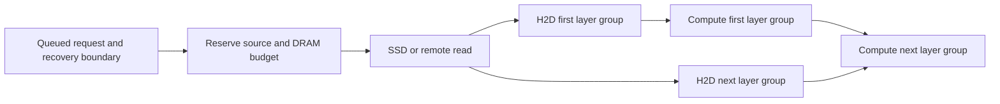

# State demand and transfer planning

Status: readiness and query ownership foundations implemented; predictive
planning remains a design proposal. The existing cache API,
engine-owned HBM, and one Cache Manager per host remain the foundation.
The [SSD experiment](ssd-performance.md) supplies initial
measurements; predictive policies require separate evaluation.

The [implementation sequence](#implementation-sequence) below turns the
proposal into reviewable changes. [Dynamo reuse](#reuse-dynamo-for-request-routing)
defines the boundary between worker selection and physical transfer scheduling.
The current scope is single-node recovery and scheduling; routing remains a
later milestone.

## What can be known ahead of time

| Evidence | What OrbitKV can prepare | Limit |
| --- | --- | --- |
| Tokenized request waiting for engine admission | Its exact reusable prefix and component set | Admission order and start time may change |
| Next scheduled batch or prefill chunk | The next restore and its first consumer | Requires an engine callback before pages are consumed |
| Known layer order | Later layer groups while earlier groups execute | CUDA graph replay needs device-visible dependencies |
| Tool call or application workflow graph | The already-computed conversation or shared system prefix likely to resume | Branches and return times are hints, not guarantees |
| Historical session reuse | Retention priority and bounded speculative DRAM warming | Cannot predict arbitrary new prompt text or safely evict live GPU pages |

Start with declared requests and measured queue delay. Add workflow hints only
after cancellation, resource limits, and demand-fetch fallbacks are reliable.
No learned predictor is needed for the first implementation. Unknown future
tokens never become a claimed exact cache hit.

## Engine signals and their present limits

vLLM 0.29.0 has a useful readiness contract:
`get_num_new_matched_tokens` may return `None`, asking the scheduler to retry.
OrbitKV already uses this for `QueryLoading`. `update_state_after_alloc` then
supplies valid destination pages. Publication and preemption callbacks supply
source lifetime evidence. This supports asynchronous lookup without blocking
the scheduler, but does not expose the entire future batch schedule.

SGLang 0.5.20's `UnifiedCacheLinker.lookup` reports restorable boundaries;
it has no pending result. OrbitKV now uses SGLang's general plugin
`HookRegistry` around `PrefillAdder.add_one_req`: an unresolved query leaves
that request in the waiting queue while other requests can be admitted. The
next prefix match polls the same query and retains its ready lease until load
or cancellation. Attention ranks reduce the wait/expiration decision together.
A five-second waiting budget cancels preparation and permits recomputation;
it does not cancel a submitted GPU restore. This budget is a fixed guard,
not a measured cost policy. No installed engine files are changed and HiCache
storage is not enabled. Multi-rank serving still needs separate qualification.

Both adapters currently acknowledge whole restores. SGLang's eight-request
submission window does not establish layer readiness; vLLM's layer callback is
not a per-layer completion fence. These are prerequisites for true overlap.

## Minimal demand contract

Evolve `orbitkv-state` and the existing channel instead of introducing a second
cache service or adapter facade. A demand record needs:

- Request/session identity and a revision for changed or cancelled work.
- Computation identity, logical token boundary, and required state components.
- Estimated first-use time, priority, confidence, and a maximum waiting budget.
- A target engine/rank topology; an HBM destination only after engine allocation.
- An operation/lease ID with a terminal completion or drained cancellation.

The result distinguishes a miss, a candidate that can be fetched, a reserved
source, resident state, and state ready for GPU consumption. A directory hint
alone cannot authorize skipping computation. Speculative warming uses a
bounded budget and does not pin engine pages before admission.

## Recovery semantics before placement

The existing model fingerprint establishes computation and storage identity.
A planner also needs a complete `StateBundle` at a legal boundary:

| Model state | Evidence needed to resume at token boundary t |
| --- | --- |
| Full attention | All required attention groups cover the needed prefix |
| Sliding-window attention | The model-specific trailing window ending at t |
| Recurrent/SSM hybrid | An exact checkpoint at t plus convolution and attention state required there |
| MLA or native sparse attention | Compatible latent/positional bytes and any required indexer or auxiliary state |
| Speculative decoding | Accepted-token boundary; draft state cannot be published as committed target state |

For a hybrid model, a longer attention match with a shorter recurrent
checkpoint is not a longer restorable prefix. The engine adapter supplies
model-specific rules; the shared contract checks component coverage and
compatibility. Generation-qualified HBM references must enter the actual
transfer path before stale page IDs can be rejected at that boundary.
Cross-engine byte reuse, dynamic LoRA, and live weight changes remain outside
the present supported contract.

## Decide when to copy, retain, and restore

Materialize a replica while its immutable source is valid and spare transfer
capacity is available. Copying a replica early does not authorize freeing HBM:
the engine decides semantic liveness and the transfer completion proves that
DMA no longer reads that generation.

Keep likely near-term reuse in DRAM. Consider SSD admission for reusable prefixes
whose avoided recomputation justifies writes and their expected storage time.
Measure saved GPU time, copied bytes, and retained byte-seconds separately;
do not add those quantities without explicit cost weights. Large one-off
prefills should not automatically monopolize the SSD write queue. Restore
traffic needs priority with bounded write starvation.

For an admitted request, compare measured estimates of:

```text
restore: transfer-queue wait + uncovered restore critical path
recompute: GPU-queue wait + missing-state prefill
```

Include contention with active decode and the cost of evicting other useful
state. Recompute only from a complete legal boundary. Avoid speculative
transfers whose expected benefit is lower than their bandwidth and occupancy
cost. Current SSD writes use weak source references and may be dropped under
pressure; future admission must reserve resources for any promised replica.

Schedule prefetch from its estimated deadline backwards:

```text
start <= first use - measured remaining critical-path latency - uncertainty margin
```

Stage SSD or remote bytes in DRAM while the request waits. Reserve HBM close to
admission. Once correctness supports it, pipeline disk chunks, H2D layer
groups, and computation through a dependency graph:



Use measured overlap rather than adding all stage durations. A node may report
readiness only after its required device dependency is established. Cancellation
revokes scheduling interest, drains submitted transfers, and only then releases
pages or mappings. CUDA graph capture and replay both need qualification.

The transfer scheduler belongs in `orbitkv-core`: bound outstanding bytes,
prioritize demand reads by slack, cap speculative reads, and account for shared
SSD/PCIe/NUMA/NIC resources. The adapters supply demand and lifecycle events;
`orbitkv-channel` carries them. A future router can consume summaries after
the local planner is useful. No new central MetaServer is required for this work.

## Reuse Dynamo for request routing

Source audit: September 21, 2026, Dynamo
[v1.4.2](https://github.com/ai-dynamo/dynamo/releases/tag/v1.4.2), commit
`2ecbdfdf192c69c02c6d21e931d20d3b4a0bb64a`. The capabilities below were checked
in that release, not inferred from the newer `dev` documentation. OrbitKV has
not yet built or integrated this dependency.

The routing implementation is already reusable:

- [`dynamo-kv-router`](https://github.com/ai-dynamo/dynamo/blob/v1.4.2/lib/kv-router/README.md)
  exports prefix indexers, a local request scheduler, load accounting, and
  worker selection. Its
  [Cargo features](https://github.com/ai-dynamo/dynamo/blob/v1.4.2/lib/kv-router/Cargo.toml)
  make `dynamo-runtime` optional. A Rust integration need not adopt the whole
  Dynamo runtime, although sibling hashing/token crates and enabled service
  dependencies still need build qualification.
- The release's
  [`WorkerSelector` implementation](https://github.com/ai-dynamo/dynamo/blob/v1.4.2/lib/kv-router/src/scheduling/selector.rs)
  combines projected prefill/decode load with device, pinned-host, disk, and
  shared-cache credits. Its score is expressed in weighted block equivalents;
  it is not a prediction of an SSD operation's completion time in milliseconds.
- The
  [standalone selection contract](https://github.com/ai-dynamo/dynamo/blob/v1.4.2/docs/fern/pages/developer-guide/knowledge-base/modular-components/router/standalone-selection.md)
  supports HTTP selection and active-load reservation without forwarding
  inference. `SelectionServiceBuilder` embeds that lifecycle in Rust. A
  production integration should use it rather than the intentionally local,
  unsynchronized `SelectionCore` helper.

| Decision | Owner | Information required |
| --- | --- | --- |
| Select an inference worker or DP rank | Dynamo request router | Prefix overlap, worker eligibility, active prefill/decode load |
| Decide whether a token boundary is recoverable | OrbitKV recovery contract plus adapter evidence | Model/storage identity, token coverage, complete components |
| Choose and reserve the source replica | Cache Manager | Current residency, replica generation, source lease |
| Schedule SSD reads, H2D, D2H, and later remote reads | Cache Manager transfer planner | Bytes, queue pressure, staging capacity, first-use budget, completion dependencies |
| Allocate or reuse engine HBM and schedule computation | Inference engine | Page lifetime, batch membership, execution dependencies |

A Dynamo load reservation books projected inference work. An OrbitKV lease
holds a source or destination generation alive. They have different owners
and completion conditions. Selecting a worker does not reserve SSD extents,
pinned memory, or CUDA destination pages.

Even with one worker, requests may compete for SSD/PCIe bandwidth and staging
capacity. Worker selection alone cannot order those physical operations or
establish a CUDA completion fence. Dynamo has a separate
[KVBM engine](https://github.com/ai-dynamo/dynamo/blob/v1.4.2/lib/kvbm-engine/README.md)
and [physical manager](https://github.com/ai-dynamo/dynamo/blob/v1.4.2/lib/kvbm-physical/README.md)
for tiered block management. Adopting those would be a larger storage and
transfer integration, including their layout and NIXL abstractions. It is not
required to reuse the router and is outside the current Mooncake/OrbitKV plan.

The later routing milestone will first integrate the upstream default selector,
not copy its formula into a competing implementation. Prefer a pinned Rust
dependency in an optional routing component owned by `orbitkv-server`; keep
the GPU/SSD core independent of it. Deployments that already use Dynamo may
retain its selection service instead. Choose one request-selection owner in
each deployment. Neither mode becomes a prerequisite for a single-node cache.

The future integration must supply real events and load lifecycle, rather
than assuming an existing OrbitKV block hash is a Dynamo routing hash:

- Partition by computation identity, tokenizer/hash scheme, block size, and
  engine/rank compatibility. Derive matching query and event hashes using the
  same scheme; do not reinterpret OrbitKV's 32-byte keys as router integers.
- Publish HBM events from the engine and DRAM/SSD residency changes from the
  Manager, with epochs, ordering, removals, and inventory recovery. Announce an
  SSD replica after successful writing. A pending read is not a resident hit.
- Resolve overlapping tier coverage before scoring. Advertise lower-tier
  credit only for adapter paths that can actually restore that state.
- Book load on assignment; update it on prefill completion, cancellation,
  generation progress, and request completion as required by the selected
  upstream model. Reconcile worker restarts and abandoned bookings.
- Revalidate state and obtain transfer leases at the selected Manager. Router
  events and cost estimates may be stale; they never authorize skipping prefill.

Start with upstream tier weights as a routing baseline. Later, feed calibrated
Manager estimates into a custom `WorkerSelector` only if measurements justify
it. Such a cost-hint integration is proposed, not an existing OrbitKV or Dynamo
wire field. Normalize units and avoid counting cache savings twice: adding a
millisecond transfer estimate directly to the default block score is invalid.
Keep estimates bounded and timestamped; export coarse summaries rather than
asking every Manager to reserve data for each candidate request.

## Research to borrow from

- [KVFlow (2025)](https://arxiv.org/abs/2507.07400) uses an agent execution graph
  and proximity to future steps to guide retention and CPU-to-GPU prefetch.
  Workflow hints are a useful extension when applications can provide them.
- [Marconi (MLSys 2025)](https://arxiv.org/abs/2411.19379) handles recurrent
  state constraints and values reuse by compute savings relative to memory.
  This motivates boundary-aware admission rather than treating every token
  page as an interchangeable recovery point.
- [ECHO (OSDI 2026)](https://www.usenix.org/conference/osdi26/presentation/liu-guangda)
  overlaps lossless recall with indexer computation for native sparse attention
  using graph-compatible GPU mechanisms. Its model-specific opportunity does
  not justify dropping dense Qwen3 attention KV or assuming unchanged accuracy.
- [Dynamo's routing model](https://github.com/ai-dynamo/dynamo/blob/v1.4.2/docs/fern/pages/developer-guide/knowledge-base/modular-components/router/routing-concepts.md)
  combines cache locality with active work. Reuse its implementation at the
  later routing milestone, with the ownership boundary described above.

These mechanisms are prior work, not OrbitKV inventions. The proposed direction
combines explicit demand, legal recovery boundaries, resource scheduling, and
measured restore-versus-recompute decisions. Performance and novelty claims
require comparisons against compatible implementations on the same workloads.

## Implementation sequence

The initial SSD measurements, stage metrics, and direct GPU byte tests are
complete in the SSD measurement change. The following stages are planned;
each needs its own implementation and acceptance evidence. Start with dense
full-attention, TP=1, and the currently pinned vLLM/SGLang releases. Broader
model and topology support needs separate qualification.

| Stage | Reviewable deliverable | Main code owners | Prerequisite |
| --- | --- | --- | --- |
| P0 | Prove a supported SGLang readiness/admission hook | `python/orbitkv/sglang/`, pinned engine interface | Current source audit and SSD reproduction |
| P1 | Owned pending operations, cancellation and bounded completion retention | `orbitkv-core`, `orbitkv-server`, `orbitkv-channel`, Python bindings/client | Can proceed while P0 establishes the engine contract |
| P2 | SGLang consumes SSD results in actual serving | SGLang linker and its qualified admission hook | P0 and P1 |
| P3 | Explicit demand and bounded early warming to DRAM | Engine adapters, state/channel contracts, core prefetch | P1 and P2 |
| P4 | Calibrated restore decisions and SSD write admission | Core storage/offload and `benches/` | P3 measurements |
| P5 | Recovery evidence, page generations and layer completion fences | State contracts, adapters, core GPU workers | P2; required before P6 |
| P6 | Qualified overlap of storage, H2D and computation | Core transfer/backing and engine layer callbacks | P3 and P5 |
| R1 | Upstream Dynamo routing with OrbitKV events | Optional server routing component and event integration | Recoverable distributed catalog and qualified remote restores |

### P0: establish the SGLang scheduling contract

The pinned `UnifiedCacheLinker.lookup` returns `list[int]` of fully restorable
boundaries; it has no pending result. In the pinned scheduler, request-arrival
prefetch and admission-time `check_prefetch_progress` are guarded by
`enable_hicache_storage`. The current OrbitKV plugin constructs the external
linker and rejects the separate hierarchical-cache mode. Merely overriding a
cache method does not make those guarded scheduler calls run.

The implemented admission hook is the release's general plugin
`HookRegistry` around `sglang.srt.managers.schedule_policy.PrefillAdder.add_one_req`.
It returns `CONTINUE` without adding the pending request to the batch. The
scheduler retains that request and can admit the next one. This is a pinned
engine integration: hook signatures and serving behavior must be checked on
an engine upgrade. Controlled-completion integration tests exercise local
waiting, other-request progress, changed keys, cancellation, and rank decisions.

The single-rank serving gate passes DRAM and forced-SSD recovery across engine
restart, with cached tokens, positive GPU-load bytes, and equal deterministic
outputs. Real-buffer integration tests also cancel or disconnect during SSD
reads and verify unconsumed results leave no pinned blocks. Other-request
progress and delayed completion are covered by controlled admission tests;
concurrent serving and multi-rank admission still need separate qualification.

### P1: make pending work an owned operation

Implemented foundation: `orbitkv-server/src/endpoint/pending.rs` is now the
only query polling registry. Explicit operation/revision tickets are scoped by
authenticated session and bind the instance, request, group, and query content.
Submission and polling are separate; a poll cannot recreate retired work. The core returns a terminal
`QueryResult` from its future; its request-string prefetch table and stale
prefetch GC are removed. Completion inserts/discards fetched data without
requiring another client poll.

`CancelQuery` drops waiting interest. In-flight work drains on Tokio and drops
an undelivered lease on completion. A cancelled read continues occupying its
operation permit until completion; limits are 128 per session and 1024 globally.
Operation-capacity exhaustion reports unadmitted `Loading`. Byte pressure keeps
an admitted ticket pending until its registered group footprint fits globally
and per instance. Reservations survive result delivery and every GPU consumer.
Identical prefix reads can be shared with independent owners and leases; SSD
queue pressure waits for space. A too-large individual query bypasses restore.
Expired replies drop resources while retaining a bounded tombstone until poll,
cancel, or session teardown. Both adapters cancel superseded queries. Channel
ABI 4 requires rebuilding the manager and client together.

Remaining work includes deadline/priority hints and exhaustive delivery-loss/
restart fault qualification. The current budget charges each owner's padded
payload conservatively; physical allocator occupancy is a separate metric.
It distinguishes preparation, ready leases, and restoration, with queueing and
backing reconstruction included in preparation. Exact per-device staging and
first-use scheduling are P3/P4 work.

Introduce one semantic operation identity bound to the Manager session epoch,
registered instance, request revision, model/storage identity, and group.
Treat the wire request ID as a message correlation ID, not the identity of
the entire prefetch. Bind query content so a changed prefix cannot consume an
older result. Repeated polls observe one operation and do not launch new reads
or mint duplicate leases.

Evolve the existing query protocol with operation polling and cancellation,
reusing the current descriptor/eventfd channel and completion infrastructure.
Keep a resident fast path. The core owns backing work and resources; the
endpoint owns encoding, authentication, and delivery. Update PyO3 and
`orbitkv.pyi` together. Remove superseded query paths when switching both
adapters; do not retain an old API facade.

The lifecycle must distinguish pending preparation, a ready leased result,
an authoritative miss, failure, and cancellation being drained. An abandoned
reply releases its lease. A completed backing read is inserted or discarded
under a bounded policy even if the caller never polls again. A deadline ends
waiting interest; it is not evidence that I/O stopped touching its buffers.
Submitted work releases resources only after completion. Reusing a request ID
or reconnecting cannot attach to an old operation.

Acceptance: test identical request IDs in different sessions/namespaces/groups,
changed revisions, repeated polls, cancellation before/during/after I/O,
disconnects, result-delivery loss, and restart epochs. Check both operation
counts and retained bytes return to baseline without relying on the periodic
stale-entry sweep. Fault tests must retain pages when DMA completion is unknown.

### P2: qualify actual SGLang SSD recovery

The single-rank serving gate and the
[Qwen3-8B SSD follow-up](ssd-performance.md#query-readiness-follow-up) now pass:
both engines consume all 15 forced-SSD restores with matching SSD-read and
GPU-load bytes. Cold and DRAM controls are retained, including the observed
vLLM 1K storage-stage latency increase. Concurrent and multi-rank serving remain
unqualified; controlled admission tests only cover the scheduling decisions.

Connect the P0 admission lifecycle to P1. A ready, leased result must be consumed
by the request's subsequent prefix match and restore. A verified miss, bounded
waiting-policy expiration, or pre-transfer failure may lead to recomputation
from a valid boundary. A submitted GPU load keeps its existing fail-closed
ownership rules; there is no arbitrary fallback while DMA may still be active.

Extend the current SGLang serving E2E and `benches.single_node` workload.
For each of the 15 forced-SSD requests, require an actual external GPU load and
the expected restored prefix, including SGLang's last-page rule. Keep the
existing exact GPU-byte tests as a separate transfer check. Add delayed SSD
completion, partial/missing suffixes, cancellation, and an unrelated request
that progresses while another waits. The test must use the serving adapter's
waiting path, not poll readiness on its behalf from the test process.

Run the vLLM correctness gate after shared query changes. Retain the 1K/4K/8K
DRAM controls and investigate regressions before introducing predictive policy.

### P3: prepare declared demand within a byte budget

Add a demand revision, required boundary, priority, and optional first-use/wait
budget to the shared state/channel contract. Begin with exact queued prompts;
derive timing only from information available at enqueue. Relative budgets are
interpreted at the receiver; do not compare monotonic clocks across hosts.

Extend `storage/prefetch.rs` rather than adding a second scheduler facade.
Use explicit byte reservations for staging, in-flight reads, and completed
but unconsumed results, globally and per instance. Keep capacity for normal
demand restores. Same-state requests may share a backing read, but each owner
has its own interest and lease; cancelling one cannot cancel another's work.
Give overdue demand work priority, cap speculative traffic, and bound write
starvation. Application workflow hints remain disabled until this lifecycle
and resource accounting pass their gates.

Acceptance: concurrent requests larger than the DRAM working-set budget,
duplicate prefixes, request reordering and cancellations stay bounded. Record
enqueue, read start, host-ready, restore submission, GPU-ready, and first-use
timestamps. Measure useful prefetch bytes and unused retained byte-seconds.
Demonstrate that early warming reduces exposed wait on a workload with real
queueing; a serial idle server need not gain anything from earlier demand.

### P4: calibrate costs and choose useful writes

Build rolling estimates from measured bytes, queue time, service time,
fragmentation, NUMA/device path, and competing reads/writes. Track model- and
shape-specific prefill time through engine observations. Cold-start estimates
use conservative measured baselines; uncertainty must remain visible.

Use the same first-use boundary to compare prepare/restore with legal
recomputation. The Manager proposes a plan and the engine makes admission and
recompute decisions using its live queue. Prioritize reads by remaining slack;
admit writes using expected avoided computation, write cost, and retention
cost. Reuse existing admission/eviction infrastructure where it fits. A
per-block sum of overlapping SSD write durations is not a pipeline latency.

Acceptance: separate ablations for early demand, read scheduling, and write
admission. Report p50/p95/p99 TTFT, inter-token latency, goodput under declared
SLOs, written bytes, unused prefetch bytes, and memory occupancy. A policy is
not accepted on hit rate alone. Keep established behavior as the initial
policy configuration until the new policy passes these measurements; this
does not require maintaining duplicate implementations or compatibility APIs.

### P5 and P6: prove recovery and then overlap execution

P5 puts absolute token spans, component coverage, and format evidence into the
actual transfer path. Enforce engine page allocation generations, including
reuse during preemption. Generation values must come from allocation/reuse
events; incrementing an adapter transfer counter does not supply that evidence.
Qualify full-attention first. Hybrid checkpoints, sliding windows, MLA and
auxiliary state each require their own complete recovery gate.

P6 adds per-layer-group completion dependencies to `gpu_worker.rs`, the backing
pipeline, and both adapters. Start with whole-prefix SSD preparation plus
layer-group H2D/compute overlap; only then pipeline SSD chunks through a bounded
staging ring. The current serialized full restore remains the reference for
byte correctness during evaluation. GPU execution must wait on a dependency
that is valid on every CUDA graph replay, not only on a host wait during graph
capture. Drain cancellation before reusing any ring slot or engine page.

Acceptance: exact poisoned-destination byte checks, eager and graph-replay
inference, partial submission faults, cancellation, and allocation reuse under
pressure. Measure decode interference as well as TTFT. Publish overlap gains
only for qualified engine/model/layout combinations.

### R1: reuse the upstream router after distributed recovery

First build a small pinned `dynamo-kv-router` integration and replay known
events and worker loads through the upstream selector. Use its service builder
for production lifecycle. Validate the event/hash mapping and reservation
accounting before adding custom cost inputs. Keep this component optional and
outside `orbitkv-core`; no current single-node dependency or service is added.

Then exercise multiple engine replicas with OrbitKV tier events and the
recovered catalog. Compare upstream default routing with load-only routing,
and separately evaluate any calibrated selector extension. Test event loss,
reordering, node restart, expired cost summaries, and failed source reservation.
A stale routing hint may degrade latency; it must never become a false cache
hit. Router-level load booking and Manager transfer leases are released through
their respective lifecycle events.

## Evaluation contract

Keep scripts and results in `benches/`; keep correctness and failure tests in
the existing Python integration/E2E and Rust test suites. Extend those owners
rather than duplicating launchers or adding forwarding packages.

Preserve the original serial forced-tier test as a regression baseline. Add
natural DRAM pressure, concurrency 1/4/8/16, partial-prefix reuse, cancellation,
and mixed SSD reads/writes. Compare compatible native-engine, LMCache, and
FlexKV SSD configurations under the same model revision, token/page budgets,
storage path and I/O mode. Record unavailable combinations as such.

Measure latency from request arrival, including scheduler waiting. Do not hide
prefetch time by resetting the timer at admission. Record application hint
lead time separately. Predeclare sample sizes, SLOs, and regression budgets;
five samples per cell do not qualify tail latency. Preserve unsuccessful reads
as misses. An oracle with perfect future knowledge is an upper bound, separate
from deployable policies. Run independent ablations for demand timing, overlap,
and admission, then repeat the combined policy on held-out workloads.
