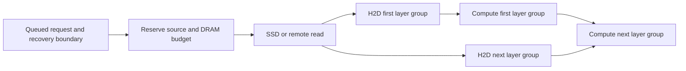

# State demand and transfer planning

Status: design proposal, not an implemented planner. The existing cache API,
engine-owned HBM, and one Cache Manager per host remain the foundation.
The [SSD experiment](../benches/README.md#ssd-restoration) supplies initial
measurements; predictive policies require separate evaluation.

## What can be known ahead of time

| Evidence | What OrbitKV can prepare | Limit |
| --- | --- | --- |
| Tokenized request waiting for engine admission | Its exact reusable prefix and component set | Admission order and start time may change |
| Next scheduled batch or prefill chunk | The next restore and its first consumer | Requires an engine callback before pages are consumed |
| Known layer order | Later layer groups while earlier groups execute | CUDA graph replay needs device-visible dependencies |
| Tool call or application workflow graph | The already-computed conversation or shared system prefix likely to resume | Branches and return times are hints, not guarantees |
| Historical session reuse | Retention priority and bounded speculative DRAM warming | Cannot predict arbitrary new prompt text or safely evict live GPU pages |

Start with declared requests and measured queue delay. Add workflow hints only
after cancellation, resource limits, and demand-fetch fallbacks are reliable.
No learned predictor is needed for the first implementation. Unknown future
tokens never become a claimed exact cache hit.

## Engine signals and their present limits

vLLM 0.29.0 has a useful readiness contract:
`get_num_new_matched_tokens` may return `None`, asking the scheduler to retry.
OrbitKV already uses this for `QueryLoading`. `update_state_after_alloc` then
supplies valid destination pages. Publication and preemption callbacks supply
source lifetime evidence. This supports asynchronous lookup without blocking
the scheduler, but does not expose the entire future batch schedule.

SGLang 0.5.20's `UnifiedCacheLinker.lookup` returns a list of restorable prefix
boundaries. OrbitKV currently maps `QueryLoading` to an empty list. The caller
can proceed with recomputation; an SSD read started by that lookup is not proof
that the request used it. A common cache transport has not removed this
scheduler-contract difference. First measure it. A production solution needs
early request observation and a pending/readiness callback, or a source lease
that guarantees the future restore can succeed. Do not block the scheduling
thread in an unbounded lookup loop or label pending bytes as resident.

Both adapters currently acknowledge whole restores. SGLang's eight-request
submission window does not establish layer readiness; vLLM's layer callback is
not a per-layer completion fence. These are prerequisites for true overlap.

## Minimal demand contract

Evolve `orbitkv-state` and the existing channel instead of introducing a second
cache service or adapter facade. A demand record needs:

- Request/session identity and a revision for changed or cancelled work.
- Computation identity, logical token boundary, and required state components.
- Estimated first-use time, priority, confidence, and a maximum waiting budget.
- A target engine/rank topology; an HBM destination only after engine allocation.
- An operation/lease ID with a terminal completion or drained cancellation.

The result distinguishes a miss, a candidate that can be fetched, a reserved
source, resident state, and state ready for GPU consumption. A directory hint
alone cannot authorize skipping computation. Speculative warming uses a
bounded budget and does not pin engine pages before admission.

## Recovery semantics before placement

The existing model fingerprint establishes computation and storage identity.
A planner also needs a complete `StateBundle` at a legal boundary:

| Model state | Evidence needed to resume at token boundary t |
| --- | --- |
| Full attention | All required attention groups cover the needed prefix |
| Sliding-window attention | The model-specific trailing window ending at t |
| Recurrent/SSM hybrid | An exact checkpoint at t plus convolution and attention state required there |
| MLA or native sparse attention | Compatible latent/positional bytes and any required indexer or auxiliary state |
| Speculative decoding | Accepted-token boundary; draft state cannot be published as committed target state |

For a hybrid model, a longer attention match with a shorter recurrent
checkpoint is not a longer restorable prefix. The engine adapter supplies
model-specific rules; the shared contract checks component coverage and
compatibility. Generation-qualified HBM references must enter the actual
transfer path before stale page IDs can be rejected at that boundary.
Cross-engine byte reuse, dynamic LoRA, and live weight changes remain outside
the present supported contract.

## Decide when to copy, retain, and restore

Materialize a replica while its immutable source is valid and spare transfer
capacity is available. Copying a replica early does not authorize freeing HBM:
the engine decides semantic liveness and the transfer completion proves that
DMA no longer reads that generation.

Keep likely near-term reuse in DRAM. Consider SSD admission for reusable prefixes
whose avoided recomputation justifies writes and their expected storage time.
Measure saved GPU time, copied bytes, and retained byte-seconds separately;
do not add those quantities without explicit cost weights. Large one-off
prefills should not automatically monopolize the SSD write queue. Restore
traffic needs priority with bounded write starvation.

For an admitted request, compare measured estimates of:

```text
restore: transfer-queue wait + uncovered restore critical path
recompute: GPU-queue wait + missing-state prefill
```

Include contention with active decode and the cost of evicting other useful
state. Recompute only from a complete legal boundary. Avoid speculative
transfers whose expected benefit is lower than their bandwidth and occupancy
cost. Current SSD writes use weak source references and may be dropped under
pressure; future admission must reserve resources for any promised replica.

Schedule prefetch from its estimated deadline backwards:

```text
start <= first use - measured remaining critical-path latency - uncertainty margin
```

Stage SSD or remote bytes in DRAM while the request waits. Reserve HBM close to
admission. Once correctness supports it, pipeline disk chunks, H2D layer
groups, and computation through a dependency graph:



Use measured overlap rather than adding all stage durations. A node may report
readiness only after its required device dependency is established. Cancellation
revokes scheduling interest, drains submitted transfers, and only then releases
pages or mappings. CUDA graph capture and replay both need qualification.

The transfer scheduler belongs in `orbitkv-core`: bound outstanding bytes,
prioritize demand reads by slack, cap speculative reads, and account for shared
SSD/PCIe/NUMA/NIC resources. The adapters supply demand and lifecycle events;
`orbitkv-channel` carries them. A future router can consume summaries after
the local planner is useful. No new central MetaServer is required for this work.

## Research to borrow from

- [KVFlow (2025)](https://arxiv.org/abs/2507.07400) uses an agent execution graph
  and proximity to future steps to guide retention and CPU-to-GPU prefetch.
  Workflow hints are a useful extension when applications can provide them.
- [Marconi (MLSys 2025)](https://arxiv.org/abs/2411.19379) handles recurrent
  state constraints and values reuse by compute savings relative to memory.
  This motivates boundary-aware admission rather than treating every token
  page as an interchangeable recovery point.
- [ECHO (OSDI 2026)](https://www.usenix.org/conference/osdi26/presentation/liu-guangda)
  overlaps lossless recall with indexer computation for native sparse attention
  using graph-compatible GPU mechanisms. Its model-specific opportunity does
  not justify dropping dense Qwen3 attention KV or assuming unchanged accuracy.
- [Dynamo's routing model](https://docs.nvidia.com/dynamo/dev/knowledge-base/modular-components/router/routing-concepts)
  combines cache locality with active work. It is a useful later placement
  baseline; it does not supply the missing engine page-lifetime contract.

These mechanisms are prior work, not OrbitKV inventions. The proposed direction
combines explicit demand, legal recovery boundaries, resource scheduling, and
measured restore-versus-recompute decisions. Performance and novelty claims
require comparisons against compatible implementations on the same workloads.

## Implementation and evaluation order

1. Measure DRAM and forced SSD restores in both engines; retain unsuccessful
   prefetches as misses. Separate client TTFT, GPU task time, SSD prefix time,
   transferred bytes, and writes that are never reused.
2. Resolve pending-query lifetime and engine readiness, then add bounded
   demand-based warming into DRAM. Use queue information available at the time,
   not future knowledge taken from the benchmark trace.
3. Introduce generation checks and per-group completion fences. Compare whole
   restore with layer overlap under eager execution and CUDA graph replay.
4. Add calibrated admission and retention, then optional workflow hints. Sweep
   concurrency 1/4/8/16, host working sets larger than capacity, partial-prefix
   hits, cancellation, and mixed read/write traffic. Report goodput under TTFT
   and inter-token-latency limits, unused prefetch bytes, and correctness.
5. Extend the same plan to remote replicas after directory recovery is qualified.
   Keep an oracle with perfect next-use knowledge as an upper-bound experiment,
   clearly separate from deployable policies. Run ablations for earlier demand,
   overlap, and admission so their contributions remain identifiable.
