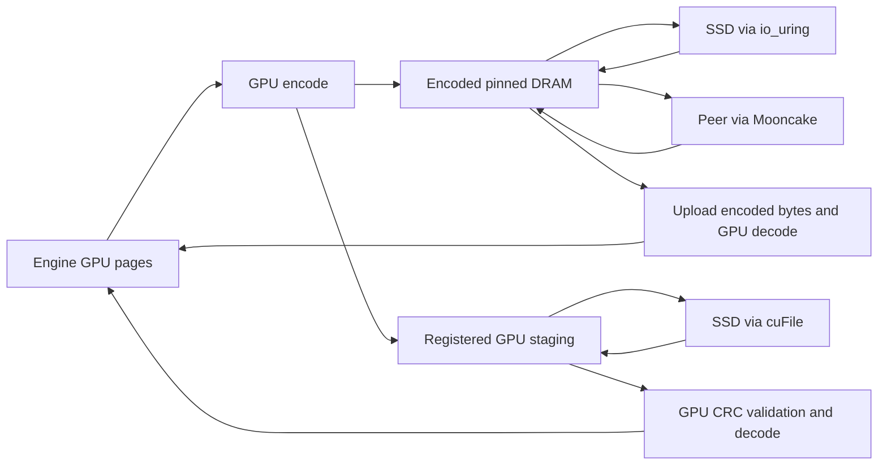

# KV precision and storage encoding

OrbitKV can encode KV pages on the GPU before offload, keep the encoded pages in
DRAM and SSD, and transfer them unchanged between Managers. Restore uploads the
encoded bytes and reconstructs the engine's original GPU layout. Rust owns codec
selection, workspace, checksums and transfer lifetimes; Python only registers
engine tensor geometry.

## Choose a representation

| `--storage-codec` | Representation | Eligible state | Precision |
| --- | --- | --- | --- |
| `none` (default) | Original bytes | All state | Exact |
| `ans` | NVIDIA nvCOMP ANS on GPU | Byte streams, FP16/BF16, native E4M3FN | Lossless |
| `fp8` | E4M3FN | Registered FP16/BF16 attention, including MLA | Lossy |
| `turboquant-4` | 4-bit K and V plus metadata | Contiguous attention head vectors | Lossy |
| `turboquant-3` | 3-bit K and V plus metadata | Contiguous attention head vectors | Lossy |

These are **cache storage** representations. They do not change the inference
engine's HBM allocator, attention kernels or `--kv-cache-dtype`. FP8 model weights
also do not imply FP8 KV. Lossy modes are experimental and require application
quality qualification; they are not enabled by default.

```bash
orbitkv-cache-manager --pool-size 8gb \
  --storage-codec turboquant-4 --storage-codec-budget 64mb \
  --ssd-cache-path /data/orbitkv/cache.bin --ssd-cache-capacity 100gb
```

Omit the SSD arguments to use encoded DRAM only. Both the vLLM and SGLang
connectors register the required layout without a separate compression setting.
All peers sharing encoded state need the selected codec and its dependencies.
The former `--ssd-codec` and `--ssd-codec-budget` flags have been removed.

## GPU ANS

ANS uses the nvCOMP 5.3 C ABI loaded by Rust. Install NVIDIA's runtime for the
CUDA major version of your deployment, for example:

```bash
pip install nvidia-libnvcomp-cu13==5.3.0.16
export ORBITKV_NVCOMP_LIBRARY=/path/to/site-packages/nvidia/libnvcomp/lib64/libnvcomp.so.5
orbitkv-cache-manager --pool-size 8gb --storage-codec ans
```

CUDA 12 uses `nvidia-libnvcomp-cu12`; system installations may expose
`libnvcomp.so.5` directly through the dynamic loader. A requested ANS policy fails
startup if this dependency is missing or has an unsupported ABI. OrbitKV does
not bundle NVIDIA's library or headers. See [NVIDIA installation instructions](https://docs.nvidia.com/cuda/nvcomp/installation.html).

Following [FlexKV's GPU ANS integration](https://github.com/taco-project/FlexKV/blob/738ddc141a198b4e20de6c5d1f0128e387f7fdb2/csrc/compression/ans/nvcomp_ans.cu),
typed 16-bit and native FP8 tensors select nvCOMP's corresponding datatype;
opaque and recurrent state use byte-stream compression. Decompression checks
both nvCOMP status and the exact output length. Incompressible pages remain raw.

## FP8 and TurboQuant

FP8 matches E4M3FN round-to-nearest, ties-to-even, including signed zero and
subnormals. Ada/Hopper and newer GPUs use FP8 conversion instructions; older
GPUs use the CUDA arithmetic implementation. A segment containing nonfinite
values or values outside [-448, 448] remains raw instead of being clipped.
If the configured GPU workspace cannot hold FP8 output, Rust selects
AVX-512F, AVX2 or scalar CPU code at runtime. AVX-512
handles 16 values per iteration, AVX2 handles eight, and scalar code completes
unaligned tails. The same lookup tables preserve identical rounding and range
rejection on every backend. This fallback saves capacity but transfers the
original width over PCIe.

TurboQuant follows [LMCache's MSE + norm-correction serde](https://github.com/LMCache/LMCache/tree/05a013b29da78cf2321b9b46ec5039dde2fb0bb0/lmcache/v1/distributed/serde/turboquant):

- K: normalize each head vector, apply deterministic random signs and an
  orthonormal Walsh-Hadamard transform, then encode Gaussian Lloyd-Max centroids.
  Restore corrects the centroid-vector norm and applies the inverse transform
  and the original FP16 norm.
- V: per-vector uniform quantization with FP16 minimum and scale.
- Head dimensions 32, 64, 128 and 256 are supported. The first and last two
  layers of each pipeline stage remain exact. MLA, recurrent/convolution
  checkpoints and unverified head layouts remain exact under this policy.

OrbitKV's versioned sign generator and segment layout are its own; encoded bytes
are not interchangeable with LMCache's serialized objects. For D=128, 4-bit K/V
use 66/68 bytes per vector versus 256 original bytes; 3-bit uses 50/52 bytes.
These are payload sizes, not an end-to-end compression or speedup guarantee.
Alignment, protected layers, raw fallback and metadata reduce total savings.

The Manager validates dtype, head dimension, stride and K/V roles, including
vLLM's packed `[block, head, token, 2 × head_dim]` layout and separate K/V tensors,
against imported tensors. Quantization never infers head layout from byte count.
Format, geometry and rotation seed participate in the v2 storage namespace.
The namespace version prevents older Managers that lack encoding metadata from
adopting compressed replicas; all Managers in a deployment should be upgraded.
Codec-enabled instances use per-layer storage, including when the adapter
requests page-first placement; this is transparent to engine page addressing.

## Ownership, storage and GDS



Each encoded segment carries a version, original length, format, stored length
and CRC32. The Manager validates checksums before cache admission or GPU decode.
A damaged SSD object becomes a miss; only that generation is invalidated, so
republication can repair it. Allocation, budget and destination errors fail the
restore without invalidating healthy SSD data. Peer transfers carry the same
metadata and verify received bytes. SSD files and indexes remain ephemeral
across Manager restarts.

Encoded segments are kept only when their aligned footprint saves at least
12.5%. Oversized, unsupported, nonfinite or insufficient-budget segments use the
raw path. Source segments up to 16 MiB are encoded; larger segments remain raw.
ANS additionally requires at least 4 KiB and 8-byte aligned GPU input.

GPU encoding groups up to 256 segments into a budgeted batch. ANS uses nvCOMP's
batched API; FP8 and TurboQuant use descriptor-based CUDA launches. A worker
retains its GPU arena, including descriptors, codebooks, checksums and temporary
memory, for later batches. Output sizes and statuses are collected once per
batch. Arena growth releases the old allocation first; teardown drains GPU work
before releasing memory.

Restore validates destinations across the whole request before splitting it
into codec batches or choosing CPU fallback. Unregister waits for outstanding
work and releases retained codec and cuFile resources before acknowledging.

`--storage-codec-budget` bounds retained GPU codec workspace **per worker**,
including ANS temporary memory and output capacity; default 64 MB. Save and
restore have independent workers. Direct encoded SSD writes use an additional,
bounded writeback lane so slow writes do not block demand reads or ordinary host
publication. The SSD decoder budgets its reusable encoded input and codec scratch
together. cuFile's registered I/O staging is accounted separately. Encoded host
residency consumes `--pool-size`, and leases retain it until completion. CPU FP8
fallback uses at most one 16 MiB host reconstruction buffer per worker, plus
fixed lookup tables. Canceling requests cannot release submitted I/O or DMA early.

With cuFile selected, complete state groups that fit an encoding batch can write
their encoded GPU bytes directly to SSD. A compressed DRAM copy is retained for
hot reuse. Fragmented groups, CPU-encoded payloads and groups exceeding the batch
budget seal in DRAM and use io_uring writeback. All writes publish SSD metadata
only after successful completion; alignment padding is initialized.

Demand reads of encoded cuFile objects assemble bounded GPU inputs, validate CRC32
on GPU, and decode into engine pages without a host payload bounce. Both raw and
encoded sources may appear in one restore. A corrupt generation is hidden from
new readers immediately and reclaimed after existing extent leases drain.
Speculative preparation still reads into DRAM through io_uring. Native GDS
qualification requires a suitable host and filesystem; container compatibility
tests do not establish native GDS performance. See [GPU storage](gds.md).

## Qualification

Use a prebuilt Manager (`ORBITKV_CACHE_MANAGER_BINARY`) and run Cargo builds
separately from live Managers. The Rust GPU codec tests cover exhaustive FP8
source values, 3/4-bit K/V reconstruction and ANS exact round trips. Source-only
Python tests verify connector contracts without a GPU.

```bash
# From python/: run the same commands with ans, fp8, turboquant-4 and turboquant-3.
../.venv/vllm-release/bin/python -m pytest -m e2e \
  tests/e2e/test_vllm_e2e_correctness.py --model /path/to/Qwen3-8B \
  --max-model-len 4096 --orbitkv-pool-size 1gb --vllm-cache-tier ssd \
  --storage-codec ans --ssd-backend uring
../.venv/sglang-release/bin/python -m pytest -m e2e \
  tests/e2e/test_sglang_direct_e2e.py -k ssd --model /path/to/Qwen3-8B \
  --storage-codec ans --ssd-backend uring
```

Keep model, engine dtype, requests, capacity and concurrency identical to the
`none` control. Exact-output tests remain strict: lossy output changes are
quality findings, not grounds to weaken the exact recovery gate. Measure
quality, encoded and total bytes, encode/decode duration, TTFT and throughput.
GPU encoding can contend with inference and small segments incur submission
and synchronization overhead; compression alone is not evidence of a latency win.
See [metrics](metrics.md) and the maintained final qualification results below.

### Recorded checks

Final checks use one H20, CUDA 13, nvCOMP 5.3.0.16, vLLM 0.29.0 and SGLang
0.5.20 with Qwen3-8B in BF16. Model tests flush DRAM after SSD writes and restart
the inference process before restoring; they also retain cold controls.

| Check | Result |
| --- | --- |
| GPU codec oracles, batching and workspace | 13 passed: exhaustive in-range FP8, 3/4-bit separate and packed K/V, heterogeneous ANS, CRC, disjoint destinations, budget bounds and workspace reuse |
| cuFile Rust integration | 8 passed with compatibility explicitly enabled; this is functional coverage, not native GDS evidence |
| Manager fault/recovery gate | 51 passed, including all codecs on io_uring/cuFile, direct encoded corruption/repair, cancellation, stalled/failed writes, queue saturation and resource release before unregister returns |
| CPU FP8 | All 65,536 BF16 and FP16 source patterns and 256 decode codes checked against an independent oracle on scalar, AVX2, AVX-512 and automatic dispatch; tails, unaligned buffers and rejected values included |
| Encoded cuFile model recovery | Qwen3-8B ANS passed both engines after restart and DRAM flush; cuFile reads/writes observed with no host-prefetch payload bounce. vLLM: 6 passed, 1 recurrent-only skip; SGLang: SSD gate passed |
| Encoded peer transfer | Passed for ANS, FP8, TurboQuant 4-bit and 3-bit; two Managers, same-host Mooncake TCP |

### Encoded SSD serving

The batching comparison uses the same Qwen3-8B BF16 artifacts, engine versions,
library paths and ANS policy before and after this change. The baseline is
[`227b849e`](https://github.com/feichai0017/orbitkv/commit/227b849e). On each engine,
all 64 prompt hashes and generated texts match across revisions.

This is a finite concurrency-four cohort: 4,096 input tokens, 16 output tokens,
49 shared-prefix requests and 15 cold requests. HBM KV is limited to 8,192 tokens
(1.125 GiB), Manager DRAM to 1 GiB and SSD to 8 GiB. The 12 prepared prefixes
represent 6.75 GiB of logical KV; cold traffic adds further pressure. Both runs
use **io_uring**, isolating codec improvements from GDS backend selection.
Throughput uses actual time to complete all 64 requests and excludes model
startup and prefix preparation.

| Engine | Output token/s, before → after | TTFT p50 ms, before → after | TTFT p95 ms, before → after |
| --- | ---: | ---: | ---: |
| vLLM | 32.57 → 60.98 | 1,290.8 → 611.0 | 3,665.9 → 1,936.0 |
| SGLang | 24.26 → 60.65 | 2,661.8 → 1,022.3 | 3,484.3 → 1,418.8 |

During the measured window, vLLM batches 142,920 codec segments into 620 batches;
SGLang batches 271,872 into 1,136. They record two and one workspace allocations,
respectively, rather than allocating for each segment. Active codec reservations
return to zero after completion; retained arenas remain budgeted until unregister.

These are single-cohort observations on a deliberately constrained KV budget,
using synthetic token prompts and real inference. They are neither peak H20
serving throughput nor a comparison against other cache projects. Reproduction:
[storage codec comparisons](../benches/README.md#storage-codec-comparisons).

### Codec choices under SSD pressure

All rows below use the final implementation and the same 64-request cohort and
1 GiB DRAM / 8 GiB SSD limits above. Each codec is compared with its own engine's
`none` control, with 64/64 verified prompt hashes. SSD read GiB counts actual
io_uring payload reads during the window, including repeated reads; it is not
cache size. Different representations change residency, misses and recomputation
as well as transfer cost.

| Engine | Codec | Output token/s | TTFT p50 ms | TTFT p95 ms | SSD read GiB | Text differences vs `none` |
| --- | --- | ---: | ---: | ---: | ---: | ---: |
| vLLM | none | 52.83 | 1,291.7 | 1,994.3 | 18.95 | 0/64 |
| vLLM | ans | 60.98 | 611.0 | 1,936.0 | 18.32 | 0/64 |
| vLLM | fp8 | 65.06 | 529.0 | 1,808.2 | 11.25 | 4/64 |
| vLLM | turboquant-4 | 67.95 | 463.6 | 1,775.6 | 7.35 | 0/64 |
| vLLM | turboquant-3 | 67.96 | 882.6 | 1,333.9 | 5.67 | 9/64 |
| SGLang | none | 50.38 | 1,202.3 | 1,747.4 | 17.75 | 0/64 |
| SGLang | ans | 60.65 | 1,022.3 | 1,418.8 | 16.96 | 0/64 |
| SGLang | fp8 | 61.92 | 1,001.4 | 1,400.7 | 11.90 | 0/64 |
| SGLang | turboquant-4 | 62.49 | 969.5 | 1,389.1 | 7.23 | 6/64 |
| SGLang | turboquant-3 | 62.90 | 964.3 | 1,389.8 | 5.43 | 24/64 |

ANS improves throughput over unencoded SSD storage by about 15% on vLLM and
20% on SGLang in this cohort. Moving from 4-bit to 3-bit reduces reads further,
but barely changes throughput and increases output differences. These text
comparisons are synthetic diagnostics, not application accuracy scores; even
zero differences do not qualify a lossy mode. The stricter model-quality probes
below remain relevant, and exact storage stays the default.

### DRAM control

These four rows disable SSD and give the Manager 8 GiB of DRAM, with the same
64-request recipe. The pool fits the 6.75 GiB of prepared prefixes, but not the
approximately 15.19 GiB of distinct logical KV after cold traffic. Compression
therefore still changes eviction and residency. Every generated text matches
the corresponding `none` control.

| Engine | Codec | Output token/s | TTFT p50 ms | TTFT p95 ms |
| --- | --- | ---: | ---: | ---: |
| vLLM | none | 55.65 | 849.3 | 1,719.5 |
| vLLM | ans | 61.16 | 953.1 | 1,715.1 |
| SGLang | none | 54.32 | 886.1 | 1,731.0 |
| SGLang | ans | 56.52 | 1,036.4 | 1,750.0 |

ANS improves throughput by about 10% and 4%, respectively, while median TTFT
increases by about 12% and 17%. This is a workload-dependent capacity/latency
tradeoff, not evidence to enable compression universally. The final matrix
covers ten SSD and four DRAM configurations (896 requests); lossy DRAM
performance is outside this matrix. No codec decode failures were recorded,
and active codec reservations drained to zero in every encoded case.

### CPU fallback throughput

Measured on Intel Xeon Platinum 8457C, pinned to CPU 8.
Each row uses a 16 MiB logical buffer, reused allocations and lookup tables,
three warmup calls and the median of five 0.5-second samples. The dataset samples
finite, in-range BF16/FP16 patterns; it is a conversion microbenchmark, not an
inference workload. All values are logical, uncompressed GiB/s for both directions.
Allocation, PCIe transfer and GPU work are excluded.

| Conversion | Scalar | AVX2 | AVX-512 | Automatic |
| --- | ---: | ---: | ---: | ---: |
| BF16 → FP8 | 3.20 | 4.53 | 4.92 | 4.93 |
| FP8 → BF16 | 7.12 | 8.32 | 8.87 | 8.88 |
| FP16 → FP8 | 3.01 | 4.25 | 4.49 | 4.50 |
| FP8 → FP16 | 7.21 | 8.62 | 9.86 | 9.85 |

AVX-512 improves these large-buffer cases by 6–14% over AVX2. Wider vectors do
not remove lookup and memory costs. The same run checks and measures 4 KiB and
256 KiB buffers; see the [CPU benchmark recipe](../benches/README.md#cpu-codec-benchmark).
Use `--seconds 0.5 --samples 5` to reproduce this sampling configuration.

### Model-quality probes

The model-quality checks below were recorded before batching, at
[`227b849e`](https://github.com/feichai0017/orbitkv/commit/227b849e).
The serving byte figures count **slots that were actually encoded**,
including their alignment and raw sibling segments. They exclude raw-only slots
such as TurboQuant's protected layers, so they are not whole-cache capacity or
PCIe savings. These correctness workloads do not establish TTFT or throughput
improvements, and a short matching output is not a general quality evaluation.

| Engine / codec | Encoded slots: logical → stored | Output check |
| --- | --- | --- |
| vLLM / ANS | 180 → 131.48 MiB | All 12 greedy-output cases matched; 6 checks passed, 1 recurrent-only check skipped |
| SGLang / ANS | 72 → 51.03 MiB | Recovery, concurrent restore, cold identity control, token IDs and logprobs passed |
| vLLM / TurboQuant 4-bit | 160 → 42.50 MiB | 5 behavior checks passed, 1 skipped; exact-output check failed on 4/12 cases (`prefix_extend`, `rollback_short`, `multi_r2`, `multi_r3`) |
| SGLang / TurboQuant 4-bit | 64 → 16.75 MiB | Recovery, concurrent restore, cold identity control, token IDs and logprobs passed |
| vLLM / TurboQuant 3-bit | 160 → 32.50 MiB | 5 behavior checks passed, 1 skipped; exact-output check failed on 5/12 cases (`long_warm`, `prefix_extend`, `rollback_short`, `multi_r2`, `multi_r3`) |
| SGLang / TurboQuant 3-bit | 64 → 12.75 MiB | Recovery, concurrent restore, cold identity control, token IDs and logprobs passed |

The SGLang probe generates eight tokens, whereas vLLM uses 12 request cases;
these results do not rank the engines' sensitivity to quantization. FP8's GPU
path is checked against every finite, in-range BF16/FP16 source value and Torch.
Its newer serving text comparisons are recorded in the SSD table above; broader
model-quality qualification is still open.
