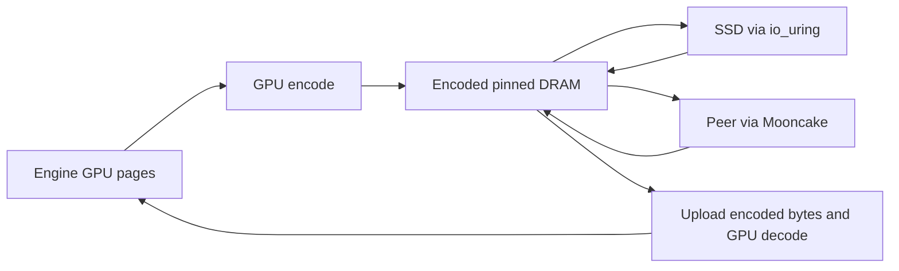

# KV precision and storage encoding

OrbitKV can encode KV pages on the GPU before offload, keep the encoded pages in
DRAM and SSD, and transfer them unchanged between Managers. Restore uploads the
encoded bytes and reconstructs the engine's original GPU layout. Rust owns codec
selection, workspace, checksums and transfer lifetimes; Python only registers
engine tensor geometry.

## Choose a representation

| `--storage-codec` | Representation | Eligible state | Precision |
| --- | --- | --- | --- |
| `none` (default) | Original bytes | All state | Exact |
| `ans` | NVIDIA nvCOMP ANS on GPU | Byte streams, FP16/BF16, native E4M3FN | Lossless |
| `fp8` | E4M3FN | Registered FP16/BF16 attention, including MLA | Lossy |
| `turboquant-4` | 4-bit K and V plus metadata | Contiguous attention head vectors | Lossy |
| `turboquant-3` | 3-bit K and V plus metadata | Contiguous attention head vectors | Lossy |

These are **cache storage** representations. They do not change the inference
engine's HBM allocator, attention kernels or `--kv-cache-dtype`. FP8 model weights
also do not imply FP8 KV. Lossy modes are experimental and require application
quality qualification; they are not enabled by default.

```bash
orbitkv-cache-manager --pool-size 8gb \
  --storage-codec turboquant-4 --storage-codec-budget 64mb \
  --ssd-cache-path /data/orbitkv/cache.bin --ssd-cache-capacity 100gb
```

Omit the SSD arguments to use encoded DRAM only. Both the vLLM and SGLang
connectors register the required layout without a separate compression setting.
All peers sharing encoded state need the selected codec and its dependencies.
The former `--ssd-codec` and `--ssd-codec-budget` flags have been removed.

## GPU ANS

ANS uses the nvCOMP 5.3 C ABI loaded by Rust. Install NVIDIA's runtime for the
CUDA major version of your deployment, for example:

```bash
pip install nvidia-libnvcomp-cu13==5.3.0.16
export ORBITKV_NVCOMP_LIBRARY=/path/to/site-packages/nvidia/libnvcomp/lib64/libnvcomp.so.5
orbitkv-cache-manager --pool-size 8gb --storage-codec ans
```

CUDA 12 uses `nvidia-libnvcomp-cu12`; system installations may expose
`libnvcomp.so.5` directly through the dynamic loader. A requested ANS policy fails
startup if this dependency is missing or has an unsupported ABI. OrbitKV does
not bundle NVIDIA's library or headers. See [NVIDIA installation instructions](https://docs.nvidia.com/cuda/nvcomp/installation.html).

Following [FlexKV's GPU ANS integration](https://github.com/taco-project/FlexKV/blob/738ddc141a198b4e20de6c5d1f0128e387f7fdb2/csrc/compression/ans/nvcomp_ans.cu),
typed 16-bit and native FP8 tensors select nvCOMP's corresponding datatype;
opaque and recurrent state use byte-stream compression. Decompression checks
both nvCOMP status and the exact output length. Incompressible pages remain raw.

## FP8 and TurboQuant

FP8 matches E4M3FN round-to-nearest, ties-to-even, including signed zero and
subnormals. Ada/Hopper and newer GPUs use FP8 conversion instructions; older
GPUs use the CUDA arithmetic implementation. A segment containing nonfinite
values or values outside [-448, 448] remains raw instead of being clipped.
If the configured GPU workspace cannot hold FP8 output, Rust uses a runtime
AVX2-dispatched CPU implementation (scalar on other CPUs). This fallback saves
capacity but transfers the original width over PCIe.

TurboQuant follows [LMCache's MSE + norm-correction serde](https://github.com/LMCache/LMCache/tree/05a013b29da78cf2321b9b46ec5039dde2fb0bb0/lmcache/v1/distributed/serde/turboquant):

- K: normalize each head vector, apply deterministic random signs and an
  orthonormal Walsh-Hadamard transform, then encode Gaussian Lloyd-Max centroids.
  Restore corrects the centroid-vector norm and applies the inverse transform
  and the original FP16 norm.
- V: per-vector uniform quantization with FP16 minimum and scale.
- Head dimensions 32, 64, 128 and 256 are supported. The first and last two
  layers of each pipeline stage remain exact. MLA, recurrent/convolution
  checkpoints and unverified head layouts remain exact under this policy.

OrbitKV's versioned sign generator and segment layout are its own; encoded bytes
are not interchangeable with LMCache's serialized objects. For D=128, 4-bit K/V
use 66/68 bytes per vector versus 256 original bytes; 3-bit uses 50/52 bytes.
These are payload sizes, not an end-to-end compression or speedup guarantee.
Alignment, protected layers, raw fallback and metadata reduce total savings.

The Manager validates dtype, head dimension, stride and K/V roles, including
vLLM's packed `[block, head, token, 2 × head_dim]` layout and separate K/V tensors,
against imported tensors. Quantization never infers head layout from byte count.
Format, geometry and rotation seed participate in the v2 storage namespace.
The namespace version prevents older Managers that lack encoding metadata from
adopting compressed replicas; all Managers in a deployment should be upgraded.
Codec-enabled instances use per-layer storage, including when the adapter
requests page-first placement; this is transparent to engine page addressing.

## Ownership, storage and GDS



Each encoded segment carries a version, original length, format, stored length
and CRC32. The Manager validates checksums before cache admission or GPU decode.
A damaged SSD object becomes a miss; only that generation is invalidated, so
republication can repair it. Peer transfers carry the same metadata and verify
received bytes. SSD files and indexes remain ephemeral across Manager restarts.

Encoded segments are kept only when their aligned footprint saves at least
12.5%. Oversized, unsupported, nonfinite or insufficient-budget segments use the
raw path. Source segments up to 16 MiB are encoded; larger segments remain raw.
ANS additionally requires at least 4 KiB and 8-byte aligned GPU input.

`--storage-codec-budget` bounds GPU codec scratch **per active transfer worker**,
including ANS temporary memory and output capacity; default 64 MB. Save and
restore have independent workers. Encoded host residency consumes `--pool-size`
and query/transfer leases retain it until completion. CPU FP8 fallback uses at
most one 16 MiB host reconstruction buffer per worker, plus fixed lookup tables.
Canceled requests cannot release submitted I/O or DMA resources early.

With encoding enabled, encoded SSD objects use io_uring and pinned encoded
pages. Direct compressed cuFile reads/writes are not implemented. Raw objects
can still use the existing cuFile read path; `none` retains the direct GDS save
path. Native GDS qualification requires a suitable host and filesystem; our
container tests do not establish native GDS performance. See [GPU storage](gds.md).

## Qualification

Use a prebuilt Manager (`ORBITKV_CACHE_MANAGER_BINARY`) and run Cargo builds
separately from live Managers. The Rust GPU codec tests cover exhaustive FP8
source values, 3/4-bit K/V reconstruction and ANS exact round trips. Source-only
Python tests verify connector contracts without a GPU.

```bash
# From python/: run the same commands with ans, fp8, turboquant-4 and turboquant-3.
../.venv/vllm-release/bin/python -m pytest -m e2e \
  tests/e2e/test_vllm_e2e_correctness.py --model /path/to/Qwen3-8B \
  --max-model-len 4096 --orbitkv-pool-size 1gb --vllm-cache-tier ssd \
  --storage-codec ans --ssd-backend uring
../.venv/sglang-release/bin/python -m pytest -m e2e \
  tests/e2e/test_sglang_direct_e2e.py -k ssd --model /path/to/Qwen3-8B \
  --storage-codec ans --ssd-backend uring
```

Keep model, engine dtype, requests, capacity and concurrency identical to the
`none` control. Exact-output tests remain strict: lossy output changes are
quality findings, not grounds to weaken the exact recovery gate. Measure
quality, encoded and total bytes, encode/decode duration, TTFT and throughput.
GPU encoding can contend with inference and small segments incur submission
and synchronization overhead; compression alone is not evidence of a latency win.
See [metrics](metrics.md) and the maintained final qualification results below.

### Recorded checks

Final checks use one H20, CUDA 13, nvCOMP 5.3.0.16, vLLM 0.29.0 and SGLang
0.5.20 with Qwen3-8B in BF16. Model tests flush DRAM after SSD writes and restart
the inference process before restoring; they also retain cold controls.

| Check | Result |
| --- | --- |
| GPU codec oracles and format policy | 4 passed: exhaustive in-range FP8 conversion, 3/4-bit separate and packed K/V, typed/byte ANS and budget fallback |
| Manager fault/recovery gate | 32 passed, including cuFile compatibility, corruption/repair, cancellation and GPU/CPU SIMD FP8 |
| ANS/TurboQuant re-registration and logical restore-byte accounting | 3 passed |
| Encoded peer transfer | Passed for ANS, FP8, TurboQuant 4-bit and 3-bit; two Managers, same-host Mooncake TCP |

The serving byte figures below count **slots that were actually encoded**,
including their alignment and raw sibling segments. They exclude raw-only slots
such as TurboQuant's protected layers, so they are not whole-cache capacity or
PCIe savings. These correctness workloads do not establish TTFT or throughput
improvements, and a short matching output is not a general quality evaluation.

| Engine / codec | Encoded slots: logical → stored | Output check |
| --- | --- | --- |
| vLLM / ANS | 180 → 131.48 MiB | All 12 greedy-output cases matched; 6 checks passed, 1 recurrent-only check skipped |
| SGLang / ANS | 72 → 51.03 MiB | Recovery, concurrent restore, cold identity control, token IDs and logprobs passed |
| vLLM / TurboQuant 4-bit | 160 → 42.50 MiB | 5 behavior checks passed, 1 skipped; exact-output check failed on 4/12 cases (`prefix_extend`, `rollback_short`, `multi_r2`, `multi_r3`) |
| SGLang / TurboQuant 4-bit | 64 → 16.75 MiB | Recovery, concurrent restore, cold identity control, token IDs and logprobs passed |
| vLLM / TurboQuant 3-bit | 160 → 32.50 MiB | 5 behavior checks passed, 1 skipped; exact-output check failed on 5/12 cases (`long_warm`, `prefix_extend`, `rollback_short`, `multi_r2`, `multi_r3`) |
| SGLang / TurboQuant 3-bit | 64 → 12.75 MiB | Recovery, concurrent restore, cold identity control, token IDs and logprobs passed |

The SGLang probe generates eight tokens, whereas vLLM uses 12 request cases;
these results do not rank the engines' sensitivity to quantization. FP8's GPU
path is checked against every finite, in-range BF16/FP16 source value and Torch,
but has not received a new model-serving quality run in this matrix.
