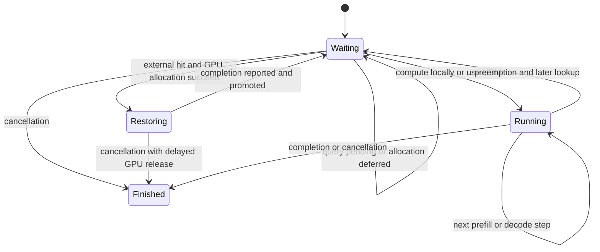
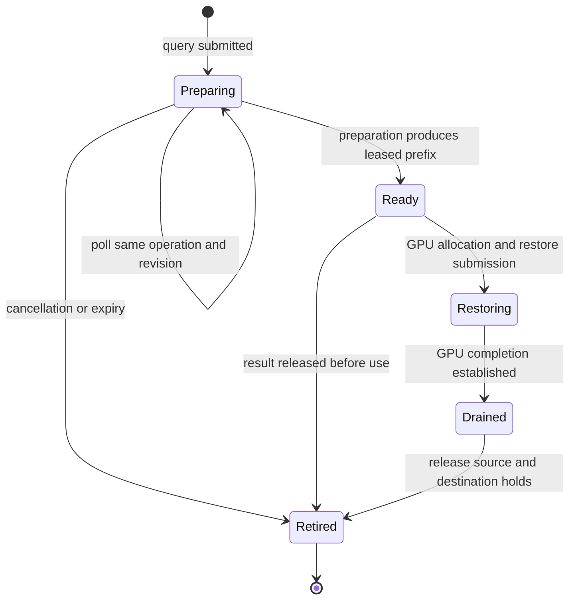

# vLLM request and cache lifetimes

This describes the vLLM 0.29.0 adapter and the current Cache Manager protocol.
The engine owns request scheduling and GPU block allocation. OrbitKV owns
external preparation, ready leases and copy completion; those lifetimes do not
end just because a request is cancelled or a scheduler lookup is repeated.

The relevant code is the
[adapter scheduler](../python/orbitkv/vllm/scheduler.py),
[worker](../python/orbitkv/vllm/worker.py),
[Rust manager client](../crates/orbitkv-channel/src/cache_client.rs) and
[vLLM V1 scheduler](https://github.com/vllm-project/vllm/blob/v0.29.0/vllm/v1/core/sched/scheduler.py).

## Scheduler admission

vLLM first checks its own HBM prefix cache, then calls
`get_num_new_matched_tokens(request, num_computed_tokens)`. An unresolved query
returns `(None, False)` so the request can be retried. A ready query supplies
the externally restorable token count and whether the load is asynchronous.

Only after `allocate_slots()` succeeds does vLLM call
`update_state_after_alloc()`. The adapter checks that the proposed load matches
the query's hash slice and leases, then creates a load intent with the allocated
GPU destinations. For hybrid layouts, the legal restore boundary also depends
on matching attention, window and recurrent state; see [state identity](state-identity.md).

`Restoring` represents vLLM's `WAITING_FOR_REMOTE_KVS`. vLLM uses this state for
asynchronous external loads even when OrbitKV supplies bytes from same-host
DRAM or SSD. It does not imply a cross-machine transfer. The diagram omits
structured-output and streaming-input wait states.

## Query ownership and revisions

`CacheManagerClient.query_prefetch()` uses the versioned process-channel query
API. An operation ID identifies the query, a revision identifies its current
hash/option set, and repeated lookups poll admitted work. Changed input advances
the revision. A pending result contains no usable recovery promise; a positive
ready result carries leases for the returned prefix.

Preparation and ready results consume the manager's byte budget. Repeated
scheduler calls reuse the adapter's matching probe instead of acquiring another
ready lease. A changed hash slice, a no-longer-needed result, request completion
or shutdown cancels pending interest or releases unconsumed leases. Same-host
TP query results use a common ready prefix and one lease per shard.

This is an ownership diagram, not an additional network protocol. An abandoned
preparation can finish without another client poll; completion then releases its
resources. Identical backing reads may share preparation, but separate engine
GPU destinations still require their own restores. See
[query budgets and demand planning](state-planning.md).

## Restore completion is not compute admission

After allocation, worker metadata carries the load intent. The worker starts a
bounded restore through the manager and retains GPU destinations until completion
is established. It reports completed requests through `finished_recving`; vLLM
records them and promotes them on a later scheduler visit.

Promotion can be blocked by a different request at the front of the deferred
queue. The [sustained workload](sustained-performance.md) reproduced a cold
request needing 128 GPU blocks when only 127 were free, while a completed
restore behind it held another 128. The scheduler stopped at the allocation
failure before reaching the completed restore.

OrbitKV now records an admitted restore in `_restores_awaiting_compute`.
Other lookups, including ready misses and prompts already covered by HBM,
return `None` while this set is nonempty. Queries may continue bounded
preparation. `build_connector_meta()` removes the request when its first
positive compute allocation appears in `num_scheduled_tokens`.

`finished_recving` alone does not open this gate. Request finish/cancellation
removes the admission hold, while any save or copy ownership continues until
its own safe completion. This conservative admission rule can reduce restore
parallelism; a replacement needs a scheduler-progress proof and workload data.

## Publish, preemption and cancellation

The engine decides which computed blocks to save. The adapter retains source
pages while Publish performs D2H copies; save completion permits those holds to
be released. SSD writes proceed asynchronously and can be dropped under pressure.
A successful Publish therefore does not promise an SSD replica.

Preemption changes the request's computed prefix and block allocation. Later
lookups must match the new query evidence. Workers finish or drain copy work
that depends on an old allocation before the engine can overwrite it. Async
saves can delay block freeing through vLLM's `finished_sending` contract.

Cancellation withdraws pending query interest and releases unconsumed ready
leases. It cannot cancel submitted DMA by forgetting a handle. vLLM can delay
freeing a cancelled restoring request until `finished_recving`; OrbitKV retains
its corresponding source and destination holds until completion is known.

## Failure boundaries and remaining work

vLLM supports reporting invalid loaded blocks and recomputing the affected
suffix. This is only safe when the transfer has stopped touching its
allocations. OrbitKV fails the affected engine on lost restore acknowledgements,
poll failures or deadlines instead of treating uncertain DMA as cancelled.
Manager shutdown drains GPU queues before CUDA IPC mappings are released.

Current tests cover revised queries, cancellation, retained budgets, scheduler
admission and GPU recovery. They do not establish complete generation-safe page
references or hybrid recovery proofs for arbitrary models. Publish can still
retain a source indefinitely if a live manager never completes it;
the Publish watchdog reports stalled ownership; deterministic fault tests cover
restart and lost notifications. Broader concurrent fault/soak qualification remains. See
[the work queue](../TODO.md) and [transport ownership](transport.md).
